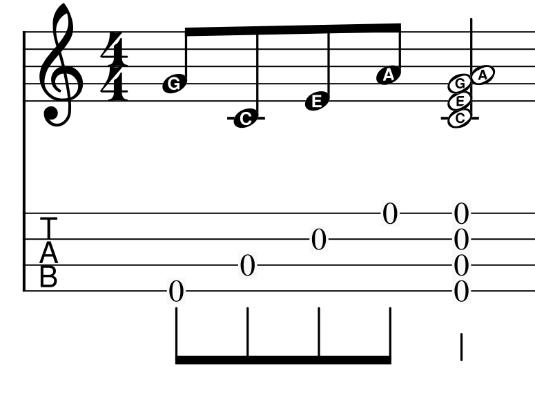

# Background: Saddles, Intonation, Compensation

The [saddle](https://www.soundpure.com/a/expert-advice/guitars/parts-of-an-acoustic-guitar/)
is the small bar which the strings run over down at the body of a guitar, ukulele or similar
fretted stringed instrument. It transmits the vibrations of the strings to the body of the instrument.
The saddle is generally made of plastic, bone or very hard wood.

To make strings play different notes, you push them down against a [fret](https://en.wikipedia.org/wiki/Fret),
and it's the distance
between the fret and the saddle (as well as the tension and density of the string) which determines
the frequency of the note.  A string which is half as long vibrates at twice the frequency, 
which is conveniently the same as one octave (12 semitones) higher.
Therefore the twelth fret is half way along the string, and the other frets correspond to 
other [musical intervals](https://en.wikipedia.org/wiki/Interval_%28music%29) in the
[scale](https://en.wikipedia.org/wiki/Equal_temperament)

Frets are ([generally](https://www.sweetwater.com/insync/the-multi-scale-mystery-unraveled/)) placed at the same
distance for all strings despite differences in string density and tension, and there's some non-linearity in that,
plus when you push a string down onto the
fret you're increasing its tension slightly, so the maths doesn't work out perfectly.
The amount by which its off is known as the instrument's [intonation](https://en.wikipedia.org/wiki/Intonation_%28music%29)

Thankfully, most people are only sensitive to pitch errors above about [6 cents](https://en.wikipedia.org/wiki/Cent_%28music%29#Human_perception)
(6% of a semitone, basically) so we don't have to get it utterly precise to sound good.

To a first approximation, for a typical acoustic guitar, you can compensate by moving the saddle back a millimeter
or so (making the strings slightly longer) and angling it slightly to make the bass strings a smidge longer again
to give them slightly more compensation.

For more precision, you need a [Compensation Calculator](https://www.liutaiomottola.com/formulae/compensation.htm)
(the units are all in inches, sorry) and/or [careful experimentation](https://www.youtube.com/watch?v=ko3byzyGzWk&t=1235s).

Then you carve the saddle in such a way that the point the string touches it moves back or 
forward a little from the center.

# Printing

My little [Maton Tenor Ukulele](https://maton.com.au/product/tenor-ukulele) is a lovely 
instrument but it has a straight saddle and the intonation was a bit all over the place.

Note that most ukuleles are tricky because the strings aren't in order: the typical
tuning, top to bottom, is G4 C4 E4 A4, where the G4 is between E4 and A4, so a straight saddle
isn't going to be good anyway.


*Ukulele Reentrant Tuning*

It uses a typical 3mm thick saddle, so there's ±1.25mm or so
to play with (the point where the string touches can't be a sharp corner, it has to be rounded
or the string will wear quickly).  Good quality 3mm bone blanks only cost $5 or so, but I didn't
want to ruin a whole bunch of them while wildly guessing at the shape I was after.  So I figured
I'd print one.

I used [OpenSCAD](https://openscad.org/) to design a part with a rectangular base
to fit the saddle slot and a raised cylinder to form the saddle for the strings:

```
    $fn=50;

    sl = 60;  // saddle slot length
    st = 2.8;   // saddle slot thick
    ss = 4;   // saddle slot depth
    sh = 1;   // saddle height above slot
    sr = 0.25;  // saddle radius

    hull() {
        translate([0,0,ss/2]) cube([sl,st,ss], center=true);
        translate([0,0,ss+sh-sr]) rotate([0,90,0]) cylinder(h=sl, r=sr, center=true);
    }
```

OpenSCAD is a strange little language, but specifying all the measurements as 
variables makes it really easy to change them up later.


*First go at a saddle model*

My [cheapo printer](/art/aldi-cocoon-3d-printer/) only does
[PLA](https://www.3dnatives.com/en/pla-3d-printing-guide-190820194/)
so PLA is what it was going to be.  I used
[Cura](https://ultimaker.com/software/ultimaker-cura) to slice the model
at maximum resolution (0.06mm layers) and full infill and then sent it
off to the printer via [OctoPrint](https://octoprint.org) and in only a 
few minutes the saddle was ready.

# Tuning Up

To install the new saddle, I just slacked all the strings right off and pushed the
old one out of the slot underneath them.  Originally I'd printed the saddle 2.9mm
thick but that took a little sanding to slip in nicely, so for later prints I 
used 2.8mm which gave a nice "light sliding fit".  Then I retuned, let the 
strings settle in a bit and gave it a go.

I was happily surprised by how decent the PLA saddle sounded: I'd thought this
was only going to be a temporary part until I could replicate it in bone, but 
to my (not especially magical) ears it sounded fine.

This saddle is just perfectly straight and centered, like the stock one, so
we haven't really achieved anything yet.
Now we know the technique is usable, let's estimate the compensation and 
print a new one.

# Compensation

I'm not a particularly sophisticated player and mostly play open chords anyway,
so rather than setting up compensation on the 12th fret, I used the 5th fret 
for measurements.

I used a stroboscopic tuner app on my phone to measure intonation and
take a first guess at compensation values. The results worked out something like
(from memory):

string | cents sharp @ 5th | compensation
-------|-------------------|-------------
G      | 5-10              | 0.5
C      | 15-20             | 1.25
E      | 10-15             | 1
A      | 5-10              | 0.5

Note that the intonation depends partly on things like how hard you fret the string,
and the fine tuning of the note actually varies a little as it rings, and
also the strings had just been disturbed when I replaced the saddle.

But that's okay, because we're going to print a few of these and home in on a 
good setting.

```
$fn=50;

sl = 60;  // saddle slot length
st = 2.8;   // saddle slot thick
ss = 4;   // saddle slot depth
sh = 0.75;   // saddle height above slot
sr = 0.15;  // saddle radius

xos = [ 0.5, 1.25, 1, 0.5 ];  // string offsets

xn = len(xos);
xl = sl / xn;

for (n = [0:xn-1]) {
    translate([-xl*n,0,0]) {
        hull() {
            translate([0,0,ss/2]) cube([xl,st,ss], center=true);
            #translate([0,xos[n],ss+sh-sr]) rotate([0,90,0]) cylinder(h=xl, r=sr, center=true);
        }
    }
}
```


