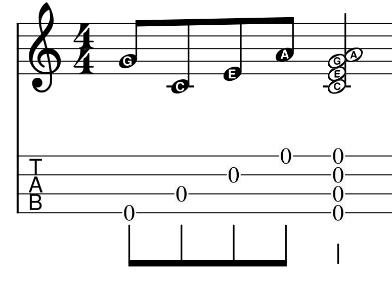
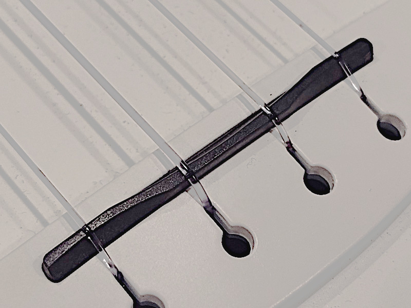
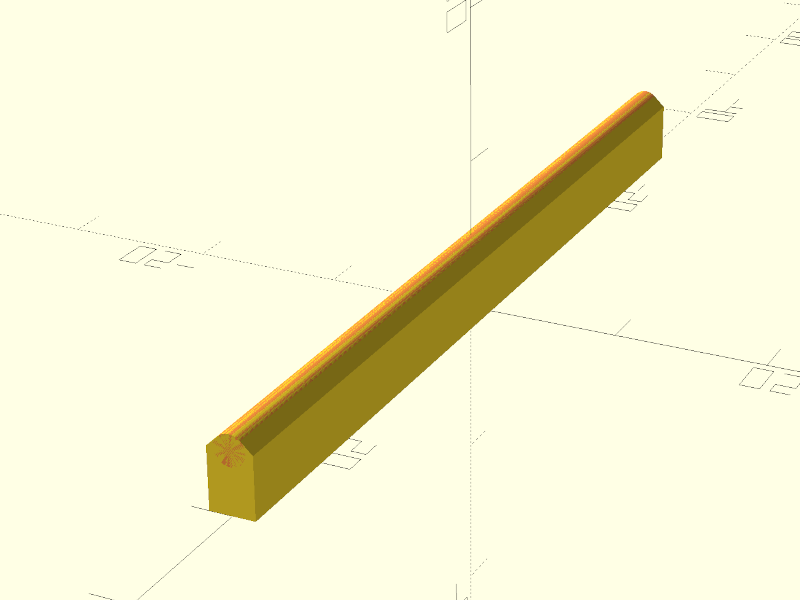
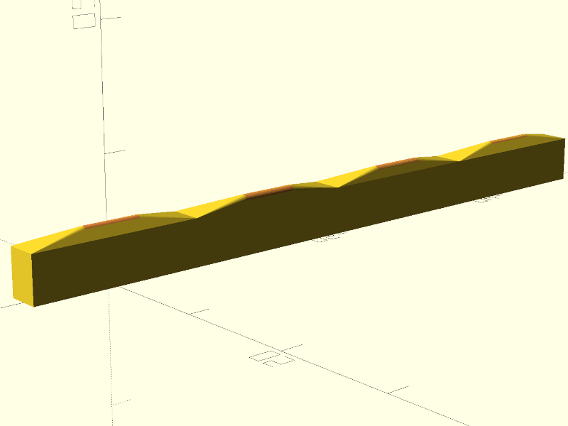
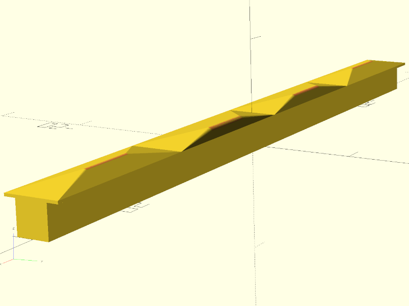

# Background: Saddles, Intonation, Compensation

The [saddle](https://www.soundpure.com/a/expert-advice/guitars/parts-of-an-acoustic-guitar/)
is the small bar which the strings run over down on the body of a guitar,
ukulele or similar fretted stringed instrument.
It transmits the vibrations of the strings to the body of the instrument.
The saddle is generally made of plastic, bone or very hard wood.

When you push a string against a [fret](https://en.wikipedia.org/wiki/Fret),
the distance between the fret and the saddle determines the note.
Making the string half as long should double the frequency which means a note
one octave higher, but it's not a perfectly linear relationship because of
string diameter, density and tension.
The amount by which its off is known as the instrument's
[intonation](https://en.wikipedia.org/wiki/Intonation_%28music%29)
and it's never quite perfect on all frets of all strings all the time.

Thankfully, most people are only sensitive to pitch errors above about
[6 cents](https://en.wikipedia.org/wiki/Cent_%28music%29#Human_perception)
(6% of a semitone, basically) so we don't have to get it utterly precise to sound good.

To a first approximation, for a typical acoustic guitar, you can improve the 
intonation by moving the saddle back a millimeter
or so from where you might expect from the scale length,
and angling it slightly to make the bass
strings a smidge longer again.  
This process is called Compensation.

For more precision, you need a
[Compensation Calculator](https://www.liutaiomottola.com/formulae/compensation.htm)
(the units are all in inches, sorry) and/or
[careful experimentation](https://www.youtube.com/watch?v=ko3byzyGzWk&t=1235s).

Then you carve the saddle in such a way that the point the string touches it moves back or 
forward a little from the center, to compensate for the intonation of each individual string.

(If you need more wriggle room you might have to 
[recut the saddle slot](https://www.youtube.com/watch?v=WMjR9YLTuHY)
but that's a bit out of my depth, frankly.)

# Ukuleles

My little [Maton Tenor Ukulele](https://maton.com.au/product/tenor-ukulele) is a lovely 
instrument but it has a straight saddle and the intonation was a bit all over the place.

Note that ukuleles are tricky because the strings aren't in order: the typical
tuning, top to bottom, is G4 C4 E4 A4, where the G4 is between E4 and A4, so an angled
straight saddle isn't going to be good anyway.


*Ukulele Reentrant Tuning*

At least the notes are very close together, 
so compensation distances vary much less than, for example, a guitar.

You can see the general shape on this closeup of my
[Enya Tenor Ukulele](https://www.enya-music.com/collections/enya-tenor-ukuleles)
(aka the Plastic Beach Ukulele).
The compensated saddle means the C and E strings are just a smidge longer
than the G and A strings, improving the intonation.


*Enya Tenor Ukulele Saddle*

# Printing Saddles

Anyway, back to the Maton.
Mostly it sounds great, but a couple of chords, especially `Em`,
are impossible to tune to sound perfect, which I think is due to the intonation.

It uses a typical 3mm thick saddle, so there's ±1.25mm or so to play with.
The stock saddle is cut straight and centered, which is what I'm calling `0`.

Good quality 3mm bone blanks only cost $5 or so, but I didn't
want to ruin a whole bunch of blanks while wildly guessing at the shape I was after.
So I figured I'd print one as an experiment.

I used [OpenSCAD](https://openscad.org/) to design a part with a rectangular base
to fit the saddle slot and a raised cylinder to form the rounded saddle for the strings:

```
    $fn=50;

    sl = 60;    // saddle slot length
    st = 2.9;   // saddle slot thick
    ss = 4;     // saddle slot depth
    sh = 1;     // saddle height above slot
    sr = 1;     // saddle radius

    hull() {
        translate([0,0,ss/2]) cube([sl,st,ss], center=true);
        #translate([0,0,ss+sh-sr]) rotate([0,90,0]) cylinder(h=sl, r=sr, center=true);
    }
```

OpenSCAD is a strange little language, but specifying all the measurements as 
variables makes it really easy to change them up later.


*First go at a saddle model*

My [cheapo printer](/art/aldi-cocoon-3d-printer/) only does
[PLA](https://www.3dnatives.com/en/pla-3d-printing-guide-190820194/)
so PLA is what it was going to be.  I used
[Cura](https://ultimaker.com/software/ultimaker-cura) to slice the model
at maximum resolution (0.06mm layers), a raft to avoid curling on the bottom layer,
and full infill.
Then sent it off to the printer via [OctoPrint](https://octoprint.org) and in only a 
few minutes the saddle was ready.

# Tuning Up

To install the new saddle, I just slacked all the strings right off and pushed the
old one out of the slot underneath them.  Originally I'd printed the saddle 2.9mm
thick but that took a little sanding to slip in nicely, so for later prints I 
used 2.8mm which gave a nice "light sliding fit".  Then I retuned, let the 
strings settle in a bit and gave it a go.

I was happily surprised by how decent the PLA saddle sounded: I'd thought this
was only going to be a temporary part until I could replicate it in bone, but 
to my (not especially magical) ears it sounded fine.

This saddle is just perfectly straight and centered, like the stock one, so
we haven't really achieved anything yet.

Now we know the technique is usable, let's estimate the compensation and 
print a new one.

# First try at Compensation

I'm not a particularly sophisticated player and mostly play open chords anyway,
so rather than setting up compensation on the 12th fret, I used the 5th fret 
for measurements.

I used a 
[harmonic tuner app on my phone](https://blog.grainapps.com/category/harmonic-tuner)
to measure intonation and take a first guess at compensation values.
The results worked out something like (from memory):

string | cents sharp @ 5th | compensation
-------|-------------------|-------------
G      | 5-10              | 0.5
C      | 15-20             | 1.0
E      | 10-15             | 0.75
A      | 5-10              | 0.5

Note that the intonation depends partly on things like how hard you fret the string,
and the fine tuning of the note actually varies a little as it rings, and
also the strings had just been disturbed when I replaced the saddle so they weren't
quite stable yet.  But it's a start.

I could just offset the saddle by, say, 1mm and that'd be an improvement.
But 3D printing really makes it easy to go all in on this kind of thing, so why
not make each string's saddle have its own offset?  

To do this I added an array of offsets, and changed the model to split the saddle into
the right number of pieces and offset them each individually.
Since they're right next to each other they all print as one, but we can set the
compensation individually.
Having the little angled pieces not line up with each other looked kind of janky, so 
I reduced the length of the saddle cylinders to make them each their own individual 
mountain.

Our offsets are a bit of a stab in the dark, 
but that's okay, because we're going to print a few of these and home in on a 
good setting.

```
$fn=50;

sl = 60;    // saddle slot length
st = 2.8;   // saddle slot thick
ss = 4;     // saddle slot depth
sh = 1;     // saddle height above slot
sr = 0.4;   // saddle radius

xos = [ 0.5, 1, 0.75, 0.5 ];  // string offsets

xn = len(xos);
xl = sl / xn;

for (n = [0:xn-1]) {
    translate([-xl*n,0,0]) {
        hull() {
            translate([0,0,ss/2]) cube([xl,st,ss], center=true);
            #translate([0,xos[n],ss+sh-sr]) rotate([0,90,0]) cylinder(h=xl/3, r=sr, center=true);
        }
    }
}
```


*Second iteration of the saddle*

# Next Iteration

This version sounds distinctly better intonated than the stock one.

The PLA doesn't sound significantly different: maybe I need to record some 
"before" and "after" samples to see if I can tell, but it's subtler than I expected.

Moving the C string back 1mm isn't quite far enough though, I think it 
will need more like 1.5mm compensation.  Which is problematic, because the slot
is only 2.8mm wide.  I really don't want to have to recut the saddle slot, so I'm
considering whether the saddle can get away with a tighter curve,
or a little "flying buttress", or whether it would
be better to have it bear on the bridge in front of and behind the slot instead of at
the bottom of the slot: it's not how it is designed, but would it work?


*It looks ridiculous, but would it work?*

I also have a [banjolele](https://en.wikipedia.org/wiki/Banjo_ukulele),
I'm considering whether it might be possible to print a whole new bridge for that!
