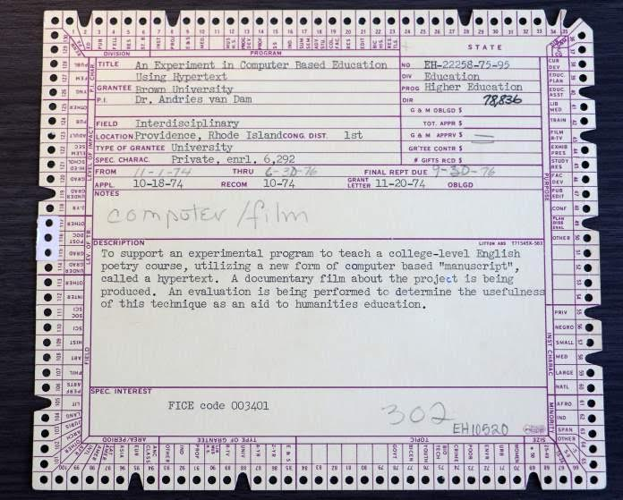
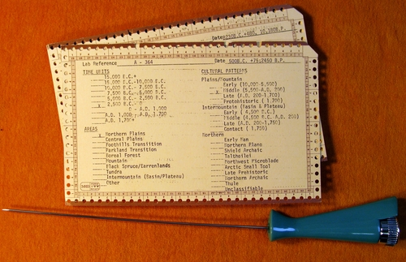
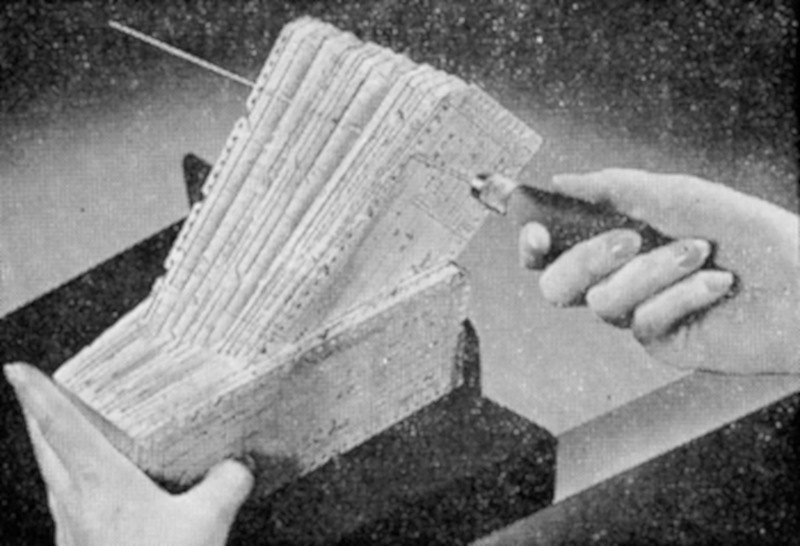
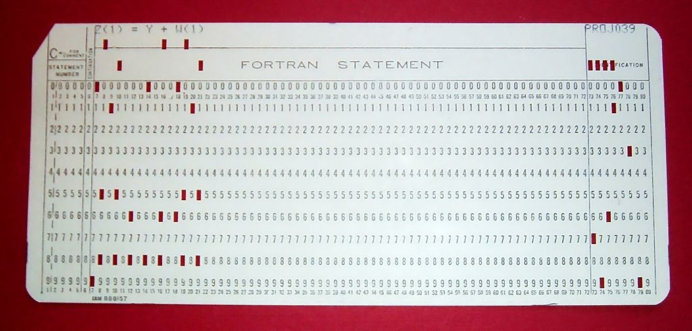
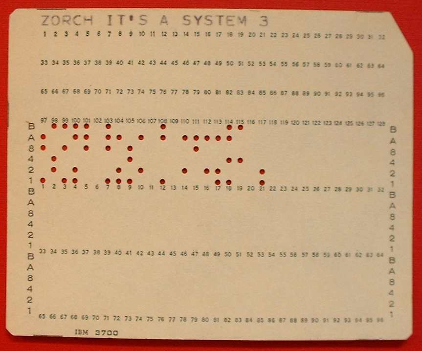
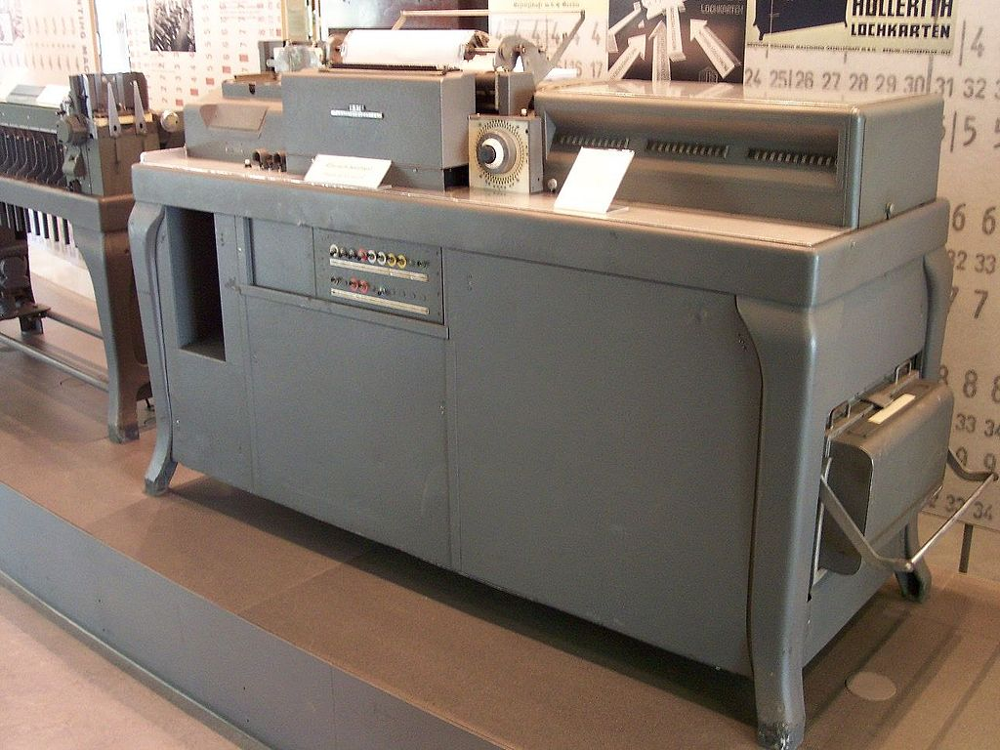

*[source: neh.gov](https://www.neh.gov/divisions/odh/featured-project/invitation-film-screening-talk-the-university-maryland-celebrate-the-work-andy-van-dam)*

*[source: royalalbertamuseumblog.tumblr.com](http://royalalbertamuseumblog.tumblr.com/post/98968032437/tracking-data-the-analogue-way)*

*[source: Whole Earth Catalog](https://nevalalee.wordpress.com/tag/the-whole-earth-catalog/)*

*[source: Wikipedia](https://en.wikipedia.org/wiki/Punched_card#/media/File:FortranCardPROJ039.agr.jpg)*
*By Arnold Reinhold - I took this picture of an artifact in my possession. The card was created in the late 1960s or early 1970s and has no copyright notice., CC BY-SA 2.5*

*[source: Wikipedia](https://en.wikipedia.org/wiki/Punched_card#/media/File:System_3_punch_card.jpg)*
*By Arnold Reinhold [GFDL](http://www.gnu.org/copyleft/fdl.html) or [CC-BY-SA-3.0](http://creativecommons.org/licenses/by-sa/3.0/), via Wikimedia Commons

*[source: Wikimedia Commons](https://en.wikipedia.org/wiki/Tabulating_machine#/media/File:Lochkarte_1.jpg)
*[CC BY-SA 3.0](https://commons.wikimedia.org/w/index.php?curid=1006474)*

*[source: Wikipedia](https://en.wikipedia.org/wiki/Tabulating_machine#/media/File:IBM402plugboard.Shrigley.wireside.jpg)
*[CC BY 2.5](https://commons.wikimedia.org/w/index.php?curid=522789)*

