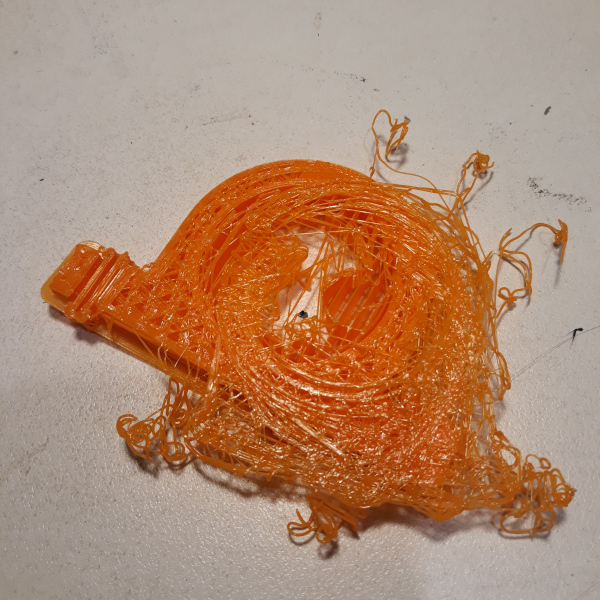

I picked up a "[Cocoon Create Model Maker](https://cocoonproducts.com.au/model-maker/)"
printer from Aldi the other day, on sale for $300.  It's a pretty direct copy of a 
[Wanhao Duplicator i3 Mini](http://www.wanhao3dprinter.com/Unboxin/ShowArticle.asp?ArticleID=88)
but with the advantage that you can drive up to the shops and grab one, and it is
covered by Aldi's excellent warrantee support.

I've been meaning to have a go at
3d printing for years now, and in fact there's an elderly and rather dodgy Prusa i3
sitting on the shelf, but I never did get anything to actually work properly despite
hours of messing about and replacing parts.  I'll write more about that printer in 
a separate article.

# Hardware 

*Unpacking the Printer*

So I bought this nifty little printer.  It is rather small, and has a quite limited
print volume of 120 wide x 135 deep x 100 high.  But it worked straight out of the box
and that's pretty impressive.  It is fully assembled, very quick to unpack and in the box
is also a scraper, and a glue stick, and spare magnetic beds, and a few lengths of test
filament, and a micro SD card with some 
pre-prepared models, so you really can level the bed and print a test or two without
anything else, although I picked up a kilo of PLA filament while I was there.

Literally the only other thing you might need is a pair of wire cutters / long nose
pliers, to cut the cable tie off the packaged printer, and to trim the ends of PLA filaments,
and to pull out the supporting scaffold which is needed to print overhangs.  Everything
else is already in the box.

The printer has a small controller built in, with a little backlit multi-line LCD and a 
rotary dial to select stuff.  It can print directly from a microSD card without being
attached to a computer, or it can plug into your computer to print from host software.
[Ultimaker Cura](https://en.wikipedia.org/wiki/Cura_(software)) is included on the SD card
as well.

*Keyrings / Bag tags for the kids at school*

On the downside: it is fairly noisy, with both hot-end cooling fan and the processor 
cooling fans making a racket.  Neither fan is under software control, so they keep
running even when the printer isn't doing anything.  And there's no heated bed.

# Gluesticks

The included gluestick helps a lot with getting good adhesion to the magnetic bed liner.
Unfortunately, it's rather a small no-brand gluestick and didn't last long.
Without good adhesion, the model can warp, peel off
or even move about, resulting in a terrible mess.

*A Terrible Mess*

I'm hoping to find an effective one by trial and error!  I bought several different ones
to try:

*Different Gluesticks*

So far:

* the very cheap Officeworks / Keji one hasn't worked well at all, it was quite hard
  to get a consistent thin layer of glue and it goes gloopy instead of tacky.
* the UHU one felt similar when applying, hard to get a consistent thin layer so I 
  gave up on that one for now but will try some test prints later.
* the StudyMate Blue Stick gave a nice consistent layer and printed a run of 
  kids keyrings perfectly, where previous attempts with the Keji one had failed.
  It did fairly well on a thicker 'bearing block' as well, although the last few
  mm of the ends lifted a tiny bit.
* The others still need testing.

(I'm not comparing these for their intended purpose, gluing paper!  Just for how they
go at making the print bed tacky enough to prevent the edges of prints lifting as they
set)

# Firmware

The main problem I've had though is the built-in driver software, which occasionally 
crashes while the head is heating up, and has some really terrible user interface.
The control knob detents seem to have no correspondence to UI movements, meaning its
easy to pick the wrong menu item. The 
whole UI seems quite badly thought out, with meaningless menu structures and so on.
But it works well enough to be used, so I guess that's okay.

I haven't tried upgrading the firmware yet, but it seems pretty likely it is based
on the Open Source [Marlin](http://marlinfw.org/) software, not that the Cocoon manuals
document this or anything.  If so, it might be possible to improve it.

It is remarkable how well this firmware works though: millions of little operations in
real time, with no visible errors.  I'd love to see a fully integrated solution though,
with an onboard processor and a web-controllable interface or similar.  It could even
integrate the slicer, so that printer parameters could be taken into account automatically.

UPDATE: I noticed that linux dmesg was reporting that the VFAT filesystem on the supplied
microSD card was corrupt, so I reformatted it.  I'm now 75% of the way through an 8 hour 
print run from the card with no crashes, so that might have been part of the problem.

UPDATE 2: Having reformatted the card, no more crashing problems even on very long jobs.

*Printing a flywheel*

# Software

The design I've been doing in [OpenSCAD](https://www.openscad.org/) which is quite
an interesting way to approach design.
The OpenSCAD syntax drives me a bit nuts so I'm thinking of trying out 
[PySCAD](https://pyscad.readthedocs.io/en/latest/) as well.  It saves designs 
in its native SCAD format but can export to STL and similar formats.

For slicing, I've been impressed with Cura, which works great out of the box and comes with the 
printer's profile built in.  I've been running it under [Wine](https://www.winehq.org/)
to avoid having to work out how to transfer the profile across to the Linux version.

To actually send the files to the printer I've been using [Pronterface](https://www.pronterface.com/),
which is pretty simple but works.  It lets you connect to printers and control each
axis and extruder separately, which is handy for setting things up.  I'd also like to 
have a better look at [Octoprint](https://octoprint.org/) because having some remote control
over the printer behaviour would be rather nice.  I experimented with setting up a 
webcam pointing at the printer and found it very useful to watch the progress of the
print run and look out for failed prints.

# Workflow 

The workflow from OpenSCAD to Cura to Pronterface is a bit clunky.  Cura has a large number
of settings which are specific to a printer (print volumes and head speeds, for example),
and a whole bunch more which vary from project to project (infill styles, wall thicknesses, etc).
For the latter, it is frustrating not to have these recorded in a file somewhere alongside the
model itself.  Ideally, something like a Makefile would bring these preferences all together
along with the STL to generate appropriate GCODE.

# Projects

* I've made a start on 3d models for [Ciril](/art/ciril-cubic-inch-robots-in-labs/)
* I got to print a couple of parts for the latest
  [Heart of Pluto](http://heartofpluto.co/) Colour Changer ... great to be able to
  help out with such a cool project
* I'm hoping to design some bits for our [Water Rockets](/art/rocket-surgery-airborne-iot-telemetry-buzzconf/) 
* I made some keyrings for kids at school ... especially good for the kids with
  less common names! 
* I've made a whole lot of rubbish :-)

I've uploaded some works in progress to [github:nickzoic/models3d](https://github.com/nickzoic/models3d/) ... they're slowly evolving as I learn more about how to get things done in OpenSCAD.

*Colour Changer mechanisms from Heart of Pluto*

*... and a rubbish-bin full of PLA scraps*

# Upgrades

Potential upgrades:

* Sit the whole thing on a box with an RPi which can run Octoprint
* A power relay to turn the printer off when it is done printing.
* A silicone or thin-film PCB heated bed to reduce shrinking / curling
* A printer enclosure to keep the warmth in and reduce drafts, and reduce noise.
* Ventilation to reduce the smell of toasty PLA.

# UPDATE 2019-05-02

* I had a small problem with the temperature of the hotend: the screw which attached
  the temperature sensor had come loose and the temperature sensor was no longer well
  attached to the hot end.  This meant that temperature regulation was misbehaving
  and the hotend overheating.  Easily fixed by removing the finger
  guard and tightening the screw.

* I had been running the supplied Cura under [Wine](https://www.winehq.org/) but now I'm using
  the Linux version 3.3.1 by copying the printer files across to `~/.config/cura/3.3/`.

* Cura version 4.0.0 is out now too, so I'll give that a go!

# UPDATE 2019-09-18

* Cura version 4.2.1 is out and works great as an AppImage for Linux.

* The bearing in the fan underneath the main board is failing and needs replacement one
  of these days, which will required some annoying disassembly.

* The blue glue stick is still going strong and tacks the prints down to the magnetic
  bed so well that the bed itself peels off: to avoid this either don't print too close
  to the `x=0,y=0` corner or I sometimes pop a little clip on that corner to give the 
  magnetic bed some extra grip.

  
  *Lifting corner*

* I've managed to gum the print head up a couple of times now and had to remove & disassemble
  it to get rid of bits of broken PLA.  It seems like it's a good idea to remove the filament
  once you finish printing.

* One idea which has worked well is to add 0.5mm holes through the piece, which is too small
  to print properly as a hole but causes the slicer to build a little tube around it.  This
  can be used to stiffen or reinforce designs which are otherwise sparsely infilled.

* I really *really* wish that there was some way to save the slicer settings into the STL
  file, because it gets very confusing working out how I tweaked the settings for various parts.

# UPDATE 2019-10-11

Some of my stuff is [now on Thingiverse](https://www.thingiverse.com/nickzoic/designs)
and there's [lots more on Github](https://github.com/nickzoic/models3d/).

# UPDATE 2022-07-19

Yeah, the printer is still going, I still mostly use OpenSCAD and Cura.

If you do have to pull the print head apart for some reason, note that the nozzle screws up 
flush to the heater block and the heat sink doesn't ... there's supposed to be a few mm
gap there.
If you assemble it in the wrong order, the heat sink can end up touching the heater block
and too much heat will end up being conducted into the
heatsink instead of the nozzle.
The print head will heat up very slowly or not at all, and weirdly this caused the firmware
to crash after a few minutes which made it appear to be a software error: it wasn't.

*Nozzle*

# UPDATE 2023-07-15

I somehow wrecked the hot end, it ended up solidly glommed up with plastic and seized into
place, and somehow I couldn't get the right nozzles etc. to fit the original.  So instead 
I've modified the printer to use a
[Creality Ender 3 V2/Ender 3 Pro Hot End from Ebay](https://www.ebay.com.au/itm/255814966439).
This is a bit shorter than the original hot end so I've modified the hot end bracket,
cut down the heat shield and mounted the fan differently.  the top of the heatsink still 
mounts directly to the bracket but over a ~13 hour print the heater stayed stable at 190⁰C
and the bracket never got even warm.

*New Hot End: [photo: kissbuyonline store](https://www.ebay.com.au/str/kissbuyonline)*

The changes are mostly reversible but those hot ends seem really common and are 
inexpensive so I'm not too worried.
Because it's a little shorter I could probably sneak another ~10mm of vertical
travel out of the printer with a bit more fettling.

 
*New Hot End Bracket*

I should probably print some kind of fan mount shroud / duct / etc but for the moment
it's hanging in there with one screw and a cable tie.  The bracket is somewhat in the 
way of the very top of the fan, but the heatsink is working well and the fan housing
is a couple of mm clear of the print nozzle which actually gives pretty good print cooling.
