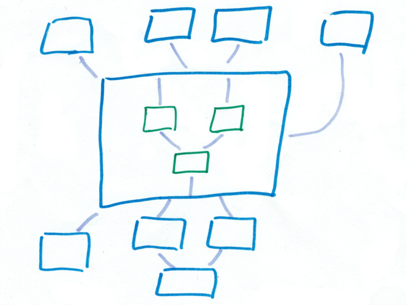

*This follows up on [Programming Beyond Text Files](/art/programming-beyond-text-files/)
and [DECODING: Programming Beyond Text Files](/art/decoding-programming-beyond-text-files/)*

# Autonomic Layouts

## Visual Programming Layout Problem

One thing which always gets brought up when talking about visual programming
languages is how fiddly they are.  Nodes are dragged and dropped onto an arbitary
space and the relationship between the nodes is left to the reader's imagination.

I attempted to provide some guidance for this in 
[Flobot](/art/flobot-graphical-dataflow-language-for-robots/) by
restricting sensor nodes to the top of the screen, and actuator nodes to the bottom
of the screen.  Nodes always have inputs on top and outputs on the bottom, so the
logical flow from top to bottom is established.

You can buck the trend and build Flobot networks in weird S shapes but loops
are disallowed and so there's a clear hierarchy. 

## Automatic Node Placement

Perhaps it'd be a good idea to take the job of placing nodes away from 
the user?  Much like tiling window managers, which place windows as 
neatly as possible without user intervention.

One possibility would be to use
[Force Directed Placement](https://en.wikipedia.org/wiki/Force-directed_graph_drawing) 
or Energy Minimization or similar to place nodes in "the right place".

Nodes would then automatically locate themselves between their
related nodes by attraction,
avoiding overlapping with other nodes by repulsion.
Clever algorithms can avoid local minima and end up with a "nice"
layout every time, with minimal edge crossings and no occlusions.
Some kind of 'hinting' may be required to keep the layout
stable.

I'm a bit obsessed with these kids of algorithms, ever since playing with
[Xspringies](https://web.archive.org/web/20130330210456/http://www.cs.rutgers.edu/~decarlo/software.html)
and [Graphviz](https://graphviz.org/) as an undergrad:
see also [Virtual Localization](https://nick.zoic.org/art/virtual-localization/)

## Blasphemous Geometries

But this assumes we're trying to lay out our visual program in
a static, flat page, which we have a little window into.

This sort of thing works okay for text files, which are long and
skinny so you can scroll your view through them in one dimension.
Scrolling through things is a lot harder in two dimensions,
requiring more of a zoom out and zoom in approach, and in more
dimensions or non-Euclidean spaces it's intractable.

I favour an approach of having a "focus" node around which other
nodes are arranged according to their relationships to the focus.
Direction on the screen can indicate the nature of the relationship,
with parent/child, next/previous, cause/effect, contains/contained
etc mapping onto the screen direction.

As mentioned in [Decoding](/art/decoding-programming-beyond-text-files/)
This mapping between graph and presentation could even be dynamic:
choose a different mapping depending on the work at hand.

Navigation is then done by shifting focus between nodes.  Move from caller
to callee and back, zoom in and out based on encapsulation.
Rather than nodes existing in a static 2D presentational space, they exist in a
much larger, higher dimensional mental space.

## Precedent

"Let me introduce the word "hypertext" to mean a body of written or pictorial
material interconnected in such a complex way that it could not conveniently be
presented or represented on paper." -- [Ted Nelson](https://dl.acm.org/doi/10.1145/800197.806036)

We're used to thinking about hypertext as something which gets laid out onto a flat
plane, something you *could* print on a really big piece of paper if you wanted to,
and I guess that's that word "conveniently".  

But there's another Ted Nelson quote I'm thinking of but can't find right now, pretty sure it was in
*[Computer Lib / Dream Machines](https://archive.org/details/computer-lib-dream-machines/mode/2up)*,
which explicitly acknowledges the necessity of *dynamic* presentation to make this work.

(Ironically, this text is quite hard to search through and unlike the 
[Principia Discordia](https://principiadiscordia.com/book/5.php) doesn't seem to have a modern
web version.  It reminds me of another great 70s book I found in the library,
[Domebook 2](https://archive.org/details/Domebook.2.1972.Lloyd.Kahn))

## Autonomy

I've coined the term "autonomic layouts" for this concept,
drawing a comparison with the
[Autonomic Nervous System](https://en.wikipedia.org/wiki/Autonomic_nervous_system)
which operates mostly autonomously but to further the 
aims of the [Somatic Nervous System](https://en.wikipedia.org/wiki/Somatic_nervous_system) which carries our voluntary actions.

## UPDATE

I'm working with some of these ideas again in [CountESS](/art/attack-and-dethrone-excel/)
