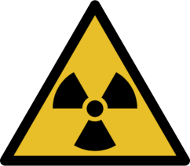
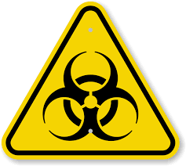
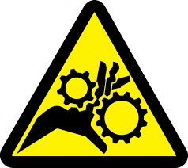
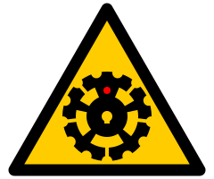

*This sketch has been sitting in a temporary repo for about 2.5 years now, it's
something I drew while experimenting with hand-editing SVG.
2020 seemed like the right year for it so I thought it should see light of day at long last*

It's a proposed warning label for autonomous robot systems: you know, the kind
of unpredicatable robot thing which should be kept away from humans lest it maim
someone. There's plenty of warning symbols for normal machinery but nothing I could see
to indicate that a machine which appears to be dormant could become active at 
any moment.

The design is based on the general idea of [symmetric hazard symbols](https://en.wikipedia.org/wiki/Hazard_symbol) like
the [radiation warning](http://www.mub.eps.manchester.ac.uk/nuclearhitchhiker/?p=665)
and [biohazard](https://en.wikipedia.org/wiki/Biological_hazard) signs.  It also takes
inspiration from the gears/cogs/sprockets represented in machinery hazard signs.

  

It is symbolically a five spoked wheel or cog to represent machinery,
and also a anthropomorphic robot in a
[Vitruvian Man](https://en.wikipedia.org/wiki/Vitruvian_Man)-like
pose to symbolize the autonomous nature of the device.

The 5 spoked wheel is a nod to the [Discordians](https://en.wikipedia.org/wiki/Discordianism)
and the 13 teeth on the wheel are just a nice bonus.  At the center is a 
skull-like [keyed shaft](https://en.wikipedia.org/wiki/Key_%28engineering%29).

(While the finer details might be a bit fussy for non-machine printing,
in an emergency a hand drawn, five spoked wheel in a hazard triangle should suffice.)

OK, I guess I'd better go print it on a T-shirt :-)
