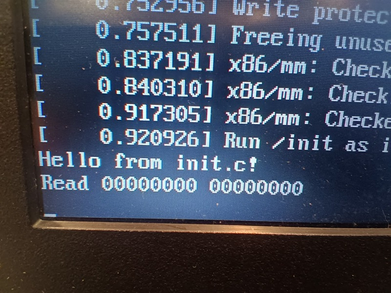

When I was [a kid](../ultima-iv-reflections/), computers weren't coddled and 
left running 24/7, when you were done with them you switched them off, and
when you wanted them again you just switched them on and within a second or
so they'd be loading whatever was in their disk drive.

There was a brief moment in the early 2000s where the newly introduced
SSDs made booting quick but as always the tech industry has taken up the
slack until even a 16 core monster with a fast SSD still takes a minute
to get its feet under it.

So I wanted to try an alternative.
Keep the Linux kernel but strip away everything else I could.
Here goes ... well not quite here goes nothing, but here goes a lot less.

## Hello, World!

The first thing a Linux system does is run an "init" program of one sort
or another which loads all the other processes and configurations and stuff.
There's nothing too special about this program, it's just a regular 
executable or script, and there have been a few different approaches taken
over the years in any case.

So we can write a new one in C ... here's `init.c`:

    #include <stdio.h>
    #include <stdlib.h>
    #include <sys/reboot.h>

    int main(int argc, char **argv) {
        fprintf(stderr, "Hello from init.c!");
        reboot(RB_POWER_OFF);
    }

All it does is print a message, and then reboot the computer.

If our init process *exits* the kernel panics, so instead of busy waiting[^1]
or sleeping forever or whatever, we use `reboot(RB_POWER_OFF)` to shut the
virtual machine down in an orderly manner.

[^1]: see [^1]

## Making initrd

Modern Linux supports
[quite a complex multi-stage process](https://wiki.debian.org/initramfs).
There's a lot of resources out there, and a lot of them are 20 years
out of date, and
[there have been changes](https://www.kernel.org/doc/html/v4.14/admin-guide/initrd.html)
but here's a summary of how I think it works right now, 
as of 2026 and Linux 6.8 or thereabouts:

* A boot loader runs with a kernel and a dummy filesystem called 'initrd'.
* The kernel attempt to unpack the 'initrd' file into an 'initramfs', a
  root filesystem in RAM which allows initialization tools to run.
  * it looks for a file called `/init` (or whatever is specified in the
  `rdinit=` kernel parameter)
  * if it exists, it runs it and that process takes over initialization.
* Otherwise, it falls back to:
  * mount the root partition specified by the `root=` kernel parameter
  * mount the `devtmpfs` filesystem at `/dev`
  * run `/init` (or whatever is specified in the `init=` kernel
    parameter) from that.
* Otherwise, or if the init process exits, it kernel panics.

Most modern distros use the first branch: quite a large initrd filesystem is
provided so that modules and firmware can get loaded before attempting to
boot the real filesystem.
The `initrd` file which my PC boots from is 73MB and according to `lsintramfs`
it contains 2163 files!

There's a few examples of how to
[construct a filesystem with a 
replacement for init](https://medium.com/@mustafaakin/writing-my-own-init-with-go-part-1-22e81495a246)
but I wanted to go even simpler.

If we compile our example code statically, eg: containing all the libraries it
needs, we can make our own 'initrd' with only one file in it:

    gcc -static init.c -o init

    echo 'init' | cpio -o --format=newc | gzip -c > initrd

### about cpio

`cpio` is a very weird and ancient program with a command line
which makes `tar` look user-friendly.
But let's not worry about the details for now.

I will note that, later, if you get a kernel message:

    Initramfs unpacking failed: no cpio magic

... it means that either the cpio format or the compression or something
similar isn't compatible with your kernel.  The kernel will attempt to
continue, but a later error message like:

    check access for rdinit=/init failed: -2, ignoring

... means that either the initramfs didn't happen *or* your binary is
in the wrong place (`-2` means file not found).
You might also get a message about incompatible architectures.
This message happens pretty early in the boot process, which attempts to 
continue anyway, so you'll have to look back carefully.
Whereas if you see:

    Trying to unpack rootfs image as initramfs...

... and then nothing else, that's a good sign. It never logs that it was
successful.

## Virtualized

Getting this going on real hardware would be pretty irritating,
so I'm using [QEMU](https://qemu.org/) to make a virtual system
to experiment with.

QEMU lets you boot from just
[a kernel and a filesystem image](https://qemu-project.gitlab.io/qemu/system/linuxboot.html)
on the command line.

For now, rather than proper QEMU I'm using KVM to run a virtualized
system. For full emulation, you can also run these examples with
`qemu-system-x86_64`, or whatever the appropriate emulator is for 
your system.

But first we need a kernel, I'm just using the current kernel
from my machine but the `/boot/vmlinuz` file is readable by root only so first
we make a copy of it in our working directory and change its ownership:

    sudo cp /boot/vmlinuz .
    sudo chown $USER:$GROUP vmlinuz

We now have our two binary files, the kernel `vmlinuz` and 
the init image `initrd` which contains only our program
`init`.
So we can boot our system with:

    kvm -m 1G -nographic -kernel vmlinuz \
        -initrd initrd -append "console=ttyS0"

The `-nographic` and `-append "console=ttyS0"` options give us a terminal console
to monitor stderr on rather than popping up a graphical console.

When the kernel starts up, it unpacks our `initrd` into a ram disk, and
runs our `init` binary:

    [    0.000000] Linux version 6.8.0-111-generic (buildd@lcy02-amd64-088)
    [    0.000000] Command line: console=ttyS0
    [    0.489390] Trying to unpack rootfs image as initramfs...
    [    0.805419] Run /init as init process
    Hello from init.c!
    [    0.807535] reboot: Power down

*(abbreviated)*

## Devices

Even if we don't want any filesystems, we might want some permanent 
storage.

But at the time our `/init` runs, we haven't mounted a root filesystem yet,
so there's no devices available!
Devices are made available using a kernel mechanism called "devtmpfs" so the
first thing we have to do is activate that. We can mount
devtmpfs from our C program using `mount("devtmpfs", "/dev", "devtmpfs", 0, NULL)`.

QEMU can present a host file as a block device on the guest using 
the `-hda` option, the file will appear to the guest as `/dev/sda`, so let's 
modify our code from before to mount the `devtmpfs`, open `/dev/sda`
and read the first few bytes from that file:

    #include <stdio.h>
    #include <stdlib.h>
    #include <unistd.h>
    #include <sys/mount.h>
    #include <sys/reboot.h>
    #include <arpa/inet.h>

    int main(int argc, char **argv) {
        fprintf(stderr, "Hello from init.c!\n");
        mount("devtmpfs", "/dev", "devtmpfs", 0, NULL);

        int fd = open("/dev/sda", O_RDWR);
        uint32_t buffer[2];
        read(fd, buffer, sizeof(buffer));
        close(fd);

        fprintf(stderr, "Read %08x %08x\n",
            ntohl(buffer[0]), ntohl(buffer[1]));

        reboot(RB_POWER_OFF);
    }

*(yeah, I know, proper C code needs to be scattered with return
value checks and sensible reports of errno.
I've left these out for clarity.)*

Before we can run this we need a disk image.
Let's make some random bytes in a file:

    dd if=/dev/random of=diskimage bs=1K count=1K

Then we can compile and run this like before:

    gcc -static -o init init.c 

    echo 'init' | cpio -o --format=newc | gzip -c > initrd

    kvm -m 1G -nographic -kernel vmlinuz \
        -initrd initrd -append "console=ttyS0" \
        -no-reboot -hda diskimage

... and end up with output something like (edited for brevity):

    [    0.000000] Linux version 6.8.0-111-generic (buildd@lcy02-amd64-088)
    [    0.000000] Command line: console=ttyS0
    [    0.010975] Memory: 975024K/1048056K available (22528K kernel code, 4438K rwdata,
                   14412K rodata, 4924K init, 4788K bss, 72772K reserved, 0K cma-reserved)
    [    0.493923] Trying to unpack rootfs image as initramfs...
    [    0.712522] ata1.00: ATA-7: QEMU HARDDISK, 2.5+, max UDMA/100
    [    0.713091] ata1.00: 2048 sectors, multi 16: LBA48 
    [    0.816634] Run /init as init process
    Hello from init.c!
    Read 4463823c a5c37e77
    [    0.819849] reboot: Power down

So there we go, less than a second from power-on to running a program and reading from disk.

## Booting real hardware

There are a lot of conflicting instructions out there, and most of them
seem to assume you're trying to update the bootloader of the system you're
using, rather than adding EFI booting to a USB stick, but this is what
worked for me:

* plug in the USB key
* use lsblk to make absolutely sure it's the right one
  (in my case, it's /dev/sda, but be careful as these commands
  will trash whatever drive you're pointing them at.)
* use `dd if=/dev/zero of=/dev/sda bs=1M count=1` to clear the boot sector
  and partition table completely.
* use `sudo cfdisk` to set up some partitions:
  * Format the device as "dos"
  * Create a partition of type "EFI" (hex id `ef`) with 512M size
    and mark it as bootable.
  * Create another partition for later, leave the type
    "Linux" (hex id `83`) for now

It should end up looking something like:

                           Disk: /dev/sda
         Size: 3.76 GiB, 4037017600 bytes, 7884800 sectors
                 Label: dos, identifier: 0xdeadd0d0
    
    Device    Boot   Start     End Sectors Size Id Type
    /dev/sda1 *       2048 1050623 1048576 512M ef EFI (FAT-12/16/32)   
    /dev/sda2      1050624 7884799 6834176 3.3G 83 Linux

Plenty of places seem to say the partition table has to be of type GPT
and the EFI partition of a special type within that, but this is what
my Mint Linux installer USB looked like and this is what 
worked for me on this crappy laptop.

Now we can make the file systems on our partitions:

    sudo mkfs.fat -F 32 /dev/sda1
    sudo mkfs.ext3 /dev/sda2

In theory UEFI can load multiple files from multiple locations, and run
a little script called `startup.nsh`, and stuff like that, but this laptop
refused to pay any attention to any of that, and the only way to get it
to boot happily was to create a file called `/EFI/BOOT/BOOTX64.EFI`.

So I needed to make a "unified kernel" which contains a loader stub,
the kernel itself, and the initrd file which contains our program.
We can do this with the `ukify` tool:

    sudo apt install systemd-ukify systemd-boot-efi
    ukify build --linux=vmlinuz --initrd=initrd

Then we just need to
copy the new unified kernel file into the right place:

    sudo mount /dev/sda1 /mnt
    sudo mkdir -p /mnt/EFI/BOOT
    sudo cp vmlinuz.unsigned.efi /mnt/EFI/BOOT/BOOTX64.EFI
    sudo umount /mnt

... and go boot the USB stick!

# TO BE CONTINUED

* User input from `/dev/console`
* Cross-compiling for ARM
* Multiprocessing and networking
