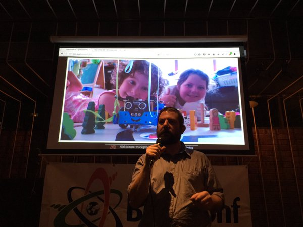

On the 26 May I presented at [Buzzconf
Nights](https://buzzconf.io/) in Melbourne about the [ESP8266
WiFi SoC](http://esp8266.com/), its implications and how to use it.

And I got to introduce and give a quick demo of the
[Flobot](../flobot-graphical-dataflow-language-for-robots/) and
[Ciril](../ciril-cubic-inch-robots-in-labs/) projects.

Video
=====

<iframe width="648" height="390" src="https://www.youtube.com/embed/VqiZ1P5cHag" frameborder="0" allowfullscreen></iframe>
[The slides are here](../../talk/buzzconf1/)

{width="648px"}

PyCon AU
========

I'll be talking about some of this stuff at [PyCon AU's inaugural
Internet of Things
mini-conf](https://2016.pycon-au.org/programme/internet_of_things_miniconf).
