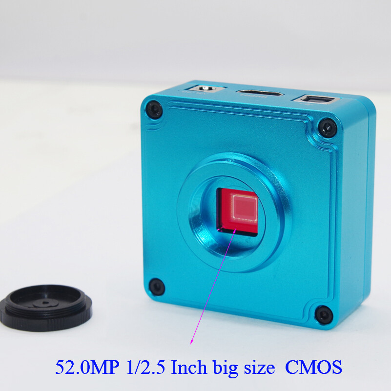
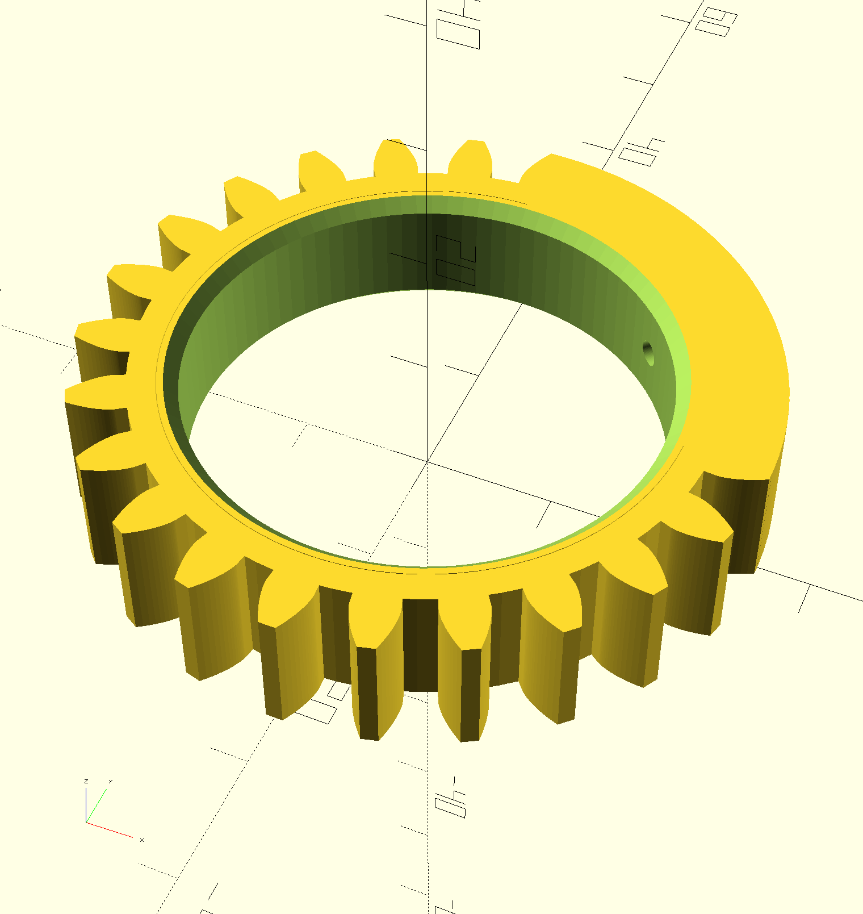

## The Camera

[Lapsun Source on Ebay](https://www.ebay.com.au/itm/125099779052)

The camera is advertised and labelled as "52MP FHD Camera V8" but when zooming to
"7.0x" in it's pretty clear that it isn't a 52 MPix sensor, and at this high level
of zoom it's actually interpolating pixels.

It is more or less [this YW5607](http://www.szyoungwin.com/en/procanshu.php?pid=401)
which I note advertises a more realistic 16Mpix which would correspond to a 2.8x zoom.

These guys were quite helpful, unfortunately this camera has a couple of things it doesn't do
which I need it to for this project:

* When powered through the DC power port, it doesn't turn on automatically or via the remote control.
* When powered through the USB port, all button controls and remote controls stop working (including zoom)
* (using a split cable) When powered through the DC power port and *not* the USB port:
  * the button controls work
  * the USB data lines don't
* If you power from DC and zoom the image in, then plug in USB, you can see the zoomed image on UVC.

So, to make this camera zoomable remotely, I'll need to toggle the USB power on and off.

* Turn USB power on to wake camera.
* Turn USB power off and then send IR codes to zoom in or out
* Turn USB power back on to connect to camera.
* Turn USB power off and send IR codes to power off.

This is annoying!  I do have a supposedly smart hub here which *should* be able
to turn ports on and off with `uhubctl` but it doesn't appear to actually work,
so I've tested this out by cutting a USB cable in half and making the power 
line switchable.
I've asked the manufacturer if they have a better way.

## The Lens

From [Ebay](https://www.ebay.com.au/itm/147100667054).

This is allegedly a 6-60mm zoom which goes out to f/1.6.
The image is 1/3" whereas the camera is 1/2.5" and at some focal
lengths you can indeed see the edges of the lens in the corners
of the image.

The outside of the barrel is 36mm.
There are three rotating controls each of which rotate about 90⁰
and they have little M2 thumb screws to secure them in one place.
Plan is to replace these with regular screws which will secure and
locate 3d printed rings with gear teeth or whatever which can be
operated by servos.

|label|purpose|
|---|---|
| N &larr; &rarr; &inf; | focus |
| O &larr; &rarr; C | aperture |
| W &larr; &rarr; T | zoom |

