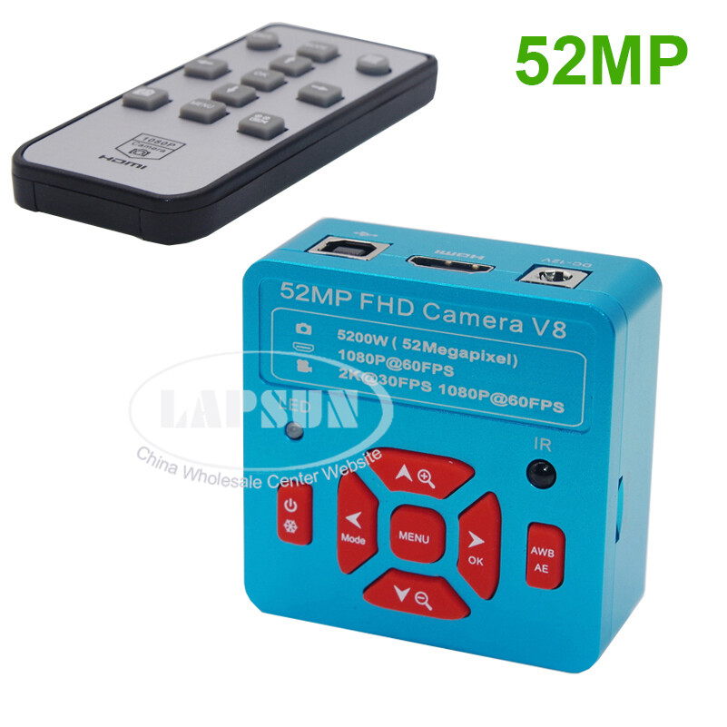
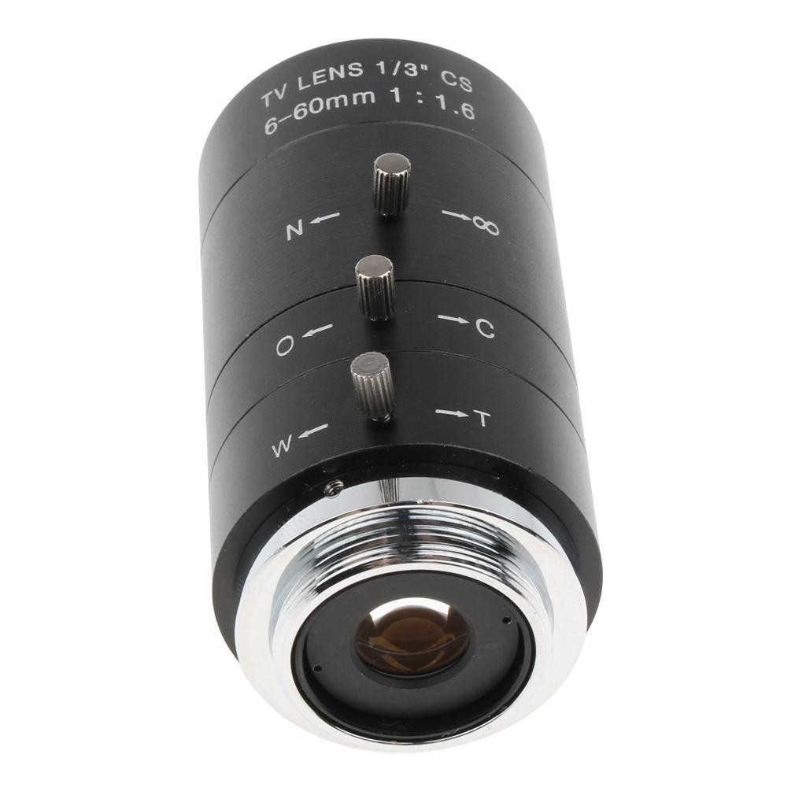
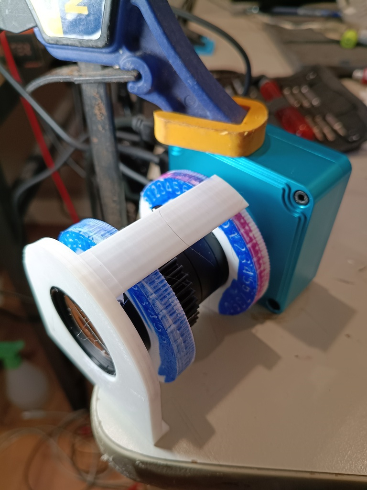
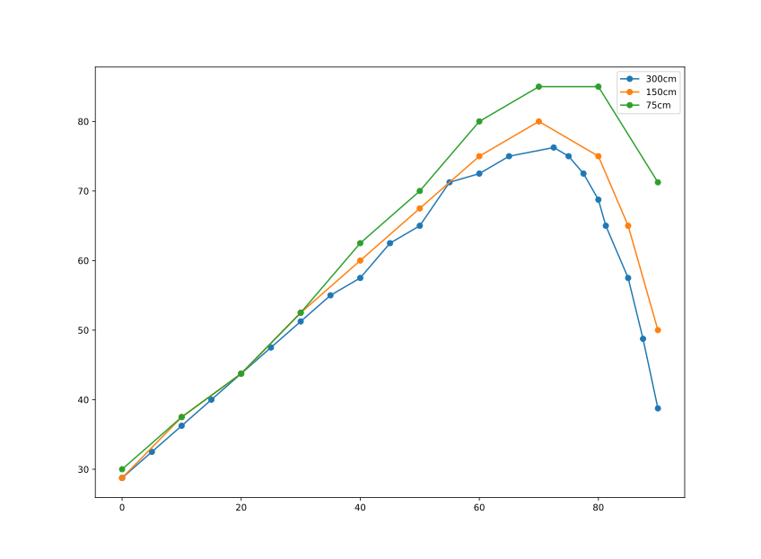
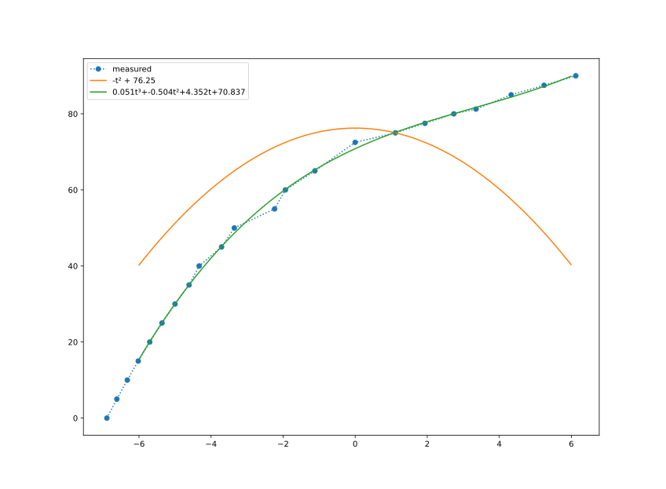

This is a project to get a camera and lens controlled directly from software.
There are various ways to do this, including remote control of a
[DSLR](https://en.wikipedia.org/wiki/Digital_camera#Digital_single-lens_reflex_cameras_(DSLR))
or [mirrorless](https://en.wikipedia.org/wiki/Mirrorless_camera) camera, but in
this case I'm just trying to control the camera hardware directly, as a learning
experience if nothing else.

## The Camera

<!---->

[Lapsun Source on Ebay](https://www.ebay.com.au/itm/125099779052)

The camera is advertised and labelled as "52MP FHD Camera V8" but when zooming to
"7.0x" in it's pretty clear that it isn't a 52 MPix sensor, and at this high level
of zoom it's actually interpolating pixels.
It is more or less [this YW5607](http://www.szyoungwin.com/en/procanshu.php?pid=401)
which I note advertises a more realistic 16Mpix which would correspond to a 2.8x zoom.

The nice thing about this camera is it outputs HDMI so you can use it directly with 
a monitor or TV at very low latency.  I'm using it in this way as a microscope for 
circuit assembly and inspection but it'd be nice to have some software control.

### Zooming

These guys were quite helpful, unfortunately this camera has a couple of things it doesn't do
which I need it to for this project:

* When powered through the DC power port, it doesn't turn on automatically or via the remote control.
* When powered through the USB port, all button controls and remote controls stop working (including zoom)
* When powered through the DC power port and *not* the USB port:
  * the button controls work
  * the USB data lines (using a split cable) don't
* If you power from DC and zoom the image in, then apply power on USB, you can see the zoomed image
  over the USB interface.
* The maximum resolution supported by this camera on UVC is 1920x1080 and it doesn't seem to expose
  "controls" for zooming.

So, to make this camera zoomable remotely, I'll need to toggle the USB power on and off.

* Turn USB power on to wake camera.
* Turn USB power off and then send IR codes to zoom in or out
* Turn USB power back on to connect to camera.
* Turn USB power off and send IR codes to power off.

This is annoying!  I do have a supposedly smart hub here which *should* be able
to turn ports on and off with `uhubctl` but it doesn't appear to actually work,
so I've tested this out by cutting a USB cable in half and making the power 
line switchable.

## The Lens

From [Ebay](https://www.ebay.com.au/itm/147100667054).

This is allegedly a 6-60mm zoom which goes out to f/1.6.
The image is 1/3" whereas the camera is 1/2.5" and at some focal
lengths you can indeed see vignetting or even the edges of the lens
in the corners of the image.

The outside of the barrel is 36mm.
There are three rotating controls each of which rotate about 90⁰
and they have little M2 thumb screws to secure them in place at
a fixed position.

### Ring, ring ...

The middle ring is labelled "O &larr;&rarr; C" and is
straightforwardly the aperture, from a maximum f/1.6 at "O" to
completely closed at "C".

The other two rings are a bit weirder.  Despite "N &larr;&rarr; &infin;"
suggesting this is focus from near to infinity and "W &larr;&rarr; T"
suggesting this is zoom from wide to tele, the front one acts more like
a zoom and the rear more like a focus adjustment.
I was having some trouble coming to grips with how this actually
worked so I ended up making a test jig to let me experiment.

*test jig for measuring lens behaviour*

Two big plastic rings and a pointer make it easy to measure the 
position of each ring to within a couple of degrees when focussed on
fixed targets at 3.0 meters, 1.5 meters and 0.75 meters:

front ring | rear ring (300mm) | rear ring (150mm) | rear ring (75mm) | zoom
---|---|---
0 | 28.75 | 28.75 | 30 | tele
5 | 32.5 | | |
10 | 36.25 | 37.5 | 37.5 | 
15 | 40 | | |
20 | 43.75 | 43.75 | 43.75 |
25 | 47.5 | | | 
30 | 51.25 | 52.5 | 52.5 |
35 | 55 | |  |
40 | 57.5 | 60 | 62.5 |
45 | 62.5 |  | | 
50 | 65 | 67.5 | 70 |
55 | 71.25 | |
60 | 72.5 | 75 | 80 |
65 | 75 | | |
70 | | 80 | 85 |
72.5 | 76.25 | | |
75 | 75 | |  |
77.5 | 72.5 | | |
80 | 68.75 | 75 | 85 |
81.25 | 65 |  | |
85 | 57.5 | 65 | |
87.5 | 48.75 | | |
90 | 38.75 | 50 | 71.25 | wide

(I didn't measure the actual zoom focal length but the lens claims 6-60mm
which would be 36-360mm in 35mm equivalent which seems about right.)

*ring1 vs ring2*

The relationship between the two is not linear!  The angle of ring2 rises 
along with the angle of ring1, until it slows and rapidly reverses.

By picking an arbitrary
'zoom' axis for both rings to be functions of, and assuming one was a
simple parabola, I was able to fit a cubic to the other:

*fitting curves compared to an arbitrary 'zoominess' axis*

This is pretty arbitrary, of course: a better fit is likely possible but 
I'm going to come back to this.

### ... why don't you give me a gear.

To gain control of the lens, I 3D printed a gear which fits tightly onto
the ring and used the thumbscrew to secure it to the ring without preventing
the ring from rotating.

I could then drive the gear with a small RC servo.  These turn about 180⁰
where the ring only turns 90⁰, so I use a 1:2 gear ratio to match them
together.

<iframe src="htt
ps://www.youtube.com/embed/9Pfr_puJHnI" frameborder="0" allow="accelerometer; autoplay; encryp
ted-media; gyroscope; picture-in-picture" style="position: absolute; width: 100%; height: 100%
; left: 0; top: 0" allowfullscreen></iframe>

The servo is a [Tower Pro 9G SG90](https://towerpro.com.tw/product/sg90-7/) ...
it is very small but it draws a lot of power when moving — about 6V 300mA 
when moving quickly and twice that current at stall — and it 'fidgets' if
it doesn't get enough.

Next: a second servo!  By controlling the two rings separately, and
plotting out focus curves at other distances, I should be able to focus
and zoom the lens accurately.  I could maybe even squeeze in a third 
servo for aperture.

Real camera lenses make these adjustments using ultrasonic steppers motors
which wrap right around the lens.  It'd be a fun project to reverse engineer
a micro-four-thirds power zoom lens for this purpose, but that's a different
project for a different time.

[Autofocus](https://doi.org/10.1364/OPTICA.6.000794)

