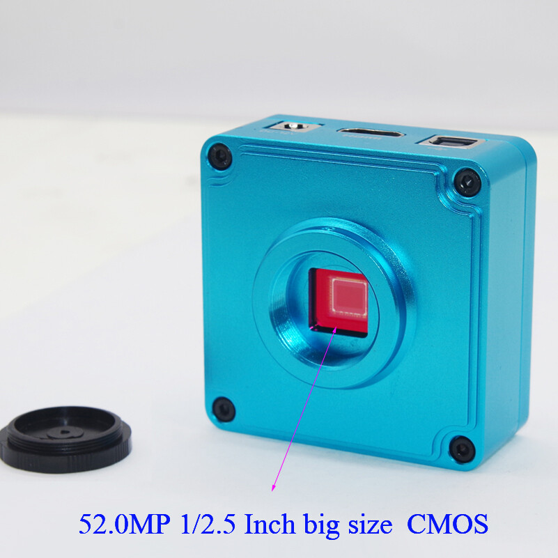
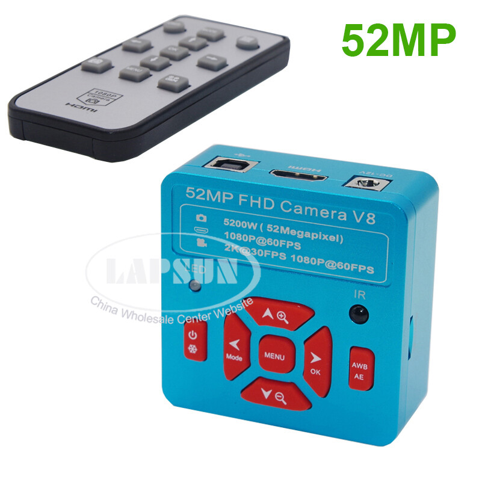
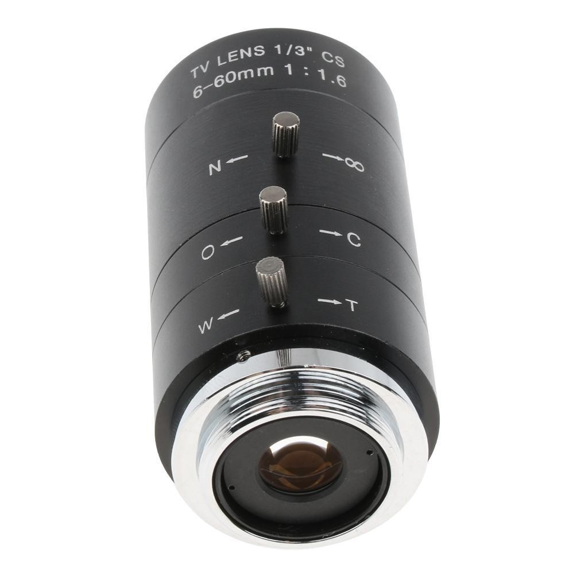
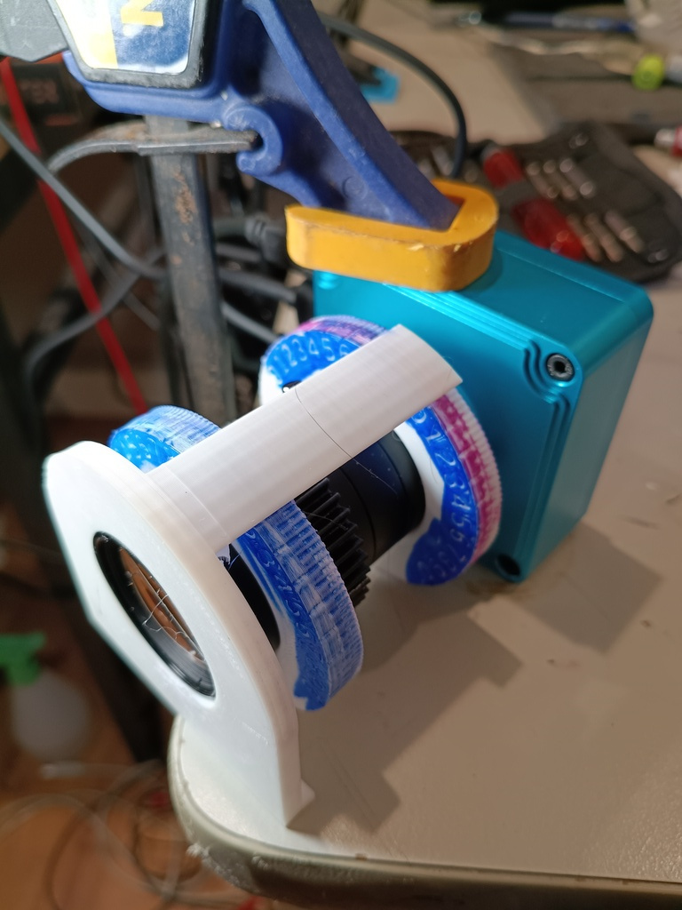
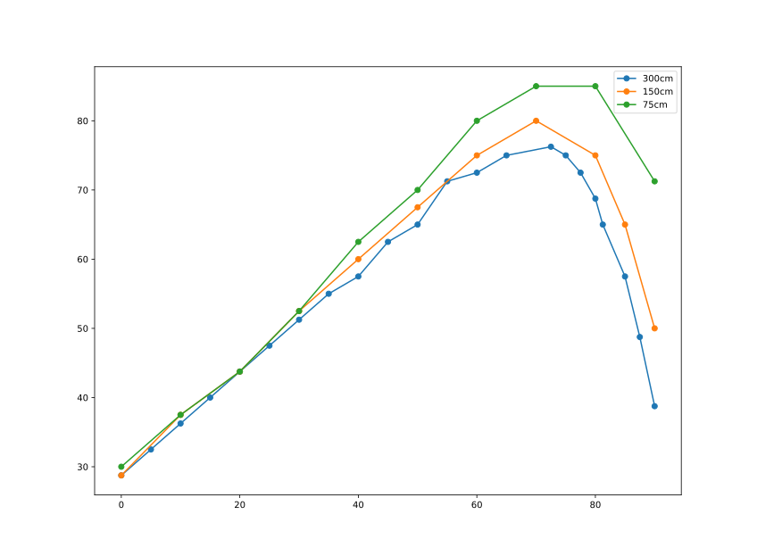
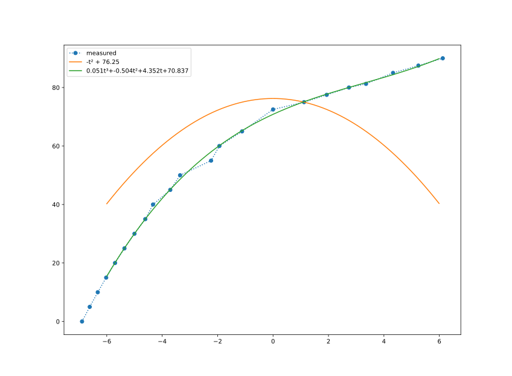
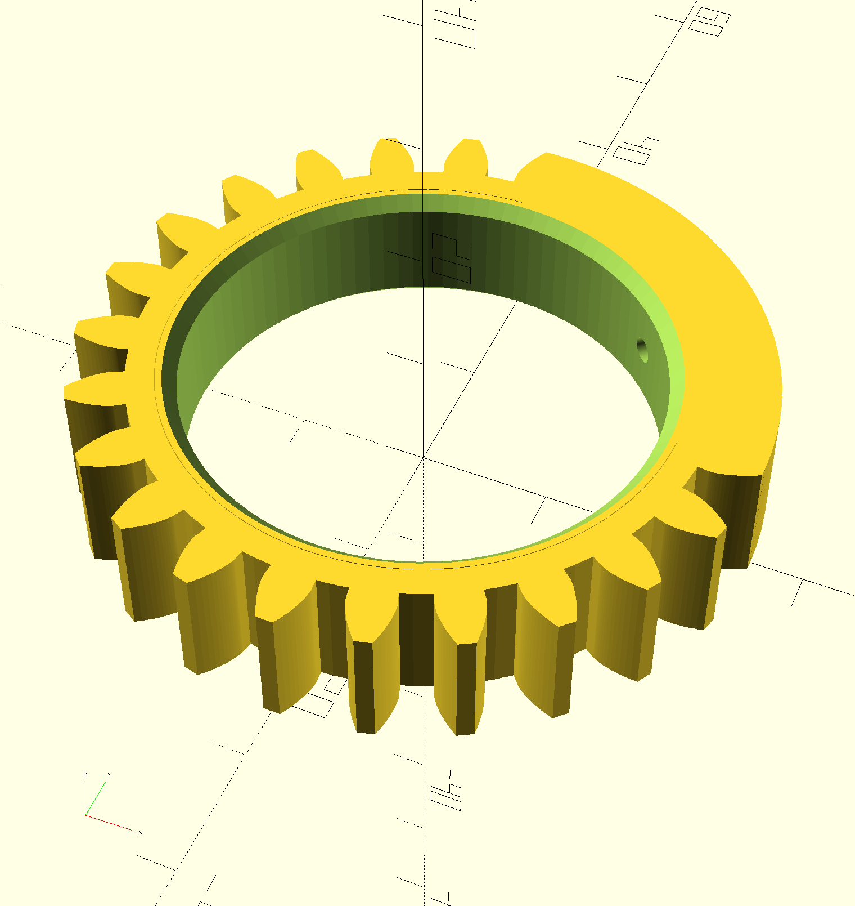
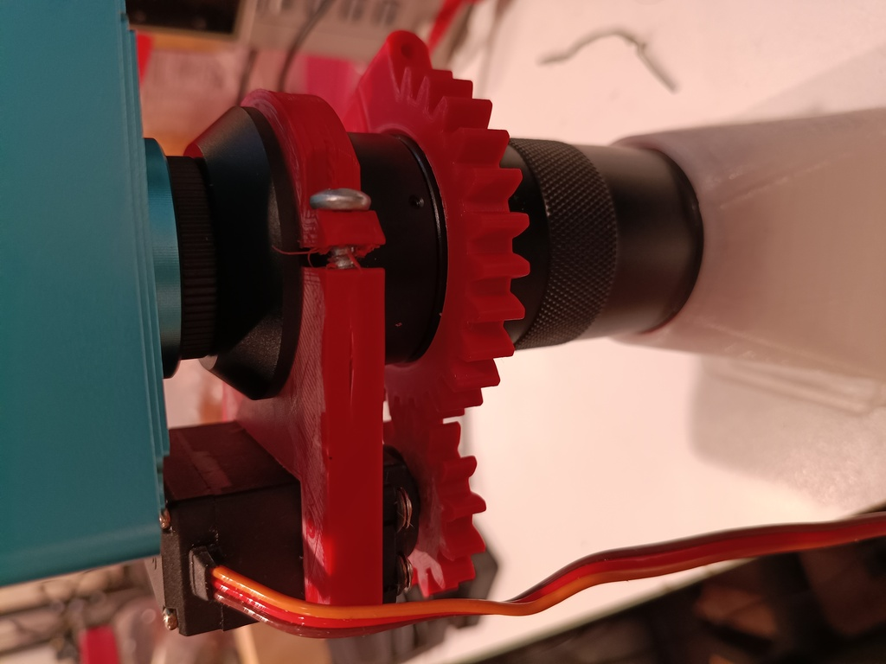

This is a project to get a camera and lens controlled directly from software.
There are various ways to do this, including remote control of a
[DSLR](https://en.wikipedia.org/wiki/Digital_camera#Digital_single-lens_reflex_cameras_(DSLR))
or [mirrorless](https://en.wikipedia.org/wiki/Mirrorless_camera) camera, but in
this case I'm just trying to control the camera hardware directly, as a learning
experience if nothing else.

## The Camera

<!---->

[Lapsun Source on Ebay](https://www.ebay.com.au/itm/125099779052)

The camera is advertised and labelled as "52MP FHD Camera V8" but when zooming to
"7.0x" in it's pretty clear that it isn't a 52 MPix sensor, and at this high level
of zoom it's actually interpolating pixels.
It is more or less [this YW5607](http://www.szyoungwin.com/en/procanshu.php?pid=401)
which I note advertises a more realistic 16Mpix which would correspond to a 2.8x zoom.

The nice thing about this camera is it outputs HDMI so you can use it directly with 
a monitor or TV at very low latency.  I'm using it in this way as a microscope for 
circuit assembly and inspection but it'd be nice to have some software control.

### Zooming

These guys were quite helpful, unfortunately this camera has a couple of things it doesn't do
which I need it to for this project:

* When powered through the DC power port, it doesn't turn on automatically or via the remote control.
* When powered through the USB port, all button controls and remote controls stop working (including zoom)
* When powered through the DC power port and *not* the USB port:
  * the button controls work
  * the USB data lines (using a split cable) don't
* If you power from DC and zoom the image in, then apply power on USB, you can see the zoomed image
  over the USB interface.
* The maximum resolution supported by this camera on UVC is 1920x1080 and it doesn't seem to expose
  "controls" for zooming.

So, to make this camera zoomable remotely, I'll need to toggle the USB power on and off.

* Turn USB power on to wake camera.
* Turn USB power off and then send IR codes to zoom in or out
* Turn USB power back on to connect to camera.
* Turn USB power off and send IR codes to power off.

This is annoying!  I do have a supposedly smart hub here which *should* be able
to turn ports on and off with `uhubctl` but it doesn't appear to actually work,
so I've tested this out by cutting a USB cable in half and making the power 
line switchable.

### Other Cameras

I've also ordered a more specialized CS-mount camera
[from Waveshare](https://www.ebay.com.au/itm/257289165597)
which doesn't have the HDMI output but should be useful for other things.
It's based on the Sony IMX577 and should be able to stream
3840 × 3024 at 20FPS over USB 2.0.  Hopefully it'll also let me zoom etc
using UVC controls.

There are heaps of similar cameras around using various flavours of "CSI",
and which support assorted Raspberry Pi and Nvidia Jetson boards, but I'm
not sure how the different versions interoperate and what boards will be
compatible in the future and using USB saves me worrying about all that.

## The Lens

From [Ebay](https://www.ebay.com.au/itm/147100667054).

This is a 6-60mm zoom CS-mount lens which opens out to f/1.6.
The image circle is 1/3" whereas the camera is 1/2.5", fractions being
fractions, at some focal lengths you can indeed see vignetting or even
the edges of the lens in the corners of the image, where the image circle
is smaller than the sensor.

The outside of the lens barrel is 36mm.
There are three rotating controls each of which rotate about 90⁰
and they have little M2 thumb screws to secure them in place at
a fixed position.

### Ring, ring ...

The middle ring is labelled "O &larr;&rarr; C" and is
straightforwardly the aperture, from a maximum f/1.6 at "O" to
completely closed at "C".  As the aperture closes it appears to
be three blades leading to quite amazing [bokeh](https://photographylife.com/what-is-bokeh)[^cs],

[^cs]: Sadly CS lenses don't lend themselves to mounting on other cameras as their focal
    plane distance is very short indeed (12.526mm), even compared to 
    say [Micro 4/3](https://en.wikipedia.org/wiki/Micro_Four_Thirds_system)'s 19.25mm.
    The ones you see people using are "C-mount", which are mostly similar but 17.526mm 
    focal plane distance.

The other two rings are a bit weirder.
The front ring is labelled "N &larr;&rarr; &infin;"
suggesting this is focus from near to infinity and the rear one 
is labelled "W &larr;&rarr; T" suggesting this is zoom from wide to tele.
In use though, the front one acts more like
a zoom and the rear more like a focus adjustment.
I was having some trouble coming to grips with how this actually
worked so I ended up making a test jig to let me experiment.

*test jig for measuring lens behaviour*

Two big plastic rings and a pointer make it easy to adjust and measure the 
position of each ring to within a couple of degrees: the rings are very 
sensitive so even a 1⁰ change makes a noticable difference.

I set the front ring to various angles, and used the rear ring to focus on
fixed targets at 3.0 meters, 1.5 meters and 0.75 meters, and recorded the
angle of the rear ring.
I didn't measure the actual zoom focal length but the lens claims 6-60mm
which would be 36-360mm in 35mm equivalent which seems about right.

front ring | rear ring (300mm) | rear ring (150mm) | rear ring (75mm) | zoom
---|---|---
0 | 28.75 | 28.75 | 30 | tele
5 | 32.5 | | |
10 | 36.25 | 37.5 | 37.5 | 
15 | 40 | | |
20 | 43.75 | 43.75 | 43.75 |
25 | 47.5 | | | 
30 | 51.25 | 52.5 | 52.5 |
35 | 55 | |  |
40 | 57.5 | 60 | 62.5 |
45 | 62.5 |  | | 
50 | 65 | 67.5 | 70 |
55 | 71.25 | |
60 | 72.5 | 75 | 80 |
65 | 75 | | |
70 | | 80 | 85 |
72.5 | 76.25 | | |
75 | 75 | |  |
77.5 | 72.5 | | |
80 | 68.75 | 75 | 85 |
81.25 | 65 |  | |
85 | 57.5 | 65 | |
87.5 | 48.75 | | |
90 | 38.75 | 50 | 71.25 | wide

*all measurements are ±1⁰ or so*

*ring1 vs ring2*

The relationship between the two is not linear!  The angle of the rear ring rises 
along with the angle of the front ring, until it slows and rapidly reverses.
You can confirm this experimentally: with the rear ring set to 60⁰, the image is in
focus at two different settings of the front ring, with different zoom levels.

By picking an arbitrary
'zoom' axis for both rings to be functions of, and assuming one was a
simple parabola, I was able to fit a cubic to the other:

*fitting curves compared to an arbitrary 'zoominess' axis*

This is pretty arbitrary, of course: a more elegant equation and a better fit
is likely possible but I'm going to come back to this once things are
automated.

### ... why don't you give me a gear.

To let the computer control the lens, I 3D printed a gear which fits tightly onto
the ring and used the existing thumbscrew to secure it to the ring.  Because of 
the additional spacing, the screws just attach the gear to the ring and don't
prevent the ring from rotating freely.

*lens gear designed in OpenSCAD*

I drive the gear with a small [RC servo](https://en.wikipedia.org/wiki/Servo_(radio_control).
The servo I'm using is a [Tower Pro 9G SG90](https://towerpro.com.tw/product/sg90-7/),
these turn about 180⁰ where the ring only turns 90⁰, so I use a 1:2 gear ratio to match them
together.

<iframe src="htt
ps://www.youtube.com/embed/9Pfr_puJHnI" frameborder="0" allow="accelerometer; autoplay; encryp
ted-media; gyroscope; picture-in-picture" style="position: absolute; width: 100%; height: 100%
; left: 0; top: 0" allowfullscreen></iframe>

RC Servos are cheap and cheerful and not particularly precise, but they do have
a handy amount of torque for their size and just need a single pulse signal to tell
them what position to go to.  This makes them very easy to control from a microcontroller
IO pin using [PWM](https://en.wikipedia.org/wiki/Pulse-width_modulation)

The front ring now moves quite easily across its full range.

Next: a second servo!  By controlling the two rings separately, and
plotting out focus curves at other distances, I should be able to focus
and zoom the lens accurately.  I could maybe even squeeze in a third 
servo for aperture.

### Other Lenses

I also have a 100x microscope lens in CS format which is also getting a servoed
focus.
The microscope lens one only has the one ring so is a little more straightforward.
This is an earlier prototype using a larger servo and chunkier gears.  It clamps 
onto the non-rotating part of the lens barrel.

*Microscope lens with servoed focus*

Real camera lenses make these adjustments using ultrasonic motors
which wrap right around the lens.  It'd be a fun project to
[reverse engineer a micro-four-thirds](https://marcuswolschon.blogspot.com/2013/12/reverse-engineering-micro-four-thirds.html)
power zoom lens for this purpose, but that's a different
project for a different time.

## Autofocus

I'd like to explore getting autofocus working ... part of the inspiration for this project
was to get the microscope camera autofocussing.  

* [Deep learning for single-shot autofocus microscopy](https://doi.org/10.1364/OPTICA.6.000794)

