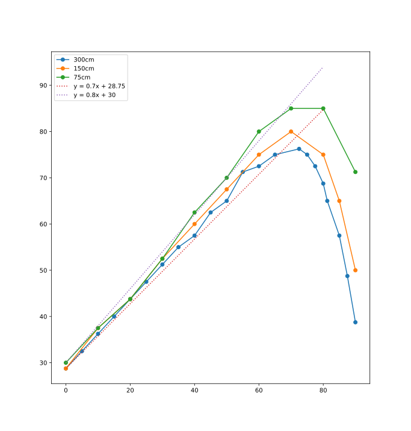
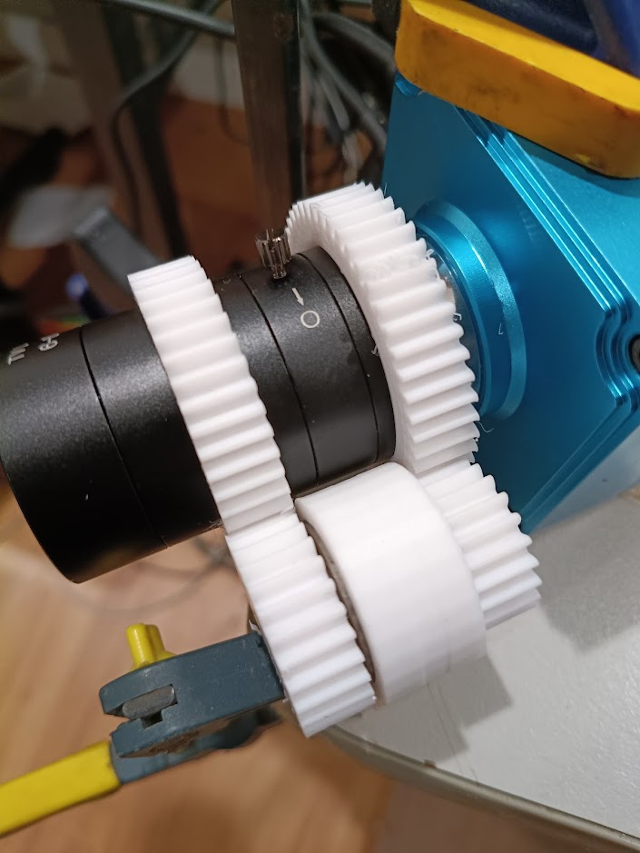

A few years ago I worked on a production of 
[Seussical Jr with the family](/art/seussical-jr-diamond-valley-singers/)
and I'm happy to say I've been sucked into working with
[Diamond Valley Singers](https://dvsingers.org/) once more, this time 
on [Charlie and the Chocolate Factory Jr The Musical](https://issuu.com/mtivault/docs/charlie_and_the_chocolate_factory_jr._actor_s_scri).

Sets and props and costumes overlap quite a lot.  Rhonda, Amelia and I are working
on the set designs but this article is mostly about the thing dearest to me:
stupid magic tricks.

## Augustus Gloop

## Violet Beauregarde

## Mike Teavee

Mike Teavee is the final child to be found wanting: he transmits himself over 
the television and is shrunk to doll size in the process.  I wanted some way to 
present this which was fun and unexpected and a bit strange.

In the movie[^wilder], Mike is in a huge white room and just stands on a little
platform and a huge white camera makes him disappear, but this is a bit beyond
our abilities.

Instead we're going to have a cylindrical "transmitter" much like a phone booth or a
giant amplifier tube[^phone], with a big window on the front from about waist height
up.  First a giant chocolate bar is place inside, and it shrinks and disappears and
reappears on an overhead projector television.
Then Mike climbs into the apparatus and does the same.

[^wilder]: Starring Gene Wilder.  Why would anyone remake a perfect movie?

[^phone]: Not that our audience will know what a phone booth or a tube circuit are.

### The Trick

Inside the apparatus is a (portrait) flat screen TV which can pivot to cover the window.
In the back is a doorway sized opening.  Mike enters through the back and can
lean out the window and wave to everyone to prove it's really him.  Then we 
flash a bunch of lights and swing the TV over the window.  Mike turns to face 
out the back door, where a camera (on its side) in the wings is zoomed in on him,
so the TV shows an image the same size as his upper body.
He's still live so can deliver his lines, and the HDMI camera should introduce very
little latency.

Then we pull the zoom back so he appears to shrink and eventually he'll defocus
and disappear, or we can close the aperture to fade to black.

A fixed mask in front of the lens prevents the camera from seeing anything it
shouldn't, but the door at the back is open to the floor so as he shrinks
we see all the way down to his feet.

Then it's time to transmit him: with more flashing lights we rotate the camera,
back to landscape, zoom back in a bit and switch the projector on.  Mike is now
on the big TV in all his glory.  When it's time for him to disappear from up
there we do the same zoom out trick and then drop a little doll from behind
the screen.

### Technology

The camera and lens are the same ones as I've been experimenting on in the
[Computer Controlled Camera Project](/art/cccp-computer-controlled-camera-project/),
as you can read there the zoom and focus are somewhat non-linear and mixed up on this lens.
I don't really want to have servos and a microcontroller as part of our staging,
I will if I have to but I'd rather not.

If you consider the graph comparing the positions of the two rings for 
a fixed focus length you can see there's a long pretty much linear region:



In this region, the two rings aren't rotating at the same speed, more's the pity, but
they are moving *proportionally* so that means we could gear[^gear] them together and that
*might* be enough.

To select the gear ratios I use a small Python script which just brute-forces all the
plausible gear sizes to see what numbers of teeth produce about the right ratio.

```
41 <= a < c < 50        # the big gears have to be big enough to fit around the lens
13 <= d < b < 30        # the small gears have to be big enough to be nicely formed
t = a + b = c + d       # the combined radiuses have to be the same for both to mesh
r = (a / b) / (c / d)   # work out the combined gear ratio
```

We can make a table of useful ratios with a small and scruffy bit of Python:

```
results = []

for a in range(41,50):
    for b in range(13,30):
        for c in range(a+1,50):
            d = a + b - c
            if d >= 13:
                r = (a/b) / (c/d)
                if 0.7 < r < 0.8:
                    results.append([r, a+b, a, b, c, d])

for r, t, a, b, c, d in sorted(results):
    print(a, b, c, d, r, t)
```

Overall, I'd prefer the ones with a smaller sum of radiuses because that
makes the whole apparatus less bulky.
Some candidate ratios produced by this script:

a | b | c | d | r | t
:---:|:---:|:---:|:---:|:---:|:---:
41 | 20 | 45 | 16 | 0.7289 | 61
43 | 27 | 48 | 22 | 0.7299 | 70
44 | 20 | 48 | 16 | 0.7333 | 64
41 | 21 | 45 | 17 | 0.7376 | 62
43 | 21 | 47 | 17 | 0.7406 | 64

Then it's time to experiment and see which set of gears gets us closest to what we want:


*trialling a set of gears which lock the front and rear rings to a ratio of 0.7299*

# TBC

[^gear]: Gears seemed an obvious way to go given I was already working with the excellent
    [OpenSCAD gear library](https://github.com/chrisspen/gears) but one or both ends
    could be replaced by a O-ring friction drive or similar instead.**
