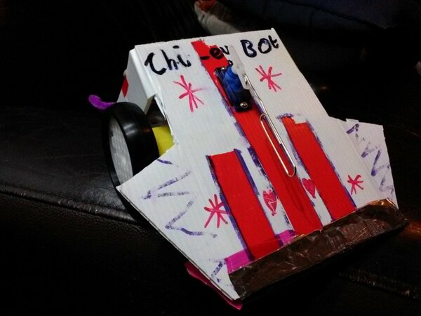
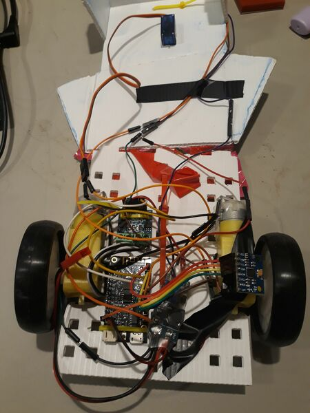

# Nodebots Day

[Nodebots Day](http://nodebotsau.io/) is an event about building
robots running Javascript, and about getting people started on learning
about robotics and programming through a fun, informal competition.

The nodebots robots are built from simple, cheap components and
being build out of cable ties, hot glue, tape and corflute they're very
accessible to kids.

Charlotte (12 at the time) and I attended and I brought with me a whole bunch
of extra parts, of course.
Since there was a whole bunch of [ESP32](/tag/esp32/)s in the junkbox
already, we decided to depart a little from the program and build something
which could run [MicroPython](/tag/micropython/).

These parts are even cheaper than the original Nodebots parts, so I felt
like they were in the spirit of the thing!

# Chipey-bot

*Chipey-bot*

The result, christened "Chipey bot" is a simple wedge-shaped sumo bot.
Rather than using a jockey wheel or a ball bearing under the nose,
we decided to let the nose slide on the floor.
The battery (which is one of the heavier components) is mounted in the
nose and the chassis extends back past the wheels to prevent the 
robot from flipping over.

Charlotte came up with the idea of making the leading edge more 
slippery by gluing on a strip of 
[Mylar](https://en.wikipedia.org/wiki/BoPET) chip (crisp) packet
which is very slippery even with the chip grease carefully washed off.
This gave Chipey-bot its name, and also an undeniable advantage in the ring,
with the front edge sliding under opponents and lifting them.

# Internals

*Chipey-bot Internals*

Internally, the robot is made of modules connected by hookup wires.
It's pretty cheesy,

* [Wemos](https://www.wemos.cc/) "Lolin-32 Lite" ESP32 microcontroller module
* L9110S motor driver module
* MT3608 DC-DC boost converter
* Two DC motors with gearboxes (as used by all the Nodebots)
* A small servomotor (not used)
* A small single-cell LiIon battery

The ESP32 runs a tiny webserver to receive steering commands and drives
the two wheels independently via the L9110S H-bridge driver.

The LiPo supplies 3.6 or so volts, but the motors are capable of taking
a whole lot more, so a DC-DC boost converter provides about 8 volts to the
motor driver which greatly increased the power available.

The intention of the servomotor was to have some kind of arm to push
other robots off the top if they became stuck, but we never got around 
to making it work before the competition was upon us.

# Results

<blockquote class="twitter-tweet">
Chip-ey Bot is brutal! <a href="https://twitter.com/hashtag/sumobots?src=hash&amp;ref_src=twsrc%5Etfw">#sumobots</a> <a href="https://twitter.com/NodeBotsAU?ref_src=twsrc%5Etfw">@NodeBotsAU</a> Melbourne <a href="https://t.co/dvgWltquFV">pic.twitter.com/dvgWltquFV</a>
&mdash; buzzconf.io (@buzzconfio) <a href="https://twitter.com/buzzconfio/status/888638462479310848?ref_src=twsrc%5Etfw">July 22, 2017</a></blockquote>  

# LoliBot

The photos above also include some later additions while helping with the design of 
[LoliBot](http://www.openhardwareconf.org/wiki/LoliBot),
Chipey-bot grew:

* GY-521 / MPU5060 IMU
* 8 Neopixel strip.

LoliBot was the [Open Hardware MiniConf](http://www.openhardwareconf.org/wiki/Main_Page)
project at [LinuxConfAU 2018](https://lca2018.org/) ... I didn't have much to do with
the hardware but [ran a MicroPython tutorial](/art/linuxconf-2018-sydney/).

# Related

See also [Rocket Surgery](/art/rocket-surgery-airborne-iot-telemetry-buzzconf/)
and [Ciril](/art/ciril-cubic-inch-robots-in-labs/)

