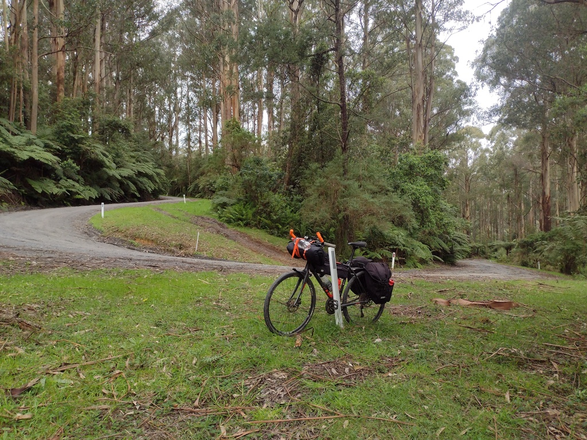
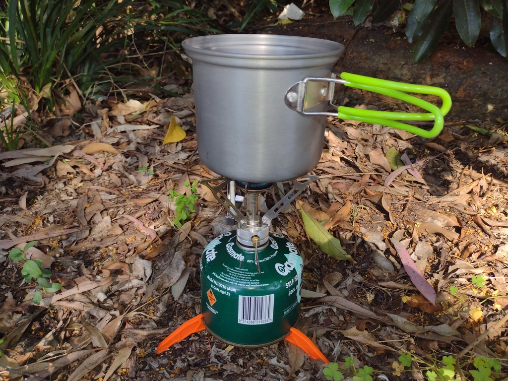
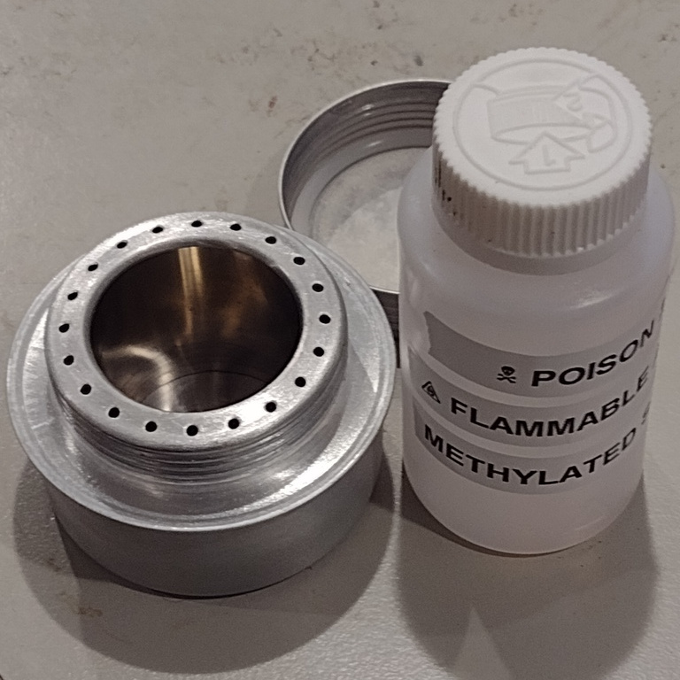
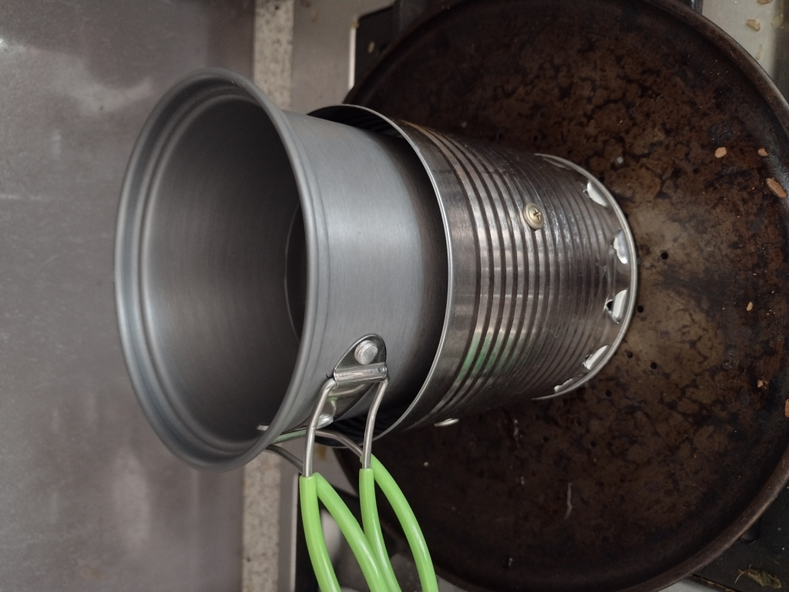

I've [gotten into bikepacking](../the-cycling-bikepacking-post/) lately,
and as well as learning [some stuff about bike mechanics](../the-touring-commuter/)
and working on my fitness, I've also had to work on how to pack.

*A lot of the cheaper stuff mentioned here, including the rocket stove, the
alcohol stove, the stove windshields and the coffee filter was bought from Temu.com.
Also a tiny luggage scale I used for a lot of the weights in this article.
I've so far found their deliveries to be super reliable and while they
have some crappy items most of the stuff I've bought has been very good
for the price.
If you're considering trying Temu out you can use
[this Temu affiliate link](https://temu.to/m/un8i4z9z5w9) or
coupon code `apr43524` and you'll get some kind of discount /
discount voucher and when you actually buy something I'll get some
kind of store credit to spend on more random cycling stuff!*

## The Weight

Weight is a funny thing.  My bike fully packed for camping weighs about
twice what it does in commuter mode, so it feels *horrible* when it's 
not moving.  But all that extra weight only works out to about an extra
15% of so of the combined weight of bike + rider so once we're moving
it really doesn't make a huge difference.

*Packed for camping, on Blacksands Road, near Warburton*

There's lots of different ways to save weight but lightness costs money
so you've got to be a bit organized to work out where to save weight
economically.
You can spend a lot of money shaving grams off bicycle parts but generally the
best place to start is with the heaviest stuff, and one of the heaviest
parts of camping gear is cooking equipment.

To decide where to more effectively save weight, weigh everything:

| Item | Weight, g | Cost, $ |
|:---:|:---:|
|Snowpeak Titanium Splade | 15 | 15 |
|The fanciest looking full sized steel fork I could find in my kitchen cutlery drawer | 51 | 0.50 |

So you're spending $14.50 to save 35 grams, or to put it another way this weight
saving is costing you $.40 per gram.  By comparison, a cheap lightweight chair weighs
900g and costs about $50, whereas the 
[Helinox Zero](https://www.anacondastores.com/camping-hiking/camp-furniture/camping-chairs/helinox-zero-chair/90187413)
weighs 500g and costs $149.  So reducing that weight is only costing you $.24 per gram.

So, is buying titanium cutlery an economically effective way to save weight?  **No.** 
Do I love my titanium splade anyway?  **Yes.**

On the other hand, you can save about 10g with
[four titanium bottle cage screws](https://www.pushys.com.au/silca-sicuro-bottle-cage-titanium-bolts-4-pack.html)
for $35 ($3.50 per gram saved), so it could be worse.

[It could always be worse.](https://www.youtube.com/watch?v=ZvI4ZpD_7EA)

## Stoves for Weight Weenies

Stoves provide a way of heating food and also
[boiling water to sterilize it](https://www.cdc.gov/parasites/crypto/index.html)
or just for a cup of tea and a nice hot water bottle on a cold night.
But they're one of the heaviest bits of kit you'll carry.

You can do without and [eat cold bean tortillas](https://www.youtube.com/watch?v=6UMVjmGnejk&t=269)
for every meal.  That is definitely a thing you could choose to do.
Or everywhere you go you could build a
[tiny fireplace out of twigs and out of bark](https://www.youtube.com/watch?v=ILnvtUirHr8)
and cook over the coals, but it's pretty time consuming way to do it.

So mostly it's practical to have some kind of stove, and thankfully
they're one of the cheapest opportunities to reduce weight.

### Gas Stoves

I have a couple of options in gas-burning stoves, a cheap mini burner
from Ebay which screws to the top of a gas can, and a
[Kovea Moonwalker](https://koveausa.com/products/moonwalker-stove)
stove which has its own tripod and attaches to the can via a long
flexible pipe.

| Item | Weight, g |
|:---:|:---:|
|Gas Stove (mini) | 115 |
|Gas Stove (kovea) | 354 |
|Gas Can Tripod | 32 |
|220g Gas Can (almost empty) | 174 |
|220g Gas Can (new) | 381 |
|Windshield (tall, halved) | 109 |
|Windshield (short, halved) | 52 |

There's a few interesting things to note here.

The windshields are made of multiple panels of alumnium joined with steel hinge wires.
They were both originally twice as long (and twice as heavy),
but I shortened them by removing half the panels, as butane stoves only really
need a shield on the upwind side.
The moonwalker is very low which means it is is very stable and doesn't need a proper
windshield in most conditions,
you can just leave a pack or some sticks upwind and that'll work.
But I've included a low wind shield in the numbers just to be fair.

*Mini gas stove, with canister tripod and small pot*

Bringing the mini gas stove (115g) instead seems like it saves a fair bit of weight
over the Kovea (354g), saving 239g but it requires a taller wind shield and
a clip-on plastic tripod for the gas canister, so the difference is only 150g,
plus the Kovea stove is better at simmering and will work at lower temperatures.

Both those stoves use isobutane fuel canisters so there's also about 180-380g
of fuel canister to carry, depending on how full it is.  
There are smaller 100g cans available but they're hard to find cheaply.

<!--Heating up a typical meal takes about 10g of gas with the tiny gas stove,
although I haven't done methodical testing here.  The Kovea is probably more
efficient too.-->

*as an aside: you really want to use fuel cans filled with
[Isobutane](https://en.wikipedia.org/wiki/Isobutane) and/or
[Propane](https://en.wikipedia.org/wiki/Propane), because regular
[Butane](https://en.wikipedia.org/wiki/Butane) stops evaporating
at around 0⁰C ... which can really cramp your cooking style on a cold morning
when your gas fuel stays a liquid.
If you can only find Butane and it's going to be chilly overnight it's best
to keep the can in the foot of your sleeping bag
[along with your microfilter](https://www.halfwayanywhere.com/trails/pacific-crest-trail/platypus-quickdraw-microfilter-review/#the-bad)!*

### Rocket Stove

A rocket stove is really just a mechanism for burning small bits 
of wood at high temperature in copious air, resulting in highly
efficient burning.  There's a few different ways to make this work,
and I'm not sure there's a precise definition of what is and isn't
a rocket stove.

My [rocket stove](https://en.wikipedia.org/wiki/Rocket_stove) is just an inexpensive
assembly of stacking double-walled stainless steel tubes.
When packed away the parts nest neatly inside each other.
The double stainless steel walls keep a lot of heat
in and reflect radiant heat back into the center.
Fresh air is drawn in at the bottom, heated between the walls and reintroduced at the
top where it causes any wood gases to be completely burnt off. 
Based on the blue color of the stainless steel it's producing
[temperatures up to 300⁰C](https://blog.adafruit.com/2016/06/20/the-color-spectrum-of-heated-steel/).

[This one is from Temu]( https://share.temu.com/72OqEdYsuEA)
but you could also
[make one out of a couple of cans](https://www.youtube.com/watch?v=ENhwbQljpM8).

*Rocket Stove*

Because of the highly efficient burn you can cook dinner over scraps
of wood which would be regarded as barely adequate kindling for getting
a regular campfire started.

| | Stove | Fuel | Windshield | Legs | Total |
|:---:|:---:|:---:|:---:|:---:|:---:|
| Mini | 115 | 300 | 109 | 32 | 556 |
| Kovea | 354 | 300 | 52 | 0 | 706 |
| Rocket | 586 | 0 | 0 | 0 | 586 |

Looking at overall weight, the rocket stove (586g) is actually lighter
than the Kovea stove plus windshield and nominal 300g gas can.
And it runs on sustainable free fuel you find laying on the ground in
every bush campsite, plus you can burn off your paper trash in it, and it gives
off a cheery campfire light.

Of course, there are places and conditions where
[a gas stove is safe/permitted and a rocket stove isn't](https://www.cfa.vic.gov.au/warnings-restrictions/total-fire-bans-fire-danger-ratings/can-i-or-cant-i),
or where dry kindling is hard to find.  Plus the rocket
stove has to cool down before you can pack it up and it covers all your cookware
in soot (not as much as an open fire, but still), so it's not as clear cut as all that.

Also: don't forget your matches.

### Alcohol stoves

In this article I'd originally dismissed alcohol burners like the 
[trangia](https://www.snowys.com.au/27-1-small-ultralight-aluminium)
as "horribly slow" but I went and bought a cheap one anyway just so I
could give it a go for you, good reader.

*Metho-burning stove with fuel bottle*

Maybe I've become more patient in my old age but five minutes to
boil 250mL of water is ... well it isn't quick but then again it's not that bad.

| Item | Weight, g |
|:---:|:---:|
| Alcohol Stove | 30 |
| Fuel bottle 100 mL | 25 |
| Liquid fuel ~95 mL | 75 |
| Trivet | 25 |
| Windshield | 52 |
| **TOTAL** | **207** | 

30 grams seems amazingly low weight compared even to the mini butane burner,
but doesn't include fuel or any kind of windshield or trivet to place your pot on,
and without those the stove isn't usable.
Like the rocket stove, but unlike the gas stoves, you can't turn it up or down
so it's pretty much a fast boil or nothing: simmering isn't really possible.

For test purposes, I made a trivet/windshield out of a Milo can which is
efficient but not very portable.  Since then I've got a tiny flexy stainless
windshield which also works as a trivet and weighs almost nothing.
It's not very stable, but if ultralight is what you want that's the price you pay.

For comparison, a [Trangia cookset](https://www.snowgum.com.au/products/trangia-25-1-ultra-light-cooking-system?categoryId=218)
with burner, windshield/pan support, two pots and a frypan is about 845g without fuel.

Methylated Spirits fuel is [quite cheap](https://www.bunnings.com.au/diggers-1l-methylated-spirits_p1560782)
and it only took about 10g / 12mL to vigorously boil a cup of water so a little 100mL bottle should
last for a short trip (in case you're wondering: ethanol is less dense than water, about 0.8 g/mL)

Note that it is really important to use a childproof bottle for your fuel and 
label it appropriately to make sure no-one mistakes it for a really terrible cough remedy.

### Other kinds of stove

Hexamine (solid fuel tablet) stoves might also be worth considering for short
trips.  They're compact, low weight and easy to light but as I understand it
not particularly fast to cook over.

Pressurized shellite stoves have their loyal adherents, but I've always found them
terrifyingly erratic, with blocked jets, leaking o-rings and sudden flare-ups.

## Cookware

As well as three stoves I've got three lots of cookware ... okay, so I have a problem.

| Item | Weight, g | 
|:---:|:---:|
| Small pot & lid with folding handles | 220  |
| Swedish Army mess kit | 465 |
| Large double pot & lid & handle | 555 |

The small pot is just the right size to fit a gas canister, gas can tripod and mini stove inside.
it's just big enough to cook some sausage and tinned beans or something like that.
It has plastic-coated folding handles which mean it's not really suitable for use on a fire or on the rocket stove though.

The [Swedish Army mess kit](https://www.ebay.com.au/sch/i.html?_nkw=swedish+army+mess+kit)
is an aluminum billy with a loop handle and a matching saucepan/lid with a fold-out steel handle.
It fits the kovea stove really nicely inside (but not the gas canister).
Mine didn't come with the windshield or the alcohol burner, but rest assured I did not pay $200 for it.
I've had it for years and it works well on the gas burner, on coals or suspended over a fire.
It's possibly a bit small for the rocket stove, across the narrow axis.

The large cookset has two pans which share a lid, and is just the right size to fit the rocket stove inside.
And both pots are a nice size to fit on top of the rocket stove without too much heat getting lost up the sides.
There's no handles, so you need a separate clip-on one (30g) to pick the pots up by. 

So I guess the options match up pretty nicely:

| Stove | Cookset | Stove (etc), g | Cookset, g | Total, g |
|:---:|:---:|:---:|:---:|:---:|
| Alcohol | Small | 207 | 220 | 427 |
| Mini | Small | 556 | 220 | 776 |
| Kovea | Swedish | 706 | 465 | 1171 |
| Rocket | Large | 586 | 555 | 1171 |
| Kovea | Large | 706 | 555 | 1261 |

... and if I'm going for minimal weight it's the alcohol stove, or maybe the mini stove but
hang on to a half-empty fuel canister to save a little weight.
If cooking for two, the large cookset is going to be more
practical, either over the rocket stove if weather isn't too hot or too wet otherwise over the
Kovea.  Decisions, decisions, decisions.

### Additional stuff

Don't forget you'll also need some utensils: at the very least a plastic splade and
probably something to stir with.  Unless you want to eat with sticks and tyre levers I 
suppose.  Unless you're doing exclusively dehydrated or boil-in-the-bag stuff you'll
need something to wash up with too.

## Coffee for Weight Weenies

I do like a [decent cup of coffee](https://www.youtube.com/watch?v=EdKP6B8NkGw)
in the mornings, but also I really don't 
want to carry a whole lot of extra weight to do so.

*coffee makers*

| Item | Weight, g |
|:---:|:---:|
| Bialetti Caffettiera (stainless) | 526 |
| Wacaco Minipresso | 400 |
| Aeropress | 160 |
| Aeropress without plunger | 87 |
| Stainless conical filter | 10 |

On the motorcycle, I used to schlep that stainless
[caffettiera / moka pot](https://www.youtube.com/watch?v=LuZiqLb70tM)
everywhere and it
makes a good coffee but I didn't often have to push it up hills so the weight didn't
worry me.  The classic aluminium ones are a bit less heavy but don't last long under 
camping conditions, in my experience: they go all weird and furry inside.  Maybe that's 
just the Australian river water.

(I found my old single shot aluminium one, it still weighs 250g even with the
plastic handle half melted off.)

I've used a [Minipresso](https://www.wacaco.com/products/minipresso-gr) a lot
on camping trips and at home and it makes a really excellent coffee.
The Wacaco website says it weighs 360g but I measure it as 400g, perhaps
mine is an older model.

Depending on your feelings about luxury items, it is maybe a bit heavy and fiddly for
bikepacking use.  Interestingly, they have new "smaller, lighter" models but according to
the website they're a bit smaller but *not very much* lighter, still over 300g.

A lighter alternative is the
[Travel Aeropress](https://aeropress.com/products/aeropress-go-travel-coffee-press),
which is really just a robust plastic cylinder with a 
holder for a paper filter at the bottom and an airtight plunger to force
the coffee through the filter.
That's only 160g, and to be honest you might as well leave the plunger at home
and just let it drip through in its own good time.  Without the plunger
it's about 87g. You can get stainless filters for these too if you don't
like the disposable paper ones.

Or, if we're happy to wait anyway, we can dispense with the cylinder and the
disposable paper filters and just bring the filter:
[a conical stainless steel filter](https://share.temu.com/tK6zRCoZltA)
folds flat, weighs about 10g and just sits inside your coffee cup until you reckon
its brewed enough and then lift it up and let it drain.

*Coffee Filter*

Congratulations, you've just saved about the weight of a tin
of beans or a cold, refreshing canned beverage.  Or maybe even
a tiny chair.

The only lighter options are "coffee bags", which I've never found to be any
good at all, and instant coffee which, well, any port in a storm but it'd better
be a hell of a storm.

## Conclusion

You could save a kilo by spending a few thousand bucks on a lighter bike,
or spending a few hundred bucks on lighter camping gear or you could just spend a 
couple of tenners on a tiny stove and eat with a tyre lever.

Or you could just bring your credit card and stay at a nice B&B.

There's many ways to do it but hopefully you've enjoyed joining me in
pondering the details from the comfort of your sofa, rather than bemoaning
your fate as you drag a kitchen sink up the side of a mountain.

And, yeah, I went and bought that 500g chair.
Because of course I did.
After all, I did just save 500g on a coffee filter ...
