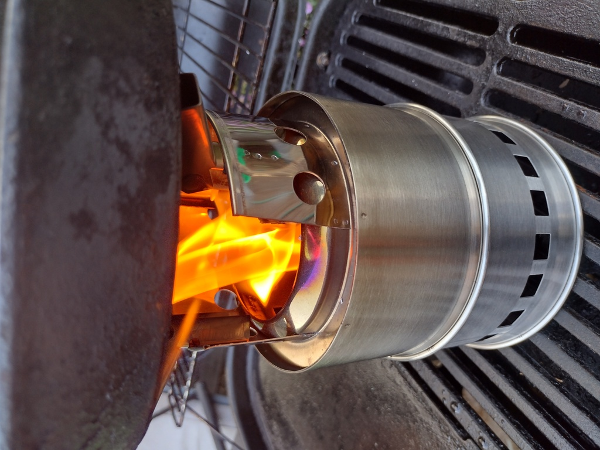
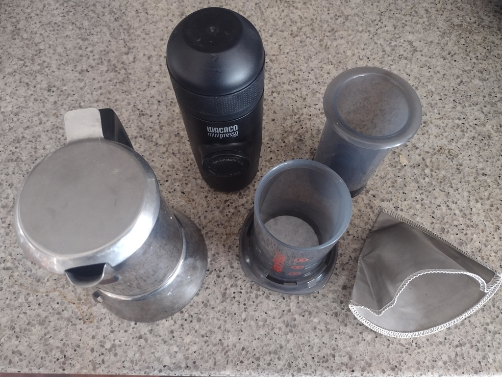
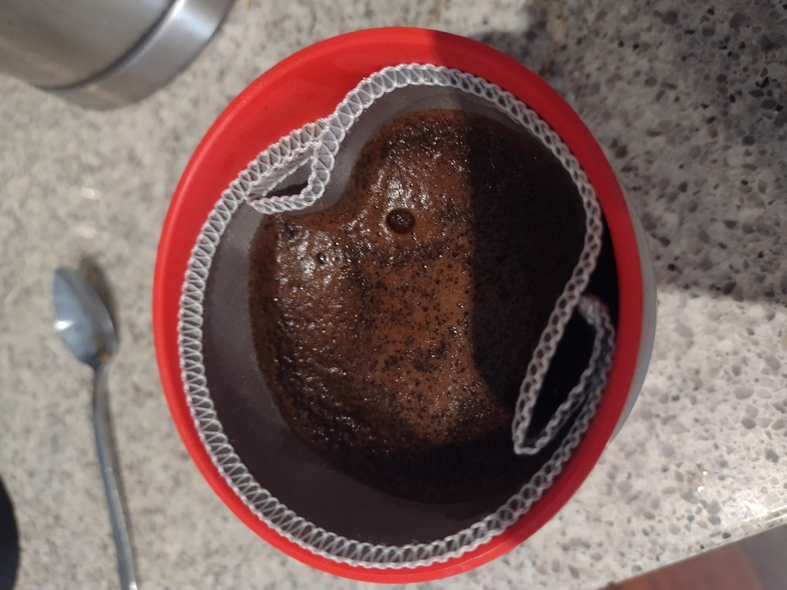

I've [gotten into bikepacking](/art/the-cycling-bikepacking-post/) lately,
and as well as learning some stuff about bike mechanics and working on
my fitness, I've also had to work on how to pack.

## The Weight

Weight is a funny thing.  My bike fully packed for camping weighs about
twice what it does in commuter mode, so it feels *horrible* when its 
not moving.  But all that extra weight only works out to about an extra
15% of so of the combined weight of bike + rider so once we're moving
it really doesn't make a huge difference.

There's lots of different ways to save weight but lightness costs money
so you've got to be a bit organized to work out where to save weight
economically.
You can spend a lot of money shaving grams off bicycle parts but generally the
best place to start is with the heaviest stuff, and one of the heaviest
parts of camping gear is cooking equipment.

To decide where to more effectively save weight, weigh everything:

| Item | Weight, g | Cost, $ |
|:---:|:---:|
|Snowpeak Titanium Splade | 15 | 15 |
|The fanciest looking full sized steel fork found in my kitchen cutlery drawer | 51 | 0.50 |

So you're spending $14.50 to save 35 grams, or to put it another way this weight
saving is costing you $.40 per gram.  By comparison, a cheap lightweight chair weighs
900g and costs about $50, whereas the 
[Helinox Zero](https://www.anacondastores.com/camping-hiking/camp-furniture/camping-chairs/helinox-zero-chair/90187413)
weighs 490g and costs $149.  So reducing that weight is only costing you $.24 per gram.

So, is buying titanium cutlery an economically effective way to save weight?  **No.** 
Do I love my titanium splade anyway?  **Yes.**

## Stoves for Weight Weenies

Stoves provide a way of heating food and also boiling water to sterilize it
or just for a cup of tea and a nice hot water bottle on a cold night.
But they're one of the heavier bits of kit you'll carry.

You can do without and eat cold peanut butter tortillas for every meal.
That is definitely a thing you could choose to do.

Or everywhere you go you could build a tiny fireplace out of rocks and
cook over the coals, but it's pretty time consuming way to do it.
So mostly it's practical to have some kind of stove.

### Gas Stoves

I have a couple of options in gas-burning stoves, a cheap mini burner
from Ebay which screws to the top of a gas can, and a
[Kovea Moonwalker](https://koveausa.com/products/moonwalker-stove)
stove which has its own tripod and attaches to the can via a long
flexible pipe.

| Item | Weight, g |
|:---:|:---:|
|Gas Stove (mini) | 115 |
|Gas Stove (kovea) | 354 |
|Gas Can Tripod | 32 |
|220g Gas Can (almost empty) | 174 |
|220g Gas Can (new) | 381 |
|Windshield (tall, halved) | 109 |
|Windshield (short, halved) | 52 |

There's a few interesting things to note here.

The windshields were both originally twice as long (and twice as heavy),
but I shortened them as butane stoves only really need a shield on the upwind side.
The moonwalker is very low and doesn't need a proper shield in most conditions,
you can just leave a pack or some sticks upwind and that'll work.  But I've
included a low wind shield in the numbers just to be fair.

Bringing the mini gas stove (115g) instead seems like it saves a fair bit of weight
over the Kovea (354g), saving 239g but it requires a taller wind shield and
a clip-on plastic tripod for the gas canister, so the difference is only 150g,
plus the Kovea stove is better at simmering and will work at lower temperatures.

Both those stoves use isobutane fuel canisters so there's also about 180-380g
of fuel canister to carry, depending on how full it is.  
There are smaller 100g cans available but they're hard to find cheaply.

<!--Heating up a typical meal takes about 10g of gas with the tiny gas stove,
although I haven't done methodical testing here.  The Kovea is probably more
efficient too.-->

*(as an aside: you really want to use fuel cans filled with
[Isobutane](https://en.wikipedia.org/wiki/Isobutane) and/or
[Propane](https://en.wikipedia.org/wiki/Propane), because regular
[Butane](https://en.wikipedia.org/wiki/Butane) stops evaporating
at around 0⁰C ... which can really cramp your cooking style on a cold morning.
If you can only find Butane and it's going to be chilly overnight it's best
to keep the can in the foot of your sleeping bag along with your microfilter!)*

### Rocket Stove

A rocket stove is really just a mechanism for burning small bits 
of wood at high temperature in copious air, resulting in highly
efficient burning.  There's a few different ways to make this work,
and I'm not sure there's a precise definition of what is and isn't
a rocket stove.

My one is just a cheap assembly of double-walled stainless steel tubes.
The double stainless steel walls keep a lot of heat
in and reflect radiant heat back into the center, and fresh air is drawn
in at the bottom, heated between the walls and reintroduced at the
top where it causes any wood gases to be completely burnt off, producing
[temperatures up to 300⁰C](https://blog.adafruit.com/2016/06/20/the-color-spectrum-of-heated-steel/).

*Rocket Stove*

Because of the highly efficient burn you can cook dinner over scraps
of wood which would be regarded as barely adequate kindling for getting
a regular campfire started.

| | Stove | Fuel | Windshield | Legs | Total |
|:---:|:---:|:---:|:---:|:---:|:---:|
| Mini | 115 | 300 | 109 | 32 | 556 |
| Kovea | 354 | 300 | 52 | 0 | 706 |
| Rocket | 586 | 0 | 0 | 0 | 586 |

Looking at overall weight, the rocket stove (586g) is actually lighter
than the Kovea stove plus windshield and nominal 300g gas can.
And it runs on sustainable free fuel you find laying on the ground in
every bush campsite, you can burn off your paper trash in it, and it gives
off a cheery campfire light.

Of course, there are places and conditions where
[a gas stove is safe/permitted and a rocket stove isn't](https://www.cfa.vic.gov.au/warnings-restrictions/total-fire-bans-fire-danger-ratings/can-i-or-cant-i),
or where dry kindling is hard to find.  Plus the rocket
stove has to cool down before you can pack it up and it covers all your cookware
in soot (not as much as an open fire, but still), so it's not as clear cut as all that.

### Other kinds of stove

Hexamine (solid fuel tablet) stoves might also be worth considering for short
trips.  They're compact, low weight and easy to light but as I understand it
not particularly fast to cook over.

I should also talk about liquid fuel stoves, eg:
[trangia](https://www.snowys.com.au/27-1-small-ultralight-aluminium) type alcohol burners
and pressurized shellite stoves, but the former I've always found horribly slow
and the latter terrifyingly erratic, but some people swear by them.

## Cookware

As well as three stoves I've got three lots of cookware ... okay, so I have a problem.

| Item | Weight,g | 
|:---:|:---:|
| Small pot & lid with folding handles | 220  |
| Swedish Army mess kit | 465 |
| Large double pot & lid * | 525 |
| Removeable pot handle | ? |

\* no handle

The small pot is just the right size to fit a gas canister, gas can tripod and mini stove inside.  It has plastic-coated folding handles which mean it's not really suitable for use on a fire or on the rocket stove though.

The [Swedish Army mess kit](https://www.ebay.com.au/sch/i.html?_nkw=swedish+army+mess+kit) is an aluminum billy with a loop handle and
a matching saucepan/lid with a fold-out steel handle. It
fits the kovea stove really nicely inside (but not the gas canister).
Mine didn't come with the windshield or the alcohol burner, but rest assured I did not pay $200 for it.  I've had it for years and it 
works well on the gas burner, on coals
or suspended over a fire.

The large cookset has two pans which share a lid, and is just the right size to fit the rocket stove inside.  There's no handles, so you
need a clip-on one to pick the pots up by.

## Coffee for Weight Weenies

I do like a [decent cup of coffee](https://www.youtube.com/watch?v=EdKP6B8NkGw)
in the mornings, but also I really don't 
want to carry a whole lot of extra weight to do so.

*coffee makers*

| Item | Weight, g |
|:---:|:---:|
| Bialetti Caffettiera (stainless) | 526 |
| Wacaco Minipresso | 400 |
| Aeropress | 160 |
| Aeropress without plunger | 87 |
| Stainless conical filter | 10 |

On the motorcycle, I used to schlep that stainless caffettiera everywhere and it
makes a good coffee but I didn't often have to push it up hills so the weight didn't
worry me.  The classic aluminium ones are a bit less heavy but don't last long under 
camping conditions, in my experience.

I've used a [Minipresso](https://www.wacaco.com/products/minipresso-gr) a lot
on camping trips and at home and it makes a really excellent coffee.
The Wacaco website says it weighs 360g but I measure it as 400g, perhaps
mine is an older model.
Depending on your feelings about luxury items, it is maybe a bit heavy and fiddly for
bikepacking use.  Interestingly, they have new "smaller, lighter" models but according to
the website they're a bit smaller but *not very much* lighter, still over 300g.

A lighter alternative is the
[Travel Aeropress](https://aeropress.com/products/aeropress-go-travel-coffee-press),
which is really just a robust plastic cylinder with a 
holder for a paper filter at the bottom and an airtight plunger to force
the coffee through the filter.
That's only 160g, and to be honest you might as well leave the plunger at home
and just let it drip through in its own good time.  Without the plunger
it's about 87g. You can get stainless filters for these too if you don't
like the disposable paper ones.

Or, if we're happy to wait anyway, we can dispense with the cylinder and the
disposable paper filters and just bring the filter: a conical stainless steel
filter weighs about 10g and just sits inside your coffee cup until you reckon
its brewed enough and then lift it up and let it drain.

*Coffee Filter*

Congratulations, you've just saved 390g, which is about the weight of a tin
of beans or a cold, refreshing canned beverage.  Or half a water bottle.

The only lighter options are "coffee bags", which I've never found to be any
good at all, and instant coffee which, well, any port in a storm but it'd better
be a hell of a storm.
