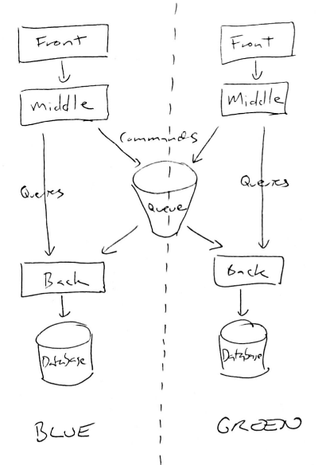

Blue-Green Deployment
=====================

At LinuxConf this year, Ruben Rubio spoke about Blue/Green
deployment
as a way of formalizing the deployment process and minimizing deployment
risk. By using immutable infrastructure, we can avoid getting our
configurations mixed up, and by keeping the old infrastructure around
until deployment is complete, we have the opportunity to roll back
easily.

I've done this before with load balanced servers:

-   Remove Server A from the LB
-   Upgrade Server A
-   Test Server A
-   Switch LB across from Server B to Server A
-   Cross fingers and hope you didn't introduce any subtle bugs or
    O(N\^4) behaviours
-   Upgrade Server B
-   Switch LB across to balance between the two servers.

... but Blue-Green deployment takes this to the next level by always
creating new "Green" containers every time, and throwing away your old
"Blue" containers once they are no longer needed.

Database State
==============

I really like the idea of containerized, immutable servers: actually,
[I'd like to roll the entire container state into Git, libraries and
all](../complete-containers-immutable-git/). Who needs state anyway!
It only gets you in trouble! At this point, though, there's just one
minor problem: most web services need to store some state at some point,
and it ends up in a database.

Ruben's talk assumes that the database is outside the deployment system,
and doesn't change with upgrades, so it'll work equally well before and
after. Or at least that any schema change can be done incrementally,
like adding a new table. My experience with relational databases is that
schemas change all the time, and that the changes are not always
backwards *or* forwards compatible. Often, for example, you might decide
to denormalize some part of your database for which JOINing is
particularly painful, and this can neither be rolled forwards or
backwards easily.

Command / Query Responsibility Segregation
==========================================

One of the things I love about conferences is that the ideas from one
talk keep rattling around in your head until they smash into the ideas
from another talk. Shortly after the Blue-Green Deployments talk,
someone mentioned *CQRS*.

Most of the time, we assume that we use the same kind of API for reading
and writing. But this is not necessarily the most sensible model. Often,
a database cluster will have a single master which accepts all writes,
and a number of "read replicas" which can handle queries. The
requirements for these systems are quite different, so in some ways it
makes sense to consider them separately.

This leads to the idea of Command / Query Responsibility Segregation.
[Greg Young dicusses CQRS
here](http://codebetter.com/gregyoung/2010/02/16/cqrs-task-based-uis-event-sourcing-agh/)
and while it isn't a comfortable fit for all problems I think it is
interesting as it reflects the underlying reality of database
transactions.

Architectural Constraints
=========================

I've previously proposed an architecture which enforces that all writes
are simply submissions to a work queue which return immediately. (And
plenty of others have looked at similar architectures). These
submissions are also required to be idempotent, so retransmitting them
if you don't get a confirmation is okay.

This is a pretty severe constraint, but just as the constraints of
immutable containers help keep our deployments organized, or the
constraints of a type system keep our thinking
organized
having an idempotent work queue based API can open up new possibilities
for deployment.

Blue-Green Database Deployments
===============================

One feature of Blue-Green Deployments is that we want to be able to
prepare our "Green" systems before rollout, and fall back to the "Blue"
systems if rollout goes badly. This makes database deployment tricky.

How about if we could just clone the "Blue" database, make our changes,
and still keep our data in sync? Well, if we've managed to force
ourselves into the idempotent work queue architecture, this becomes
rather simple:

Messages in the queue are received by *both* backends, and operated on
accordingly. The "green" side of the queue can be paused while the
database is cloned and upgradeed, and then restarted to get the
databases back in sync. Because the work queue operations are
idempotent, it doesn't matter if the same operation is repeated before
and after cloning.

An update of a user's contact details might be a different database
operation on each database, but each is free to interpret it in their
own way. Of course, if there's a whole new entity in Green, then the
Blue backend may not know what to do about it, but uninterpretable queue
entities can be put aside.

The only thing the Blue and Green systems now have in common is the work
queue, whose state is ephemeral in any case.

Summary
=======

Accepting architectural constraints (for example an idempotent work
queue approach to updates) can lead to simplifications of other parts of
the system and address previously intractable problems. I think this
kind of approach is worth closer consideration.
