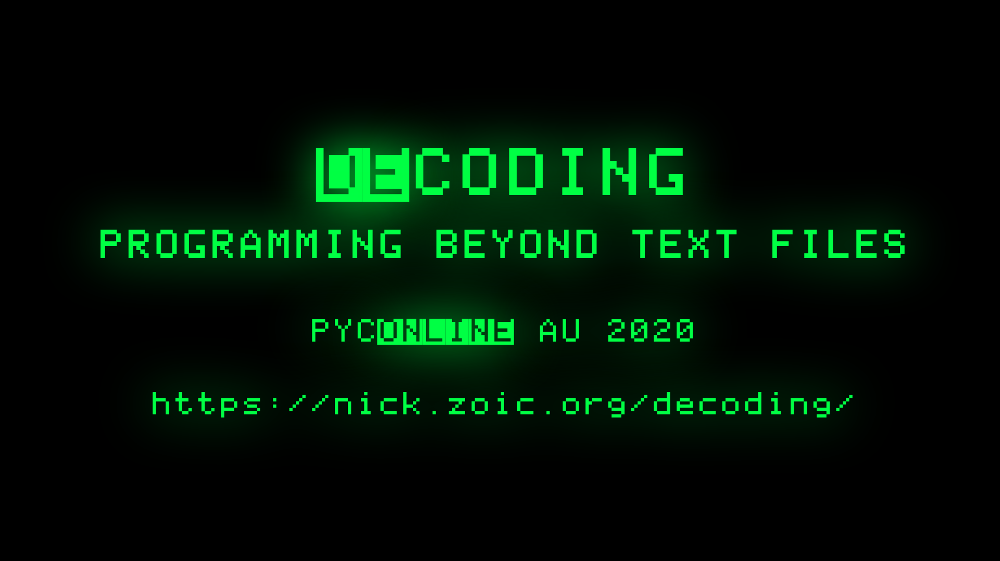
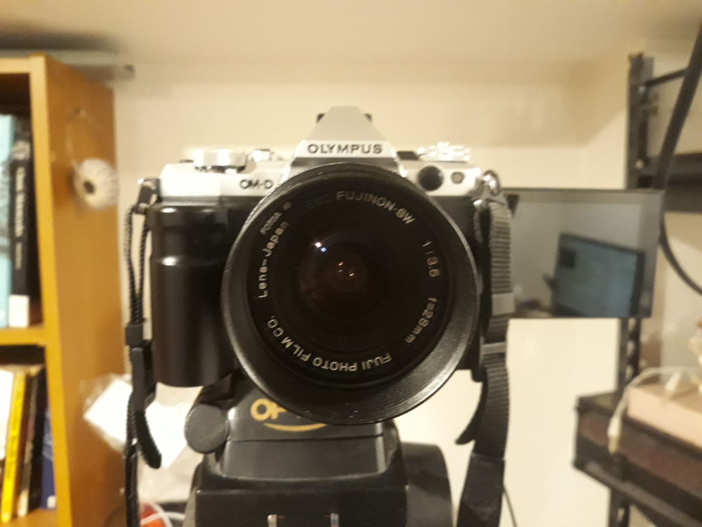
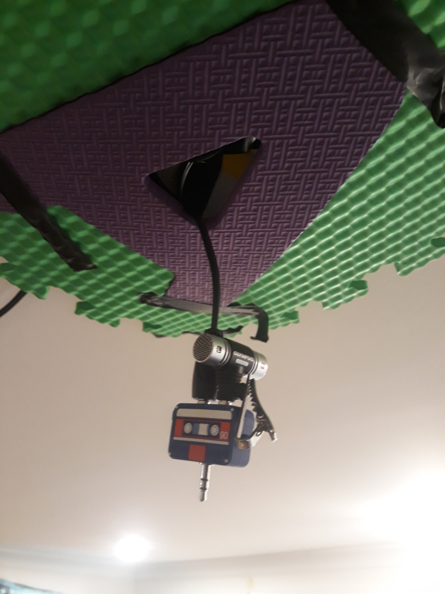
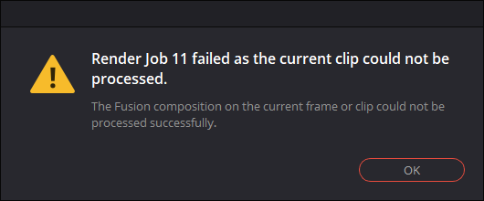
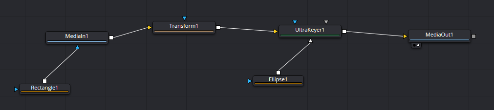

So [PyCOnline AU 2020](https://2020.pycon.org.au/) is all online this year 
and I decided to prerecord my presentation of
[Decoding: Programming beyond text files](/art/decoding-programming-beyond-text-files/)
so as not to have to worry about Internet on the day.

This page is some "behind the scenes" info on how I did it and what I'd do differently
next time ...

# Recording

Recorded on my Olympus E-M5 mkII which I've not really used for video before but
it can record 1080p at 50fps so I figured that would be good.

Lens is a old manual Fuji EBC 28mm f/3.5 on an adaptor (so, equiv 52mm on a m4/3).
I picked this one just because it was the right focal length for the shot I wanted
and brighter than the zoom at the same length.

I ended up filming at exposure compensation -1.7 to stop the metering getting
confused by the dark background.

I shot this in lots of little takes because I wasn't quite sure how it was all
going to fit together and I *thought* that it'd be easier to fix it up later.

Originally I was planning on chroma-keying (green screening) out my background and
putting the slides *under* my video.  Instead I found there was lots of noise in the
background so I just chroma-keyed out as much as I could and then put the slides 
*over* my video, using "Lighten" to combine them.  It mostly worked.
There's a couple of moments where you can see my shoulder through the image.

Microphone setup was an Olympus lapel mic on a long cable, plugged into the camera,
but because I kept getting caught up in the cable I ended up dangling it from the 
ceiling just out of shot.

This kind of worked but it's a bit "phasey" ... this
room is very reflective.  I taped some foam to the ceiling to try and reduce the 
phaseyness but it didn't help much.  I didn't have a proper adaptor for the mic either so
it's using a cute cassette tape shaped headphone splitter.

## Files

In total I recorded:

* 70 MOV files
* 17.6 GB
* 1h24m53s total

Quite a few bits had several takes where I flubbed one bit or another,
plus every video has a few seconds of lead-in and lead-out, so there
ends up being a lot left on the cutting room floor!

## Slides

These were made with my usual `flip.js` script and HTML,
on the offchance that I want to present this at a real live conference
some day I figured I might as well have a real live slide deck.
Then I just took PNG screenshots of each slide.

I should really get a better way of doing this together,
markdown at the least since writing HTML by hand is terrible.

* 1 HTML file, screenshotted into ...
* 67 .PNG files for slides

The stylesheet is meant to look a bit like an old `APPLE ][` era 
computer, with an Apple font, inverse characters, green phosphor
colour and a bit of a phosphor glow.  It's not very authentic but
I kinda like it.

# Editing

I edited it down with [Davinci Resolve 16](https://www.blackmagicdesign.com/au/products/davinciresolve/) which is fantastic and *free*.

There's certainly a learning curve.

I ended up using the Fusion 'UltraKey' component to delete the background, which
worked okay. The most complicated Fusion code involved:

* two masks to mask out most of the background
* a transform to scale me down and shift me right
* Ultrakey to delete remaining background
* another mask to stop UltraKey deleting bits of my face

You can copy Fusion compositions from one clip to another by going into the 
Fusion mode, click 'Clips' up the top to show a list of all your clips, then
select one or more clips to copy *TO* (with left click, like normal) and
then middle-click on a clip to copy the Fusion composition *FROM*.
Then you can tweak the exact alignment of stuff in each clip.

There was a lot of white noise on the recording too, so I reduced that
in Fairlight.
 
## Mysterious Rendering Error

I had a nasty moment towards the very end when with less than 24 hours to go to 
submit the video, on the final render I got this error:

`Render job 11 failed as the current clip could not be processed. The Fusion composition on the current frame or clip could not be processed successfully`

Which isn't particularly helpful.  I still don't know what it was complaining about.
I eventually found an online tip which said you could make Resolve slightly less fussy
about frame errors by going to:

`Davinci Resolve` >> `Preferences` >> `UI Settings` >> `User` >> `Stop renders when a frame or clip cannot be processed`

Which may have left a single glitchy frame behind but so be it.  The original message
was utterly useless so I have no idea what I could do to fix it.
Deleting fusion compositions where the error occurred didn't help.

<blockquote class="twitter-tweet">
Dear <a href="https://twitter.com/Blackmagic_News?ref_src=twsrc%5Etfw">@Blackmagic_News</a> please hire me so I can find out who wrote this error message and snub them at parties.
&mdash; nick moore (@nickzoic) <a href="https://twitter.com/nickzoic/status/1298450533691191296?ref_src=twsrc%5Etfw">August 26, 2020</a></blockquote>  

(for future reference: Resolve 16.2.4.016, on Windows 10 Home 1909 18363.1016)

## Intermediate Files:

* 189 GB of intermediate cache / optimized files

A huge amount of data get created as part of the video generation pipeline.
You'd better have somewhere fast to put it.
I ended up having to delete a whole bunch of steam games to make enough room!

## Final Files:

20 minutes 40 seconds of video:

* 1080p: 1.11 GB
* 720p: 454 MB
* 576 (PAL): 274 MB

# If I was going to start over today

I'm happy with what I submitted but I've learned a lot so if I was
going to submit this somewhere else I'd reshoot it with the following changes:

* Buy a decent microphone up front and do a lot more test recording and review.
  Probably a ceiling boundary mic would work in this little reverby office.

* The camera also has a lot of high white noise which might be reduced with a 
  better mic with its own power.

* It's pretty noisy here so most takes were done quite late at night, most of the ones
  done during daylight were unusable so I should have just not bothered.

* I underestimated how much time it was going to take to glue the parts back together,
  and how tricky it was to get takes filmed on different days to match up with lighting
  and camera position etc.

* I used the Fuji lens because at f/3.5 it's twice as 'bright' as the Olympus zoom at 
  f/4.9 ... quite a lot of shots are 'soft' because the DoF is small and focus was off
  by a bit.  I used a focussing target but it's pretty hard to get this sorted
  out on your own, and I'm not sure I was always quite on my mark.

* I'd probably have been better off using the autofocus zoom and making up for the
  smaller aperture with ...

* ... more lights!  I needed more specific lighting.  Again, though, tiny office, I'd
  need to ceiling mount something.

* Also I'd stump up for a better black background.  I used a halloween tablecloth, 
  but it isn't as matte as it should be ... you can see every now and then a grey area
  to my right which is a curve in the fabric (I deleted most of these in post, but a 
  few moments got through).  Black or green felt might have worked better.

* I'd pretend it was a normal conference presentation with slides,
  prop a monitor up under the camera and grab my remote clicker so I could do the thing in
  one long take.

* At the same time I'd use `ffmpeg` to record the slides into a video with 
  the same time cues as the talking, then just line the camera and slide video up
  in the editor, superimpose them and trim where necessary.

* Going up to the camera to start it recording meant that every take starts with my 
  big blurry moon face, which means that the white balance and auto exposure is thrown
  way off at the start of each take, and I had to wait a white for it to settle.  There's
  a couple of bits where you can see the light changing at the start of a segment
  when I hadn't waited long enough for the camera to settle down.

* Also this means that the "media library" icons all look like tired ghosts.

* Another way to handle the print-on might have been to make the slides with a black
  background but a transparent corner cut off to show the presenter through. Since the
  slides are just still images this could be nicely alpha blended in, probably making
  all the fancy keying unnecessary.

# A Couple More Thoughts

* Ironically, the slides were written in HTML using `vim`.

* It turns out that Davinci Resolve includes a visual language "Fusion" for manipulating
  videos, and so at least part of the production was done in a visual language!

  

* This annoyed the heck out of me because the project is an opaque thing, there's no way
  to be sure you've backed it up against accidentally deleting the wrong bit of a timeline.

* Really, what I want is a GUI for writing `ffmpeg` filters.

* If I'd have a heap more time I'd have bribed a teenager into doing line drawings of 
  the photos and converted them to green glowing lines.

* Thanks to Ryan at [Next Day Video](https://nextdayvideo.com/) for checking over the
  video and help understanding what encoding to use.

# UPDATE 2020-11-09

I've just finished putting together the video for
[Journey Onward](/journey/)
and it went a bit better than last time.

1. I shot the whole thing in five segments which worked okay.
   Autofocusing and auto light adjustment is still a bear, often wasting the 
   first 20 seconds of each shot, but having fewer shots helped.

2. I'm reading the script a lot of the time from the scripts pinned either side
   of the camera.  I'd like to do a better job of this but it takes such an
   enormous amount of time.

3. It's shot with an Olympus 45mm prime at f/2.0 and +1.3 exposure compensation,
   against a bright white background which effectively blanks out.  The last time
   I was using a manual lens at 28mm but I ended up digitally zooming in a bit.

4. I bought an Audio Technica AT9946 stereo shotgun mic, I'm reducing it to mono, 
   even then my office isn't very quiet so you can hear traffic, flying foxes, etc.
   I can't really record during the day either the lorikeets make a lot of noise
   too!  Unfortunately my voice is just like that.

5. Resolve worked pretty well this time, although I kept stuffing up the talking
   track while I worked on the slides and stuff.  Tip: lock one track while you
   work on the other, and if you lock the video lock the audio too.

6. Lots of video game footage captured with `mame -aviwrite` and then converted
   using `ffmpeg -vf "scale=1120:768" -r 30` to scale the frames up and reduce
   the frame rate to suit the target video.

There's a few things I'm not totally happy with and if I had more time I'd got
back and edit, but it'll do for now.

1. I wanted to do a more 'natural' job of it but I'm not much of an actor so you
   can tell I'm reading it.  Maybe a half-mirror 'teleprompter' would help, but
   probably not.

2. I didn't leave enough space for the all the games to have sound on, so you miss
   out on lots of bleeps and bloops.

3. I needed to record way more game footage but `mame -aviwrite` uses up a ludicrous
   amount of space, not a lot of compression going on there.  Running it through ffmpeg
   makes it a lot more manageable, perhaps I could do something clever with sockets.

4. I ran out of time for adding the inverse font and cool phosphor glow to the
   text slides.  I just hammered them out in GIMP text tool whereas last time
   I used HTML and CSS.
