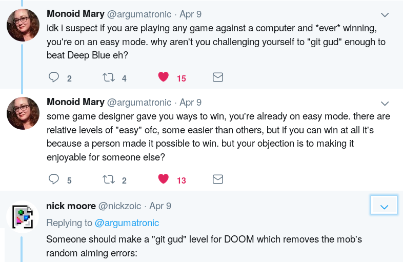
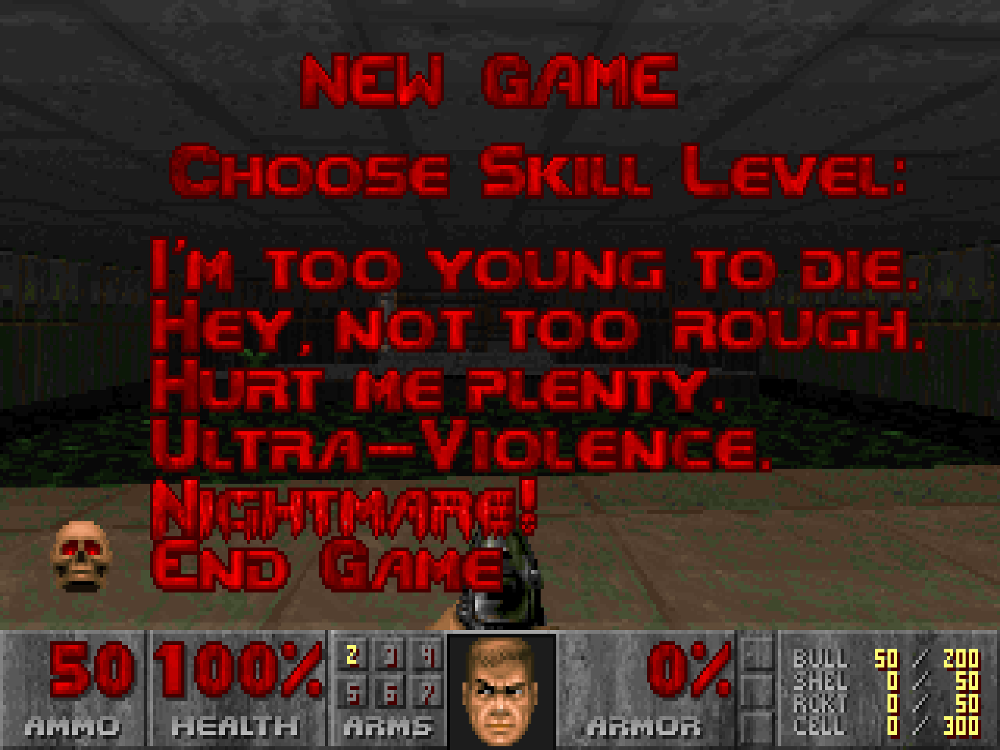
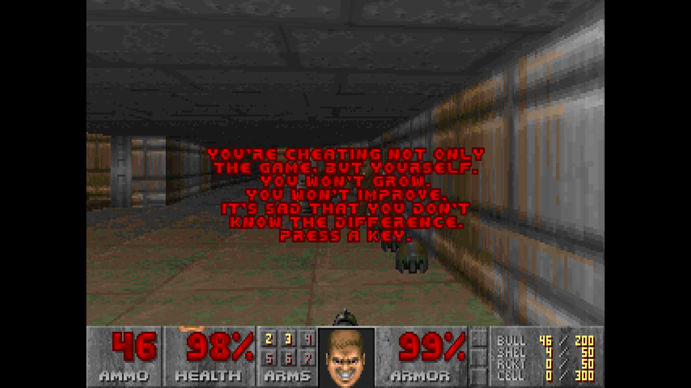
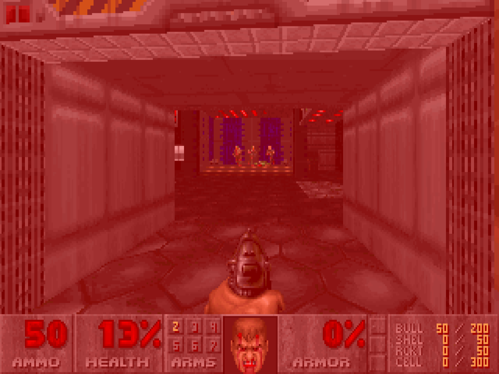

If Nightmare mode is not enough of a challenge for you, you'd better just git gud:

[DOOM Git Gud](https://github.com/nickzoic/doom-git-gud/)

Possibly the dumbest thing I've actually bothered to do based on a
[joke tweet](https://twitter.com/nickzoic/status/1115793964844507136):

[](https://twitter.com/nickzoic/status/1115793964844507136)

This patch to Chocolate Doom challenges you to really stretch yourself 
by having the enemies actually shoot straight.



There's not an easy way to make a new "GIT GUD" label, the graphics 
live in the WAD file which is separate.  Just select the one which says "END GAME".

Of course, DOOM GIT GUD expresses its distaste if you pick any other option:



I was originally intending to patch the enemies' movement code to 
have them behave less stupidly than directly walking into fire,
but it turns out that a one line patch to make them shoot straight is probably enough ...

The change looks like a bit like this:

```
-    angle += P_SubRandom() << 20;
+    angle += (gameskill < sk_gitgud) ? (P_SubRandom() << 20) : (P_SubRandom() << 16);
```



This code just takes `angle`, the correct angle for the enemy to
be firing at to hit you, and modifies it a bit.

`P_SubRandom()` returns a random number between -255 and 255.

(Actually: the difference between two
pseudo-random numbers between 0 and 255, so between
-255 and 255 but with a bias towards the middle much
like rolling two dice and adding them up)

`angle` is a 32 bit number representing 360⁰ of 
rotation, so `P_SubRandom() << 20` represents an
aiming error of about ±22⁰.  `P_SubRandom() << 16` is 
a much healthier aiming error of about ±1.4⁰, which
seems like it's roughly the same as what the player gets:
if you're shooting at a soldier, they hit you about as
often as you hit them.

If that's too easy for you, change it to:

```
angle += (gameskill < sk_gitgud) ? (P_SubRandom() << 20) : 0;
```

And remember, "if you can win at all it's because a person made it possible to win."
