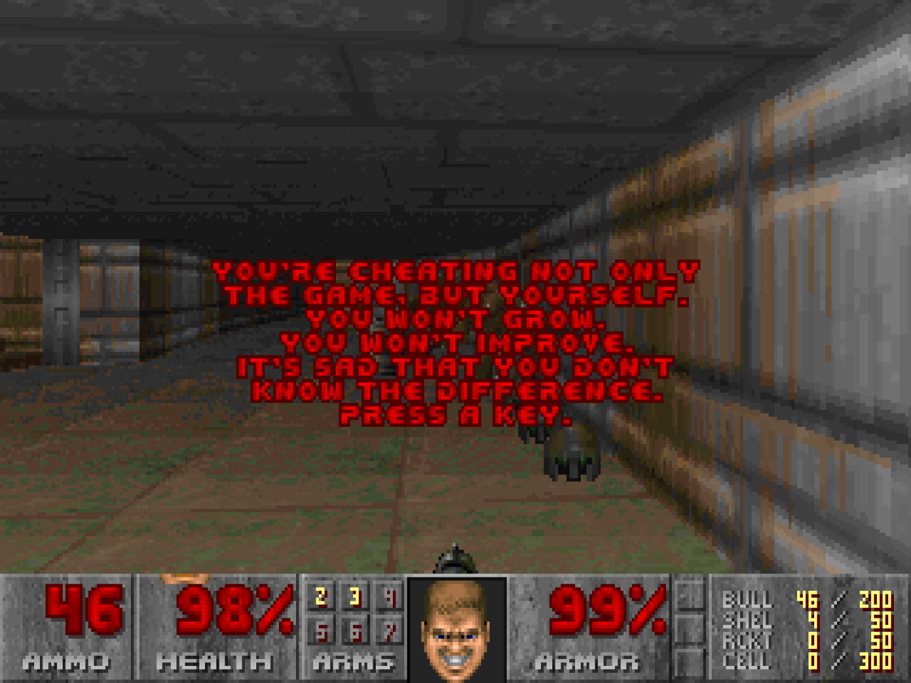

If Nightmare mode is not enough of a challenge for you, you'd better just git gud:

[DOOM Git Gud](https://github.com/nickzoic/doom-git-gud/)

Possibly the dumbest thing I've actually bothered to do based on a joke tweet:

[](https://twitter.com/nickzoic/status/1115793964844507136)

This patch to Chocolate Doom challenges you to really stretch yourself 
by having the enemies actually shoot straight (and expresses its distaste
if you pick any other option):



I was originally intending to patch the enemies' movement code to 
have them behave less stupidly than directly walking into fire,
but it turns out that just removing the randomization code which
causes them to rarely shoot straight is probably enough ...

```
-    angle += P_SubRandom() << 20;
+    angle += (gameskill < sk_gitgud ? P_SubRandom() << 20 : P_SubRandom() << 16);
```


