I've been working on [MicroPython for ESP32](../micropython/)
recently and working on implementing some of the crazier hardware on the
device.

Capacitive touch sensor controllers are widely available, but having the
facility built in making the ESP32 competitive with cheaper SoCs which
don't already include these facilities. While I've been looking at the
software, it's been interesting to look at the hardware and see how it
works as well.

The sensors work by allowing the pin to freely oscillate, and monitoring
the frequency at which it does so. Attach the pin to a conductive pad,
and bring something large and conductive, like a finger, close to it,
and the pin will oscillate more slowly. The controller can measure this
and detect that the pad is being (almost) touched.

Each sample takes about 8ms to complete.

MicroPython
===========

I'm programming the ESP in [MicroPython](../micropython/) which
just makes the experimental setup easier. Not all features are merged in
yet, so if you want to use the TouchPad from MicroPython you may need to
pull in [my esp32-touchpad
branch](https://github.com/nickzoic/micropython-esp32/tree/esp32-touchpad)

Test Setup
==========

I started off testing the hardware with flying leads and alligator
clips, but since capacitive test sensors are affected by their
surroundings it's hard to get a consistent response in this way. So I
made up some a quick test setup out a [Sparkfun ESP32
Thing](https://www.sparkfun.com/products/13907) and a bit of
single-sided blank PCB cut into four zones with a rotary burr.

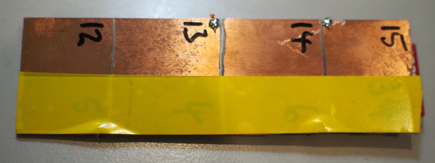

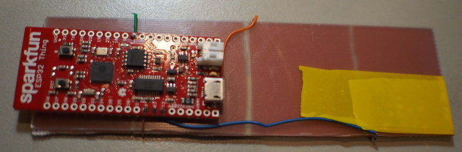

The ESP32 board is stood off from the touch board with a layer of foam
and double-sided taple, and a couple of layers of insulting tape over
the top of the foil simulate putting the pads in an enclosure.

I then logged some measurements with the following MicroPython code:

... which captures 400 readings across the four pins as fast as it can,
and then dumps the lot out for pasting into gnuplot. Each sample takes
about 8ms, so the capture is over about 3 seconds.

Swiping a finger from GPIO15 to GPIO12 shows the way the multiple
oscillators respond:

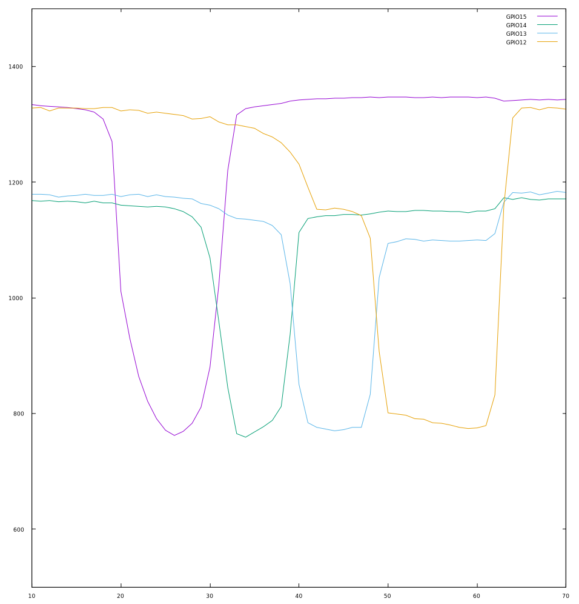

The 'resting' frequencies of the central two pads are lower than that of
the pads at the ends, presumably because they are somewhat coupled to
them ... you can see that touching GPIO15 has a small effect on GPIO14
as well, and GPIO13 is effected by both GPIO14 and GPIO12. GPIO12 is
especially messy, I think because the blue wire connecting it runs
behind the pad for GPIO13 for quite a way, inevitably coupling them. Any
design using the capacitive sensors is going to have to take board
layout seriously!

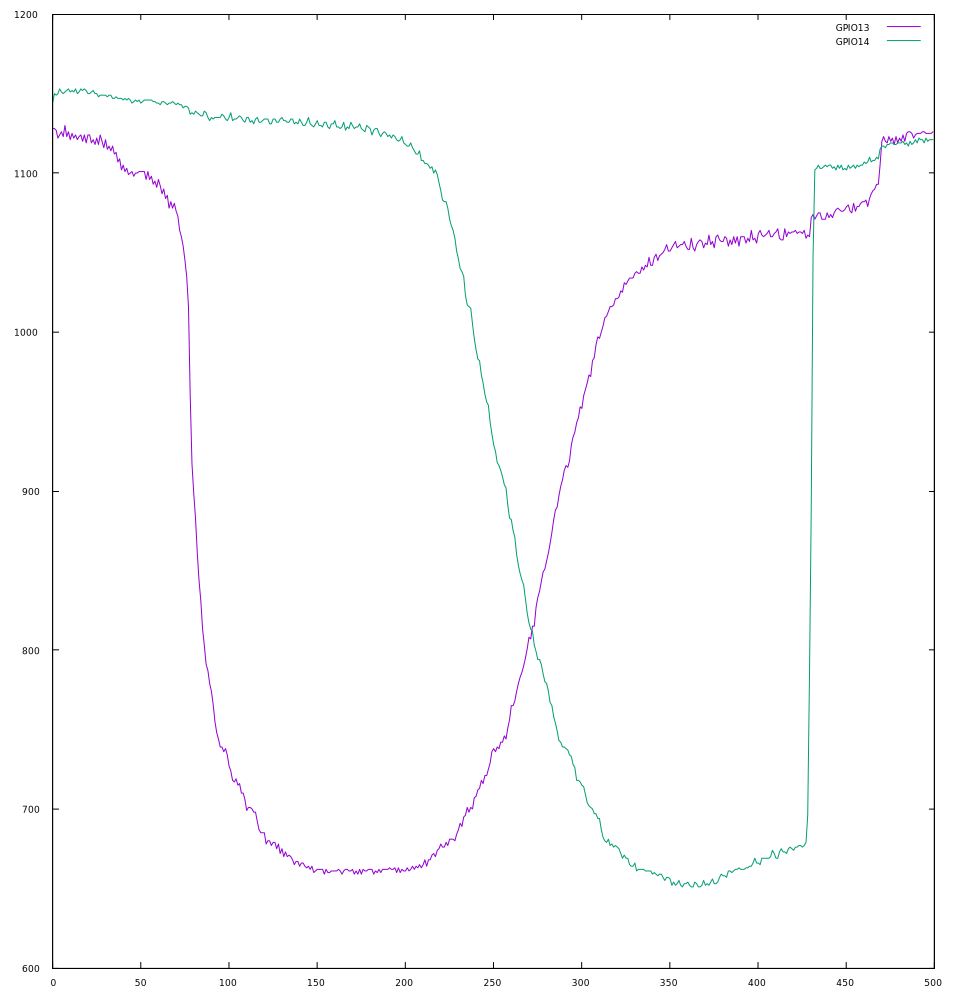

A closer look at just two pads (at twice the sample rate, and a larger
number of samples) shows that there's a smooth crossover between the
pads, where your fingertip is close to both of them. The curves are nice
and smooth, suggesting that they don't interfere much. It might be
possible to get a longer transfer between the two by interleaving tracks
at the edges, perhaps even tapering them together like so:

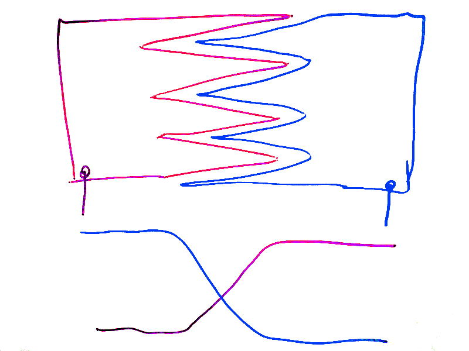

The sensors work pretty well right through the PCB, these traces show a
touch on the non-copper side. Again, good PCB design practices will be
needed to prevent interference!

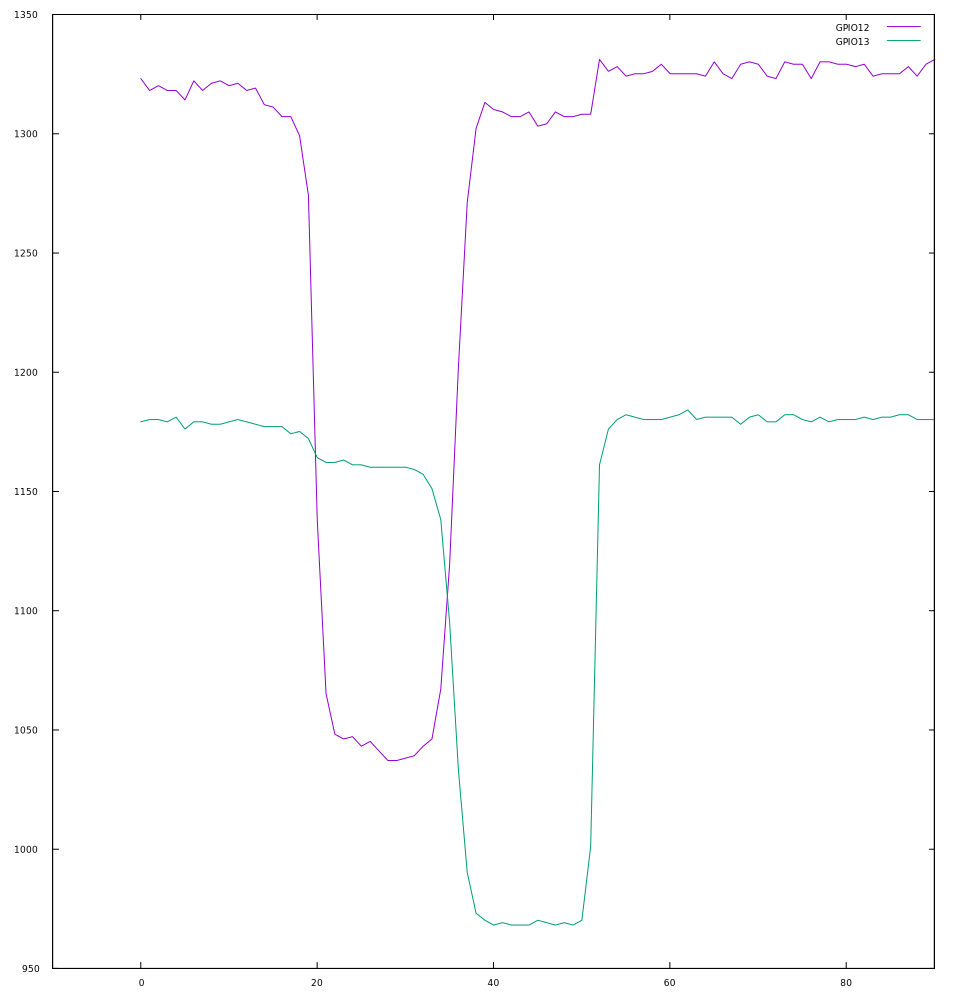

Seriously Retro
===============

Just out of curiosity, I got out the trusty CRO to have a look at how
the signals for the touchpads work. Photographing CROs is not exactly
easy, so please forgive these lousy images:

Unfortunately, my CRO is sufficiently old as to have a fairly large
effect on the system under test (t.read() was 286, like being touched!),
so I'll have to come back to this with some better test equipment.

This first one shows the pin and pad oscillating happily with no touch.
At 10us per division that's about 14ms per cycle or 71kHz. The vertical
axis shows the signal going from about 1.5V to 3.7V above ground. At
this point, t.read() returns about 300.

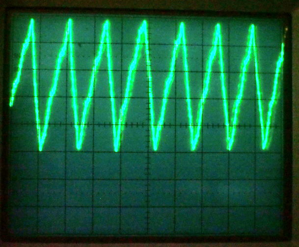

The second shows the waveform while being touched, at the same setup.
The frequency has reduced to about 34us per cycle or 30kHz. At this
point, t.read() returns about 230.

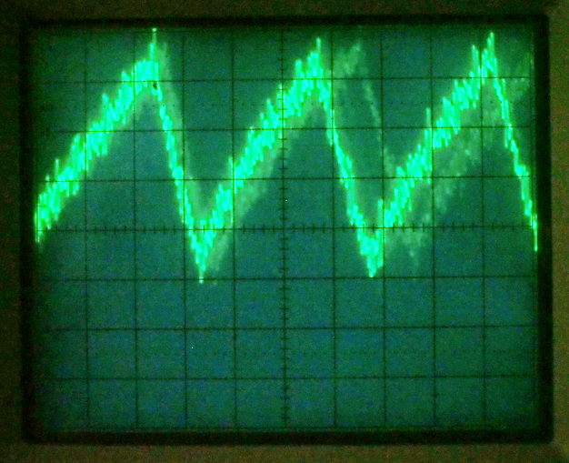

Interestingly, the oscillator output isn't constant, but occurs in about
8ms bursts with about 30ms 'off' between them.

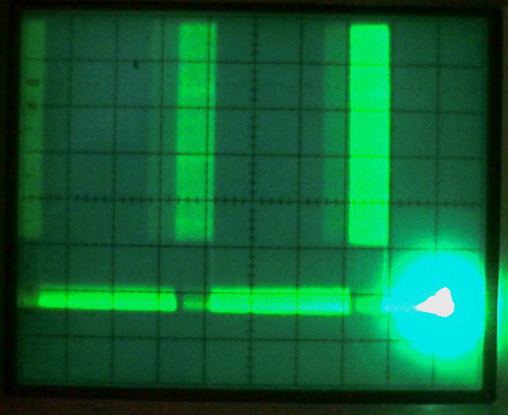

UPDATE
======

I talked about the touch sensors at the [Melbourne MicroPython Meetup](https://www.meetup.com/MicroPython-Meetup/)
and got some great feedback from Angus, John, Lachlan and others as part of the 
[Minimum Viable Badge](https://github.com/mage0r/Minimum-viable-badge) concept.

First things first, Angus (@projectgus) pointed this out:

> I think a better conceptual model for captouch isn't that you're grounded
> and the device is coupling to you
> (how can this work for double insulated devices, battery powered devices, etc.)
> but that there is a coupling between the ground plane and the electrode, and when you move your
> water-filled limbs into this space you are changing the properties of that field

This is a really good point and something I'd never really thought critically about.
Compared to a chip, Earth is big, people are big, same thing surely :-).  But this is 
some pretty fuzzy thinking.

The experiments I'd done had the board grounded by the USB lead, so would they work
differently on battery power?

I'd also assumed that capacitance to a ground plane would be a bad thing,
so I'd avoided having a ground plane ...
Gus also pointed out TI's
[Capacitive Touch Hardware Design Guide](http://www.ti.com/lit/an/slaa576a/slaa576a.pdf)
which says:

> Ground planes, both coplanar and on neighboring PCB layers, reduce noise. This is the same principle
> discussed in Section 5.1. The ground or guard structures are placed as close as possible to reduce noise
> but also kept far enough away to minimize parasitic capacitance"

New Test Board
--------------

OK, so new test board design required!  I cracked out the rotary tool
(and eye protection, kids!) and made this out of 1.6mm single-sided board:

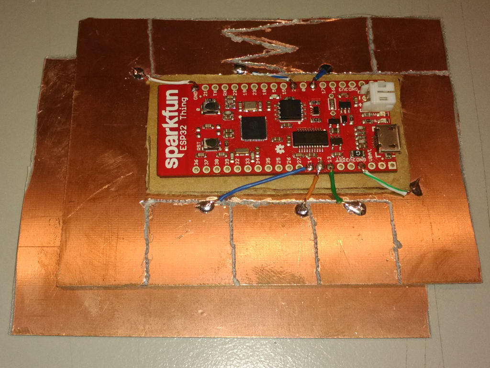

One edge has three 20x20mm contacts, the other has two contacts with a zigzag boundary.
The second piece of board is a removable backplane, to see how a groundplane affects
the touchpad behaviour.

The insulating tape I'd used in the previous setup was a lot thicker than you'd
expect from PCB mask, so I used some thinner
[pallet strapping tape](http://www.signet.net.au/store/products/11098/signet-strapping-tape-19mm-x-66m-black)
this time, it is smooth and very strong but only 0.1mm thick.

I then assembled the board and the backplane, and double-sided taped them to my desk to stop them
moving around ...

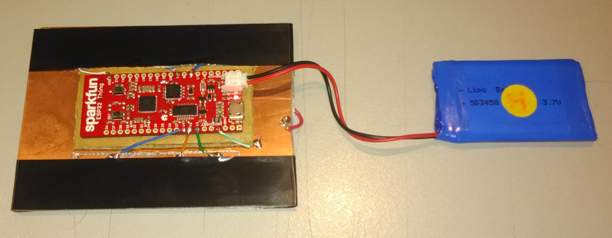

New Test Python
---------------

The first thing I did was build a shiny new MicroPython v1.8.7-965-ge7aefc7a and deploy
it to the board.

I wanted to run the board on batteries so as to disconnect it from the PCs ground, 
so reading results over the REPL wasn't going to work this time. Either the PC could be 
the client or the PC could be the server, it doesn't make a lot of difference but I ended
up going with the former.

This code is not very elegant, but it is enough to listen on port 9999 and when a client
connects, dump touchpad readings at it:

```
import network
import socket

import machine
import time

wlan = network.WLAN()
wlan.active(True)
wlan.connect('my_ap','my_password')

sock_listen = socket.socket()
sock_listen.bind(('0.0.0.0', 9999))
sock_listen.listen(1)

touch0 = machine.TouchPad(machine.Pin(4))
touch2 = machine.TouchPad(machine.Pin(2))
touch4 = machine.TouchPad(machine.Pin(13))
touch5 = machine.TouchPad(machine.Pin(12))
touch6 = machine.TouchPad(machine.Pin(14))

while True:
    try:
        sock, _  = sock_listen.accept()
        start_ticks = time.ticks_ms()
        while True:
            sock.write("%d %d %d %d %d %d\n" % (
                time.ticks_diff(time.ticks_ms(), start_ticks),
                touch0.read(),
                touch2.read(),
                touch4.read(),
                touch5.read(),
                touch6.read()
            ))
            time.sleep(0.01)
    except OSError:
        pass

```

Then I can just connect to this like so:

```
nc 10.107.1.125 9999 | tee -a touchpad.dat
```


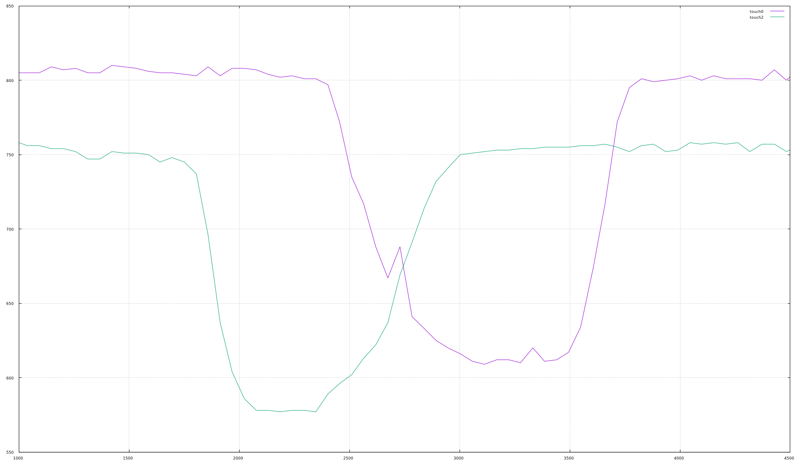
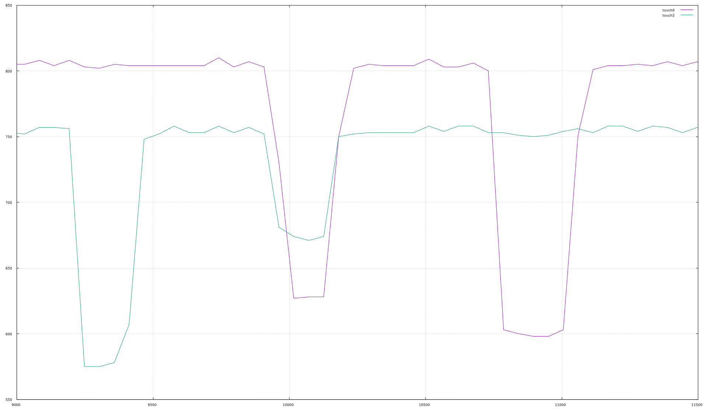
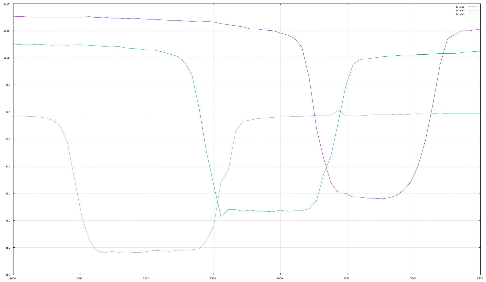
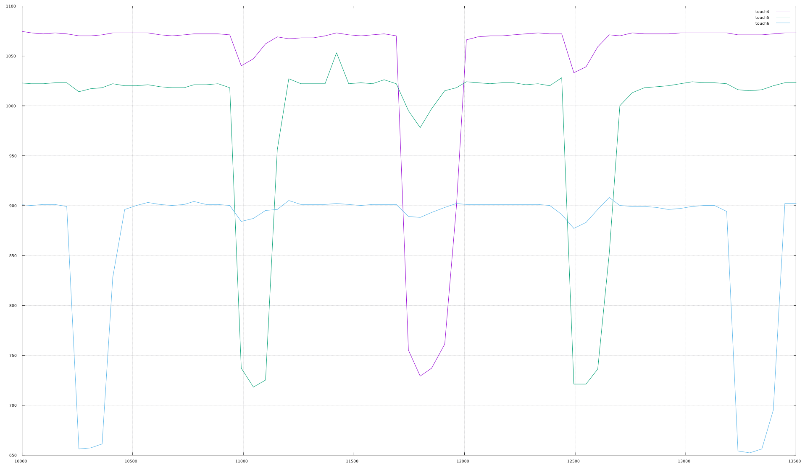

```
plot "touchpad.dat" using 1:2 with lines title "touch0", \
     "touchpad.dat" using 1:3 with lines title "touch2", \
     "touchpad.dat" using 1:4 with lines title "touch4", \
     "touchpad.dat" using 1:5 with lines title "touch5", \
     "touchpad.dat" using 1:6 with lines title "touch6"
```


