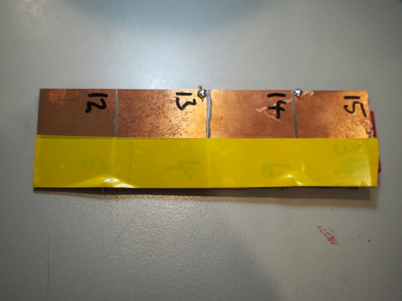
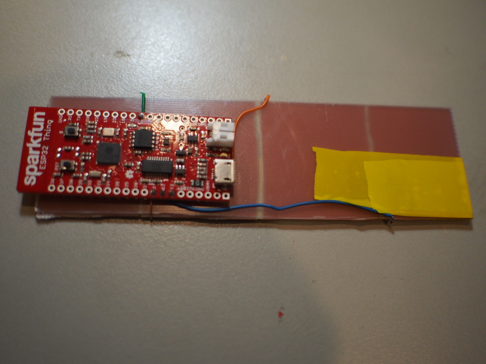
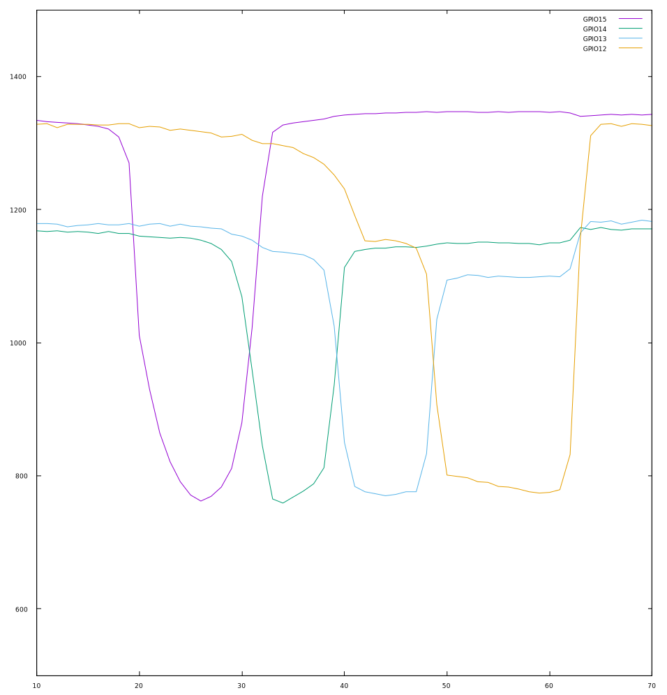
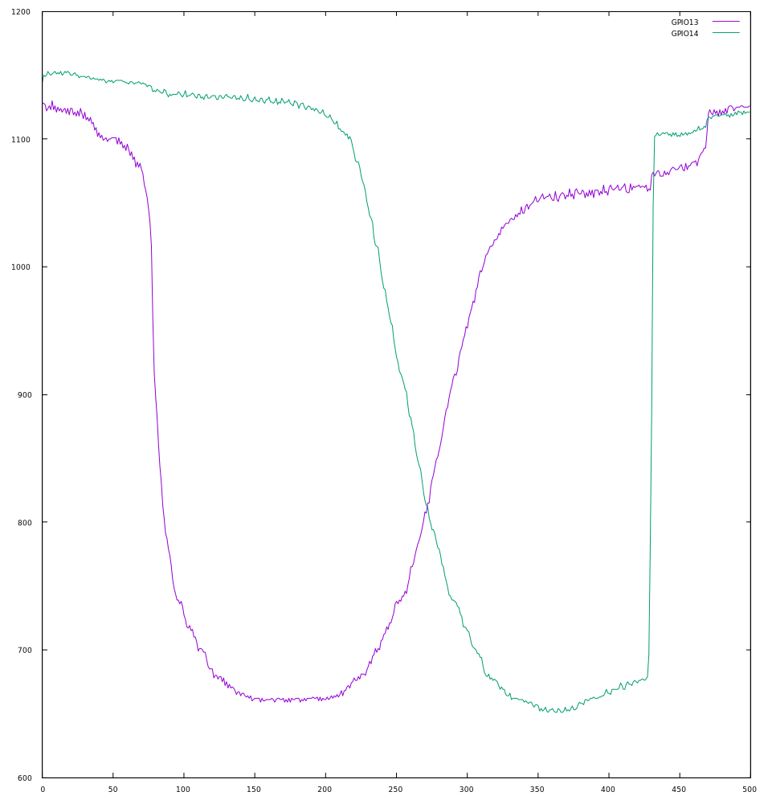
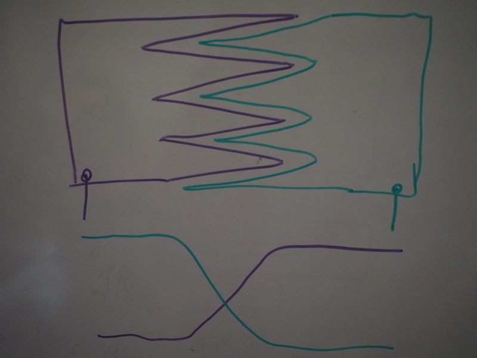
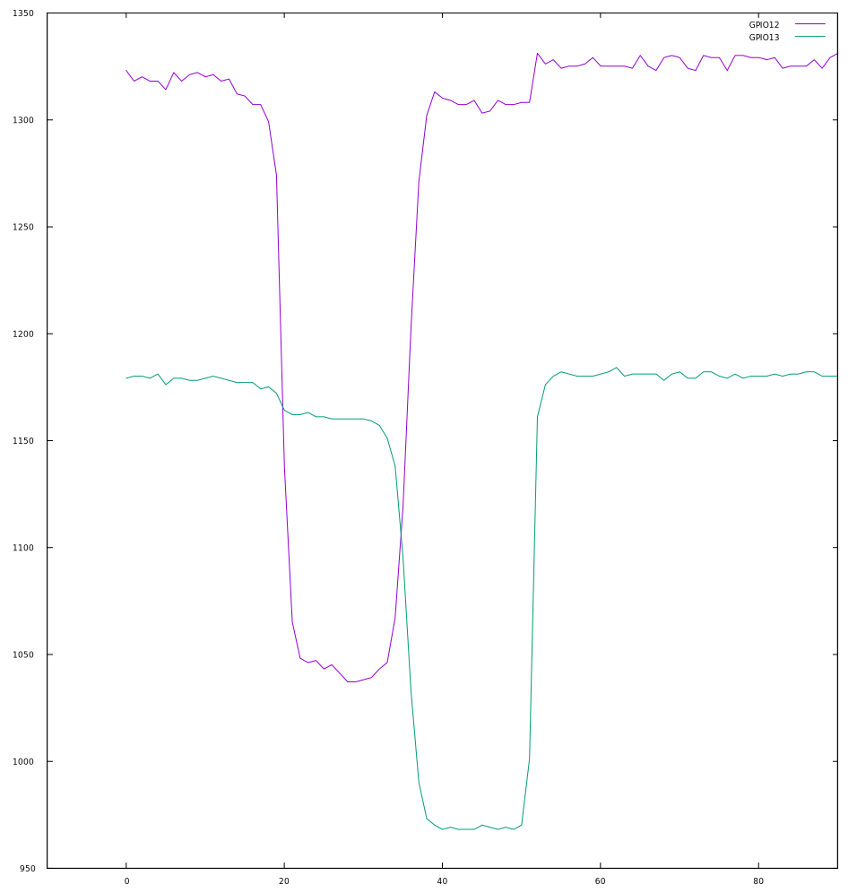
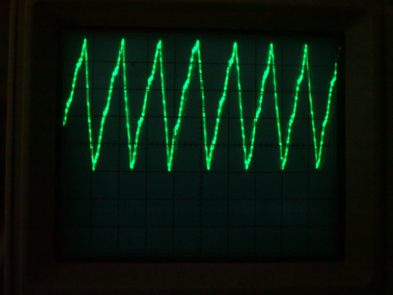
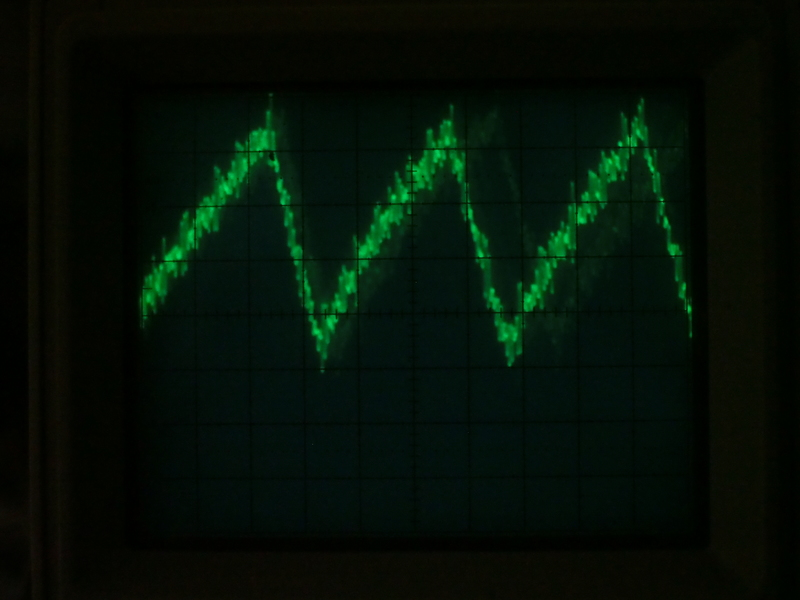
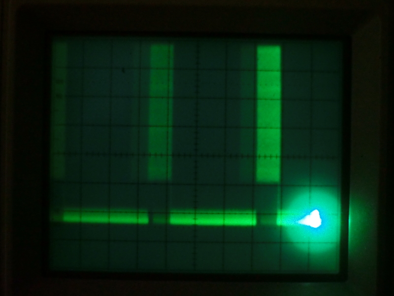

I've been working on [MicroPython for ESP32](/python/micropython/)
recently and working on implementing some of the crazier hardware on the
device.

Capacitive touch sensor controllers are widely available, but having the
facility built in making the ESP32 competitive with cheaper SoCs which
don't already include these facilities. While I've been looking at the
software, it's been interesting to look at the hardware and see how it
works as well.

The sensors work by allowing the pin to freely oscillate, and monitoring
the frequency at which it does so. Attach the pin to a conductive pad,
and bring something large and conductive, like a finger, close to it,
and the pin will oscillate more slowly. The controller can measure this
and detect that the pad is being (almost) touched.

Each sample takes about 8ms to complete.

MicroPython
===========

I'm programming the ESP in [MicroPython](/python/micropython/) which
just makes the experimental setup easier. Not all features are merged in
yet, so if you want to use the TouchPad from MicroPython you may need to
pull in [my esp32-touchpad
branch](https://github.com/nickzoic/micropython-esp32/tree/esp32-touchpad)

Test Setup
==========

I started off testing the hardware with flying leads and alligator
clips, but since capacitive test sensors are affected by their
surroundings it's hard to get a consistent response in this way. So I
made up some a quick test setup out a [Sparkfun ESP32
Thing](https://www.sparkfun.com/products/13907) and a bit of
single-sided blank PCB cut into four zones with a rotary burr.

The ESP32 board is stood off from the touch board with a layer of foam
and double-sided taple, and a couple of layers of insulting tape over
the top of the foil simulate putting the pads in an enclosure.

I then logged some measurements with the following MicroPython code:

... which captures 400 readings across the four pins as fast as it can,
and then dumps the lot out for pasting into gnuplot. Each sample takes
about 8ms, so the capture is over about 3 seconds.

Swiping a finger from GPIO15 to GPIO12 shows the way the multiple
oscillators respond:

The 'resting' frequencies of the central two pads are lower than that of
the pads at the ends, presumably because they are somewhat coupled to
them ... you can see that touching GPIO15 has a small effect on GPIO14
as well, and GPIO13 is effected by both GPIO14 and GPIO12. GPIO12 is
especially messy, I think because the blue wire connecting it runs
behind the pad for GPIO13 for quite a way, inevitably coupling them. Any
design using the capacitive sensors is going to have to take board
layout seriously!

A closer look at just two pads (at twice the sample rate, and a larger
number of samples) shows that there's a smooth crossover between the
pads, where your fingertip is close to both of them. The curves are nice
and smooth, suggesting that they don't interfere much. It might be
possible to get a longer transfer between the two by interleaving tracks
at the edges, perhaps even tapering them together like so:

The sensors work pretty well right through the PCB, these traces show a
touch on the non-copper side. Again, good PCB design practices will be
needed to prevent interference!

Seriously Retro
===============

Just out of curiosity, I got out the trusty CRO to have a look at how
the signals for the touchpads work. Photographing CROs is not exactly
easy, so please forgive these lousy images:

Unfortunately, my CRO is sufficiently old as to have a fairly large
effect on the system under test (t.read() was 286, like being touched!),
so I'll have to come back to this with some better test equipment.

This first one shows the pin and pad oscillating happily with no touch.
At 10us per division that's about 14ms per cycle or 71kHz. The vertical
axis shows the signal going from about 1.5V to 3.7V above ground. At
this point, t.read() returns about 300.

The second shows the waveform while being touched, at the same setup.
The frequency has reduced to about 34us per cycle or 30kHz. At this
point, t.read() returns about 230.

Interestingly, the oscillator output isn't constant, but occurs in about
8ms bursts with about 30ms 'off' between them.

