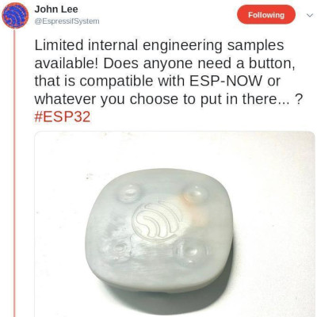
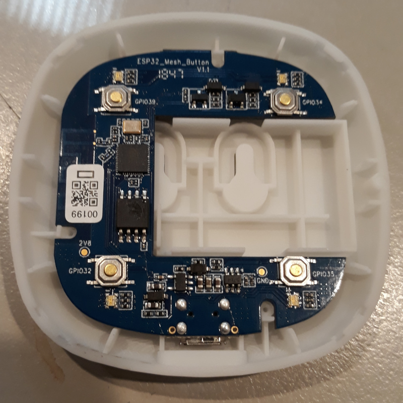
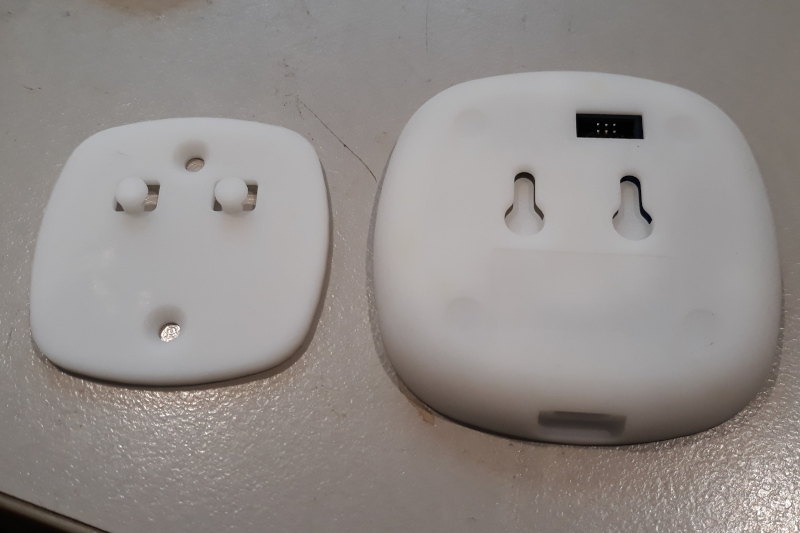
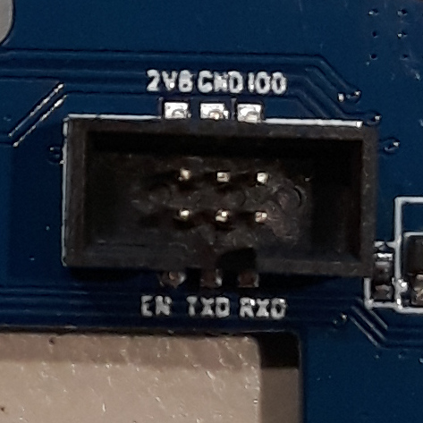

I replied to this tweet and Espressif sent me this nifty "ESP32 Meshkit Button"
to play with with MicroPython, let's have a look ...

*Tweet from John Lee*

## Hardware

*Inside the ESP32 MeshKit Button*
*Back of the ESP32 Meshkit Button*

The device consists of a little snap-together clamshell holding a C-shaped board with
four mechanical buttons and four RGB LEDs. The big cutout in the center is to hold a 
[200 mAh LiPo with JST-SHR-2P connector](img/battery.jpg).

There's lots more information about this device available on github, including a 
schematic:
[ESP32 MeshKit Button on github](https://github.com/zhanzhaochen/ESP32-MeshKit-Button)

I'm quite surprised, disappointed even, that this device doesn't use 
[the ESP32's excellent capacitive touch sensing](/art/esp32-capacitive-sensors/) 
to detect touch through the plastic front panel. Instead, we've just got 
plain tactile buttons on GPIOs 32 to 35.  Oh well, perhaps in version 2 ...

Also, the RGB LEDs aren't individually addressable, which seems like a shame.
There is some interesting
"[Dickson charge pump](https://en.wikipedia.org/wiki/Voltage_multiplier#Dickson_charge_pump)"
circuitry in there to drive the R and G channels at a higher voltage than would otherwise
be available.  Perhaps they'll be brighter at 50% PWM than at 100%!

And there's a
[set/reset flip-flop](https://en.wikipedia.org/wiki/Flip-flop_(electronics)#Simple_set-reset_latches)
arrangement on the red channel, presumably so it can be locked on while the CPU is asleep.

There's a charging circuit to charge the little LiPo from a USB port.  The USB
port doesn't carry data though, just charge.  I have a couple of batteries around the
right size but without the right connector, so I'll just run it from external power for
the moment.

*Programming Port*

And finally, there's a programming port.  This is a mini header, 6 pins at
0.05" / 1.27mm pitch.  I can totally understand why manufacturers want to go to 
a connector an eighth the volume of the common 0.1" header, and I'd love to see
a standardized header for serial programming ports.  These connectors are pretty
rare in hobbyist land still ... it'd be great to include one in the box for
those of us living a long way from Shenzen.  I ended up mutilating a 10P x 1.27mm
cable for now.

To program the device you'll need a USB to serial adaptor, if you've been 
messing with microcontrollers for a while you'll probably have a million of these
lying around.

# TBC

