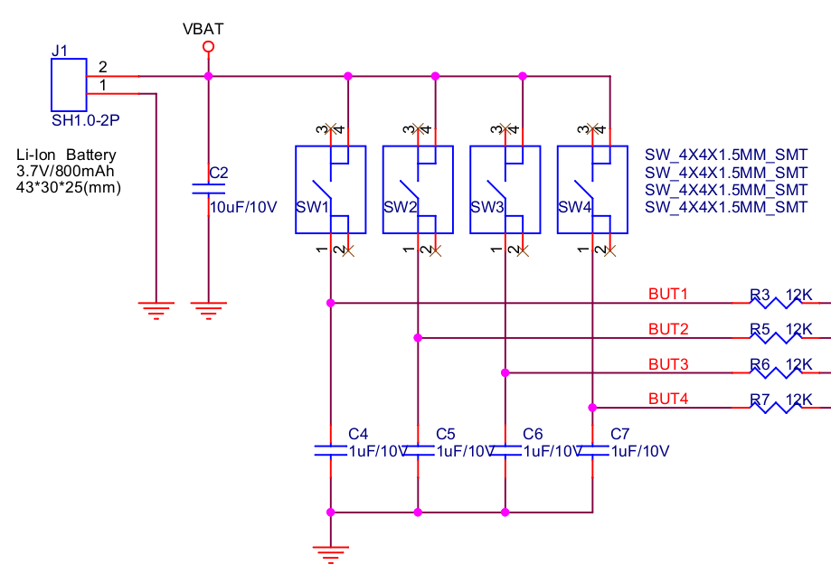
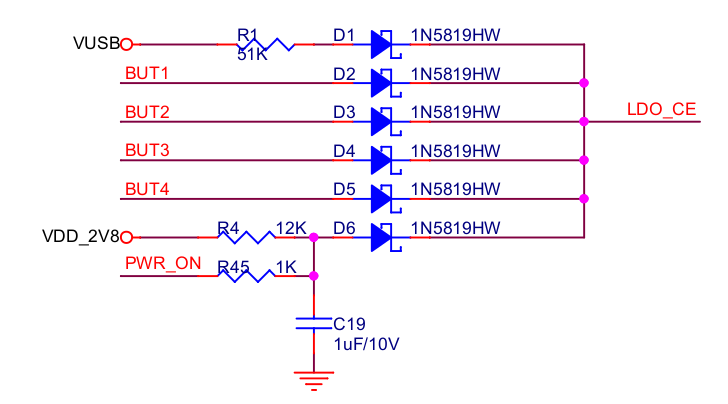
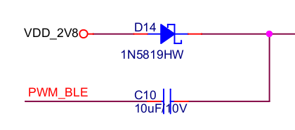
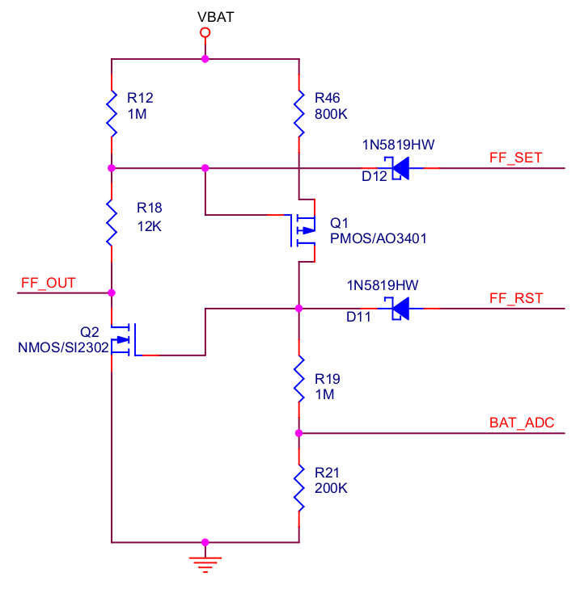
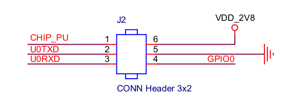
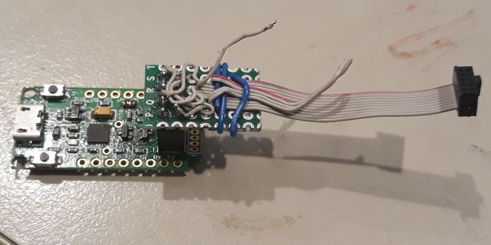

I replied to this tweet and Espressif sent me this nifty "ESP32 Meshkit Button"
to play with with MicroPython, let's have a look ...

[](https://twitter.com/EspressifSystem/status/1069227084650704902)

## Hardware


*Inside the ESP32 MeshKit Button*

The device consists of a little snap-together clamshell holding a C-shaped board with
four mechanical buttons and four RGB LEDs. The big cutout in the center is to hold a 
[200 mAh LiPo with JST-SHR-2P connector](img/battery.jpg).

There's lots more information about this device available on github:
* [github repo](https://github.com/zhanzhaochen/ESP32-MeshKit-Button)
* [Schematic](https://github.com/zhanzhaochen/ESP32-MeshKit-Button/blob/master/docs/ESP32-MeshKit-Button_Schematic.pdf)

I've used some excerpts from the schematic here to illustrate my investigations of
the circuit.

I'm quite surprised, disappointed even, that this device doesn't use 
[the ESP32's excellent capacitive touch sensing](/art/esp32-capacitive-sensors/) 
to detect touch through the plastic front panel. Instead, we've just got 
plain tactile buttons.


*Tactile Buttons Circuit*

(Note: the schematic shows `BUT4_A` connected to `GPIO33` but it is actually
connected to `GPIO39` ... according to the silkscreen, the `button_driver.c` code
and experiment ...)

There's little symbols molded into the top, although they're quite hard to see:

position | icon | GPIO
--- | --- | ---
top left | IEC power | 39
top right | light bulb on | 34
bottom left | Sleep | 32
bottom right | light bulb off | 35

There's some interesting circuitry around those buttons though: they're powered directly
from `VBAT` and there's a little diode-OR circuit to power up the LDO if any of the buttons
are pressed.  So if the CPU pulls `PWR_ON` low, and there's no `VUSB`, and there's no button pressed,
the LDO will turn off and the CPU too.  This has got to be the ultimate in power saving.


*Diode OR circuit*
 
There is some interesting
"[Dickson charge pump](https://en.wikipedia.org/wiki/Voltage_multiplier#Dickson_charge_pump)"
circuitry in there to drive the G and B channels at a higher voltage than would otherwise
be available.  Perhaps they'll be brighter at 50% PWM than at 100%!


*Charge Pumps*

The R channel doesn't get a voltage doubler, but then again red LEDs typically have a smaller
voltage drop so it doesn't need it.  And there's a
[set/reset flip-flop](https://en.wikipedia.org/wiki/Flip-flop_(electronics)#Simple_set-reset_latches)
arrangement on the red channel, presumably so it can be locked on while the CPU is unpowered.


*Flip-flop circuit*

There's a charging circuit to charge the little LiPo from a USB port.  The USB
port doesn't carry data though, just charge.  I have a couple of batteries around the
right size but without the right connector, so I'll just run it from external power for
the moment.


*Back of the ESP32 Meshkit Button*

On the back is a pair of holes for a wall mount plate.  These don't really clip in, just sit
there.  There's also a tiny programming port.


*Programming Port*

Here it is without the case.  This is a mini header, 2 x 3 pins at
0.05" / 1.27mm pitch.  I can totally understand why manufacturers want to go to 
a connector an eighth the volume of the more common 0.1" headers, and I'd love to see
a standardized header for serial programming ports.  But these connectors are pretty
rare in hobbyist land still, so it'd be great to include one in the box.


*Programming Port Header*

I ended up mutilating a 10P x 1.27mm cable for now, and connecting the other end
to an 8P 0.1" male header like an [ESP-01](https://en.wikipedia.org/wiki/ESP8266#Pinout_of_ESP-01)
so I could use a serial converter I already had.  If you've been
messing with microcontrollers for a while you'll probably have a million of these
lying around.

Port | ESP-01 Pin | Diode?
--- | --- | ---
2V8 | | K
GND | GND | 
IO0 | GPIO0 |
EN  | RST |
TXD | TX | 
RXD | RX |
    | GPIO2 | 
    | CH_PD |
    | VCC | A

Blanks mean "no connection".  It's a pity the power pin is to VDD_2V8 ... it's useful 
to have the device powered for programming but the 3.3V out of the serial converter is
dragged down to 2.8V by the output side of the LDO.  
I'm thinking of adding a diode in there to drop the voltage so the device can be 
powered from the programming cable, but in the meantime it is sufficient to connect
power through the main charging port as well.


*Programming Cable (very nasty)*

With this cable in place, and power applied through the built-in USB port, I can run
`esptool`, which identifies the device as a ESP32D0WDQ5 (rev 1) with 4MB flash.
I can also connect to the USB port at 115200 baud and see logging messages as the device
initializes and as it logs button presses.  The auto-reset circuit even works!

## ESP-MESH Software

This is MIT Licensed, implemented in quite readable C and available at the github repo above.

I've talked about [the Internet of (Not Shit) Things](/art/the-internet-of-not-shit-things/)
and about [L2IoT](/art/l2iot-iot-without-ip/) so I'm very excited to see what Espressif have
made of [ESP-MESH](https://docs.espressif.com/projects/esp-idf/en/latest/api-guides/mesh.html)

## MicroPython

The next step is to load MicroPython onto the device in place of the shipped firmware, and 
see what we can come up with.  I just grabbed the latest master and build it and here's the
familiar banner:

```
MicroPython v1.9.4-788-gf874e8184 on 2019-01-25; ESP32 module with ESP32
Type "help()" for more information.
>>>
```

The buttons on GPIOs 32, 34, 35 and 39 are quite easy to read:

```
>>> import machine
>>> p = machine.Pin(32, machine.Pin.IN)
>>> p.value()
0
>>> p.value()
1
```

When it boots, the blue LED channel is slightly on, because GPIO14 is on.
How about if we try out those voltage doublers?

```
>>> blue_pin = machine.Pin(14, machine.Pin.OUT)
>>> blue_pwm = machine.PWM(blue_pin, freq=1000)
>>> blue_pwm.duty(512) 
```

... as predicted, the blue LEDs are brighter with a 50% duty cycle than they 
were when solidly 'on', ditto the green channel on GPIO26.

The red channel is a bit different, as it has no voltage doubler circuit and
therefore the brightness is roughly linear with PWM duty cycle.

The flipflop behaviour is a little more mysterious, perhaps because I've not
got a battery hooked up yet.  It looks like it can be flipped on to turn the
red LED channel on while the CPU is shut down.

# TO BE CONTINUED

Further work is needed!

* Hook up a lithium battery
* experiment with the wake-on-press and keep-awake behaviours.
* try to understand that flip-flop on the red LED.
* have a look at ESP-MESH bindings and how to get them into
  MicroPython


