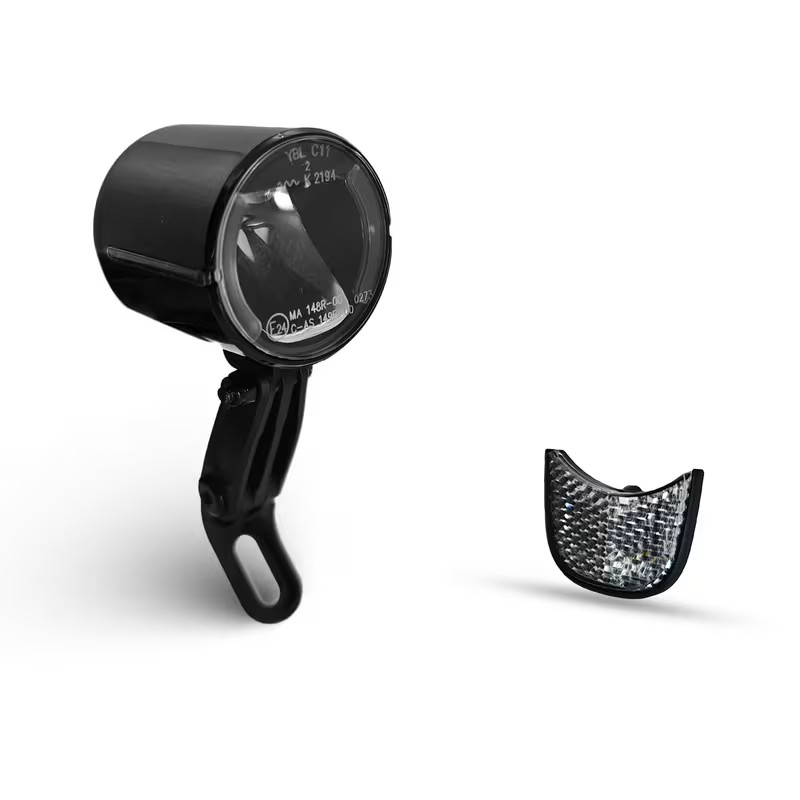
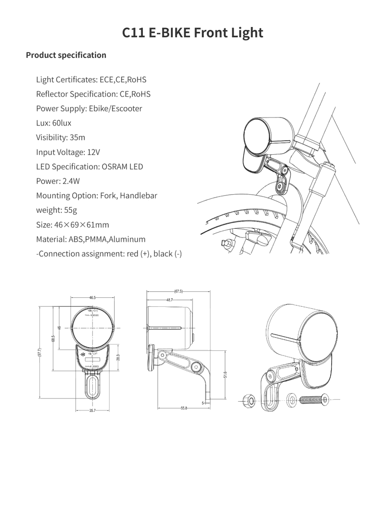
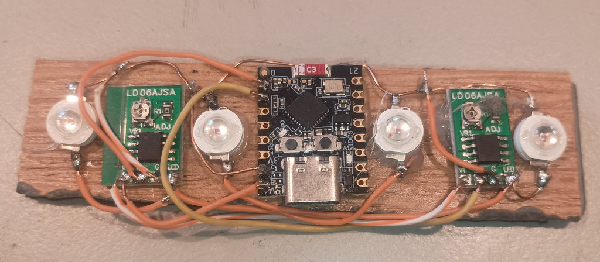
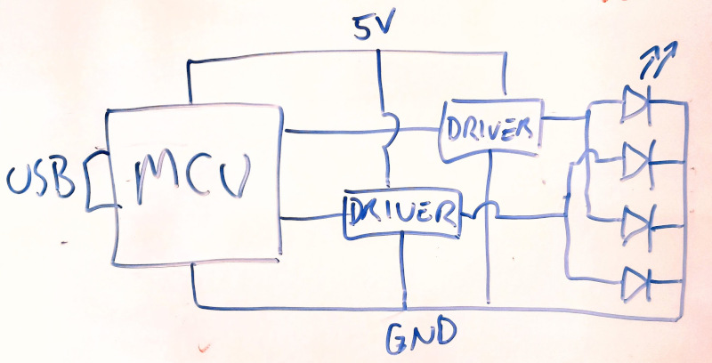

## Why?

Why on earth would I be considering making bicycle lights when there
are many good products out there on the market, and a huge glut
of cheap but reasonable lights too.

Well, none of them do quite exactly what I want, that's why!

So inspired at least partly by
[Pete's Neopixel lights](https://rasterweb.net/raster/2025/12/04/neopixel-bike-light-v2/)
and [Ryan's wheel lights](https://rideatnight.com/en-aud) I thought
I'd put a design of my own together.

## Shared Power

I have an LED headlight which runs on 4 x 18650s in parallel, and having that
external battery pack shared between the head and tail light would be
rather convenient.

## New headlight?

I bought one of these from Temu just for fun:

The datasheet says "Input voltage: 12V" but there's very likely a 
constant current driver in there so we'll get it on a bench power
supply and find out.  I don't know what "60 Lux" will work out
like in practice:

| volts | amps | watts |
|---:|---:|---:|
| 4.0 | 0.032 | 0.128 |
| 5.0 | 0.347 | 1.73 |
| 6.0 | 0.284 | 1.68 |
| 7.0 | 0.240 | 1.68 |
| 8.0 | 0.207 | 1.66 |
| 9.0 | 0.186 | 1.67 |
| 10.0 | 0.172 | 1.72 |
| 11.0 | 0.164 | 1.80 |
| 12.0 | 0.157 | 1.88 |
| 13.0 | 0.152 | 1.98 |

So, it's a lot of things, but it isn't 2.4W.

XXX put a big capacitor on there and solder the wires though

Interestingly, the design has a downward-facing LED and a diagonal 
reflector which does reduce the glare a little.
It doesn't seem to lose a lot amount of brightness down
to 5.0V, or to gain much above there, and I did accidentally
over-voltage it to about 17V without it dying.
So it won't run on 1S (~3.6V) but it should run pretty well on a
2S (~7.2V) or a 3S (~10.8V) pack.

Even at full power a 2S 5000mAh pack should last several hours.

### Just buy something

External battery pack lights seem to have diminished in popularity
but there's still some like
[these ones](https://www.ebay.com.au/itm/306227423154?_skw=bicycle+90000LM)
which include 3 LEDs and a chunky 2S x 3600mAh battery pack.

## Rear Light Prototype

*Probably should put a Content Warning: Bad Soldering on that one*

*Badly drawn schematic*

[LD06AJSA](https://www.aliexpress.com/s/wiki-ssr/article/ldo6ajsa-datasheet)
driver boards are available in all the usual places and are 
just a little carrier for a
[CN5711](https://electronperdido.com/wp-content/uploads/2024/04/CN5711-datasheet.pdf)
LED driver and a variable resistor `$ R_{ISET} $` to set the output
current.

The CN5711 can operate from 2.8V to 6V, conducting current up to 1.5A.
A resistance on pin `ISET` can be used to set the LED current
anywhere from 60mA to 1500mA and additionally the `CE` pin can be used
to switch the current on and off, or can be used as a PWM input at 
up to 2kHz.

White LEDs generally have a forward voltage of about 3.2V so these
chips are good to drive a white LED at up to about 4.8W.  Red LEDs 
have a lower forward voltage, about 2.0V, but it'd be typical to put
a couple of them in series if running off a higher voltage.
