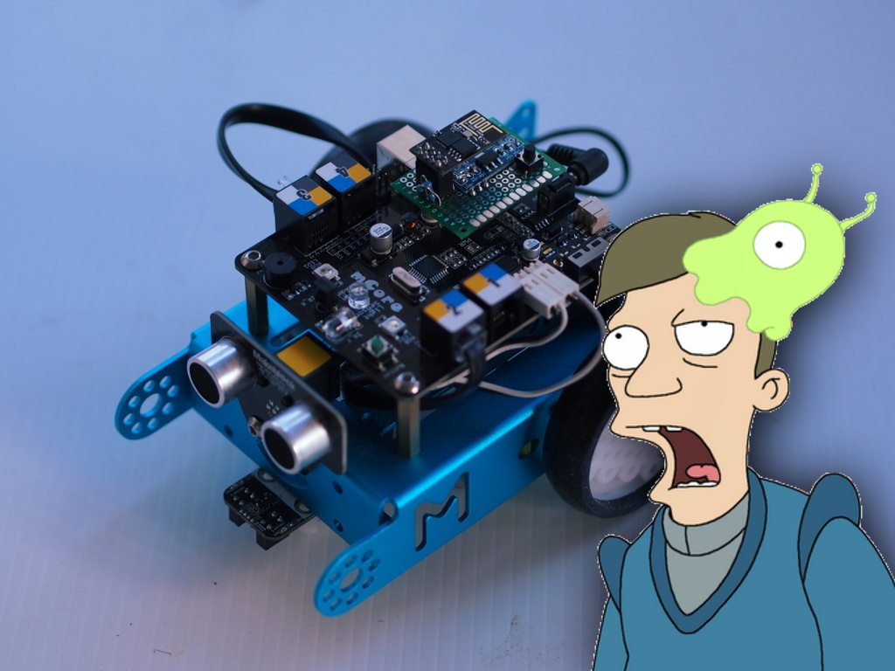

-   [original Flobot
    article](../flobot-graphical-dataflow-language-for-robots)
-   [Flobot on Github](https://github.com/mnemote/flobot/)

MicroPython
===========

The first version of Flobot was in C. I'd looked at
[NodeLua](https://nodelua.org/) and decided it wasn't really going to
work for me, so I ended up writing it in C and implementing [a very
simple
VM](https://github.com/mnemote/flobot/blob/d699411a3c25393b1b923e06eec1b6807c891e29/esp8266/vm/virtual.c)
to run the flobot instructions. This worked in the end, but really I'd
*under* estimated just how capable a CPU the ESP8266 is and so I spent
way too much time worrying about performance, forgetting that it really
isn't that much slower than [my first Linux
box](http://www.cpushack.com/2013/01/26/cpu-of-the-day-new-logo-old-processor-intel-486-dx2-66/).

The main drawbacks were:

-   Javascript has terrible support for binary, and C is somewhat awful
    with strings. So getting them to communicate is always a
    little painful.
-   Writing C code in the first place never seems that bad, but coming
    back to it after a couple of months and changing it ... ugh. I guess
    because it is such a nitty-gritty language it fights
    against refactoring.

Thankfully, in the meantime, [MicroPython came to the
ESP8266](https://github.com/micropython/micropython/tree/master/esp8266)
and things got a lot easier. It talks JSON naturally. Rather than
implementing a VM, I just
[compile](https://docs.python.org/3.5/library/functions.html#compile)
some Python bytecode into existence and run it! The Python bytecode
interpreter is a pretty full-featured thing, so this also makes more
advanced features like components possible.

Flobot is intended to be an educational language, but it of limited
depth. Dragging and dropping components and wires works great for a
bunch of simple experiments, but (absent monitors in the several square
meter range) it's pretty limiting on the total complexity of programs
you can write. So if that happens, we can just switch across and edit
code in Python, also right there in the browser ... editing the same
program you've already written graphically!

And then, since Flobot itself is written in MicroPython ... students
who've grown up hacking *with* Flobot can hack *on* Flobot!

Flobot on mBot
==============

I [wrote earlier about the
mBot](../mbot-nodebot-blockly-arduino/)
and, well, it is a nifty piece of hardware and there's a heap of them
out there in schools. The [mCore
board](http://makeblock.com/mcore-main-control-board-for-mbot) runs a
ATMega328 which is not going to be running MicroPython any time soon,
but the [firmata firmware](https://github.com/firmata/protocol) lets the
CPU take orders from the serial port. Usually that'd be used to control
the mBot over USB serial or bluetooth from something like
[Johnny-Five](http://johnny-five.io/).

But it's pretty easy to set up an on-board ESP8266 to run Flobot and
talk to Firmata over the serial port ... so then Flobot can control
mBot! I call this the Brain Slug.

The tricky bit is that it needs the UART and the UART is generally used
for the REPL. But with some small tweaks (okay, so switching off the
serial REPL) it should work ... and that's where the original
MicroPython investigation came from, because when I started digging into
the code to implement Firmata I discovered that the original C
implementation, while working, was very very 'brittle' and hard to
change.

Further Work
============

I've also got to implement a few other bits and pieces:

-   [mDNS/Bonjour](https://en.wikipedia.org/wiki/Multicast_DNS) and/or
    [Dynamic DNS](https://en.wikipedia.org/wiki/Dynamic_DNS) for easier
    setup, maybe a 'telnet' style serial REPL.
-   At the moment there's no way to save Flobot programs on the robot,
    the client or on a server: ideally I'd like to support all three.

I got to talk about [Flobot at PyCon AU](/etc/pycon-2016-melbourne/)
which was incredibly exciting and energizing ... it's really inspired me
to get this project moving again. More updates soon!
