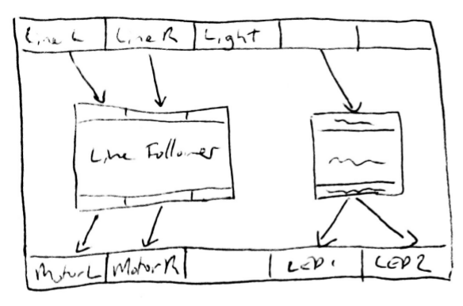
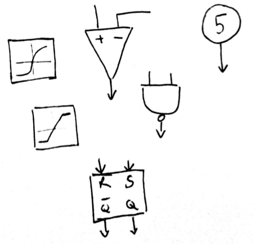
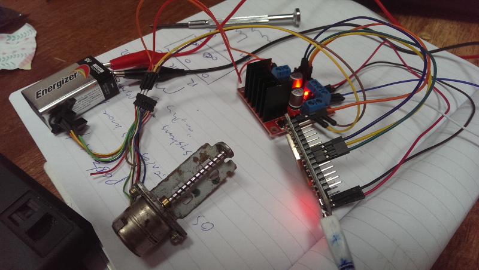

> **note**
>
> For updates, see the
>
> [Flobot Project Page](http://flobot.mnemote.com/)

I've [talked about my experiences with
mBot](../mbot-nodebot-blockly-arduino/) already, and
concluded the idea is good but the implementation is a little clumsy for
the primary classroom. Which is a pity, because the little robots are
immediately fascinating to very young kids.

To summarize, the things I think are great are:

-   The graphical, syntax-error free nature of Scratch
-   The simple joy kids get from the little tiny robots
-   The immediate feedback you can get from debugging live.

The things I don't like much are:

-   Installing software on PCs
-   Having a separate compile / upload step
-   Lack of clarity around hardware configuration

Dataflow Languages
==================

One of the harder things to explain to novice programmers is the concept
of variables.

If you ask a functional programmer, they'll explain that this is because
[immutability](https://en.wikipedia.org/wiki/Immutable_object) is the
natural way of things and variables are a historical accident). One way
to get around this is to move to a pure functional approach, but our
robots have to actually *do* something which means that we can't be
*entirely* pure and there's no way in the world I'm going to try to
explain
[monads](https://en.wikipedia.org/wiki/Monad_(functional_programming))
to primary school kids.

Additionally hardware and networking functions can be very slow,
requiring the programmer to think about asynchronous behaviours. For
example, the ultrasonic sonars used on a lot of robot kits take many
miliseconds to acquire a distance measurement.

So I think the way to go here is a [Dataflow /
Reactive](https://en.wikipedia.org/wiki/Reactive_programming) paradigm.
Sensors create data and actuators consume it, and the programmer hooks
up functions a flows between these to control the behaviour of the
robot.

Examples of thing kind of programming include
[Labview](http://www.ni.com/labview/) and
[Spreadsheet Formulae](/art/spreadsheets/) and while it
isn't a very common paradigm it is quite easy to explain and use.

You can also blame nostalgia for [Rocky's
Boots](https://en.wikipedia.org/wiki/Rocky%27s_Boots). This was an
amazing game for the Apple \]\[ and early PC, which taught kids like me
to construct simple binary logic circuits to solve puzzles in an
interactive maze. You can play online here thanks to the Internet
Archive:

-   [Rocky's Boots for Apple
    \]\[ (1982)](https://archive.org/details/a2_Rockys_Boots_1982_Learning_Company)
-   [Rocky's Boots for
    MS-DOS (1985)](https://archive.org/details/msdos_Rockys_Boots_1985)

Graphical Editor
================

The other worst thing to explain is syntax. Missing parens, misaligned
blocks, typos, semicolons, the lot. Sure, as programmers we get used to
it but the great thing about Scratch is that that stuff isn't there to
scare kids off.

So what I'd like to do is set up a graphical editor for the dataflow
language.

HTML5 App
=========

But I don't want to have to install applications on the desktop, nor do
I want to get stuck with development for the many native platforms. So I
think the way to go here is HTML5.

Shock, horror! But think about it. The robot itself has only a very
simple CPU and runs the simplest of web servers, but the client you're
connecting to it with is many times more powerful (even if it is a
phone). If we make the client do all the hard work, we can simplify the
microcontroller code as far as possible.

On-board Web Server
===================

So: The microcontroller runs a web server and `GET /` serves up a page
which is, to it, just a binary blob. That page includes an HTML5 app
(loading assets and libraries from the Internet if necessary) which lets
a user graphically edit a program.

As the user changes the program, the changes are `POST` ed to the
microcontroller, which updates its list of instructions on the fly.

Data
====

In the long run, I'd like to support complex types with units, such that
the units matter and you can't plug a degrees C output into a `mA`
input. But for the moment, I'll probably just make everything a 16-bit
signed int or maybe shift it down by a factor of 100 so there's a couple
of decimal digits to play with. The ESP8266 has some software
floating-point support too.

Constants would also be defined and could be changed to alter behaviour.

Operators
=========

Obviously the program has to do more than just move numbers around.
Builtin operators would include adding, multiplying, dividing,
thresholding and sigma-curving numbers, but also time-varying operations
such as differentiating, integrating and slew limiting need to be
supported. This means the operator functions need a "time since last
update" input.

Compiling Code
==============

The code editor wouldn't be a text file editor even by proxy. The flobot
language would be a datastructure serializable to JSON, but edited
directly in memory. The app could use the [HTML5 File
API](https://developer.mozilla.org/en/docs/Web/API/File) and/or the [git
HTTP API](https://git-scm.com/docs/git-http-backend) to load and save
source files.

The symbolic code is likely to be relatively verbose, and so rather than
interpreting it directly it should be compiled down to a bytecode for
execution on the MCU. This can be done in the HTML5 app. While it seems
like a big ask to write a compiler in HTML5, remember that the source
doesn't need parsing as it is already a big datastructure, and the
output is a bytecode rather than native code.

There's a bit of an open question here about how big the transformation
should be ... do I just squish the dataflow graph into a compact binary
form and do more work on the microcontroller end, or do we generate
actual ESP8266 binary, or generate a bytecode somewhere in between? I
suspect the only way to get a feel for what will work is to try it.

One interesting aspect is that each "port" is set from exactly one
"instruction", and so we can just have a long list of instructions each
of which always writes to its corresponding port. In the longer run, I'd
like to propagate changes through the graph, but for the moment just
interating over all nodes will do.

Platform
========

By keeping the requirements on the MCU very low, something like the
[ESP8266](http://www.esp8266.com/) could be used. The ESP8266 firmware
understands WPS and DHCP and then the robot could register its address
so it can be looked up and contacted directly on the network.

When the user navigates to the address of the robot, a simple
"index.html" static page loads the HTML5 app code (perhaps from the
Internet if the flash is a bit small), and a simple REST-ish API lets
the app upload and debug code on the MCU. The current value of each
"port" in the dataflow can be retrieved and displayed in real time on
the app, making for easy debugging, and as connections and parameters
change in the app they can be immediately changed on the MCU giving kids
great feedback.

Device Discovery
================

If all the required libraries and assets can be squeezed into the
device's flash memory, then a user can connect to the device with the
ESP8266 acting as an AP. No other infrastructure is needed.

But the ESP8266 can also join an existing network, and in a classroom
situation this might work better. In this case, though, how do we find
the IP addresses for the devices? With a bit of luck DHCP will take care
of mapping hostnames to each device, but if not we can use a third party
registry like DynDNS or equivalent.

Work in Progress
================

This project is a work in progress. The first step is to try and get the
HTML5 GUI up and running, and while I'm doing that I'll get hold of some
ESP8266 modules on Ebay and try and get a handle on programming them.

There's now a [FloBot project](https://github.com/mnemote/flobot) on
Github with some very minimal code in it, just me messing around with
how to write a standalone GUI for now. I'm a bit torn between trying to
do this with lots of floating `div` s or building the whole thing as
SVG. Either will work, its just a matter of working out which is more
elegant ...

UPDATES
=======

I've started playing with the HTML5 GUI ...

<iframe width="100%" height="400px" src="./demo/index.html" style="border: 2px solid black;"></iframe>
... And [messing around with hardware](http://github.com/mnemote/ciril)
experimenting with stepper motors and drivers in
[NodeMCU](http://nodemcu.com/index_en.html):

