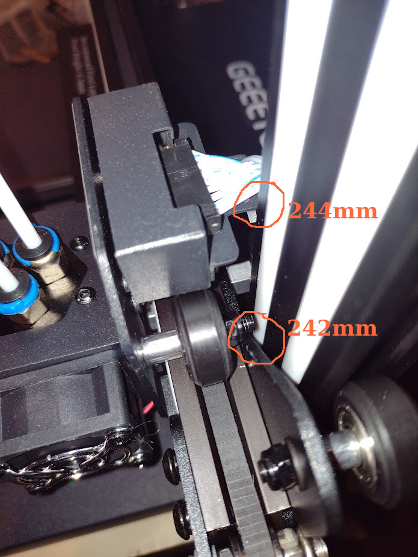
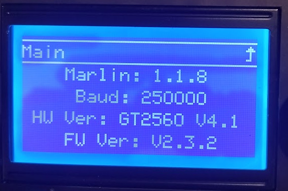
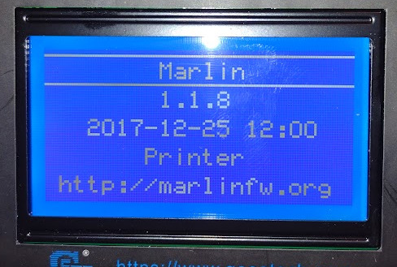

I've been [messing around with my cheap ALDI 3D printer](/art/aldi-coccoon-3d-printer/)
for almost five years now and it's time to upgrade!

I've just received my shiny new
[Geeetech A20T](https://www.geeetech.com/geeetech-a20t-triple-color-mixing-filament-detector-breakingresuming-250x250x250mm-p-1108.html)
which has about 12× the build volume of the old printer,
and has one extruder with three filaments feeding into it, letting
it print designs in multiple materials and/or colours.

This article is about setting the printer up and getting it working.
I've written a separate article with all the technical details of
[Multi-Material 3D Printing with OpenSCAD, Cura and the Geeetech A20T](/art/multi-material-3d-printing-openscad-cura-geeetech/)
which might be interesting if you're specifically into
[OpenSCAD](https://openscad.org/) and
[Cura](https://ultimaker.com/software/ultimaker-cura/)
but otherwise not so much.

## Reviews, etc

On Youtube, there's a
[Geeetech A10M review at Teaching Tech](https://www.youtube.com/watch?v=AbZhNvMM4Os)
and [six Geeetech A10M upgrades at Teaching Tech](https://www.youtube.com/watch?v=8o--HmfZ57I)
which give you some idea of how these printers work and whether
they'll be right for you.

The [A20T User Manual](https://www.geeetech.com/download.html?version_id=428)
gives you a pretty good idea of what you're getting
yourself into.

## The Out-Of-Box Experience

It's a winner so far.  Everything is in the box, and the 
instructions are fairly good.  Admittedly, the box arrived 
upside-down, eg: with the shipping label on the opposite end
to the "this way up" end, but the courier were going to do
that anyway.  It's very well packed into it's box
and doesn't appear to have been harmed.

The instruction booklet is fairly good, there's a couple of
steps in the instructions which aren't necessary as they're
already done for you
(Y-axis wires were already plugged in, and the little
bracket on the back of the print head already installed)

There's a few spare screws, a couple of spare nozzles,
various cleaning tools, replacement feeder tubes.
And a little MicroSD card which turns out to have more
documentation on board, and a USB adapator in case you
don't have one.

**At the very end of the instruction book is a warning to
check that the power supply is correctly set to 110V/240V.**
This is pretty easy to miss even if you read all the 
English instruction section before starting.
It's a lot more obvious in the PDF manual than the 
printed one which comes in the box.
Putting the traditional warning sticker over the
power inlet would be a nice touch.

## Assembly

The only tricky bit really is attaching the gantry to
the body.  The easiest way seems to be to hang the body
over the edge of a table so you can get to the screw 
from underneath while the gantry is in position.
A spare pair of hands might be nice.

The tools in the box are mostly okay with the exception 
of the 4mm Allen key which you need to attach the 
gantry to the body.  It's too small to get a decent torque
on those screws.  But like me you probably have a few 4mm
allen keys laying around. 

I do wish they'd mentioned to attach the mylar bed before
assembling the gantry to the printer body, that would have
made it easier to line up.  The mylar bed was well hidden
in the packaging.  I'd not realized this is just a fixed
stick-on platform rather than a removable magnetic one.
I might have to go back and buy the magnetic one now.

Also, before cable-tieing the wiring loom into place its 
a good idea to gently move the print head to its furthest
position so you can judge where the cables will sit.

All up it took about an hour from the courier arriving to 
powering the printer up for the first time.

## Loading

Two of the three feeders are *really* hard to load 
filament into.  Once you get the filament past the 
roller, it seems to hit a little restriction in there
somewhere and get hung up on it.  The third one doesn't
seem to do this so perhaps I should pull one apart
and have a look at what's going on.

## Appearance

There's a couple of "untidy" things about this printer,
for example the front end of the Y axis belt is out
in the open air and the Y axis end stop is exposed too.
It's no big deal it just looks a little messy.
I might print little covers for them.

The wiring looms are well protected in woven sleeves but 
they look quite messy too.

## Printing Dimensions

When homed, the X axis is at -10mm, and moves cleanly to
+242mm before one of the print carriage screws
fouls on the right hand gantry and the stepper cogs.
This is no big deal but
will cause layer misalignment so the software really
should know about this.  You can flip the screw around but
then the print carriage cable bracket fouls on the gantry
at +244mm.


*X-axis interference*

The Y axis homes at -5mm and moves to +250mm before software
stops it, so that's nice.

The Z axis homes to 0 and moves to +249mm before the print
head cable fouls on the gantry. This could probably be 
adjusted out by pulling the Z stop microswitch
and the print bed down a tiny bit.

## Machine Dimensions

The specifications list the dimensions of the
printer as
`442x447x480 mm`
which isn't quite correct. You'll need to
have a work top at least 500mm deep to allow the 
print bed to go all the way back with the front
feet still on the table, and when fully forward
the print bed will stick out a further ~75mm past
that.

You'll need at least 480mm width, and a bit more if you
want to access the SD card slot on the right side, and
there isn't much room for the USB cable either.

And the printer itself is about 520mm tall, but you'll
need about 600mm to be able to load filament into the 
feeders.

So overall, probably 600x600x600 mm would be an 
appropriate amount of space to allow.
This stuff is important to get correct if you're
installing a shelf or cabinet for the printer.

## Firmware


*Hardware Info Screen*

As packaged, the printer was loaded with
[Marlin](https://marlinfw.org/) 1.1.8
(2017-12-25) and no support for the 3DTouch sensor.


*Firmware Version as supplied*

I grabbed the upgraded firmware from
[the geeetech site](https://www.geeetech.com/download.html?download_id=45) but really, it's prety annoying to ship a product
with 5 year old firmware which the user then has to upgrade
just to fully use your product!

There's various instructions I found online which use Arduino or 
Visual Studio to upload the firmware, but you really only need
to use `avrdude`:

[avrdude option desciptions](https://www.nongnu.org/avrdude/user-manual/avrdude_3.html#Option-Descriptions)

```
avrdude -P /dev/ttyUSB0 -p m2560 -c wiring -D -U flash:w:GT2560_A20T_HW4.1B_FW2.3.2__20210330.hex:i
```

After this upgrade ... well, it's still Marlin 1.1.8 but at least its 
a more recent build, and the 3DTouch menu is present now.


*Upgraded Firmware Version*

At some point I might have to look into upgrading to a more recent Marlin 2.x.

## Noise

The print head cooling fan is really quite noisy.

According to the 
[Schematic](https://www.geeetech.com/download.html?version_id=457)
there's PWM on multiple fans, but only the print cooling fan seems
to respond to commands.  Which is annoying.

[M112](https://marlinfw.org/docs/gcode/M112.html) shuts the printer
firmware down but doesn't turn off the fans. Properly shutting the 
machine down remotely will still require a mains relay I suppose.

## Front Panel UI

The display is big and bright and the click-and-turn input device is the
same kind of thing the Aldi printer has, but without its annoying habit 
of shifting just as you click.  You can't actually see the display when 
the bed is fully forward though.  I don't expect to be using this much 
as I mostly drive the printer through [Octoprint](https://octoprint.org/).

## Automatic Bed Levelling

Along with the printer I ordered a 
[Geeetech 3D Touch v3.2 Auto Leveling Sensor](https://www.geeetech.com/geeetech-3d-touch-v32-auto-leveling-sensor-p-1010.html)
This is pretty fiddly to install and not supported by the firmware out of the box
so trying it out had to wait until I got the firmware installed (see above).

It's a pretty simple device: there's a little linear servo which slides a pin
in and out over a range of about 6mm.
It sends back a signal to say if the tip is touching the build plate.
Once it's installed and configured it replaces the functionality of the
Z-axis end stop switch, which you can remove.

So that lets it measure the build plate distance accurately.
You then set it up so that the correct nozzle clearance (0.3mm or so) 
is when the fully-retracted sensor is about half way (3mm or so).
There's a parameter in the firmware which sets that exact value,
so you can home the printer, lower Z to 0 and check the clearance,
tweak the Z offset value and repeat until you get it spot on.

1. Level the bed as well as possible using the supplied slip of paper and the bed
   thumbwheels, etc.

2. Adjust the 3D Touch sensor until it's 2-4mm off the build plate.
   About 3mm is ideal but don't sweat it.

3. Unplug the Z-axis limit switch, plug in the 3D Touch sensor, activate 3D Touch in firmware.

4. Home the printer, lower the Z axis and then adjust the 3D Touch offset to get the
   offset correct.  Repeat until it's accurate.

## Filament Runout Detection

The printer came with three filament runout detection sensors.
In videos I've watched these little switches have seemed like they're 
[pretty wobbly](https://www.xiaomitoday.com/2018/10/11/geeetech-a20m-review/#Filament_runout_detector)
but on this printer they bolt securely into place and the
wiring loom is already ready for them to plug in.  The firmware supports
them out of the box too, although you have to go into a settings
menu to enable them.

**TO BE CONTINUED: First Boats!**
