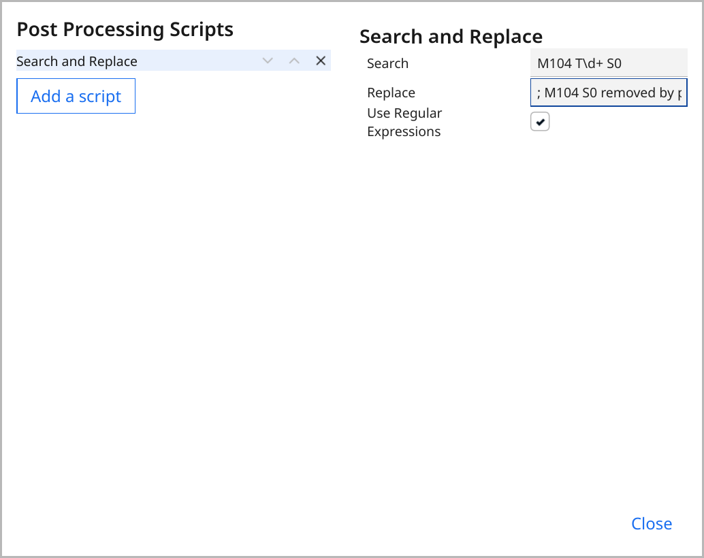
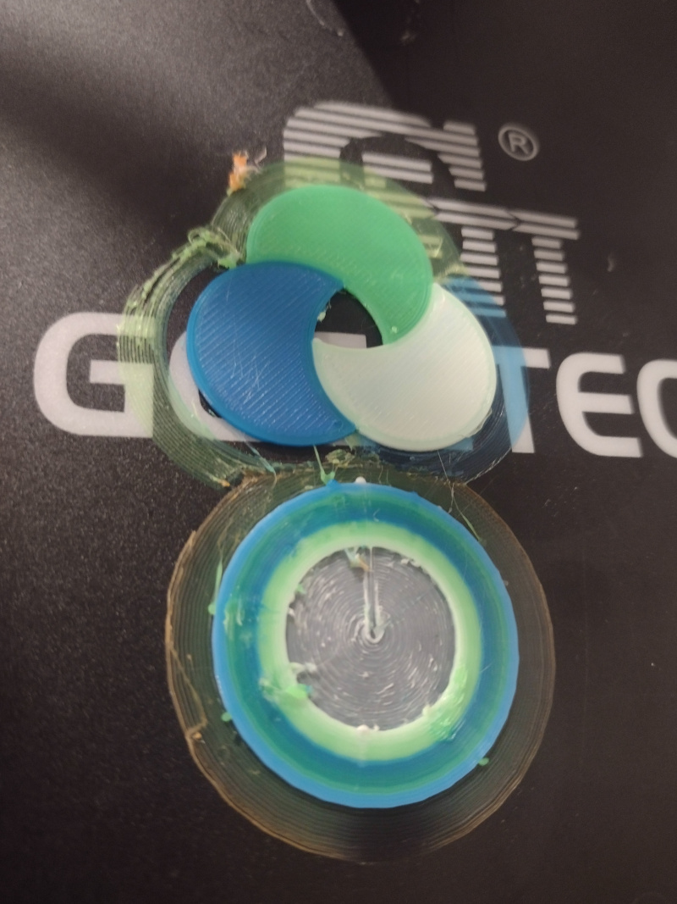

I've written about [Assembly and configuration of the Geeetech A20T 3D printer](/art/geeetech-a20t-assembly-and-configuration/) and also [Multi-Material 3D Printing With OpenSCAD, Cura and the Geeetech A20T](/art/multi-material-3d-printing-openscad-cura-geeetech/) 
and now it's time to actually print something!

## Straight out of the box

The SD card which came with the printer contains a couple of G-Code files
which I assume are tuned up for the printer.

### `A10TA20Tcube_colored.gco`

This is just a cube which is a solid color, a mix
of all three extruders.  There's no metadata but
there's only one color change command in there:

```
M163 S0 P0.2
M163 S1 P0.3
M163 S2 P0.5
M164 S0
```

It's weird that this doesn't include any tool
changes at all?  To demo printers which are all
about filament changes? 

### `A20T-cat.gco`

This is a cat with a color gradient.  Headers
indicate that it was generated with Simplify3D
and maybe give us a good start on dialling in 
decent settings for Cura:

```
 G-Code generated by Simplify3D(R) Version 4.0.1
; Apr 20, 2019 at 3:15:11 PM
; Settings Summary
;   processName,Process1
;   applyToModels,cat
;   profileName,Default (modified)
;   profileVersion,2017-03-01 08:00:00
;   baseProfile,
;   printMaterial,PLA
;   printQuality,High
;   printExtruders,
;   extruderName,Primary Extruder
;   extruderToolheadNumber,0
;   extruderDiameter,0.4
;   extruderAutoWidth,0
;   extruderWidth,0.4
;   extrusionMultiplier,1
;   extruderUseRetract,1
;   extruderRetractionDistance,10
;   extruderExtraRestartDistance,0
;   extruderRetractionZLift,0.3
;   extruderRetractionSpeed,6000
```
(etc)

Hopefully we can also learn something from the G-Code.

The color gradient is done by setting the 
extruder proportions for every layer rather than
by using the `M166` command which isn't
supported in Marlin 1.1.x.

Let's try printing it ...


*A20-T-cat.gco ... well, the first bit, anyway*

I stopped it after the first little bit because I don't
really need a plastic cat right now, lucky or otherwise.
You can see how it blends colours as the layers change,
which is nice.

But this is a really easy model.  There's no travel or
retraction needed, no infill, the colour changes are slight
and there's no attempt to flush the nozzle between colours,
it's not really pushing what the printer can do.

All in all, an odd choice for a test print.  There's some
other files on the SD card in STL format, but those need
to be sliced to print ...

## Setting up a Cura Profile

I've started off using the
[Ultimaker Cura](https://ultimaker.com/software/ultimaker-cura/) 5.4.0
built-in profile for this printer.

### First Boats

I tried printing off a [Benchy](https://www.thingiverse.com/thing:763622)
using three PLA filaments: blue for the main hull, orange for the trim and white
for the infill.  I just used the default profile which ships with Cura for this.


*Not a very successful Benchy*

It didn't work at all well.  The boat is a mass of ooze, the colours are 
all jumbled up, and the colour change tower hit the nozzle, broke off the
build plate and then jammed between the boat and the print cooling fan, 
causing the Y motor to skip and misalign.  I stopped it not long thereafter.

Clearly some work needs to be done.  It looks like the temperature is 
far too high, with liquid blobs all over the place, and also the
retraction is far too short and/or too fast ... it is a mess of 
spiderwebs.  Also the support has bonded far too strongly to the print
and is impossible to remove.

### Simpler Tests

Okay, so Benchy is maybe not a great place to start.  Lets do something
a lot simpler: three circles, one per extruder.


*Test print: three circles*

This *worked*, so that's something.  There's a few issues:

* Lousy adhesion: this might have been because I set the bed to cool down 
  after the first layer and it cooled down quite quickly.
* [extruder heater turning off too early](https://github.com/Ultimaker/Cura/issues/2918)
  This has been an issue for a long time so I think Cura aren't going to fix it.
  It can be avoided with a post-processing step or, as they note, it could be fixed
  in Marlin.
* There's some mixing of colours around the edges, which are the first things to
  print in each layer.  Because they're generally the skin layers, this is particularly
  bad, since they're the most visible.
* There's a bit of oozing before the print even starts, you can see the remnants
  in that little orange blob.

Interestingly, the blue one (Extruder 2 == Tool 1) looks pretty good whereas the
orange one has a lot of blue on the outside and the white one gets a fair bit of
orange.  Could this be down to the individual filaments?

Or is it the order in which the elements are printed?
Looking at the G-Code, it doesn't print like:

```
Layer 0: Segment 1, Segment 2, Segment3
Layer 1: Segment 1, Segment 2, Segment3
Layer 2: Segment 1, Segment 2, Segment3
```

It does:

```
Layer 0: Segment 1, Segment 2, Segment3
Layer 1: Segment 3, Segment 2, Segment1
Layer 2: Segment 1, Segment 2, Segment3
```

Which makes sense: that's fewer tool changes and therefore
less waste.  But it also makes the operations less consistent
between alternating layers.  It should probably be a "Dual Extrusion" option in Cura.

### Post Processing

Cura includes a bunch of options for post-processing G-Code, but 
the simplest one has to be the "Search and Replace" which literally
just does a regex match and replace on your G-Code output.  To solve
the problem of the heaters getting turned off early, you can set up:

* Search: `M104 (T\d+) S0`
* Replace: `; M104 \1 S0 removed in post-processing`
* Use Regular Expressions: Yes

The first line looks for `M104` followed by `T`-and-any-number-of-digits followed by `S0`.
These are only issued in this particular situation. 
Cura also issues a `M104 S0` (with no `T`) at the very end to turn all
the heaters off.

The second line replaces that with a comment, letting you know what was removed.
The `\1` is substituted with the bit which matched `(T\d+)`.

The third line lets the search and replace know you want to use those trickier
options rather than just matching plain text.
See also [Python re.sub](https://docs.python.org/3/library/re.html#re.sub)
for more information.


*Screenshot of the Post-Processing Search-and-Replace Rule*

The result: Cura's commands which normally turn the heaters off too early
get replaced with harmless comments.

UPDATE: The slicer issues a bunch of other 'standby temperature' commands
which aren't helpful either.  I've changed my post processing to 

* Search: `M104 (T\d+) (S\d+)`
* Replace: `; M104 \1 \2 remove in post-processing`
* Use Regular Expresions: Yes

### More Circles

Okay, so lets change some stuff:

* Increase bed temperature & leave it at 60⁰C.
* Add a 5mm brim to prevent lifting
* Add the post-process to remove `M104 Tn S0`.
* Increase Prime Tower Size to 35mm and Prime Tower Minimum Volume
  from 6mm³ to 30mm³ (surely overkill, but ...)
* Slow Nozzle Switch Retraction Speed to 10mm/s
* Make the circles smaller (we don't need that much plastic to show
  the bleed between colours)


*Test print: three smaller circles*

Okay, well, the overkill worked.  There's three little circles, with very
little bleed between them.  A pretty wasteful process, but now we
know it works we can gradually
reduce the prime tower volume and get a better idea of how much is required.

Trying again with smaller numbers revealed two things: firstly, 15mm³ per
tool change is not enough to flush the nozzle and secondly a 20mm prime tower is not big
enough to hold 45mm³ per layer, which should be kind of mathematically obvious
but I didn't think of it.

Cura doesn't notice this and just makes a little poop emoji of molten filament
which screws the print head up.  This would be a good quick fix for Cura: just
quickly check that:

```
π r² h > k v n

r = prime tower size / 2
h = layer height
k = fudge factor, perhaps about 1.5
v = prime tower minimum volume
n = maximum number of tool changes in a layer
```

So I'm going back up to a 35mm tower and a 30mm³ dump, even though it looks
ridiculous.

### Ooooooooze

### Keyrings

### Benchy Revisited


## EXTRA STUFF

Other stuff I'll come back to later:

### Adhesion

The parts generally are very well attached to the bed, so after the print
finishes I've been heating the bed up to 80⁰C and then letting it cool
to room temperature.  That seems to help to loosen the print a bit.
I wonder if I could add an under-bed cooling
fan to get it to cool down a bit quicker in the hopes of having parts just
"pop off"?

It's either that or buy a magnetic bed like my cheapy printer has, that 
makes removal a lot easier plus you can use glue stick if you're having
trouble getting stuff to stick.

### Mixing

I'm beginning to think I'd be better off with a
[Reprap Diamond](https://reprap.org/wiki/Diamond_Hotend) style 
printhead which looks like it has a much smaller internal "mixed" volume,
or maybe just give up and go with 
[three separate nozzles](https://www.aliexpress.com/item/32887495430.html)
after all.

Altering the printer so radically might sound a bit crazy but it'd
actually be a fairly simple upgrade I think, so long as you don't mind
having the three nozzles share a heater and thermostat.

Of course, something in my tiny brain is telling me: if you can't decide
between 3 individual nozzles and one three-way mixing nozzle, perhaps you
need a two-way mixing nozzle plus another separate nozzle ... or two 
two-way mixing nozzles!  The possibilities are endless.
This way, clearly, lies madness.

### Another minor profile annoyance

Even before the individual printer start G-Code, Cura issues
these commands (comments mine):

```
M140 S60   ; set bed to 60, don't wait
M190 S60   ; wait for bed to reach 60
M104 S190  ; set nozzle to 190, don't wait
M109 S190  ; wait for nozzle to reach 190
```

... which is *very almost* what it should be doing to
heat everything up at once ... just swap the middle two
lines ...

```
M140 S60   ; set bed to 60, don't wait
M104 S190  ; set nozzle to 190, don't wait
M190 S60   ; wait for bed to reach 60
M109 S190  ; wait for nozzle to reach 190
```

It's a minor annoyance, but some of the other printer definitions
seem to get this correct?  It turns out that Cura
[looks for some magic in the startup G-code](https://github.com/Ultimaker/Cura/blob/0089b5e06cab4137a19943dc2f57197305f4e170/plugins/CuraEngineBackend/StartSliceJob.py#L473-L482),
specifically interpolations of `{material_bed_temperature}` and
`{material_print_temperature}`, and if they aren't present then it 
adds some of its own before the machine start gcode.
So if your startup code just uses a set value like `M109 S190` instead of 
`M109 S{material_print_temperature}` it won't detect it, and Cura will prepend
its own one.

### Saving to SD Card

It'd be nice to buffer the print from the PC to the printer, ideally
without having to mess around with OctoPrint.

the [M28 Start SD Write](https://marlinfw.org/docs/gcode/M028.html),
[M29 Stop SD Write](https://marlinfw.org/docs/gcode/M029.html), 
[M23 Select SD File](https://marlinfw.org/docs/gcode/M023.html) and
[M24 Start or Resume SD print](https://marlinfw.org/docs/gcode/M024.html)
commands should make this possible by wrapping the g-code in something
like:

```
M28 buffer.gco
; rest of the g-code goes here
M29
M23 buffer.gco
M24
```
