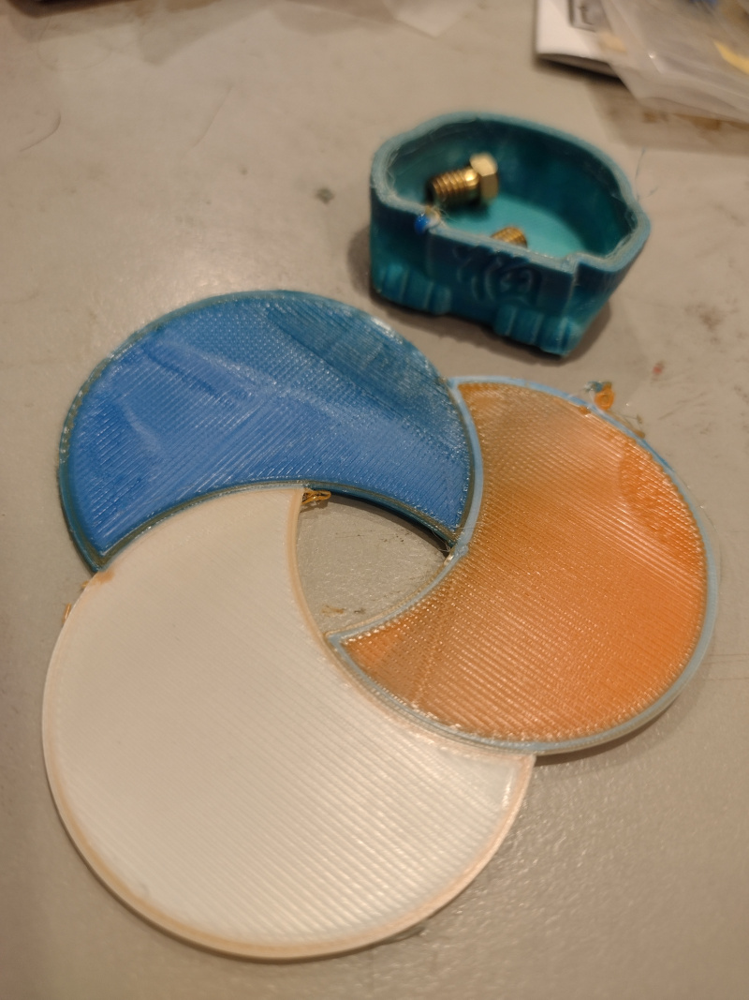

I've written about [Assembly and configuration of the Geeetech A20T 3D printer](/art/geeetech-a20t-assembly-and-configuration/) and also [Multi-Material 3D Printing With OpenSCAD, Cura and the Geeetech A20T](/art/multi-material-3d-printing-openscad-cura-geeetech/) 
and now it's time to actually print something!

## Straight out of the box

The SD card which came with the printer contains a couple of G-Code files
which I assume are tuned up for the printer.

**`A10TA20Tcube_colored.gco`**

This is just a cube which is a solid color, a mix
of all three extruders.  There's no metadata but
there's only one color change command in there:

```
M163 S0 P0.2
M163 S1 P0.3
M163 S2 P0.5
M164 S0
```

It's weird that this doesn't include any tool
changes at all?  To demo printers which are all
about filament changes? 

**`A20T-cat.gco`**

This is a cat with a color gradient.  Headers
indicate that it was generated with Simplify3D
and maybe give us a good start on dialling in 
decent settings for Cura:

```
 G-Code generated by Simplify3D(R) Version 4.0.1
; Apr 20, 2019 at 3:15:11 PM
; Settings Summary
;   processName,Process1
;   applyToModels,cat
;   profileName,Default (modified)
;   profileVersion,2017-03-01 08:00:00
;   baseProfile,
;   printMaterial,PLA
;   printQuality,High
;   printExtruders,
;   extruderName,Primary Extruder
;   extruderToolheadNumber,0
;   extruderDiameter,0.4
;   extruderAutoWidth,0
;   extruderWidth,0.4
;   extrusionMultiplier,1
;   extruderUseRetract,1
;   extruderRetractionDistance,10
;   extruderExtraRestartDistance,0
;   extruderRetractionZLift,0.3
;   extruderRetractionSpeed,6000
```
(etc)

Hopefully we can also learn something from the G-Code.

The color gradient is done by setting the 
extruder proportions for every layer rather than
by using the `M166` command which isn't
supported in Marlin 1.1.x.

Let's try printing it ...


*A20-T-cat.gco ... well, the first bit, anyway*

I stopped it after the first little bit because I don't
really need a plastic cat right now, lucky or otherwise.
You can see how it blends colours as the layers change,
which is nice.

But this is a really easy model.  There's no travel or
retraction needed, no infill, the colour changes are slight
and there's no attempt to flush the nozzle between colours,
it's not really pushing what the printer can do.

All in all, an odd choice for a test print.  There's some
other files on the SD card in STL format, but those need
to be sliced to print ...

## Setting up a Cura Profile

I've started off using the
[Ultimaker Cura](https://ultimaker.com/software/ultimaker-cura/) 5.4.0
built-in profile for this printer.

### First Boats

I tried printing off a [Benchy](https://www.thingiverse.com/thing:763622)
using three PLA filaments: blue for the main hull, orange for the trim and white
for the infill.  I just used the default profile which ships with Cura for this.


*Not a very successful Benchy*

It didn't work at all well.  The boat is a mass of ooze, the colours are 
all jumbled up, and the colour change tower hit the nozzle, broke off the
build plate and then jammed between the boat and the print cooling fan, 
causing the Y motor to skip and misalign.  I stopped it not long thereafter.

Clearly some work needs to be done.  It looks like the temperature is 
far too high, with liquid blobs all over the place, and also the
retraction is far too short and/or too fast ... it is a mess of 
spiderwebs.  Also the support has bonded far too strongly to the print
and is impossible to remove.

### Simpler Tests

Okay, so Benchy is maybe not a great place to start.  Lets do something
a lot simpler: three circles, one per extruder.


*Test print: three circles*

This *worked*, so that's something.  There's a few issues:

* Lousy adhesion: this might have been because I set the bed to cool down 
  after the first layer and it cooled down quite quickly.
* [extruder heater turning off too early](https://github.com/Ultimaker/Cura/issues/2918)
  This has been an issue for a long time so I think Cura aren't going to fix it.
  It can be avoided with a post-processing step or, as they note, it could be fixed
  in Marlin.
* There's some mixing of colours around the edges, which are the first things to
  print in each layer.  Because they're generally the skin layers, this is particularly
  bad, since they're the most visible.
* There's a bit of oozing before the print even starts, you can see the remnants
  in that little orange blob.

Interestingly, the blue one (Extruder 2 == Tool 1) looks pretty good whereas the
orange one has a lot of blue on the outside and the white one gets a fair bit of
orange.  Could this be down to the individual filaments?

### Mixing

I'm beginning to think I'd be better off with a
[Reprap Diamond](https://reprap.org/wiki/Diamond_Hotend) style 
printhead which looks like it has a much smaller internal "mixed" volume,
or maybe just give up and go with 
[three separate nozzles](https://www.aliexpress.com/item/32887495430.html)
after all.

Altering the printer so radically might sound a bit crazy but it'd
actually be a fairly simple upgrade I think, so long as you don't mind
having the three nozzles share a heater and thermostat.

Of course, something in my tiny brain is telling me: if you can't decide
between 3 individual nozzles and one three-way mixing nozzle, perhaps you
need a two-way mixing nozzle plus another separate nozzle ...
this way, clearly, lies madness.

