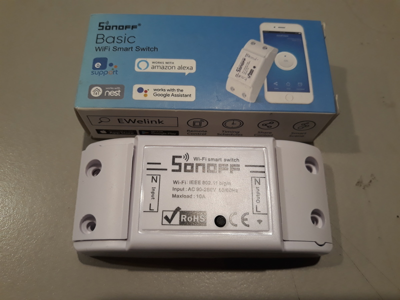

In addition to [the Espressif meshkit button](/art/esp32-meshkit-button-micropython)
I have some other cool hardware on the workbench at the moment ...

## Metro M4 Express & Feather nRF52840

*Adafruit Metro M4 Express and Feather nRF52840 Express*

The [Metro M4 Express](https://www.adafruit.com/product/3382)
is a nice development board with an Arduino-compatible footprint but a lot faster CPU.  

The [Feather nRF52840 Express](https://www.adafruit.com/product/4062) is a nifty little unit with a nRF42840 on board with good
Bluetooth support. I'm working on [touchio support](https://github.com/adafruit/circuitpython/issues/1048)
for this board at the moment.

## Air602

*Air602 dev board and module*

Could the [Air602](https://www.seeedstudio.com/Air602-WiFi-Module-p-3139.html) be the successor to the [ESP8266](/tag/esp8266/)?  It's even smaller and looks quite capable, packaging a 
[W600](http://www.winnermicro.com/en/html/1/156/158/497.html) SoC plus some support
circuitry on a neat little castellated 12-pin module.

The "dev board" is just the Air602 module plus a USB serial converter, voltage
regulator, reset button and PCB antenna.  Yes, yet another microcontroller whose interface
to the world is a serial port!

The Air602 could be quite handy as a "wifi coprocessor" at the very least ... no MicroPython
yet but it's not impossible!  With a Cortex M3 at 80MHz and 288kB RAM it's in the same
ballpark as the '66.

There's an [Air602 SDK compatible with GCC](https://yoursunny.com/t/2018/Air602-blink/)
and a [Air602 Forum at Seeed](https://forum.seeedstudio.com/viewforum.php?f=106&sid=1152bf0b77e4b5248367936ebb01c1ba) ... the real challenge is going to be finding documentation.

## ESP32 + LoraWAN

*ESP32 with Lorawan*

This is a neat little board integrating an [ESP32](/tag/esp32/) and a
[SX1276 LoRa transceiver](https://www.semtech.com/products/wireless-rf/lora-transceivers/sx1276) 
which I bought from [Ebay](https://www.ebay.com.au/sch/i.html?_nkw=esp32+sx1276).

Quite a few people have put work into [MicroPython drivers for SX1276](https://www.google.com/search?client=ubuntu&channel=fs&q=micropython+sx1276)
and I hope to get this into mainstream MicroPython at some point ...

## Sipeed MAIX

*Sipeed MAIX*

An cheap and interesting [RISC-V](https://riscv.org/) with addition "neural network coprocessor".

* [Sipeed MAIX github repo](https://github.com/sipeed/MaixPy)
* [Sipeed MAIX at Indiegogo](https://www.indiegogo.com/projects/sipeed-maix-the-world-first-risc-v-64-ai-module#/)

*Sipeed MAIX Display*

The [Sipeed MAIX MicroPython Fork (MaixPy)](https://github.com/sipeed/MaixPy) came preloaded on
the device, and you can connect to it with the usual 115200/N/8/1 serial port settings.
I got as far as taking a photo with the supplied camera and displaying it on the supplied
screen.  Pretty cool!

## Sonoff Basic & S20

*Sonoff Basic*

These are neat little mains-powered switches which embed an [ESP8266](/tag/esp8266/) and
[can easily be reflashed to run MicroPython](https://medium.com/cloud4rpi/getting-micropython-on-a-sonoff-smart-switch-1df6c071720a).

[Sonoff S20 schematics](https://www.itead.cc/wiki/S20_Smart_Socket) are available which makes these
a great choice if you're considering switching mains from a hobbyist project and
[don't want to get locked into someone else's IoT solution](/art/the-internet-of-not-shit-things/).

## TinyFPGA BX

*TinyFPGA BX*

Suitable for running [FuPy](https://nick.zoic.org/art/fupy-micropython-for-fpga/), I've soldered 
headers all over this one, and now I need to get back to it and try to actually make some progress
on understanding FPGAs!

UPDATE: I'm [playing with FPGAs again ...](https://github.com/nickzoic/migen-gigatron/)

## Espruino Pico

*Espruino Pico*

Just to prove that MicroPython isn't the *only* high level language I'm interested in for
microcontrollers ... the [Espruino Pico](http://www.espruino.com/Pico) embeds Javascript instead,
on an ARM Cortex M4.  There's a lot of things I really like about Javascript's event-driven 
model for microcontroller programming so I reckon this is worth a look.

