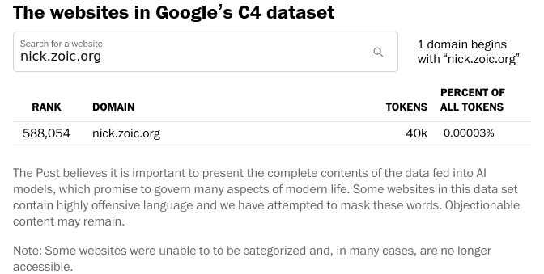

The [Washington Post](https://www.washingtonpost.com/technology/interactive/2023/ai-chatbot-learning/#lookup-table)
just ran an article about Large Language Models which investigated the sources of
Google's ["C4"](https://www.tensorflow.org/datasets/catalog/c4) dataset and included a little tool to look them up, so naturally the
first thing I checked out was ... me.

*The websites in Google's C4 dataset: Rank 588,054 Domain nick.zoic.org Tokens 40k*

Pretty weird.  Now I've currently got CCBot disallowed in [robots.txt](/robots.txt)
but this was relatively recent so I'm just assuming they scraped everything before
that.

UPDATE: Interestingly, if you look at the requests that the page is sending,
it appears to use
[a technique for making static content appear dynamic](/art/static-jquery-dynamic/) 
which I discussed on here a few years back: for each three-letter prefix, 
there's a static files like
`/technology/interactive/2023/ai-chatbot-learning/lookup/$PREFIX.csv` 
which gets loaded and parsed in Javascript, and then Javascipt does the
rest of the filtering before presenting the data to the user.
