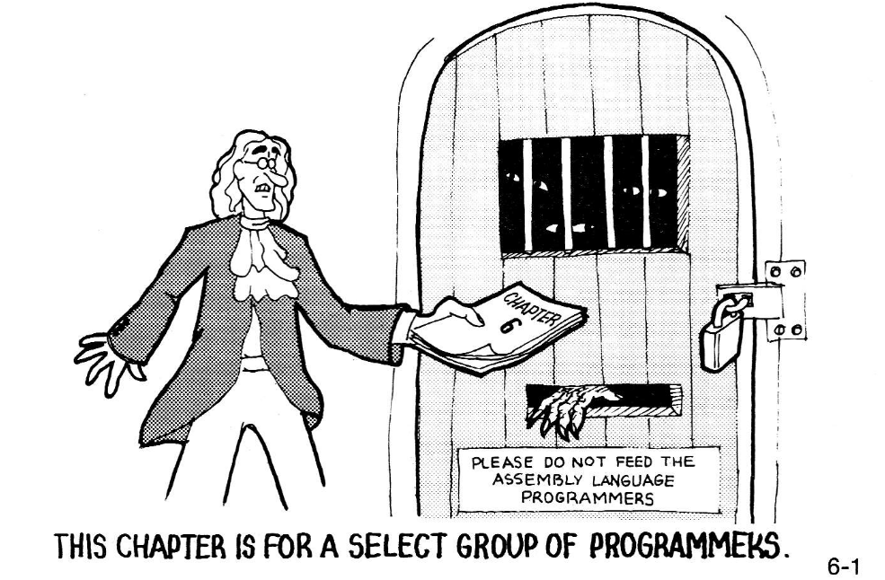

*This is an approximate script for my talk
at [EveryWorld 2020](https://auc.edu.au/everyworld/about/),
with some notes and references and credits as well.*

**0m**

# Journey Onward
## The Apple \]\[ and me

G'day everyone at EveryWorld and welcome to "Journey Onward: 
the Apple 2 and me".

My name is Nick Moore, I'm a freelance software consultant from Melbourne.
I work mostly in Open Source Software.
This is the story of how I got interested in computers in the first place

[nick.zoic.org/journey](https://nick.zoic.org/journey/)

# Journey Onward
### the Apple 2 and me

## First Computers

**16s**

Some time in the mid 1980s, when I was just starting high school,
Dad brought home an Apple 2.

*Image: [mjbauer.biz](http://www.mjbauer.biz/DREAM6800.htm)*

It wasn't our household's first computer: that honour went to the 
"Dream 6800", a single-board computer based around the 6800
microprocessor, sporting 2K of RAM, an 18 key hexadecimal keypad and a
stunning 64x32 monochrome composite video output.

# XXX EA article

The plans were published in Electronics Australia, along
with instructions for assembling and programming the computer.
Dad built it into an old Samsonite briefcase using a keyboard
made of scavenged microswitches, with enough room
left over inside for a chunky cassette recorder used to save and
load files.

*Image: [Electronics Australia, July 1979 via mjbauer.biz](http://www.mjbauer.biz/DREAM6800.htm)*

Programs were published as long listings of hex digits which you
could type in and run. The extrememly limited resources meant that
these games generally took longer to type in than the did to play, and
while they could be saved to audio cassette, restoring them was
always a bit hit and miss.

*Image: [Electronics Australia, July 1979 via mjbauer.biz](http://www.mjbauer.biz/DREAM6800.htm)*

The only game I remember getting working was this
"UFO intercept" game, which was kind of like space invaders
if there were only two invaders and they never really
got around to invading.

**1m23s**

## System 80

*Image: [classic-computers.org.nz/system-80](https://www.classic-computers.org.nz/system-80/hardware_s80.htm)*

The Apple 2 wasn't even our first computer with a proper keyboard:
that was the "System 80", a Dick Smith clone of the RadioShack TRS-80 Model 1.
In addition to having an actual keyboard, it featured a built in
cassette player to load and save programs from audio cassettes.

Ah, [BASIC](https://www.classic-computers.org.nz/system-80/manuals.htm#basman),
and the first thrill of [programming](https://www.calormen.com/jsbasic/)

        10 PRINT "POOP"
        20 GOTO 10

I remember spending hours colouring in graph paper to design a game
for its unusual 6 pixels per character, mixed text and 128x48
graphics display.  Never completed and sadly
lost to time now, all I can really remember is it was a combination of
the only two arcade games I was really familiar with, Breakout
and Space Invaders, and it had something to do with bees.

The games are somewhat relevant to this story, the bees less so.

**2m13s**

### Apple 2

And then the Apple 2 arrived, and the System 80 was forgotten.

It was a cast-off, a cheap Apple 2 plus clone[^1], the last remaining stock
left over when a friend of Dad's decided to wind up his small import
business.  The case was built to the same moulded design as a real Apple 2 Plus
but the plastic was a little mottled and swirly and slightly yellowish,
and missing the beautiful rainbow Apple logo nameplate which would
otherwise have covered the ugly injection marks on the lid moulding.

*Image: [apple2history.org](https://apple2history.org/history/ah04/)*

The intellectual property laws around clones were somewhat vague at
the time, as I understand it: the circuits and physical design weren't
well protected but trademarks were. The only obvious indicator that this 
was a dastardly clone was that the cheery but trademark-protected
`APPLE ][` boot message was replaced with the slightly confusing
name ` GALAGA `.

**2m30s**

Interestingly, some software[^2] would actually check that these
bytes read `APPLE ][` ... this is similar to the "DSMOS" protection
used in OS X to this day ... but we wouldn't find this out until later
when we obtained another clone, this time an ` ORANGE `, and had to
work out how to re-flash the EPROM chips which held the boot firmware
so we could run ProDOS on it.

> * More on [Apple 2 Clones](https://en.wikipedia.org/wiki/Apple_II_series#Clones)
> * [ProDOS](https://en.wikipedia.org/wiki/Apple_ProDOS#Unlicensed_Apple_II_clones)

The Apple 2 was similarly specced to the System 80: a few KB of RAM,
a BASIC interpreter, output to composite video.  The Apple 2 graphics
were somewhat better, with 280x192 "high res" graphics and colour of sorts
(although ours was always plugged into a monochrome green phosphor monitor,
so that detail escaped me for many years).

**3m50s**

## Apple 2 Community

But the Apple came with something else which the previous machines
had not: an active community. There was no Internet on which to
find technical information, in those days, but in addition to 
the official Apple publications
there were third party books and magazine articles.

These included the surreal ramblings of the Beagle Brothers,
which were kind of the Principia Discordia of the Apple ecosystem,
full of dense, obscure examples and strange marginalia.

XXX pic of book

**4m20s**

A lot of this stuff is now available thanks to the
[Apple II Documentation Project](https://mirrors.apple2.org.za/Apple%20II%20Documentation%20Project/),
including the excellent *Beneath Apple DOS* which contains a huge
amount of information on how the hardware and software worked.

The Apple 2 was also *expandable*, with a huge number of Apple and 
third-party addons available to interface the machine to peripherals,
upgrade the monitor output to 80 columns or even provide a whole extra CPU
so it could run CP/M.

There was even a speech synthesizer card: SAM, the Software Automatic Mouth.

*Image: [applelogic.org](http://www.applelogic.org/files/MIDASONIChires.JPG)*

Simple accessories like joysticks were also available, and a whole ecosystem
sprang up around the Apple.

**5m04s**

*Image: Beneath Apple DOS, by Don Worth and Pieter Lechner*

## Games

Finally we were free of cassette tapes: this machine had a
Disk II controller and two 5.25" floppy drives.  Unlike 
cassettes, floppy disks could reliably store 140kB of data ...
they could even access multiple files without rewinding!
Disks opened up a whole new world of actually being able to
save stuff.

And disks we had.

In a dusty shoebox were a pile of 5.25" floppies, 
mostly single sided but with an extra notch cut into the side with
scissors. Thanks to the unusual "soft sector" design of the Apple
drives these
"[flippy disks](https://en.wikipedia.org/wiki/Disk_II#Disk_II)"
worked pretty well, most of the time.

**5m**

In the box were DOS master disks, some utilities and lots and
lots of games. 

> You can try Apple 2 software out in your browser using the excellent
> [apple2js](https://github.com/whscullin/apple2js), or by loading up 
> the Apple 2 ROMs into [MAME](https://mamedev.org/).

I have fond memories of very simple games like
[Moon Patrol](https://en.wikipedia.org/wiki/Moon_Patrol)
and Hard Hat Mac; also the infuriating text adventures like 
Hitch-hikers Guide to the Galaxy.

I also have very confusing memories of the oddly named
[The Bilestoad](https://en.wikipedia.org/wiki/The_Bilestoad)
by the even more oddly named Mangrove Earthshoe.  Two axe-wielding warriors,
or possibly crustacea, or maybe pastries, battle it out to the tune of
*Für Elise*, kind of.

**6m25s**

Another favourite was [Lode Runner](https://en.wikipedia.org/wiki/Lode_Runner),
a really simple platformer which showed how a simple mechanic could be used
to build a fantastically complicated game.  All you can do is run, climb, dig
and fall.  Collect all the gold and an exit ladder appears.  Don't get caught
and don't get stuck.

Out of these simple parts, hundreds of official levels
were created.  Plus the game included a level editor!

As you learned the tricks and techniques of the official levels,
you could try out your own ideas as well, and save them to disk.
You were no longer just *playing* the game, you were *changing* it,
challenging your understanding as a player and a designer simultaneously.

**6m30s**

> There was also [Rocky's Boots](https://en.wikipedia.org/wiki/Rocky%27s_Boots),
> a strange game which taught boolean logic:
> It helped inspire [Flobot](/art/flobot-graphical-dataflow-language-for-robots/).

# Ultima IV: Quest of the Avatar

But the undisputed champion of our Apple 2 games was
[Ultima IV: Quest of the Avatar](https://en.wikipedia.org/wiki/Ultima_IV:_Quest_of_the_Avatar),
which was not merely an ephemeral *game*, something you played for a few
minutes, before bedtime, but an *adventure*.  To conquer the game,
you had to explore, fight, and build up your resources.
You could even *save your progress* which wrote the state of the game
back to a floppy disk, so once you'd done your homework and fed
the dog you could select "Journey Onward" to continue your epic quest.

The game was so large it used *four* floppy sides, and much swapping of 
disks was required, with the game halting to demand a swap of disks whenever
your character entered a town, or left a town, or entered a dungeon,
or inevitably died in a dungeon.

You had to collect clues by talking to non-player characters in each
of the 16 castles, towns and villages scattered across the land.  Often a clue
would just be a hint about where to find some item, or who to ask for further
information, or perhaps the ingredients for a useful spell.
Some of these characters would be willing to join you in your quest, if
you've acted virtuously enough and build up enough experience, so you
could build up a small party of adventurers, very handy in battle.  

Of course, if things are going badly you can just choose not to save,
and reset the whole machine.  Software was a lot simpler back then.

The game was supposed to come with various materials and an
ingenious piece of copy protection: an instruction book and a cloth map.
These were difficult to photocopy with the technology of the day,
and necessary to answer questions at a few key points in the game.
Ours, of course, being a pirate copy, had none of the above and it wasn't
like we could just
[look it up on the Internet](https://ultima.fandom.com/wiki/Ultima_IV_Locations_Map).

*(No, really!  Read the Book of History!)*

Additionally, I was never the most *patient* or *methodical* of kids,
and so spending hours jotting down clues and beating up on skeletons and orcs
to build up enough funds for a decent sword was maaaaybe pushing it a little.

> The disks aren't included in the apple emulator above, but you can download
> them [at wowroms](https://wowroms.com/en/roms/apple-ii/download-ultima-iv-quest-of-the-avatar/1466.html)
> and point the emulator at them.  There's also a version
> [at virtualapple.org](http://www.virtualapple.org/ultimaivdisk.html)
> featuring this excellent "crack screen":
> 
> 
> *The Digital Gang Presents: ULTIMA IV THE LAST CRACK BY: HOT ROD OF BLACK BAG SPECIAL THANX: SHERLOCK APPLE THANX The Dragon Lord DISTRIBUTED BY D.I.S.C*
>
> (If you actually want to try playing Ultima IV though, the easiest way is to download the
> free PC/Mac version of 
> [Ultima IV from GOG.com](https://www.gog.com/game/ultima_4).
> You don't need to change disks all the time, the graphics are better and
> some gameplay bugs are fixed.)

**8m15s**

# Sector Editor

But, as luck would have it, there were some more disks in the dusty shoebox,
including a *sector editor*

*Copy II Plus Sector Editor*

> (Probably [Copy II Plus 5](https://apple2online.com/web_documents/copy_ii_plus_5.0_-_manual.pdf),
> which includes a sector editor among other things. You can find it at
> [apple2online.com](https://apple2online.com/index.php?p=1_24))

A sector editor lets you investigate and change the contents of floppy disks. 
Apple 2 disks are pretty simple.  They generally have 16 sectors x 35 tracks.
Each sector is 256 bytes, so the total floppy size is about 140K.

Disks don't have to have a "file system" on them as such. Instead the computer
jumps to the PROM on the Disk II controller which in turn
[loads track 0 sector 0 into memory and jumps to it](https://en.wikipedia.org/wiki/Apple_DOS#Boot_loader)
and those two tiny, 256-byte programs do the rest of the work
of loading DOS or whatever other application.

Much like Lode Runner, with its level editor, which encouraged you to think 
as both player and designer, protagonist and antagonist, the very openness
of this machine encouraged you to get in there and experiment.

There's no encapsulation or memory protection: the boot code is free to
use and abuse the disk drive hardware in any way you can think of.  This
led to a large number of copy protection schemes being invented, which hid
extra information between disk tracks, or interleaved disk sectors in 
particular ways, to prevent programs from simply copying disks.  This in
turn led to the invention of specialized copying software which could defeat
these schemes, and this arms race continues to this day.

**10m30s**

> There's lots of [details](https://apple2.org.za/gswv/a2zine/GS.WorldView/Resources/DOS.3.3.ANATOMY/BOOT.PROCESS.txt)
> of these things out there: in those primitive times we were
> forced to fend for ourselves with only
> [Beneath Apple DOS](http://asciiexpress.net/files/docs/Beneath%20Apple%20DOS.pdf)
> and a couple of [Beagle Bros](http://beagle.applearchives.com/) tip sheets.

# Journey Onwards

We knew from all that disk swapping that the world map, and the saved game state,
was stored on the Britannia disk.  The Britannia disk isn't bootable,
so it doesn't have to have any particular structure, not even a boot sector.
You can't look at the contents of this disk from DOS, but you can look at it 
with a sector editor.

And indeed if you create a new character,
and save the game, you can use your sector editor to check out the Britannia disk
and find your new character's name stored neatly at Track $14, Sector $4, Offset $04

> (but note that the
> character codes in caps but offset by hex 80 and terminated by 00,
> so NICK would be stored as `CE C9 C3 CB 00`.)

Nearby are many interesting values ... you start off the game with 300/300 HP and there's
bytes `03 00 03 00` just near your name, and the bytes `25 21 18 00` look oddly
familiar too ...

*player stats*

**10m15s**

## Ethical Doubts

Let's try setting them to something more fun, like `99 98 97 96`, and then
restarting the game ...

*modified player stats*

OK, now we're in business.  With a bit more messing around and comparing
save games we find that there's quite a lot of things we can change in 
track 14 ...

Offset | Values | Purpose
--- | --- | ---
11416 | C7 | 'G' for good, or D0 'P' for poisoned
14417 | 25 | STR 25
14418 | 21 | DEX 21
14419 | 18 | INT 18
1441C | 03 00 | HP 0300

*more modified player stats*

> "Hang on, what?", you might be thinking, "The 6502 is a little-endian
> CPU which thinks in binary.  300 should be stored as `2C 01`.
>
> Interestingly, these values are mostly stored in
> [Binary Coded Decimal (BCD)](https://en.wikipedia.org/wiki/Binary-coded_decimal)
> which stores each digit 0-9 into a hex nibble.
> The 6502 processor supports BCD calculations through a 
> ["Decimal Mode"](http://www.6502.org/tutorials/decimal_mode.html)
> which makes it easy to calculate addition and subtraction of BCD numbers.

The "save" area isn't clearly structured and is almost certainly just a write
of the memory space used for keeping track of the status during the game.
Writing weird values here and there certainly can make a mess of the game state,
but it's pretty easy to keep backups of the Britannia disk using the sector
editor so we got stuck in.

**11m**

# More Save Details

Just for fun I worked out a few more disk locations:

Offset | Values | Purpose
--- | --- | ---
14004 | 23 | Current Longitude (hex)
14005 | DE | Current Latitude (hex)
... | ... | ...
14020 | 00 00 01 86 | Number of moves made in game
... | ... | ...
14304 | 50 55 65 60 50 50 55 50 | Virtues? 3rd one probably Valor?
14314 | 02 99 | Party Food 299
14316 | ? | ?
14317 | 02 00 | Party Gold 200
... | ... | ...
1433C | 00 03 04 00 00 00 00 00 | Reagents on hand
... | ... | ...
14400 | 00 EC | ?
14402 | 00 02 | ?
11404 | CE C9 C3 CB 00 |  "NICK"
11414 | 5C | 5C for Male?
11415 | 02 | Class 2: Fighter?
11416 | C7 | C7 'G' for good, or D0 'P' for poisoned
14417 | 25 | STRength 25
14418 | 21 | DEXterity 21
14419 | 18 | INTelligence 18
1441A | 00 | MP 0 (Magic Points, I think)
1441B | 20 | Level?
1441C | 03 00 | HP 0300 Hit Points
1441E | 03 00 | HM 0300 Maximum Hit Points
14420 | 02 05 | EX 0205 Experience
14422 | 05 | Current Weapon (Axe)
14423 | 02 | Current Armour (Leather)
14424 | C9 CF CC CF 00 | "IOLO"
... | ... | ...

Also nearby are your character class, your current location, and what
reagents you have on hand to brew up magical potions.

Names & stats for each of the other party characters follow.
By carefully experiment, you could work out what each byte means and 
how to set all party characteristics, and also the position of
ships, the balloon, etc.

Once you have STR 99 / DEX 99 / HP 999 and plenty of 
reagents to unpoison yourself at will it's pretty easy to get around Britannia
sweeping up monsters.

**11m30s**

But there was still the matter of the map. We'd got hold of the Sextant by this point, 
which would give you a latitude & longitude in the format `A'B" C'D"` where each letter 
was between A and P.  That's a pretty thinly disguised pair of bytes, so we were pretty
confident that the world was:

* 256 x 256 tiles
* [toroidal](https://en.wikipedia.org/wiki/Wraparound_(video_games\))
* A bit obsessed with the number 16.

But how was it stored?
The hint came in the form of a rectangle of very weird ocean.  When we sailed around the 
*back* of the world, to coordinates A'A" A'A", in the middle of the deepest ocean was a
rectangle of ... random stuff.

 
*random stuff in the map*

It didn't take too long to work out that was pretty much a 16x16 block,
taking up locations A'A" A'A" through A'P" A'P".
While the sea was sea, the monsters weren't real monsters ... just tiles. 
Indeed, as it turns out the map is stored in 16x16 regions, each taking up
one 256 byte disk sector, on the 16 sectors of the first 16 tracks of the disk.

**12m30s**

The weird stuff in the ocean?
That was a DOS 3.3 boot sector which had been accidentally written to
track 0 sector 0 of the unbootable Britannia disk at some time during
its pirate misadventures.

*sector editor showing map-like sector*

After a while you realize that you can pretty much see the map right there in the sector
editor, with each character corresponding to a kind of tile.

> It's interesting to note that there's plenty of spare room on this disk: the map only uses 
> up 16 tracks out of 35, and the last few tracks are entirely blank.

**12m50s**

# Cartomancy

Our next step was printing a map from this data.

We designed 7x8 pixel icons for each of the more common map cells and write a program
to load two sectors at a time and turn each pair into a 224 x 128 pixel image
drawn in the 280x192 "High Resolution Graphics" mode, HGR.

Hang on, why 7x8?  Well, as we discovered, each row of the HGR screen
is 40 bytes, with seven pixels per byte adding up to 280 pixels per row.
The eighth bit shifts between the primary and secondary pallets,
a mechanism which was irrelevant to our dot matrix printer and
utterly mysterious to us as monochrome monitor users.  

*Image: [xtof.info](https://www.xtof.info/blog/?p=768)*

Additionally, the HGR memory layout was ... a litte eccentric.
24 groups of 8 rows were interleaved, so the maths works out a lot
easier if you just stick to the same dimensions as the native Apple II
font.  Most of the map is composed of just a dozen or so tiles, so 
we just ignored any other types of tiles.

**13m45s**

We then printed screenshots of these
images onto hundreds of slips of thermal printer paper, each about 10cm x 5cm.
128 of these small rectangles were then cut out and glued 
together to form a giant, if rather scruffy, map.

Sadly, the physical map and the programs used to produce it are long gone, but
years later, I used some resources found online to prduce the following 
4096x4096 pixel map using the actual 16x16 tiles from the game.

The towns are stored in a similar manner on the "towns" disk, with each of the 
town maps having a 32x32 map.
That disk also contains all the conversations you can have
with townsfolk, so you can learn a lot from it!

**14m30s**

> There's more of that sort of thing on
> [this old Ultima IV page](https://code.zoic.org/ultima/) of mine.

# Nostalgia ain't what it used to be

So, to recap: to finish Ultima IV you must spend hundreds of hours grinding 
through enemies, jotting down clues and hints from strange characters in towns,
hand-drawing maps of towns and dungeons and exploring a limited world,
which turns out to contain a lot more detail than you'd expected.

But you can avoid all that by spending hundreds of hours learning the 6502
instruction set, writing down clues and hints from strange characters in books,
hand-drawing maps of disks and memory and exploring a limited world which
turns out to contain a lot more detail than you'd expected.

**15m**

Brittania was created and ruled over by the kindly but distant 
Lord British, just as the Apple 2 was created and ruled over by
the legendary Woz.  All those eccentricities and lost evil artefacts: were
these truly malicious, or the side-effects of weighty decisions 
and bargains beyond my youthful understanding?

Ultima IV wasn't exactly subtle with it's moral lessons.
The importance of paying attention and taking notes, the necessity of
building a team to take on bigger challenges, the 
eightfold system of virtues and of course the quest to rid the world of evil.

Then again, either were the authors of the Apple 2 books, always
encouraging curiousity, and patience, and good humour in the face of 
a limitless challenge.

The point of this story isn't really Ultima IV.
I don't think we ever even finished the game, in any real sense.
Maybe we jumped in our sector editor, equipped all the right things and
sailed to the abyss just to see what would happen, but does that even count?

**15m45s**

> (I suspect the only games I've ever really "finished", in the "without cheating"
> sense, are Portal and the easiest difficulty of Half Life 2.)

But through this process I learned to see software as observable,
mutable, fallible.
Looking at how the software behaved led to a theory of how it might be changed,
and how those changes might alter the game. But if you altered it too far, unexpected 
things could occur, things which the game designer never considered.

And that put me on the road I'm on today ... just as the Apple 2 eclipsed
the System 80, it was eventually dethroned by a PC/AT, and then a '286,
and a series of PCs, Macbooks, Thinkpads and iPads.

The machine I'm producing this video on
on has a processor thousands of times as fast as a 6502 and about one
million times as much free RAM as that Apple had. The MAME emulator I used to 
capture the video used in this presentation doesn't just run the game, it
emulates the CPU, and the disk drives, and even the physical limitations of
the monitor.

But the core principles remain the same: these fantastic machines are a
reflection of our human minds, our human limitations.  Computers enable 
our imagination, but they are also a product of our imagination, and it is
up to us to decide how to use them.

Back in the early '80s, Dad brought home more than a computer and a dusty
box of pirate floppies.  He brought home a whole world.  My kids are about
the same age now as I was then, and I wonder: what am I bringing home to 
them, what quest will they embark upon?

Journey Onward! and all the best of luck ...

**17m**

# Acknowledgements

Thanks to my family, then and now, for encouraging and joining me in
this journey.

Also thanks to Steve Wozniak, Richard Garriot,
the Beagle Brothers and Mangrove Earthshoe, and of course many others,
for that early inspiration, and to the creators of MAME and the Apple
Documentation project for keeping the world of the Apple 2 alive.

And thanks to you for listening!

# Further Reading

* Lots more Ultima IV tech stuff at [Ultima Codex](https://ultimacodex.com/)

* If you enjoyed this and you'd like to try a similar adventure for yourself,
  check out the [Synacor Challenge](https://challenge.synacor.com/)

* Or check out [PICO-8](https://www.hanselman.com/blog/ThePICO8VirtualFantasyConsoleIsAnIdealizedConstrainedModernDayGameMaker.aspx)
  for a fun, extremely resource constrained "fantasy console".

