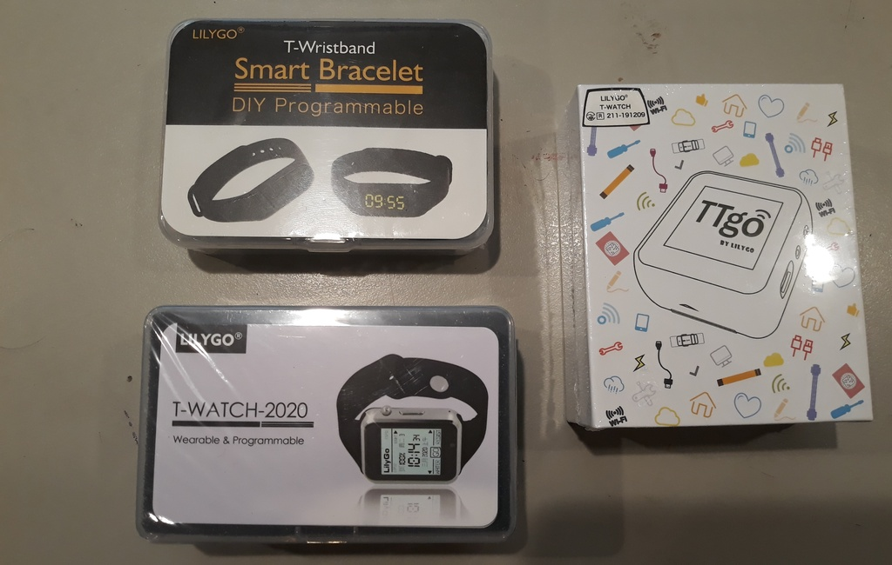
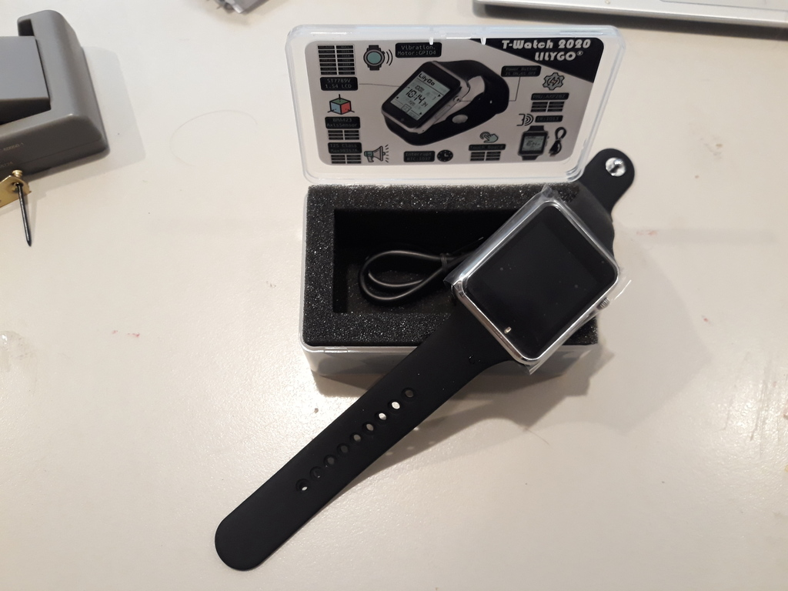
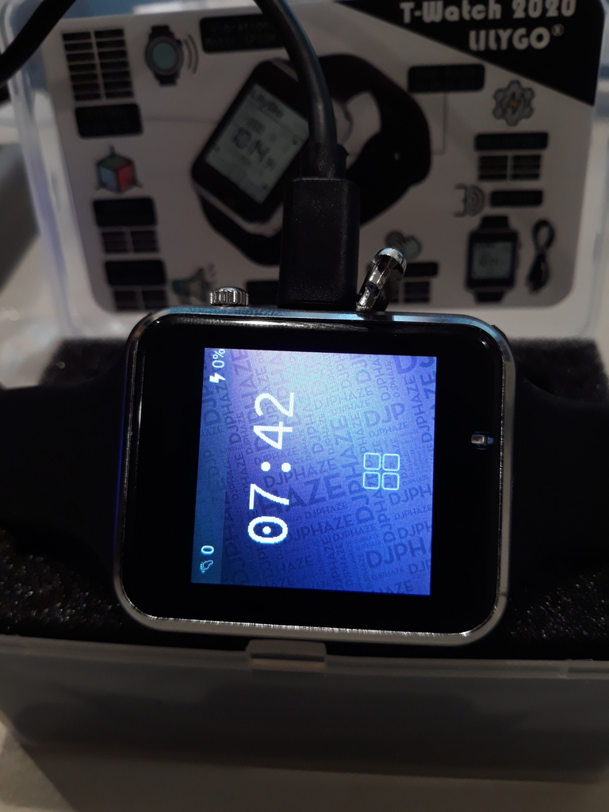
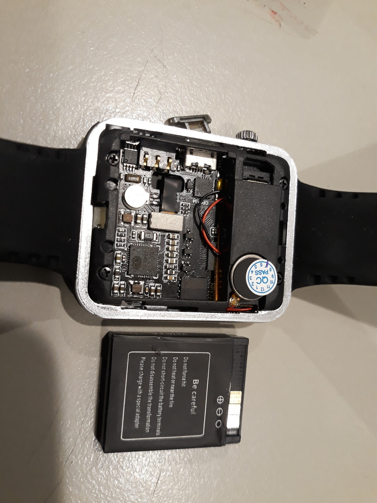
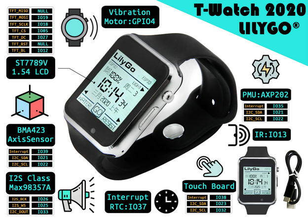
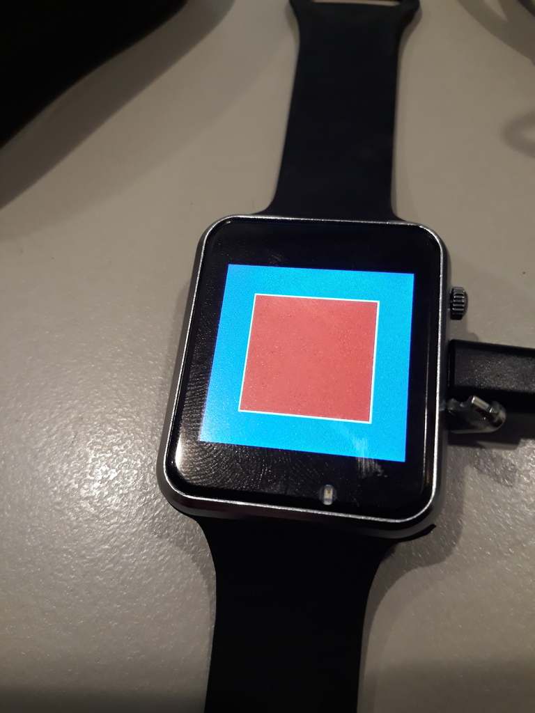

[Lilygo, aka Shenzhen Xin Yuan Electronic Technology Co., Ltd](http://lilygo.cn)
were kind enough to send me some samples of their new watches: well,
wrist-mounted computers, really.



# Lilygo TTgo T-Watch 2020

The first one I'm going to look at is the T-Watch 2020, the latest of their
wristwatch devices.  It's a bit chonky, the body is 49mm x 40mm by 12.7mm thick, 
but the edges are round and comfortable and the black plastic back makes it
seem a little less over the top.

Even though I don't generally wear a wristwatch, it's not so big as to feel
like you've strapped a computer to your arm and light enough to not feel weird.



On board is an [ESP32](/tag/esp32/) microcontroller (specifically ESP32D0WDQ6),
16MB of flash memory and a bunch of peripherals.
Under a little thumbnail-removable cover on the side is a standard MicroUSB port
for charging, and attached to a standard CP210x-type UART.
There's a little cable supplied but it's accessible enough that you can use a
normal microUSB cable.



Under the back cover you can see a tiny speaker and even a removable LiIon battery!
Remarkable in a device this small, please pay attention phone manufacturers!



Out of the box it's running some firmware which looks like a watch and lets
you set scan WiFi and so on but I didn't really look much more at it,
because that's not what we're here to talk about: what's fun about this device 
is that it can run [MicroPython](/tag/micropython/).

## Trail Breakers

This trail has been broken by [y0no](https://y0no.fr/posts/micropython-ttgo-twatch2020/)
[(en translation)](https://translate.google.com/translate?hl=&sl=auto&tl=en&u=https%3A%2F%2Fy0no.fr%2Fposts%2Fmicropython-ttgo-twatch2020%2F) and
[mooond](https://gitlab.com/mooond/t-watch2020-esp32-with-micropython/-/wikis/home)
but I thought I'd give it a go too.

# MicroPython 1.13

First things first: I build the newly released MicroPython 1.13 for ESP32,
plugged in the watch and flashed it the usual way.

It doesn't do much like this: you can connect to the serial port and get a 
Python prompt, but that's not very useful.

## Proof of Life

First things first: is this device really working?

There's a [technical document for T-Watch 2020](https://t-watch-document-en.readthedocs.io/en/latest/introduction/product/2020.html)
which includes lots of great information, including 
peripherals and pinouts.

Starting with the most basic "proof of life", we can see GPIO4 is attached to the
vibration motor, so we can pulse that GPIO and see what happens

```
import machine
import time
p = machine.Pin(4, machine.Pin.OUT)
p(1)
time.sleep(1)
p(0)
```

Yep, that buzzes for 1 second!  Can we do more?

```
import machine
pp = machine.PWM(machine.Pin(4))
pp.freq(10)
pp.duty(1)
```

The GPIO signal doesn't seem to drive the motor directly, but by using a really low
duty cycle and varying the PWM frequency between 5 and 30 Hz you can make a variety
of different vibrations at least ... potentially handy.

## Another GPIO ...

Likewise, GPIO12 is the display backlight: you can PWM it at 100Hz and set the
background brightness with the duty cycle.

```
import machine
pp = machine.PWM(machine.Pin(12), freq=1000, duty=512)
```

*UPDATE: This only works if power to the display is on. Which is might or might not
be, depending on if you've pulled the batteries since you first booted the device
on it's built-in firmware, or something.  Anyway, it worked for me at first but then
stopped working until I got down to the AXP202 bit below*

## GPIO mappings

It's a bit confusing to try to work out which pin is which internally, as 
some of the docs are mixed up between the older, expandable watch and this 
current model.
[This pin map on github](https://github.com/Xinyuan-LilyGO/TTGO_TWatch_Library/blob/master/docs/pinmap.md) is possibly the best guide.
It doesn't list GPIO 12 though, which I've confirmed is a backlight pin.

This image from the website fills in some more details:



The button on the side, which looks like a little crownwheel but isn't,
is attached to Pin 36 on older watches but doesn't seem to be attached to
anything on this model, which is a bit annoying.  If you hold it down for 
a few seconds it toggles the watch on and off though, which is handy.

## I2C you too ...

There's several I2C peripherals listed at various pins: let's see if we can
find them.

```
>>> import machine
>>> i0 = machine.I2C(sda=machine.Pin(21),scl=machine.Pin(22))
>>> i0.scan()
[25, 53, 81]
>>> i1 = machine.I2C(sda=machine.Pin(23),scl=machine.Pin(32))
>>> i1.scan()
[56]
```

According to the sites linked above, these should be (respectively):

* BMA423 Accelerometer
* AXP202 Power Management
* PCF8563 RTC
* FT6236U Touch Sensor

### PCF8563 RTC

The simplest device we can talk to is the RTC: There's a 45 page
[PCF8563 datasheet](https://www.nxp.com/docs/en/data-sheet/PCF8563.pdf)
here, but the only bit we need to worry about is section 8, which explains
what the I2C registers are used for.

Its so simple we don't really need a library to get started.
We can just read out registers 2, 3 and 4 
over I2C to get the seconds, minutes and hours:

```
import machine
import time
i0 = machine.I2C(sda=machine.Pin(21),scl=machine.Pin(22))
while True:
    s, m, h = i0.readfrom_mem(81, 2, 3)
    print("%-02s:%-02s:%-02s" % (h,m,s))
    time.sleep(1)
```

... and this seems like it probably works, until ...

```
19:16:55
19:16:56
19:16:57
83:16:64
83:16:65
83:16:66
83:16:67
83:16:68
```

... it turns out that these values are in BCD, and have some
spare bits besides.  Correcting for that:

```
import machine
import time
i0 = machine.I2C(sda=machine.Pin(21),scl=machine.Pin(22))
while True:
    s, m, h = i0.readfrom_mem(81, 2, 3)
    print("%d%d:%d%d:%d%d" % ((h>>4)&3, h&0xF, (m>>4)&7, m&0xF, (s>>4)&7, s&0xF))
    time.sleep(1)
```

... we get much more sensible results:

```
13:16:55
13:16:56
13:16:57
13:16:58
13:16:59
13:17:00
13:17:01
13:17:02
13:17:03
13:17:04
13:17:05
```

We're probably better off using a library for the RTC, but it's nice to know
we can talk to it directly from MicroPython if we have to!

### BMA423 Accelerometer

Likewise, there's a 101 page [BMA423 Datasheet](https://www.bosch-sensortec.com/media/boschsensortec/downloads/datasheets/bst-bma423-ds006.pdf)
which tells us a lot about the device but at the most basic level let's just
check we've got the right device, turn the accelerometer on, and see what it says:

```
import machine
import time
i0 = machine.I2C(sda=machine.Pin(21),scl=machine.Pin(22))
assert i0.readfrom_mem(25, 0, 1) == b'\x13'
i0.writeto_mem(25, 0x7d, bytes([4]))

while True:
    x1, x2, y1, y2, z1, z2 = i0.readfrom_mem(25, 0x12, 6)
    x = (x2 << 4) + (x1 >> 4)
    y = (y2 << 4) + (y1 >> 4)
    z = (z2 << 4) + (z1 >> 4)
    if x >= 2048: x -= 4096
    if y >= 2048: y -= 4096
    if z >= 2048: z -= 4096
    print("%d %d %d" % (x,y,z))
    time.sleep(0.1)
```

You can get a pretty clear idea how the accelerometer works just from this.
There's a lot more features to explore though, including much more sophisticated
power management, motion-triggered interrupts and so on.

(this is very similar to the code used in the 
[Rocket Surgery](https://nick.zoic.org/art/rocket-surgery-airborne-iot-telemetry-buzzconf/)
project)

### AXP202 Power Management

One chip I knew nothing about in this device was the
[AXP202](http://www.x-powers.com/en.php/Info/down/id/55),
but it looks like it is the battery charge controller, the CPU power
regulator and also used to switch other parts of the circuit on and off.

It's programmable, which means we could, in theory, crank the CPU or
battery up to too high a voltage and damage something.
We really don't want to screw this one up.

I'm going to take a wild guess that this chip is what is attached to that 
power button, too, since it has a `PWRON` input.  A long press shuts the
whole watch down, but it might be that this device can pass a short press
through to the CPU using its interrupt pin, which is hooked up to GPIO35

It also contains an accurate ADC for estimating remaining battery.

For now, all I'm going to do is turn on the display power and leave everything
else alone:

```
import machine
i0 = machine.I2C(sda=machine.Pin(21),scl=machine.Pin(22))

power_output_control = io.readfrom_mem(53, 0x12, 1)[0]
power_output_control |= 4 # LDO2 enable
io.writeto_mem(53, 0x12, bytes([power_output_control])
```

### FT6236 Touch Screen

The last device on our I2C list is the FT6236 touch screen controller.
The [FT6236 Datasheet](http://www.buydisplay.com/download/ic/FT6236-FT6336-FT6436L-FT6436_Datasheet.pdf)
is terse compared to the ones we've seen so far, but it's enough.

```
import machine
import time
i1 = machine.I2C(sda=machine.Pin(23),scl=machine.Pin(32))
while True:
    ts, xh, xl, yh, yl = i1.readfrom_mem(56, 2, 5)
    if ts & 3:
        print((xh&15)*256+xl, (yh&15)*256+yl)
    time.sleep(0.1)
```

Again: this could be made a lot more sophisticated *but at least we know it works*.

## Spy vs SPI

OK, so the last remaining piece of hardware I'm going to worry about for tonight
is the ST7789 display, connected to SPI2.

These are *way* too complicated for my usual mess-around-with-registers approach to
apply but thankfully interfacing to the ST7789 is a pretty well trodden path.

I'm going to try this with this
[C MicroPython ST7789 driver](https://github.com/devbis/st7789_mpy),
which gets compiled in to MicroPython. After following instructions, I hit a snag:
the watch doesn't *have* a reset pin for the 7789, but the driver insists on having
one.

So I made [a fork which doesn't insist on a reset pin](https://github.com/nickzoic/st7789_mpy/tree/optional_reset_pin) 
and now the following code works:

```
import machine
import st7789
spi=machine.SPI(2,baudrate=32000000, polarity=1, phase=0, bits=8, firstbit=0, sck=machine.Pin(18,machine.Pin.OUT),mosi=machine.Pin(19,machine.Pin.OUT))
disp=st7789.ST7789(spi,240,240,cs=machine.Pin(5,machine.Pin.OUT),dc=machine.Pin(27,machine.Pin.OUT))
disp.init()
disp.fill(st7789.BLUE)
disp.fill_rect(40,40,160,160,st7789.WHITE)
disp.fill_rect(42,42,156,156,st7789.RED)
```



# Status

It's not much, but it's working!  So far we've got very basic access to:

* Vibration motor
* RTC
* Accelerometer
* Touch Screen
* Power Management
* Display

We already know MicroPython can handle WiFi well, and now has support for
Bluetooth BLE, so we now should have a networkable, remote-controllable watch!

Unexplored hardware:

* I2S Speaker
* IR transmitter
* Ambient light sensor?

## FURTHER WORK

* Work out best available modules to support hardware properly
* Knock this into a simple firmware download to make it easy to install

