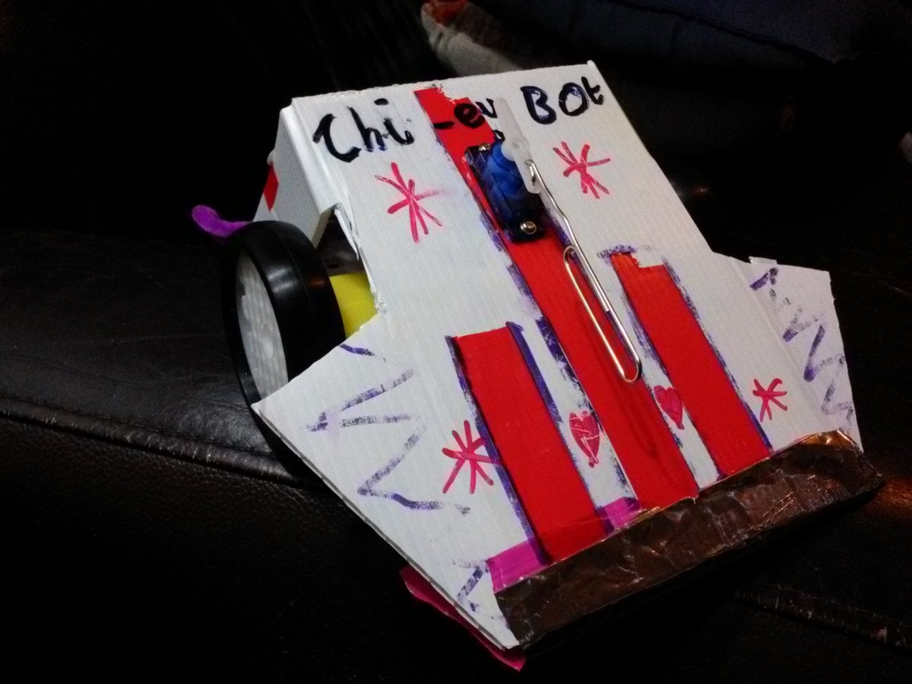

# Tutorial: Getting Started with MicroPython

I did a ["Getting Started with MicroPython" tutorial](/talk/lca2018/) at LinuxConfAU this year ...
I'd previously talked about [MicroPython](https://micropython.org/) at the
[Open Hardware MiniConf](https://openhardwareconf.org/) at 
[LinuxConf](https://linux.conf.au/) 2017 and at
[PyConAU 2017](/art/pycon-2017-melbourne/)

I'd like to do more with this tutorial material as time permits ...

# Open Hardware Miniconf: LoliBot

I was also peripherally involved with the Open Hardware Miniconf project.

Last year, Charlotte and I went to [NodeBots Day](https://github.com/nodebots/nodebotsday) and,
failing to follow the instructions, we made the following:

It's named Chipey Bot after the chip-packet based slider on the leading edge, and uses an ESP32
and a couple of L9110S based motor drivers.  Chipey-Bot ended up upgraded with extra LEDs and
a voltage booster for the motors, and this design evolved into
[LoliBot](https://github.com/CCHS-Melbourne/LoliBot) after a whole
bunch of hard work from other people.

UPDATE: [more on Chipey-bot](/art/chipey-bot-at-nodebots/)
