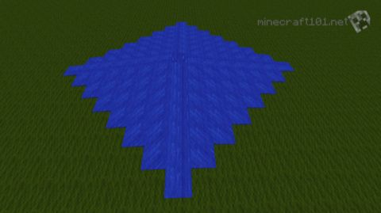

> He had said that the geometry of the dream-place he saw
> was abnormal, [non-Euclidean](https://en.wikipedia.org/wiki/Non-Euclidean_geometry), and loathsomely redolent of
> spheres and dimensions apart from ours.
>
> -- HP Lovecraft, /[The Call of Cthulhu](https://www.hplovecraft.com/writings/texts/fiction/cc.aspx)/

I'm interested in writing some grid based quantized simulations 
(games)
but there's some irritating things about square grids.


*image: minecraft101.net*

For example, [water flows funny in Minecraft](https://www.minecraft101.net/t/water-handling.html), spreading along the cardinal directions
faster than along the diagonals.  This is unrealistic.

## What is a grid?

It'd be handy to quantify what I mean by a grid, and what I 
mean by realistic.

### Graphs & Tilings

By "grid", I mean an [infinite, connected, planar graph](https://en.wikipedia.org/wiki/Graph_(discrete_mathematics)) with some geometric consistency so that any part of the grid looks much like any other part of the grid.

This kind of graph consists of "nodes", joined by "edges".  Each edge joins exactly two nodes.  This kind of graph is equivalent to a 
[tesselation or tiling](https://en.wikipedia.org/wiki/Tessellation) where each node is a tile and touching tiles have an edge between them.

For our purposes, it'd be nice if the [graph was regular](https://en.wikipedia.org/wiki/Regular_graph), eg: every node was connected to the same number of edges, but a little variation is okay.

### Measurement

In a grid, we have two ways of measuring space:

* nodes as a quantum of area (`$A$`)
* edges as a quantum of distance (`$r$`)

a "realistic" simulation of a flat plane will have `$ A \propto r^2 $` just like in the real 
world. This is not often the case in grid based simulations!

(In 3D we could also consider `$ V \propto r^3 $`, but I'm not 
worrying about that right now)

Ideally all nodes will have the same number of edges, although a mix 
of `$N$` and `$N+1$` would be okay.  It would be very useful for this
to be a repetitive pattern or at least in some way predictable.


## Bad Grids

### Trivial: 0-, 1-, 2- connected

Disconnected, connected in pairs, or connected in an infinite line.
None of these are very interesting!

### Ugly: 3-, 4-, 6- connected

A 4- connected grid is the obvious option, the familar grid of graph paper,
the chessboard, minecraft.

```
A - B - C - D
|   |   |   |
E - F - G - H
|   |   |   |
J - K - L - M
```

But drop water on flat ground in minecraft and it'll spread out faster along
the axes than the diagonals, forming a diamond shape.  Starting from one node,
in `$N$` steps we can cover `$2N^2 + 2N + 1$` nodes.

```
        4
      4 3 4
    4 3 2 3 4
  4 3 2 1 2 3 4
4 3 2 1 0 1 2 3 4
  4 3 2 1 2 3 4
    4 3 2 3 4
      4 3 4
        4

```
(visualize this as two interlaced diamonds, an outer one with `$(N+1)^2$` nodes
and an inner one with `$N^2$` nodes.  Or think of it as a central `$0$` 
surrounded by 4 offset triangles each of which has area `$\frac{N^2+N}{2}$` ...)

```
A - B - C - D
| / | / | / |
E - F - G - H
| / | / | / |
J - K - L - M
```
If we add a set of diagonal links to our 4-connected grid we get a 6-connected
grid.  Every node has 6 neighbours.  This is not uncommon as hex maps for war
games and as hex plots for 2D histograms.  The issues are less pronounced than in
4- connected grids but our puddles still aren't round:


```
      3 - 3 - 3 - 3
     / \ / \ / \ / \
    3 - 2 - 2 - 2 - 3
   / \ / \ / \ / \ / \
  3 - 2 - 1 - 1 - 2 - 3
 / \ / \ / \ / \ / \ / \
3 - 2 - 1 - 0 - 1 - 2 - 3
 \ / \ / \ / \ / \ / \ / 
  3 - 2 - 1 - 1 - 2 - 3
   \ / \ / \ / \ / \ /
    3 - 2 - 2 - 2 - 3
     \ / \ / \ / \ /
      3 - 3 - 3 - 3
```

Think of this as a central `$0$` surrounded by six offset triangles each
with area `$\frac{N^2+N}{2}$` ... our area is 
`$3N^2 + 3N + 1$`.  

That's rounder, but it's still not `$\pi r^2$`

We can think of 3- connected as being like 6- connected but with half the edges
missing.  It isn't very useful although it is pretty as ASCII art:

```
      3   3
      |   |
  4   2   2   4
   \ / \ / \ /
    3   1   3
    |   |   |
    2   0   2 
   / \ / \ / \
  3   1   1   3
  |   |   |   |
  4   2   2   4
   \ / \ / \ /
    3   3   3

```

... and it does look nice as crochet.  Unsuprisingly, in a distance of `$N$` we
can reach `$\frac{3}{2}N^2 + \frac{3}{2}N + 1$` nodes.

### Non-planar: 7- and 8- connected

It seems like we can get "rounder" by increasing the number of neighbours per
node.

An 8- connected grid would be like the way a king moves on a chessboard:
all the adjoining squares plus the diagonals.  But these grids aren't planar,
eg: if you flatten them out some edges cross.  The diagonal moves go through
each other.

```
A - B - C - D
| X | X | X |
E - F - G - H
| X | X | X |
J - K - L - M
```

A 7- connected grid is harder to visualize, but you can imagine trying to add in 
edges to a 6- connected grid.  The areas between the edges are triangles, so
there's no more links you can add in without edges crossing other edges, which 
would make the grid non-planar.

I'm not interested in non-planar grids for now but maybe we'll come back to them.

### 5- connected?

```
A - B - C - D
|   |   |   |
E - F - G - H
| / | / | / |
J - K - L - M
|   |   |   |
N - O - P - Q
| / | / | / |
R - S - T - U
```

We skipped over 5-connected grids back there.  Imagine a 
6-connected grid but you delete half of the diagonal links.

