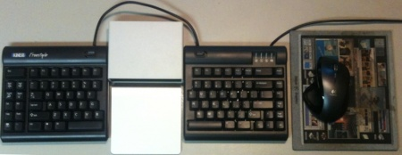

Well, I’ve decided to declare 2011 the year of finally getting my
ergonomics sorted out, and to that end I went and splashed out on a
[Kinesis Freestyle split
keyboard](http://www.kinesis-ergo.com/freestyle.htm), and an [Apple
Magic Trackpad](http://www.apple.com/magictrackpad/). More on the
keyboard later, this post is all about the Magic Trackpad.

The Magic Trackpad is, sadly, a bluetooth device which means [a certain
amount of messing around with
hidd](http://www.excession.org.uk/blog/apple-magic-trackpad-and-ubuntu-lucid.html).
The missing link for me was that there needs to be a bluetooth PIN agent
running to prompt you for the PIN you want to connect with:
`hidd --connect` won’t do that for you. There are all sorts of gnomic
things, but the simplest one is the
[simple-agent](http://gitorious.org/bluez/mainline/blobs/master/test/simple-agent)
which comes as part of the bluez distro ... run this in another
terminal, now when hidd tries to connect it’ll contact the simple-agent,
you can enter the proper PIN [^1], and it'll connect.

Alternatively, the gnome bluetooth applet seems to work, although it has
some odd UI bugs. See also this post on [broken bluetooth support in
ubuntu / bluez
4](http://blog.projectnibble.org/2010/08/08/how-ubuntus-broken-bluetooth-support-came-to-be/)
which explains where hcid.conf has gone ...

It also helps to know that the trackpad is a bit fussy about when it is
discoverable ... the easiest thing is to hold the button down until the
light starts flashing a slowish double-blink, and keep holding it down
until the connection is made. Otherwise it seems to time out. If the
light goes out instead of starting to flash, you’ve turned the trackpad
off instead of on.

Now, that’s enough to get you basic mouse function ... move the pointer,
button one on tap or click. But that’s not all that useful, especially
in X windows.

The file `/usr/share/X11/xorg.conf.d/60-magictrackpad.conf` (created by
package `xserver-xorg-input-evdev`) overrides the trackpad to use the
“evdev” driver. If you don’t already [have a custom xorg.conf as in
these
instructions](http://www.excession.org.uk/blog/apple-magic-trackpad-and-ubuntu-maverick.html),
the easiest way to override it back again is to create a file
`/usr/share/X11/xorg.conf.d/99-magictrackpad.conf`:

    Section "InputClass"
      Identifier "Magic Trackpad"
      MatchUSBID "05ac:030e"
      Driver "synaptics"
      Option "SHMConfig" "True"
    EndSection

Which defines it right back to what you’d like it to be. Apparently many
more sophisticated gestures are available with the multitouch driver,
but I’m kind of used to synaptics so I’ll stick with it for the moment.

So this is what the input part of the desk looks like right now:

This puts the halves of the kinesis keyboard about the right distance
apart for me, and the trackpad is well positioned to get to without much
wrist movement. The synaptics driver uses the right hand edge of the
trackpad for vertical scrolling ... this is particularly easy to do with
my right thumb.

[^1]: 0000, of course
