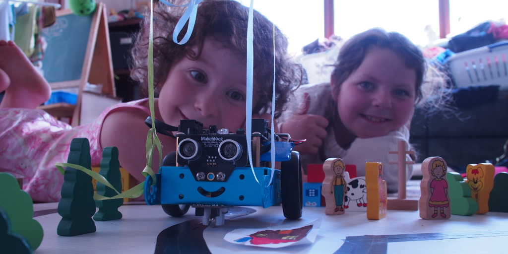
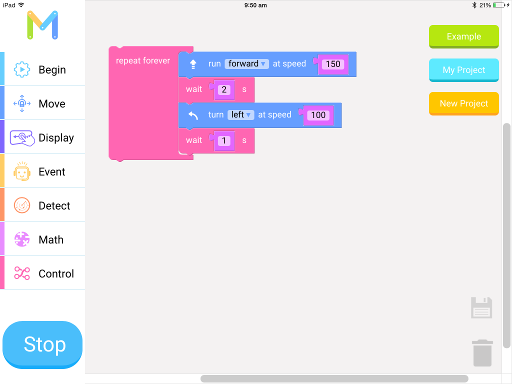
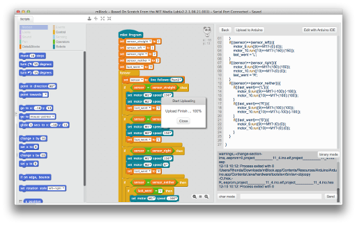
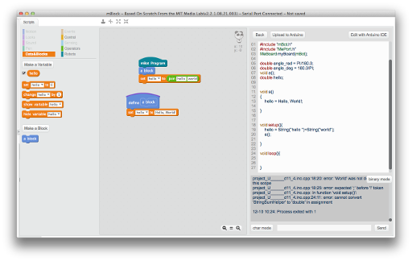
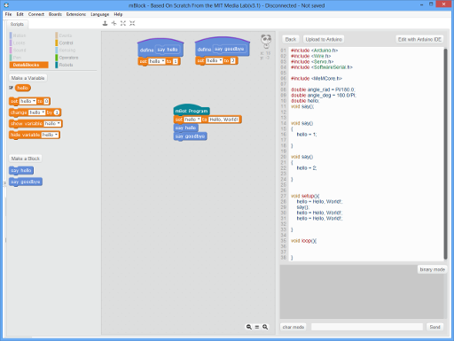
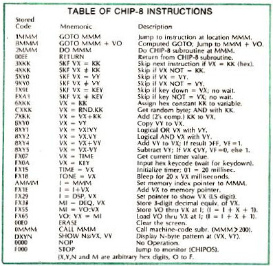

I attended a [Nodebots](http://nodebots.io/) workshop a couple of weeks
ago at [BuzzConf](https://buzzconf.io/), and Charlotte and I put
together an [mBot](http://www.makeblock.cc/mbot/) kit and had a go at
programming it.



We made a racetrack for the mBot, out of a bit of corflute with a track
for the robot made out of black insulating tape. The challenge was to
write a program which would follow the line quickly and without knocking
down all the houses and people!

The mBot platform
=================

The mBot itself is a great looking device, well packaged and comes with
almost all of what you need to get started, even a double-ended
screwdriver. The only other things you'll need are a pair of needle-nose
pliers or tweezers to hold the nuts when putting the motor retaining
bolts in, and 4 x AA batteries for the battery box. Any kid who's put
together some Lego will be able to follow along with some minimal help.

The whole thing has a cheery and non-threatening presence which is
encouraging to kids.

mCore board
-----------

The choice of
[6P6C](https://en.wikipedia.org/wiki/Modular_connector#6P6C) connectors
is somewhat inspired, as they are cheap and easy to use. On the boards
we got, there's 4 sockets, and each has power & ground, two I/O pins of
its own and 2 pins for a shared [I2C /
TWI](https://en.wikipedia.org/wiki/I%C2%B2C). More modern boards seem to
have a mix of different port types. There's also a row of 6 through hole
behind each connector which offer the same pins in the more usual
arduinoish way. If you've got other arduino stuff already, maybe
populate those holes with pin headers before assembling your robot.

There's also a couple of
[H-bridge](https://en.wikipedia.org/wiki/H_bridge) drivers already on
the board for driving DC motors, and a 3.7 LiPo charging circuit with
the usual connector, and some RGB LEDS, and a USB interface and so on,
which means that getting the system up and running is quite painless. A
couple of headers up the back let you plug in a Bluetooth serial module.

Peripherals
-----------

The mBot kit came with a couple of other little boards ... an ultrasonic
transducer board and a line-detector board. These screw neatly to the
mBot chassis and connect with tiny 6P6C cables. Nothing fancy but quite
workable.

The motors supplied are neat enough little units, with quite good wheels
and rubber tyres. They plug directly onto the mCore board motor ports,
and the wheels just slip onto the axles.

There's a 4 x AA battery box included, so pick up some high-powered
alkaline cells for it and you're away. If you want to play with the
included remote control, grab a CR2025 lithium battery while you're at
it.

mBot Programming
================

So, now you've assembled your robot, what can you do with it?

Nodebots
--------

The Buzzconf workshop was using [NodeBots](http://nodebots.io/) which we
dutifully installed and much to my surprise it worked pretty well. I
even got the Bluetooth interface to play nicely with Linux, miracle of
miracles.

But I'm not a fan of [Node](https://nodejs.org/) despite (or perhaps
because ...) of having done a bit of work with it, and I'm not sure it
is a good match for the robot. On the one hand, sure, if you're going to
learn a programming language these days, it might as well be Javascript
... it's used in so many damned things.

On the other hand, teaching Javascript is a fairly dismal experience ...
there's a lot of complexity to digest up front, and not a lot of
consistency.

mBlockly for iOS
----------------

[](mBlockly.png)

This app loaded up nicely on a recent (iOS 8.1) iPad and found the
robot's Bluetooth interface straight away. (On an older iPad 2 (iOS 6)
it started but couldn't find the robot.) It looks great, very friendly,
and will be immediately familiar to anyone who's played with any of the
[Scratch](https://scratch.mit.edu/) family.

Unfortunately, it is a bit minimal: there's no variables, and motor
control is limited. Yyou can set the motors to forward, or backward, or
turn left or turn right. You can vary the overall speed, but you can't
control the two motors separately, eg: set the left one to turn forward
at 50 and the right forward at 100. That's a bit limiting for things
like line following.

But the *real* problem is that it is *sloooooooow*. Every message pings
back and forth between the robot and the iPad-as-controller, and
unfortunately by the time the messages ping from robot to controller and
back the robot has already left the line, or hit the wall, or whatever.

So I gave up on mBlockly for now ...

mBlock
------

### mBlock 2.2 for Mac

[](mblock1.png)

Now we're getting somewhere.

[mBlock](http://mblock.cc/) works by compiling Scratch-like block code
to Arduino flavoured C++, and then using the Arduino toolchain to load
the code onto the robot. Loading works great over USB cable but I never
did get the Bluetooth loader to work properly. Once the code is loaded,
the USB lead can be disconnected and the robot will continue to run
indepedently.

The block code has variables and functions, which is great. There's not
much point trying to teach fundamentals of programming without them.

### Arduino Code Generation

[](mblock2.png)

Sadly, the code generation is a little funky. There's no type inference
(everything is a `double`), and strings aren't always escaped. Function
names get cut off at white space, so you'd better not define two
functions called "say hello" and "say goodbye". Sometimes things seem to
come out in a different order than they go in.

C++ compiler error messages are displayed to the user, and it's hard to
imagine a primary school kid doing much with:

```
project U________d11_4.ino.cpp:24:11 error: cannot convert 'StringSumHelper' to 'double' in assignment
```

It is a cool idea, but it seems not quite ready for classroom use ...

The other problem is that compiling and uploading the Arduino system
takes time, and once it is uploaded there's no way to single-step or
otherwise debug the robot. Debugging is of enormous benefit to novice
programmers, so it seems like a bad limitation.

### mBlock 3.1 for Windows

[](mblock3.png)

mBlock for Windows has a newer version, 3.1.

I only took a quick look at this. Despite being a new major release, the
code generation is still screwy. That's quite disappointing. I think
code generation to Arduino is a good approach, but there's no point if
they're not going to take it seriously.

A Better Approach?
==================

There's two opposed approaches here: the Nodebots/mBlockly way of having
the robot be a peripheral under control of the PC, and the mBlock way of
building code to upload to the robot. I'm not happy with either of them,
really.

Untethered but Debuggable
-------------------------

There's some conflicting requirements here: I'd like to have the robot
run untethered, and I'd like it to be debuggable. I'd also like to avoid
having the robot run a full PC stack, even if single board computers
like the [RPi Zero](https://www.raspberrypi.org/products/pi-zero/) make
this quite practical -- it seems like a lot of additional complexity.

(Actually, I could be convinced, *if* someone could squeeze a web-based
Scratch-like IDE onto the RPi itself so that no configuration would be
needed. That'd be cool.)

Remote Monitor
--------------



Another alternative would be to run some kind of monitor / interpreter
which could handle the single-step behaviour and so on. Scoff if you
will at the thought of interpreting bytecodes on an ATMega328, but my
household's first ever computer was a [DREAM
6800](http://www.mjbauer.biz/DREAM6800.htm) which could run programs in
an interpreted mini-language called
[Chip8](http://www.chip8.com/?page=78). It was a very very simple
mini-language, as you can see from the instruction set list on the
right.

Is a bytecode for Scratch too much to imagine?

Hardware Configuration Language
-------------------------------

The other thing which would be useful is a "hardware configuration
language" for the robot: that way you could define which pins/ports are
which functions, and what paramters they accept/return, and thus end up
with structured and more readable code.

-   Why does the line follower return 0, 1, 2 or 3?
-   Why do the motor speeds vary from 0 to 255?
-   Why does the motor not actually move at speeds less than about 50?

These are simple questions for someone with some robotics knowledge, but
no so much for someone without the background knowledge.

TL;DR
=====

The mBot is a great little device which is very kid friendly to assemble
and start using, and if you've got someone around who knows something
about programming kids can have a lot of fun with it.

But in my opinion it is still a few iterations away from being ready to
hand over to an educator with no idea about programming.

UPDATE 2016-02-07
=================

I learned a lot about the ESP8266 at [LinuxConf this
year](/etc/linuxconf-2016-geelong/) and the interpreted approach looks
more realistic ...

See also [Flobot: A Graphical Dataflow Language for
Robots](/etc/flobot-graphical-dataflow-language-for-robots/) for some
new ideas going forward!
