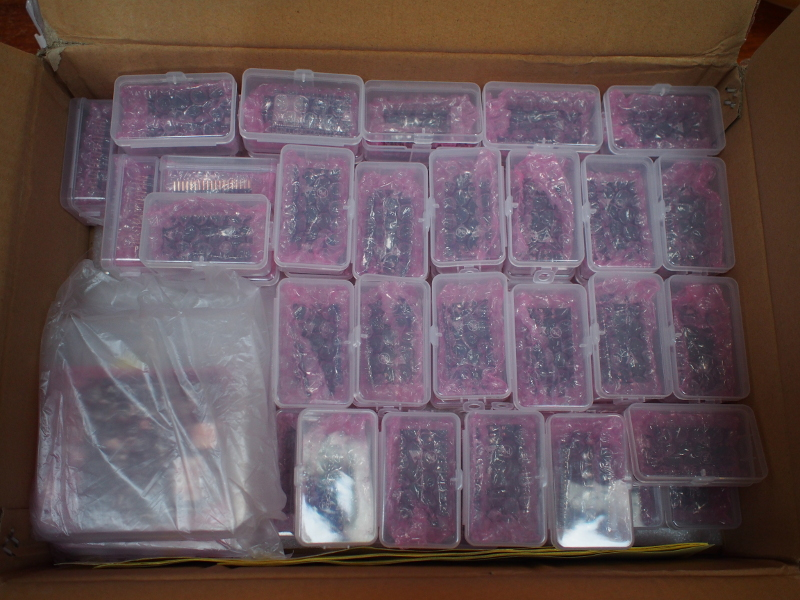

MicroPython Sprints at PyConAU
==============================

So this year at [PyConAU](https://pycon-au.org/program/sprints/) we've
got a chance to work together on [MicroPython](https://micropython.org/),
specifically the [ESP32 port of MicroPython](https://github.com/micropython/micropython-esp32).

[Damien George](http://dpgeorge.net/) and [I](http://nick.zoic.org/) will
be there and I hope you can come too!

<b>(To clarify: this is for registered PyConAU attendees only, and you need to be 
registered for the sprint days, which costs an extra $5 or so ... if you're interested
in working on MicroPython but you're not registered for PyConAU, let me know and
we'll organize something for another day ...)</b>

Bring a laptop and Micro USB cable along ... thanks to [Espressif](http://www.espressif.com/)
we'll have plenty of ESP32 boards on hand to work with.  Have a look at the 
[Issues](https://github.com/micropython/micropython-esp32/issues) (and the 
[Issues](https://github.com/micropython/micropython/issues) for the parent project!) and
see if there's something there you'd like to contribute to.

Additionally, [Tim 'mithro' Ansell](https://blog.mithis.net/)
will be bringing along some FPGA boards to work on the
[Micropython on FPGA](https://upy-fpga.github.io/) project, which is a port of MicroPython
to run on the [MiSoC](https://github.com/m-labs/misoc) reconfigurable FPGA SoC.

Damien and I will also be talking about MicroPython as part of the
[PyConAU IoT Miniconf](https://2017.pycon-au.org/program/internet-things-iot-miniconf/)
( [1](https://2017.pycon-au.org/schedule/presentation/68/),
[2](https://2017.pycon-au.org/schedule/presentation/67/) ), 
and there's another 3 MicroPython based talks as well
( [3](https://2017.pycon-au.org/schedule/presentation/93/),
[4](https://2017.pycon-au.org/schedule/presentation/65/),
[5](https://2017.pycon-au.org/schedule/presentation/69/) )
so I there's lots of chances to talk about where the project is at and how you can contribute.

MicroPython itself is written in C, so C knowledge is obviously very helpful,
but we also need Python skills ... we're aiming to make MicroPython as Pythonic
as possible!

[You can register here](https://www.meetup.com/MicroPython-Meetup/events/241386881/) ...
but make sure you're registered for the sprints with PyConAU as well.

<b>UPDATE: Sold out!  If you're still interested, see below</b>

UPDATE 2017-07-20
=================

There may still be spots available ... check when you register for PyConAU ...

We're also very excited to welcome Espressif on board as a
[Sponsor of PyConAU](https://pycon-au.org/sponsors/) and thank them for providing
us some ESP32 hardware to play with:

MicroPython Meetup
==================

There's also a regular
[Melbourne MicroPython Meetup](https://www.meetup.com/MicroPython-Meetup/)
so if you're based in Melbourne you might find that interesting.
[Our next meeting](https://www.meetup.com/MicroPython-Meetup/events/241165971/) is just before
PyConAU so we'll probably use that time to work out what to sprint on.

If you're *not* registered for PyConAU but would like to participate in a sprint, let me
know and we'll organize something after PyCon as part of the meetup group.
