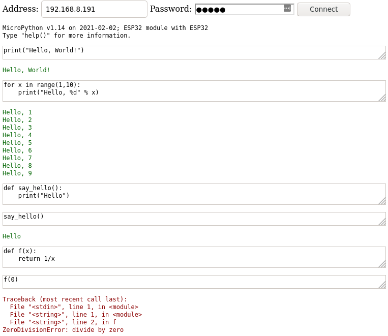

*I thought I'd written something up about WebPad ages ago, but apparently not.
I did talk about it in passing at [LCA 2018](/art/linuxconf-2018-sydney/)
I think.*

# MicroPython WebPad

MicroPython is a great language for people getting into microcontrollers,
but getting a workflow going between editing files and using the REPL is
tricky.

Once you've managed to get [a serial console](http://mpy-tut.zoic.org/tut/installing.html)
you're stuck juggling between [file uploads](https://github.com/nickzoic/mpy-utils/) and
the REPL which gets pretty annoying.

WebPad is a project to provide a unified, web-based development environment for
MicroPython.  It somewhat resembles [Jupyter](https://jupyter.org/) in that it
provides a kind of persistent notepad for your python REPL code.

You can do a similar thing with
[Jupyter's MicroPython Kernel](https://pypi.org/project/jupyter-micropython-upydevice/)
but WebPad doesn't require any local software installation.

## Installing 

[WebPad](https://github.com/nickzoic/mpy-webpad)
is a very small piece of code, really just an HTML5 page, which 
connects to the device and sends commands to the REPL.  The 
current version uses the socket exposed by [WebREPL](https://micropython.org/webrepl/)
(REPL over WebSockets) but I'm working on a [new version](https://mpy-usb.zoic.org/)
which will use [MicroPython / WebUSB](/art/micropython-webusb/)
to talk directly to the device over a USB cable.

There's some [WebREPL and WebPad setup instructions here](http://mpy-tut.zoic.org/tut/webrepl-and-webpad.html).

## Example

*webpad from 2017 talking to MicroPython from 2021*

WebPad keeps its code in a number of blocks, each of which has a separate little
edit window on the page.
Each block is evaluated separately using `exec()`.
If it prints anything that's shown in
green and if it throws an exception that's shown in red.

You can go back and edit each block and it and all subsequent blocks will
get re-evaluated. 
 
Local context is passed between evaluations, so you can define functions in one
block and use them in another.

You can get rid of a block by deleting all the text in it, and you can make a
break between blocks with a triple blank line.

## What's missing

There needs to be a few things added:

* the ability to download the current program to your computer
* the ability to save and load programs to the device's flash
* support for [MicroPython / WebUSB](/art/micropython-webusb/)
* earlier blocks shouldn't get re-evaluated when later blocks change.

And further into the future:

* support for pure text blocks (`"""` documents, basically) in markdown.
* support for editing multiple files on the flash filesystem.
* exceptions / stack traces could be displayed more nicely, with links to the
  place the error occurred.
* support for passing structured data out rather than just `print()`ing stuff.

This whole thing is really just a first step for my experiments with
[Visual Programming](/art/programming-beyond-text-files/)
