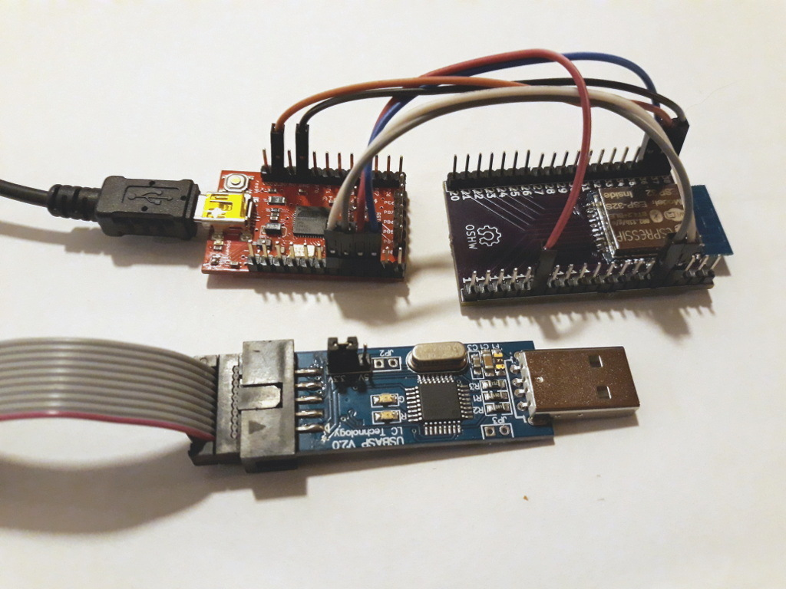
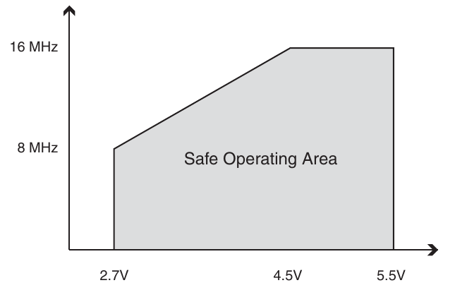

## The Out of Box Experience

Back in the nineties, one company really stood out from the other Unix workstation vendors:
Silicon Graphics.  Well engineered workstations with [funky](https://en.wikipedia.org/wiki/SGI_O2)
plastics were part of it, but the setup was part of it too: you set the 
workstation up, ran the Out of Box Experience CD and you were messing about in 3D while your
friends with Sun workstations were still trying to get gcc to compile itself.

Apple, of course, saw this and ran with it, but every time I boot a new iPhone and it says 
"Hello" I think of SGI ...

## The current MicroPython experience

At the moment, we do not have a good Out of Box Experience for MicroPython.
I'm running a [MicroPython Meetup](https://meetup.com/MicroPython/) and I've just 
done a ["Getting Started in MicroPython" tutorial at LCA](/art/linuxconf-2018-sydney/)
and so I've been there for a lot of people's first experience and it is not great.

For starters, all the standard ESP8266 / ESP32 boards come with a USB to serial
converter. From the moment you plug the microUSB cable in, the
[instructions](https://github.com/nickzoic/mpy-tut/blob/master/tut/installing.md)
multiple ways: which operating system? does it recognize the device already? did you
try downloading this random unsigned driver off the Internet?  It's not a good 
experience and you end up having to cover a staggering amount of mess just to get 
as far as seeing a REPL.

[Bunnie Huang's talk at LCA2018](https://www.youtube.com/watch?v=alssfVGrFhI)
touched on the same things: the
[Chibitronics Clip](https://github.com/chibitronics/ltc-chibichip-hardware)
gets around this by using an audio channel to transmit programs to the controller.

## CircuitPython on the Trinket M0

[AdaFruit](https://adafruit.com) have made a big leap forward with their
[Trinket M0](https://www.adafruit.com/product/3500).  To quote their website:

> When you plug it in, it will show up as a very small disk drive with main.py on it.
> Edit main.py with your favorite text editor to build your project using Python,
> the most popular programming language. No installs, IDE or compiler needed,
> so you can use it on any computer, even ChromeBooks or computers you can't install software on.

Now *that's* getting closer to a good out of box experience.  I only take issue
with "your favorite text editor".  Text editors have, over the years, caused 
[some controversy](https://en.wikipedia.org/wiki/Editor_war), and actual beginners
quite possibly don't yet have a favourite one.

But mounting the filesystem and the inclusion of a big `README.txt` and an example
`main.py` are a very good start.  

## WebUSB

[WebUSB](https://wicg.github.io/webusb/) is a rather new API which allows a browser
to directly communicate with USB devices in a safe manner.
It is supported in recent [Chrome](https://chrome.google.com/) browsers and 
[not much else](https://caniuse.com/#search=webusb).  Still, given the choice between
telling people to install Chrome and telling them to install VCP drivers plus PuTTY plus etc ...
well, Chrome is a lot less to ask.

[This summary of how to set up a device with Web USB](https://developers.google.com/web/updates/2016/03/access-usb-devices-on-the-web)
is almost exactly what I want for a MicroPython Out Of Box Experience:

> Let's see what you could expect with the WebUSB API:
>
> 1. Buy a USB device.
> 2. Plug it into your computer.
> 3. A notification appears right away, with the right website to go to for this device.
> 4. Simply click on it. Website is there and ready to use!
> 5. Click to connect and a USB device chooser shows up in Chrome, where you can pick your device.
> 6. Tada!

In this case, for "website" read "HTML5-based IDE" and for "Tada!" read "flash your code".

We're somewhat limited, in the "usual" case, by the serial converters used on the development
boards.  Chrome seems to be able to enumerate these, but that's about it.

We could, however, replace these serial converters with a small coprocessor which 
could handle the USB conversion more sensibly and give us more flexibility.  I
[previously discussed this wrt ESP8266](/art/nodemcu-plus-plus/) and I still think it is a 
good idea ... also I went and [reserved a VID/PID](http://pid.codes/org/MicroPython/) for
this purpose.  Then the device needs to export a descriptor which allows the browser to
communicate with it.

### Second Brain

There are a lot of options here, including ARM Cortex M0 chips like the
[STM32F103](http://www.st.com/content/st_com/en/products/microcontrollers/stm32-32-bit-arm-cortex-mcus/stm32-mainstream-mcus/stm32f1-series/stm32f103/stm32f103c8.html) or 
comparitively old chips like ATMega8U2.  For the final product, the decision
is probably more about supply chain and price than technical amazingness.
In the presentation linked above, Bunnie identified the
[Kinetis KL02](https://www.nxp.com/products/processors-and-microcontrollers/arm-based-processors-and-mcus/kinetis-cortex-m-mcus/l-seriesultra-low-powerm0-plus/kinetis-kl0x-48-mhz-entry-level-ultra-low-power-microcontrollers-mcus-based-on-arm-cortex-m0-plus-core:KL0x?&tab=Documentation_Tab&linkline=Data-Sheet)
family as being worth a look, so that's another option.

This second CPU could be built
onto a larger module, or provided as a "programming interface" to a bare ESP32 module.
Alternatively, the [ESP32 itself could bit-bang USB](http://bbs.esp32.com/viewtopic.php?f=13&t=2162)
but that a) sounds pretty flakey and b) would require a boot loader out of the box.
Perhaps still simpler than a dual CPU dev board though ...?

## Continuous Development

I'm a big fan of developing in the REPL, for the reasons outlined here:
[Software development at 1 Hz](https://hackernoon.com/software-development-at-1-hz-5530bb58fc0e).

But doing this kind of thing isn't limited to Lisp-y langauges,
[Here's a demo doing the same thing with shaders](https://youtu.be/NyiCoRZTYS8?t=990)
You can see that the left side of the screen is source code, the right is a rendered surface,
and when Harley changes the source code the render automatically updates.  This encourages
a very exploratory way of working.

I put together a little visual language
[Flobot](http://nick.zoic.org/art/flobot-graphical-dataflow-language-for-robots/)
which works this way too: as soon as you change anything the
device gets updated and behaviours change.  I gave a
[Live Demo](https://www.youtube.com/watch?v=vgbZInw6rNM#t=2m20s) of this at PyConAU 2016 which
probably gives you a good idea of what it's about, live debugging and all.

I'd like MicroPython to work somewhat similarly ... my first stab at this is 
[mpy-webpad](https://github.com/nickzoic/mpy-webpad) which I need to put together a
decent demo of, perhaps for PyConAU 2018.  It's rather similar to 
[Jupyter Notebooks](http://jupyter.org/) only controlling hardware.

### Distribution of Resource Usage

It's pretty frustrating that MicroPython introduces some pretty large overheads onto
the target system: the RAM requirements alone put it out of the scope of a lot of the
smaller micros, and even on the ESP8266 it is using up more than its fair share.

But even more annoying, to me, is the amount of resources it is using up on my host 
system: almost none.  I'm using a Core i7 CPU to do the job of a VT220 terminal from
the 1980s.  We could get that machine to do a lot more work in the comparatively 
immense gulfs of time between keystrokes.

Rather than having our PC send text files, and then have our microcontroller have to parse
and compile them, perhaps we could have the PC do the parsing and compilation and send only
the bytecode ready for the MicroPython VM to run.
Given the size of programs we're talking about, compiling on the fly to
native code wouldn't be impossible either ... imagine a compiler which runs continuously
and pushes new code whenever it successfully compiles!

Another thing I'd like to explore, which I can't believe I haven't written up 
for this blog yet, is the idea of an editor which edits the AST directly instead of
editing a text file which is then parsed into the AST.  I've been poking around at these
ideas for a while now ... particularly for homoiconic languages but there's no 
reason this kind of approach couldn't be adapted for Python too.

*UPDATE: Here's the [Syntax Tree Editor](/art/waste-web-abstract-syntax-tree-editor/) article ...*

(There's some prior art here in
[the micro:bit Python editor](https://python-editor-1-0-0.microbit.org/help.html)
... imagine that without the download button ...)

## So: where to next?

* Identify an appropriate USB controller, preferably in the junkbox already.
* Work out how to get WebUSB descriptors to work across OSes.
* Work out what kind of API to offer up: just a serial-converter-but-available-in-
  the-browser, or something a little more thorough?
* Work out if the same device can also present itself as a mass storage device
  ala the Trinket.
* Integrate [Ace](https://en.wikipedia.org/wiki/Ace_\(editor\)) or similar
* Work out how installing micropython packages would work ... 

# UPDATE 2018-02-07

I found a [DigiStump DigiSpark Pro](http://digistump.com/getpro) lurking in the junkbox.
This is an [ATtiny167](https://www.microchip.com/wwwproducts/en/ATtiny167) with a USB
connector [directly connected to PB3 and PB6](https://s3.amazonaws.com/digistump-resources/files/d312a4a8_ProFinal.pdf)
and the [MicroNucleus](https://github.com/micronucleus/micronucleus) bootloader already
on board, making it easy to program over USB. It's probably not the greatest choice but 
since I already have one handy it is expedient.

[V-USB](https://www.obdev.at/products/vusb/index.html) runs on the ATtiny167 and seems 
relatively simple to work with.  The example code is pretty good and within a few minutes
I had their HID mouse demo up and running on the DigiStump (using the MicroNucleus loader
instead of AVRdude).  The only snag I hit is that this particular chip has a different
UART configuration to the typical ones, so the usual debug-by-uart libraries didn't work ...
I might upstream a change for this but in the meantime it was easy enough to work around
and I could get the onboard UART logging out at 38400 baud.  Going higher may be a problem
due to the very limited clock dividers available, I'll have to see ... 

The next step was to saw off all the bits I didn't need, and get "Hello, World!".
There's a very early version of this code at [espplus](https://github.com/nickzoic/espplus/)

# UPDATE 2018-02-14

I've made *some* progress on the "espplus" code linked above, and can connect to it 
from the browser!  In a great moment of irony, it turns out that the main barrier to
having WebUSB talk directly to a CP2102 or HL-340 etc serial converter is that Linux
*does* support them, and so 'claims' the devices' interfaces and won't let them be
accessed from WebUSB ("Failed to claim interface 0").

Also my WINUSB descriptor is apparently wrong and Windows 10 cracks it, but that's
neither here nor there and I'll get around to it.

*(Maybe I should be just making a project for a serial converter which speaks both
[USB CDC](https://en.wikipedia.org/wiki/USB_communications_device_class)
and WebUSB simultaneously, independently of MicroPython ... that would then work 
with many different microcontrollers (etc).  It could support multiple UARTs and some
control pins, which would cover the usual bases of console, logging, resetting.)*

# UPDATE 2018-05-20

## ATMega32U4

USB throughput with the ATTiny seems pretty terrible ... I didn't measure it but
typing through it was like typing at 300 baud.  This was pretty predictable: V-USB
is bit-banging USB on a slow 8-bit micro, so performance is probably okay for a mouse
or a keyboard but maybe not for uploading files.

I thought I'd try out an [ATmega32u4](https://www.microchip.com/wwwproducts/en/ATmega32u4),
which has hardware support for USB and works with [LUFA](http://www.lufa-lib.org/).
I had an old
[Sparkfun ATmega32u4 breakout board](https://www.sparkfun.com/products/retired/11117)
in the junkbox ... they're no longer made, but there's the
[Adafruit Teensy 2.0](https://www.adafruit.com/product/199) which is probably equivalent,
and a bunch of Ebay boards too.

A quick experiment with a modified version of the DualVirtualSerial demo code puts the 
throughput at about 140kB/s full duplex (into /dev/ttyACM0 and out of /dev/ttyACM1)
which seems about right for [low speed USB 1.1](https://en.wikipedia.org/wiki/USB#USB_1.x)
and is pretty similar to the 115200 baud which we tend to program ESPs at anyway.

The default message size (`CDC_TXRX_EPSIZE`) is 16 bytes.  Increasing the packet size
to 64 bytes (the maximum) and going to simplex messages increases this significantly:

| Size (B) | Duplex (kB/s) | Simplex (kB/s) |
| --- | --- | --- |
| 16 | 140 | 245 |
| 32 | 205 | 295 |
| 64 | 237 | 420 | 

The fastest I've ever got an ESP32 serial port to talk reliably is 230400 bps
(including stop and start bits, so call it 23kB/s), so this is, to my mind,
Pretty Bloody Good.  It might be even better with protocols other than
[CDC](https://en.wikipedia.org/wiki/USB_communications_device_class)
which is designed to mimic a serial port.

(okay, so 460800 is pretty practical for the genuine DevKitC ... most of the eBay 
specials are a little more special though ...)

The bottleneck becomes the serial link between ATMega and ESP32.  With short traces, this 
could maybe be pushed to work at 1 or 2 Mbit/s.
Another alternative would be to have the ATMega hold the ESP32 in reset while it directly
manipulates the contents of the ESP32 module's flash memory.  This might be very handy,
especially for block device access.

### /dev/ttyACM0: Device or resource busy

As an aside, I'd been getting lots of sporadic `failed to open '/dev/ttyACM0': Device or resource busy`
messages and was wondering why ... when I ran up my DualVirtualSerial example I could see that
something was sending AT commands to the ports.  It turns out that this is 'modemmanager',
"a unified high level API for communicating with mobile broadband modems".

I could just `apt purge modemmanager` but it appears that that also has some role to play in
configuring 4G interfaces, so I guess it has to stay.  Thankfully it looks like there's a
[way to prevent ModemManager from interfering](https://linux-tips.com/t/prevent-modem-manager-to-capture-usb-serial-devices/284)

# UPDATE 2018-05-23

*Top left: Sparkfun ATMega32U4 breakout.*
*Top right: ESP32S module on a breakout board.*
*Bottom: USBasp programming cable for JTAG*

## Wiring

The LUFA version of the code is going okay ... it is really very messy at the moment but
I got an end-to-end test working with the browser talking to MicroPython running on the ESP8266,
and then soldered up an ESP32 module and got that working as well.  The only issue I had 
was forgetting to pull the RESET line high ... I missed the pullup on the 
[Witty Cloud](http://www.instructables.com/id/Witty-Cloud-Module-Adapter-Board/) causing
the processor to go into paroxysms of resets ...

| ATMega32U4 | ESP32 |
| --- | --- |
| PD2 / RXD1 | GPIO1 / TXD |
| PD3 / TXD1 | GPIO3 / RXD |
| PD4 | RESET / ENABLE |
| PD5 | GPIO0 |

The sparkfun module I'm using has a jumper to run the ATMega at 3.3V ... which is not quite
enough to do 16MHz accoding to Figure 29.2 from the
[ATMega32U4 datasheet](http://ww1.microchip.com/downloads/en/DeviceDoc/Atmel-7766-8-bit-AVR-ATmega16U4-32U4_Datasheet.pdf):

Still, the one I've got here works, so perhaps I'm just lucky.  For a proper design, 
I'd want to either run the ATMega at 5V, with level shifting between it and the ESP32,
or reduce the ATMega clock speed to 10MHz or so.

## Multiple Interfaces

USB can configure multiple interfaces per device, each of which can be 'claimed' by 
different programs.  So my aim here is to expose three separate interfaces with
overlapping functionality:

1. A CDC ([Communications Device Class](https://en.wikipedia.org/wiki/USB_communications_device_class))
   interface which looks like a normal serial port REPL.  This would be compatible with the
   existing esptool / ampy / mpy-utils tools, with changes in RTS / DTR status passed 
   through to the GPIO0 and RESET pins.

2. A HID ([Human Interface Device](https://en.wikipedia.org/wiki/USB_human_interface_device_class))
   (or maybe just "vendor specific") interface which allows access to the REPL and also
   allows explicit commands to toggle GPIO0 and RESET and direct access to the filesystem
   to avoid the current ampy / mpy-utils REPL-smashing shenanigans.

3. A [Mass Storage](https://en.wikipedia.org/wiki/USB_mass_storage_device_class) class which
   allows direct access to the underlying block device (perhaps by directly bashing on the
   SPI bus, or perhaps using some serial bootloader zanyness)

## Linux udev rules

Under Linux, the CDC interface is picked up and presented as `/dev/ttyACM0` or similar.
udev rules set its group to (variously) `plugdev` or `dialout`, so the user has to be 
a member of some appropriate group.  Also, a udev rule is needed to stop that 
'modemmanager' thing from typing `AT AT ~+~ ~+~` at the REPL ...

## Windows Descriptors

On the other hand, I haven't had much luck getting Windows to accept my descriptors.
USB Descriptors are quite complicated, with many strange extensions and diversions.
I've tried adding in a "Microsoft OS 2.0 Platform Capability Descriptor" along with
everything else but while both the CDC and HID interfaces are visible in Device
Manager they don't configure, which is annoying.

## But what if WebUSB doesn't ...

I've also had a think about what to do if WebUSB never really standardizes and the
Chrome team get bored of it and walk away.  Which could well happen.

Under Linux / Mac it should be easy enough to write a little daemon which looks for
micropython boards and serves them up as websockets.  So not much unlike WebREPL really.

Windows isn't quite the same, but I've written Windows native apps which speak
HID before, and that was relatively easy, in fact easier than dealing with the
vagaries of Windows COM ports.  So it'd be practical enough to write a native Windows
app to do the same kind of thing, either serving up a websocket or embedding a web view.

# UPDATE 2018-06-16

Thanks to Adafruit for
[sending some traffic my way](https://www.adafruitdaily.com/2018/02/16/micropython-with-webusb/)
... yeah, I don't ever look at analytics so it took me several months to notice.

Checkout the [NumWorks calculator](http://numworks.com/)'s WebUSB interface as part of 
[#deskofladyada](https://www.youtube.com/watch?v=1e7SrAMvnHE?t=265) although that's 
a pretty rough user experience and could be streamlined a lot.  

I've also got some hardware on the way to program the SAMD21 processor on the
[Adafruit Trinket M0](https://www.adafruit.com/product/3500) 
so rather than starting from scratch I might have a go at adding WebUSB to 
the existing USB stack.

  

