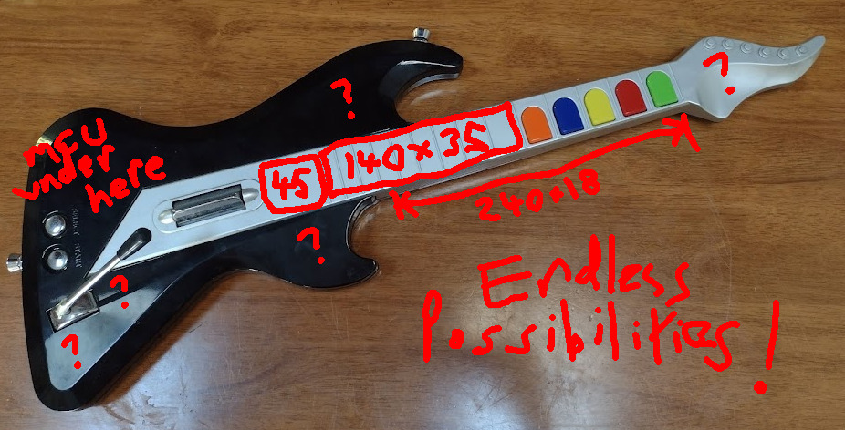
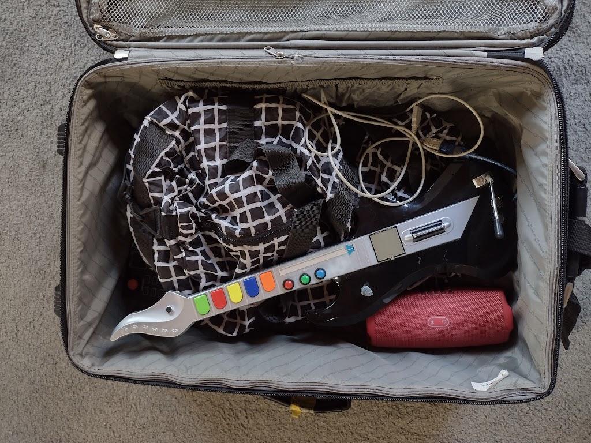

Well, it looks like [we're going to PyConAU](https://2023.pycon.org.au/program/8PDEHA/) and to celebrate
the [MIDI Hero guitar](/art/midi-hero/) is going to get some sensor upgrades ...

## New Controls

There were three things I wanted to add to this project:

* On-board Synthesis (Audio Out) 

  This would be cool because the instrument could have its own voice rather than
  being just a synth input device.

* More fret controls, possibly a fretless slider

  The five buttons are pretty limiting, and there's plenty of room on the 'fretboard'
  for more controls.

* Nicer strum control, possible a piezo or similar sensor

  The clicky strum thingy is quite annoying, I'm interested to see how a piezo or 
  force sensor would feel to play.

So let's work out how those might work:

### On-board Synthesis

On-board synthesis with [Karplus-Strong](http://amid.fish/javascript-karplus-strong)
shouldn't be too hard.

While CircuitPython supports [I2S](https://en.wikipedia.org/wiki/I%C2%B2S)
it'd probably be easier just to
run audio straight out the A0/A1 analog outputs.  We're not exactly after high
fidelity here and I2S needs several pins and a separate I2S DAC board.

### More Frets!

Some more fret buttons would be nice, and there's also a possibility for analog
input from something like a
[Soft Potentiometer](https://www.spectrasymbol.com/linear-position-sensors/soft-membrane-linear-pots-softpot)
which would allow for continuous movement much like a
[Lap Steel Guitar](https://en.wikipedia.org/wiki/Lap_steel_guitar). 

### Better Strums!

The nice thing about the soft pot mentioned about is that it is thin and can just 
get surface mounted to the controller.  This saves a lot of hassle removing
internal structures which keep the controller rigid.

A similar device called a [Force sensing resistor](https://en.wikipedia.org/wiki/Force-sensing_resistor)
might be usable as a better strum sensor.
Another possibility is to use a [piezo sensor](https://en.wikipedia.org/wiki/Piezoelectric_sensor)
on the inside of the plastic case, or even just a tiny microphone to detect the sounds of fingers
whacking on the plastic.

Software would track the peak force/pressure/signal and use this to assign the "velocity" of the MIDI event.

The existing strum control could either be left as is (two separate digital inputs) or wired into the
analog strum circuit somehow.

## Control Positions

*Endless Possibilities*

There's many possibilities for adding extra controls.  For a start, there's a 
large rectangular space on the faux fretboard, between the lowest 'fret button'
and the strum sensor.  This is about 180mm long, and about 45mm at the wider
end and 35mm at the narrower end.  There are little fret ridges but there can
be sanded flat if necessary.

The neck is also quite square, and so there's
a flat strip along the bottom of the neck which is about 240x18mm which is quite easy
to get fingers on.

The MCU board takes up a lot of space in the top side of the lower bout, but
there might be some room around the whammy bar for another control knob, or
maybe the lower or upper horns could host some more controls.

Finally, that weird blobby headstock could maybe fit something or another in it?
I'd consider sawing it off but that would make the controller hard to 
[hang](https://github.com/nickzoic/models3d/blob/master/music/u-hook-square.scad)

I don't really want to keep pulling this thing apart, and I'd like to have
some spare stuff built in to fiddle with at [PyConAU](https://2023.pycon.org.au/program/8PDEHA/)
so I think I'll take the approach of using up as many I/O pins as possible ...
not everything is going to turn out to be useful, but it's a platform for experimentation so
that's okay.

## Available I/O

Sticking with the [Adafruit Metro M4 Express](https://circuitpython.org/board/metro_m4_express/) currently 
in it, we've got [quite a few pins to play with](https://learn.adafruit.com/adafruit-metro-m4-express-featuring-atsamd51/pinouts):

| Pin | Function | Use |
|-----|----------|-----|
| A0  | Analog Input or Output | Stereo Jack (T) * |
| A1  | Analog Input or Output | Stereo Jack (R) * |
| A2  | Analog Input or Digital I/O | Whammy Bar |
| A3  | Analog Input or Digital I/O | Fret Slide (soft potentiometer)|
| A4  | Analog Input or Digital I/O | Strum Sensor (force dependent resistor) |
| A5  | Analog Input or Digital I/O | Knob 1 |
| SDA | SDA or Analog Input A6 | Knob 2 |
| SCL | SCL or Analog Input A7 | Knob 3 |
| D0  | Digital I/O or Serial1 RX | 5 pin MIDI * |
| D1  | Digital I/O or I2S SDI or Serial1 TX | 5 pin MIDI * |
| D2  | Digital I/O or I2S MC | Fret 1 |
| D3  | Digital I/O or I2S BCK | Fret 2 |
| D4  | Digital I/O | Fret 3 |
| D5  | Digital I/O | Fret 4 |
| D6  | Digital I/O | Fret 5 |
| D7  | Digital I/O | Fret 6 (additional) |
| D8  | Digital I/O or I2S SDO | Fret 7 (additional) |
| D9  | Digital I/O or I2S WS | Fret 8 (additional) |
| D10 | Digital I/O | Strum Down |
| D11 | Digital I/O | Strum Up |
| D12 | Digital I/O | Select Button |
| D13 | Digital I/O (red LED) | Start Button |
| SCK | Digital I/O or SPI SCK | ** |
| MISO | Digital I/O or SPI MISO | ** | 
| MOSI | Digital I/O or SPI MOSI | ** |

\*: Eventually?  Leave them just in case.

\*\*: These are on a different header so not as convenient.

So that's an additional analog fret slider, a strum force sensor, three extra fret buttons
and three multipurpose knobs to fit in.  Plus a handful of passive components.  And we have
to work around the internal structures of the controller enough that it will stil
screw back together nicely.

Then the onboard software will map each of these things to
[MIDI Messages](http://www.music.mcgill.ca/~ich/classes/mumt306/StandardMIDIfileformat.html#BMA1_1) 
such as notes, velocities, pressures, pitch bends and control changes.

## See you at PyConAU!

*packing my bags for PyConAU*

I was in a rush so I just soldered things to other things
at random and kept going until almost everything worked:

| Pin | Function | Use |
|-----|----------|-----|
| A0  | Analog Input or Output | |
| A1  | Analog Input or Output | Whammy Bar |
| A2  | Analog Input or Digital I/O | Slide sensor |
| A3  | Analog Input or Digital I/O | Microphone |
| A4  | Analog Input or Digital I/O | Pressure sensor |
| A5  | Analog Input or Digital I/O | Knob |
| D0  | Digital I/O or Serial1 RX | Start Button |
| D1  | Digital I/O or I2S SDI or Serial1 TX | Select Button |
| D2  | Digital I/O or I2S MC | |
| D3  | Digital I/O or I2S BCK | |
| D4  | Digital I/O | Strum Up |
| D5  | Digital I/O | Strum Down |
| D6  | Digital I/O | Fret 8 (additional) |
| D7  | Digital I/O | Fret 7 (additional) |
| D8  | Digital I/O or I2S SDO | Fret 6 (additional) |
| D9  | Digital I/O or I2S WS | Fret 5 |
| D10 | Digital I/O | Fret 4 |
| D11 | Digital I/O | Fret 3 |
| D12 | Digital I/O | Fret 2 |
| D13 | Digital I/O (red LED) | Fret 1 |

Hopefully not too much of it will break in transit.

# UPDATE 2023-08-21

Well it [went to PyConAU](/art/pycon-pyconau-2023-adelaide/), it survived, the overall conclusion was that:

* The latency makes it practically unplayable, this needs fixing.
* I need to do something about debouncing & also a curve to make the pressure pad more expressive.
* I really like the idea of having the pressure pad actually control a parameter rather than the velocity 
  or aftertouch.
* The "soft pot" components worked okay, but they're not necessarily a nice feel,
  and the big ones are very expensive.
  I might try making some custom boards for [Capacitive Touch Sensing](/art/esp32-capacitive-sensors/#update-2018-12-11)
  for frets instead.
* It sure is fun to make annoying boop noises though

Thanks to everyone who popped past and said hi and had a go at it, and also [cTrix](https://ctrix.net/) who was
busy filming but I got to chat to at the airport on the way home ...
