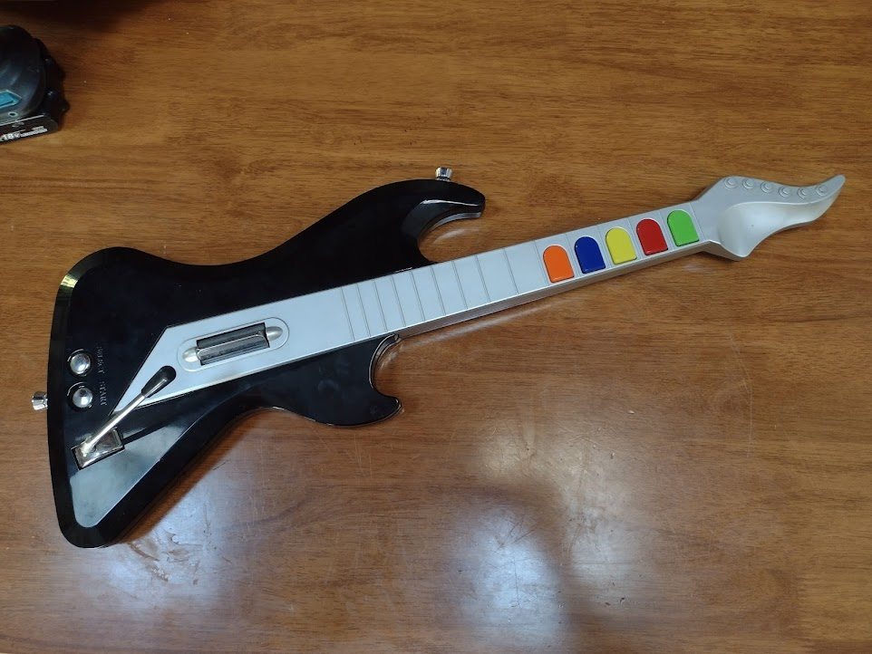
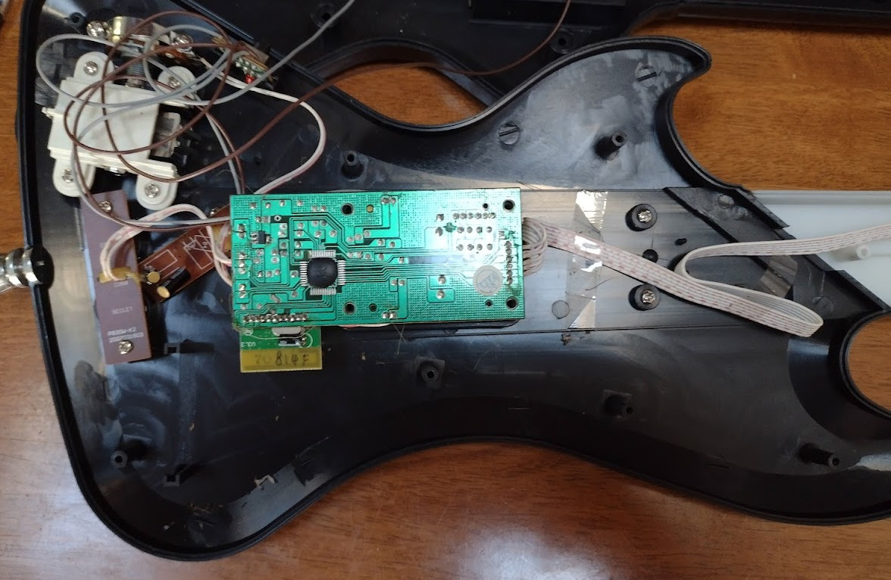
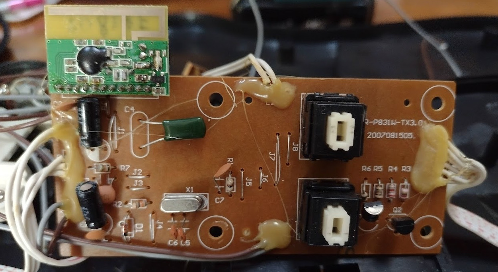
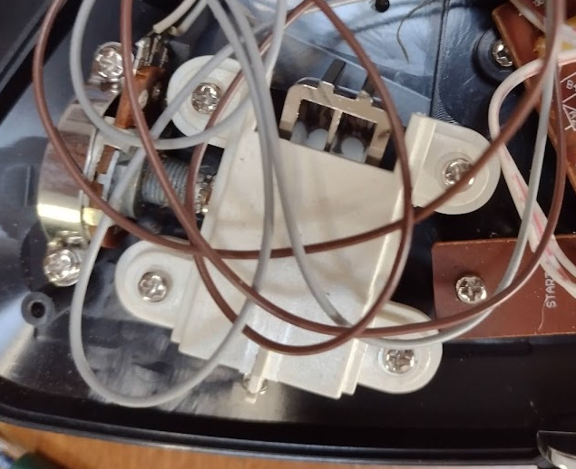

# In The Beginning ...

I picked up a [Guitar Hero](https://en.wikipedia.org/wiki/Guitar_Hero)
type controller from the thrift store on impulse (it was $7).
It turns out to be a well-worn
[Playstation 2](https://en.wikipedia.org/wiki/PlayStation_2) controller,
but since I don't have a PS2, well ... it's going to become something else.

Inside, it's very retro ... a total mess of little PCBs and flying wires instead of the
more modern flexi-PCB kind of construction.  But that's good for my 
purposes, since it makes it much easier to butcher.

In its current form it has:

* 5 "fret" buttons (resistive rubber contacts I think)
* A tiny power switch and red LED on their own board
* A separate board for start and select buttons
* Some kind of multi-axis tilt sensor I think
* The "whammy" mechanism, which turns a metric pot ... this is pretty badly worn.
* The main CPU board, with:
  * An anonymous ASIC 
  * The two "strum" buttons
  * A little bluetooth (?) daughterboard

# ... Let There Be Rock

So, the plan is to turn this ridiculous thing into something which can 
actually be played as a musical instrument.  The obvious choice for this 
is [MIDI](https://en.wikipedia.org/wiki/MIDI), a
[standard](http://www.music.mcgill.ca/~ich/classes/mumt306/StandardMIDIfileformat.html)
invented back in 1981 for doing exactly this kind of thing.  The guitar would send 
MIDI messages and then a synthesizer, or synthesizer software running on
a computer, turns that into actual music.

*There are [real](https://koalaaudio.com.au/products/artiphon-instrument-1) 
[ones](https://playjammy.com/) [of](https://www.rorguitars.com/products/expressiv-midi-pro)
[these](http://www.muzines.co.uk/articles/yamaha-g10/347) controllers out there already
but that's not entirely the point.*

Computers can receive MIDI signals from a special interface to the old-school
[5 pin MIDI](https://learn.sparkfun.com/tutorials/midi-tutorial/hardware--electronic-implementation), or [MIDI over USB](https://www.midi.org/midi-articles/basic-of-usb).
Since I don't have one of the former handy right now I'll concentrate on
the latter for the moment.
As a bonus, USB can provide power to the instrument.

5-pin MIDI or synthesized audio might also be useful for live performance,
but let's not get ahead of ourselves here `:-)`.

# Inputs

## Frets

5 fret buttons doesn't seem like much compared to the 90-odd fret
positions on a real guitar neck.
But there's a lot of songs which have a small number of chords,
thankfully.
About 3/4 of my ukulele songbook would get covered by:

| Gn | Rd | Yy | Bu | Or | Chord | In C  |
|----|----|----|----|----|-------|-------|
| X  |    |    |    |    |   I   |   C   |
| X  | X  |    |    |    |   ii  |   Dm  |  
|    | X  |    |    |    |   II  |   D   |
|    | X  | X  |    |    |   IV  |   F   |
|    |    | X  |    |    |   V   |   G   |
|    |    | X  | X  |    |   vi  |   Am  |
|    |    |    | X  |    |   VI  |   A   |
|    |    |    | X  | X  |  ♭VII |   B♭  |
|    |    |    |    | X  |   VII |   B   |

Or something like that, anyway.  There's still plenty of playable combinations
left over.  Maybe throw in some sevenths.

## Strums

The frets would be used to select which chord to play, but the strum sensor would
be responsible for actually triggering it.

The strum mechanism is really just a little cam which operates two switches
which look suspiciously like [ALPS](https://deskthority.net/wiki/Alps_SKCL/SKCM_series)
clone keyboard switches.  These are mounted on the back of the main board,
which mounts to the case using four screws.  I'll probably replace this with a bit of 
proto board with a couple of similar switches on it, but it might be nice to 
consider some kind of [piezo](https://en.wikipedia.org/wiki/Piezoelectric_sensor)
sensor to give the instrument some [expression](https://en.wikipedia.org/wiki/Musical_expression)

The relationship between the two different switches and the MIDI message
I'm not sure about.  Should an upward strum be different from a downward strum?
Is a down-down-down-down strum different to a down-up-down-up strum?
Does holding the 'flipper' down do anything different?
This will take a bit of experimentation too see what "feels" right I guess.

## Whammy Bar

There's a little [Whammy Bar](https://en.wikipedia.org/wiki/Vibrato_systems_for_guitar#Origin_of_names)
which operates a standard metric
[potentiometer](https://en.wikipedia.org/wiki/Potentiometer).
It only rotates one way (down), but it should be able to 
feed a MIDI pitch wheel input.

Unfortunately the mechanism is pretty badly worn so I might have to do some fixing up.

## Other

There's also the START and SELECT buttons which could send other MIDI
messages to change channels or instruments or whatever.

There's plenty of empty real estate on the guitar, so adding in some other
inputs should be possible.  Perhaps for example a capacitive slider strip on fretboard
for "fretless" operation, or various knobs to send
[MIDI CC](https://www.noterepeat.com/articles/how-to/213-midi-basics-common-terms-explained#G)
messages.

There's a board with a couple of tilt sensors already, but an
[accelerometer](../rocket-surgery-airborne-iot-telemetry-buzzconf/)
would be a more modern alternative and could feed into a control channel as well.

Plus, of course, I should make some room for [neopixels](../saturnalia-a-rotating-christmas-tree/)!

# Microcontroller

Handily there's a [CircuitPython](https://circuitpython.org)
[USB MIDI library](https://circuitpython.readthedocs.io/en/latest/shared-bindings/usb_midi/index.html) already.
I'm a big fan of [not writing C if I don't have to](../linuxconf-2017-hobart/)
and this library supports a lot of [junkbox boards](/tag/microcontrollers/) I already have, so that
seems like an obvious choice.  I just have to find one with enough I/O pins.

