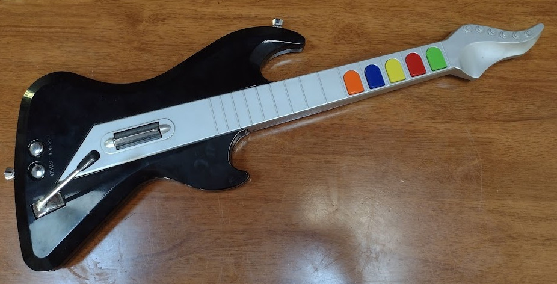

# In The Beginning ...

I picked up a [Guitar Hero](https://en.wikipedia.org/wiki/Guitar_Hero)
type controller from the thrift store on impulse (it was $7).
It turns out to be a well-worn
[Playstation 2](https://en.wikipedia.org/wiki/PlayStation_2) controller,
but since I don't have a PS2, well ... it's going to become something else.



Inside, it's very retro ... a total mess of little PCBs and flying wires instead of the
more modern flexi-PCB kind of construction.  But that's good for my 
purposes, since it makes it much easier to butcher.


In its current form it has:

* 5 "fret" buttons (resistive rubber contacts I think)
* A tiny power switch and red LED on their own tiny board
* A separate board for the start and select buttons
* Some kind of multi-axis tilt sensor I think
* The "whammy" mechanism, which turns a metric potentiometer
* The main CPU board, with:
  * An anonymous ASIC 
  * The two "strum" buttons
  * A little bluetooth (?) daughterboard
* A battery holder for 4 x AA batteries.

# ... Let There Be Rock

So, the plan is to turn this ridiculous thing into something which can 
actually be played as a musical instrument.  The obvious choice for this 
is [MIDI](https://en.wikipedia.org/wiki/MIDI), a
[standard](http://www.music.mcgill.ca/~ich/classes/mumt306/StandardMIDIfileformat.html)
invented back in 1981 for doing exactly this kind of thing.  The guitar would send 
MIDI messages and then a synthesizer, or synthesizer software running on
a computer, turns that into actual music.

*There are [real](https://koalaaudio.com.au/products/artiphon-instrument-1) 
[ones](https://playjammy.com/) [of](https://www.rorguitars.com/products/expressiv-midi-pro)
[these](http://www.muzines.co.uk/articles/yamaha-g10/347) controllers out there already
but that's not entirely the point.*

Computers can receive MIDI signals from a special interface to the old-school
[5 pin MIDI](https://learn.sparkfun.com/tutorials/midi-tutorial/hardware--electronic-implementation), or [MIDI over USB](https://www.midi.org/midi-articles/basic-of-usb).
Since I don't have one of the former handy right now I'll concentrate on
the latter for the moment.
As a bonus, USB can provide power to the instrument.

*5-pin MIDI or synthesized audio might also be useful for live performance,
but let's not get ahead of ourselves here `:-)`.*

# Inputs

## Frets

5 fret buttons doesn't seem like much compared to the 90-odd fret
positions on a real guitar neck.
But there's a lot of songs which have a small number of chords,
thankfully.
99% of my ukulele songbook would get covered by:

| Gn | Rd | Yy | Bu | Or | Chord | In C  | Value | Notes     |
|----|----|----|----|----|-------|-------|-------|-----------|
| X  |    |    |    |    |   I   |   C   | 1     | C E G     |
| X  | X  |    |    |    |   ii  |   Dm  | 3     | D F A     |
|    | X  |    |    |    |   II  |   D   | 2     | D F♯ A    |
| X  | X  | X  |    |    |   II7 |   D7  | 7     | D F♯ A C♯ |
| X  |    | X  |    |    |   iii |   Em  | 5     | E G B     |
|    | X  | X  |    |    |   IV  |   F   | 6     | F A C     |
|    |    | X  |    |    |   V   |   G   | 4     | G B D     |
|    | X  |    | X  |    |   v   |   Gm  | 10    | G B♭ D    |
|    | X  | X  | X  |    |   V7  |   G7  | 14    | G B D F   |
|    |    | X  | X  |    |   vi  |   Am  | 12    | A C E     |
|    |    |    | X  |    |   VI  |   A   | 8     | A C♯ E    |
|    |    |    | X  | X  |  ♭VII |   B♭  | 24    | B♭ D F    |
|    |    |    |    | X  |   VII |   B   | 16    | B D♯ F♯   |
|    |    | X  |    | X  |   vii |   Bm  | 20    | B D F♯    |
|    |    | X  | X  | X  |  VII7 |   B7  | 28    | B D♯ F♯ A |

Or something like that, anyway.  There's still a few playable combinations
left over.

## Strums

The frets would be used to select which chord to play, but the strum sensor would
be responsible for actually triggering it.


The strum mechanism is really just a little cam which operates two switches
which look suspiciously like [ALPS](https://deskthority.net/wiki/Alps_SKCL/SKCM_series)
clone keyboard switches.  These are mounted on the back of the main board,
which mounts to the case using four screws.  I'll probably replace this with a bit of 
proto board with a couple of similar switches on it, but it might be nice to 
consider some kind of [piezo](https://en.wikipedia.org/wiki/Piezoelectric_sensor)
sensor to give the instrument some [expression](https://en.wikipedia.org/wiki/Musical_expression)

The relationship between the two different switches and the MIDI message
I'm not sure about.  Should an upward strum be different from a downward strum?
Is a down-down-down-down strum different to a down-up-down-up strum?
Does holding the 'flipper' down do anything different?
This will take a bit of experimentation too see what "feels" right I guess.

## Whammy Bar

There's a little [Whammy Bar](https://en.wikipedia.org/wiki/Vibrato_systems_for_guitar#Origin_of_names)
which operates a standard metric
[potentiometer](https://en.wikipedia.org/wiki/Potentiometer).
It only rotates one way (down), but it should be able to 
feed a MIDI pitch wheel input.

Unfortunately the whammy mechanism is pretty badly worn from heavy
use so I might have to do some fixing up.


## Other

There's also the START and SELECT buttons which could send other MIDI
messages to change channels or instruments or whatever.

There's plenty of empty real estate on the guitar, so adding in some other
inputs should be possible.  Perhaps for example a
[capacitive slider strip](../esp32-capacitive-sensors/) on the unused
part of the neck for "fretless" operation, or various knobs to send
[MIDI CC](https://www.noterepeat.com/articles/how-to/213-midi-basics-common-terms-explained#G)
messages.

There's a board with a couple of tilt sensors already, but an
[accelerometer](../rocket-surgery-airborne-iot-telemetry-buzzconf/)
would be a more modern alternative and could feed into a control channel as well.

Plus, of course, I should make some room for [neopixels](../saturnalia-a-rotating-christmas-tree/)!

# Microcontroller

Handily there's a [CircuitPython](https://circuitpython.org)
[USB MIDI library](https://circuitpython.readthedocs.io/en/latest/shared-bindings/usb_midi/index.html) already.
I'm a big fan of [not writing C if I don't have to](../linuxconf-2017-hobart/)
and this library supports a lot of [junkbox boards](/tag/microcontrollers/) I already have, so that
seems like an obvious choice.  I just have to find one with enough I/O pins.

Just to begin with I need 5 digital I/O pins for the fret buttons and
2 for the strum buttons.  It'd be nice to have a couple of analogue inputs for
knobs, too.

I have a 'beta' [adafruit Metro M4 Express](https://circuitpython.org/board/metro_m4_express/) lying around from
[some work I did a long time ago](https://github.com/adafruit/circuitpython/issues/703) and it comes with USB-MIDI already on board so it seems like a good choice.  
I've upgraded that to CircuitPython 7.1.1.

*There's also [I2S](https://en.wikipedia.org/wiki/I%C2%B2S) support
so it's possible I could implement a
[Karplus-Strong](http://amid.fish/javascript-karplus-strong) synth right
on the instrument with output to a standard guitar jack, but I'll worry about that later.*

It seems odd at first, but USB devices can present as many kinds of thing
at once, using "endpoints".  So the single USB port on the board can
simultaneously present as a mass storage device (for program code) and as a 
serial terminal device (for the interactive console) and as a MIDI device
for sending music to the computer!

## Making Sounds

Linux audio support continues to be a
[nightmare](http://www.tedfelix.com/linux/linux-midi.html)
but I eventually worked out that the devices were visible from ALSA
and got [fluidsynth](https://www.fluidsynth.org/) working via its GUI "qsynth".
I'm really hoping there's a friendlier way to do this in the future!

```
$ amidi --list-devices
Dir Device    Name
IO  hw:3,0,0  Metro M4 Express MIDI 1
IO  hw:4,0,0  MPK mini play MIDI 1
```

*Update: I've finally worked out that [lmms](https://lmms.en.softonic.com/)
actually does work if you go into the overall settings and set MIDI interface
to "ALSA Raw-MIDI" using the device names above *and* you go into the
instrument settings and tell it to use MIDI input. Duh.*

Using `amidi`, I dumped some raw MIDI messages out of a little AKAI
MIDI keyboard, and then turned them into this work of musical genius:

```
import usb_midi
import time

op = usb_midi.ports[1]

messages = [
    b'\x90\x3C\x39',  # key down, middle C
    b'\x80\x3C\x00',  # key up
    b'\x90\x40\x48',
    b'\x80\x40\x00',
    b'\x90\x43\x49',
    b'\x80\x43\x00',
    b'\x90\x43\x49\x90\x40\x4C\x90\x3C\x4D',
    b'\x80\x43\x00\x80\x40\x00\x80\x3C\x00',
]

while True:
    for msg in messages:
        op.write(msg)
        time.sleep(0.5)
```

This is just sending a sequence of raw MIDI events over the USB port, and yes!
It works!

* `\x90` is a key down message, and `\x80` is a key up message.

* `\x3c` (60) is Middle C, and `\x40` (64) and `\x43` (67) are the E and G above that.

* The third number in each message is a "velocity", how hard the key was hit, more
  or less.  That varies a little for key down, and is zero for the key up messages.

* The last two lines combine the up and down messages for three notes C, E and G
  to play a C Major chord.

So, all our code will have to do is listen for buttons and send similar messages.
Almost too easy! 

## Jammin' ...

Also in the junkbox: a
[Freetronics ThinkerShield](https://www.freetronics.com.au/products/thinker-shield) 
There's not a lot on this board, although it's kind of handy if you like
alligator clips, but there is a pot and a pushbutton.  Which is enough to
implement our first interactive MIDI instrument, which sounds like a 
glitchy theremin played through autotune:

```
import usb_midi
import digitalio
import analogio
import board

midi_out = usb_midi.ports[1]

knob = analogio.AnalogIn(board.A5)

button = digitalio.DigitalInOut(board.D7)
button.switch_to_input()

while True:
    # Just busy wait until the button gets pressed
    while not button.value: pass

    # Scale the 0..65535 range of the input to the 0..127 range
    # of MIDI notes (not very nicely)
    note = knob.value // 512

    # Play the note
    midi_out.write(bytes((0x90, note, 0x7F)))

    # Wait until the button gets released or the knob gets moved
    while button.value and (knob.value // 512 == note): pass

    # Cancel the old note, go back around and wait for next note.
    midi_out.write(bytes((0x80, note, 0x00)))
```

I can already see that CircuitPython's [lack of interrupt driven I/O](https://learn.adafruit.com/cooperative-multitasking-in-circuitpython-with-asyncio/handling-interrupts) is going to drive me bananas, but let's stick with it for now.

# No Guts, No Glory

It's time for the innards of the guitar to come out.  The original boards can go
in the junkbox, perhaps they'll be handy to make a MIDI *input* for PS2
so you can play Guitar Hero on a keytar `:-)`

Once all the extraneous parts are out, in goes a new board for the strum buttons.
The dimensions are actually pretty tight, so I desoldered the old switches.
The little protoboards i had are juuuuuust too short for this job but this is okay
for a first go around.


So I've done a very rough job of soldering the five fret buttons and two 
strum buttons to I/O pins 6 through 12, and wedged the board into a corner
of the case ... and well, it kinda sorta works:

```
import usb_midi
import digitalio
import board

def make_button(pin):
    btn = digitalio.DigitalInOut(pin)
    btn.direction = digitalio.Direction.INPUT
    btn.pull = digitalio.Pull.UP
    return btn

# Note: buttons are all pulled *low* by being pressed
# TODO fix this just to make code more readable

s_up = make_button(board.D6)
s_dn = make_button(board.D7)

f_gn = make_button(board.D8)
f_rd = make_button(board.D9)
f_yy = make_button(board.D10)
f_bu = make_button(board.D11)
f_or = make_button(board.D12)

chords = {
        1: [ 60, 64, 67 ],      # C
        2: [ 62, 66, 69 ],      # D
        3: [ 62, 65, 69 ],      # Dm
        4: [ 67, 71, 74 ],      # G
        5: [ 64, 67, 71 ],      # Em
        6: [ 65, 69, 72 ],      # F
        7: [ 62, 66, 69, 73 ],  # D7
        8: [ 69, 73, 76 ],      # A
        10: [ 67, 70, 74 ],     # Gm
        12: [ 69, 72, 64 ],     # Am
        14: [ 67, 71, 74, 77 ], # G7
        16: [ 71, 75, 78 ],     # B
        20: [ 71, 74, 78 ],     # Bm
        24: [ 70, 74, 77 ],     # B♭
        28: [ 71, 75, 78, 81 ], # B7
    }

def get_notes():
    val = ( (1 if not f_gn.value else 0) +
            (2 if not f_rd.value else 0) + 
            (4 if not f_yy.value else 0) +
            (8 if not f_bu.value else 0) +
            (16 if not f_or.value else 0) )
    return set(chords.get(val, []))

midi_out = usb_midi.ports[1]

while True:

    while s_up.value and s_dn.value: pass

    notes = get_notes()

    for note in notes:
        midi_out.write(bytes((0x90, note, 0x5f)))

    while not s_up.value or not s_dn.value: pass

    for note in notes:
        midi_out.write(bytes((0x80, note, 0)))
```

# TO BE CONTINUED

So it's kinda sorta playable, but there's a lot of things still to do:

* Wire up the whammy bar
* Wire up the other buttons
* Work out where latency is coming from
* Find an instrument which sounds nice in LMMS
* Record a video

Further work:

* Switch to a smaller, battery-powered CPU
* Implement 5-pin MIDI and/or an onboard synthesizer.
* Add some more controls etc.

