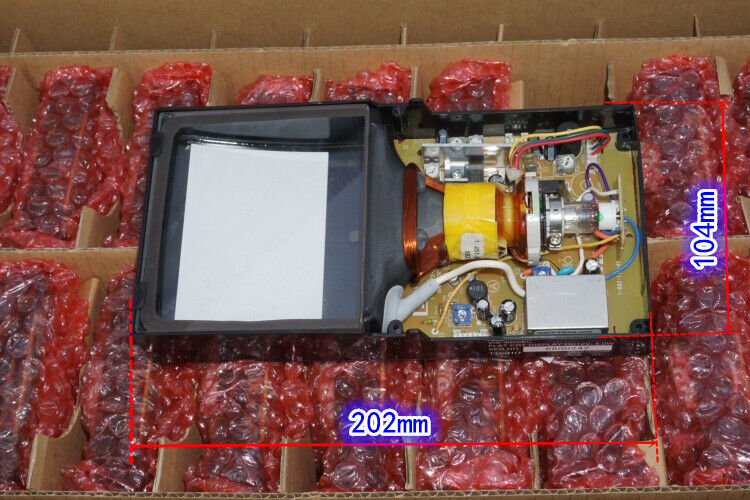

## Vector Displays

[Vector Display](https://en.wikipedia.org/wiki/Vector_monitor)
[Vectrex](https://en.wikipedia.org/wiki/Vectrex)

[CRT](https://en.wikipedia.org/wiki/Cathode-ray_tube)

## Micro CRT

There's a bunch of ["Micro CRT"s on Ebay](https://www.ebay.com.au/sch/i.html?_nkw=micro+crt&_sacat=293),
there are a lot of different sellers but they're all pretty much the same as
[the one I bought](https://www.ebay.com.au/itm/404936807399), with a 4 inch 
[Flat CRT](https://en.wikipedia.org/wiki/Cathode-ray_tube#Flat_CRTs)
tube with power supply and composite video circuitry.

The part numbers seem to be `VIS4001D`, `VIS4001EA` or `VIS4001EC`,
with some small differences between them.

## Resources

* ["Experiment with Sony flat 4inch CRT"](https://geeseang.wordpress.com/experiment-with-sony-flat-4inch-crt/)
[[archive.org]](https://web.archive.org/web/20230522080743/https://geeseang.wordpress.com/experiment-with-sony-flat-4inch-crt/)
* [tweet by ZxSpectROM](https://x.com/ZxSpectROM/status/1407363271171186695)
* [Jerry Walker on youtube](https://www.youtube.com/watch?v=mh_9LUYnDv0)
* [DiodeGoneWilld on youtube](https://www.youtube.com/watch?v=l9CXZXSwG7I)

## Connectors

JST XH? 

## Power

The sticker on the side of the assembly says `DC12V,4.0W`.

Somewhere there was an infrared image of the board which suggested that a
large proportion of the 4W power consumption was
getting radiated from the three-terminal TO220 regulator and associated
heatsink on the right side of the board, which is interesting.

## Displaying Composite Video

## Taking Control

