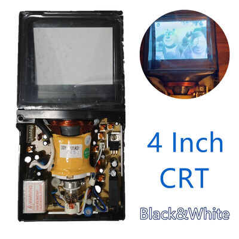
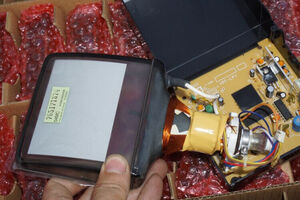
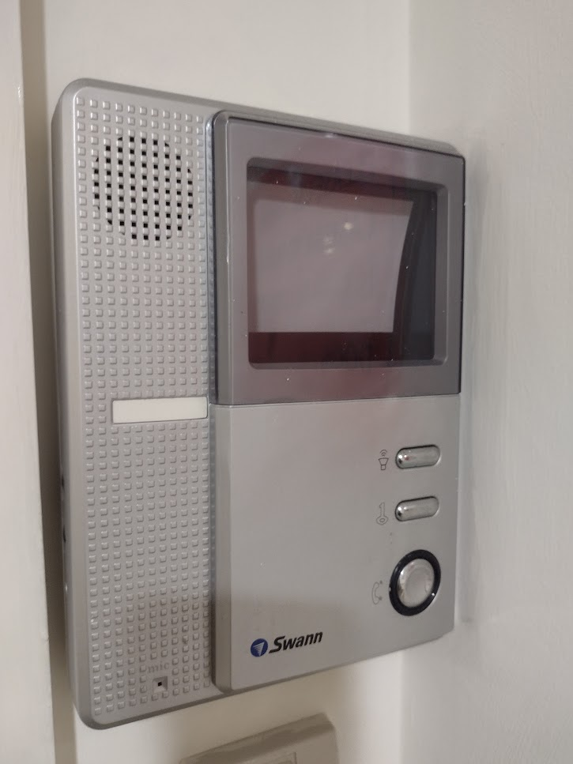
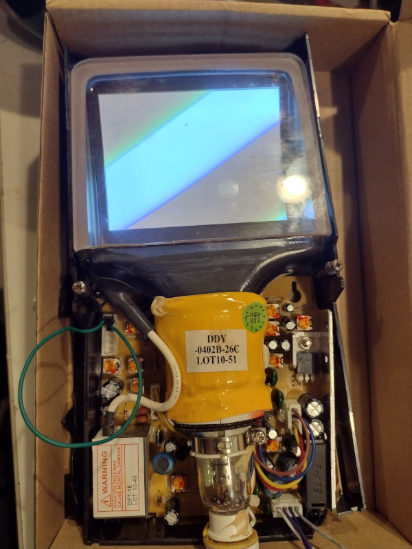
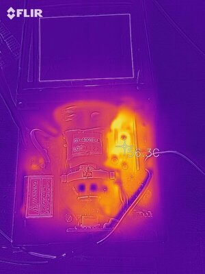
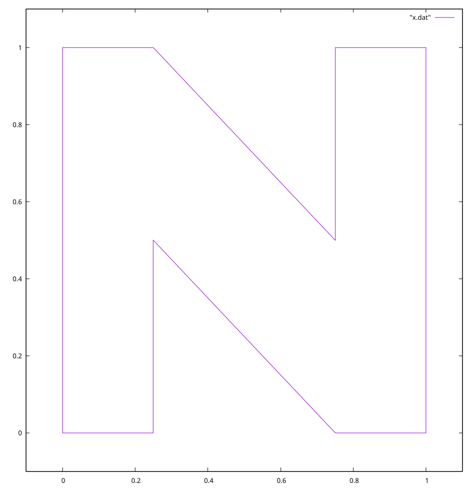
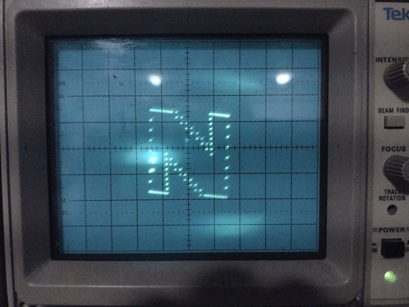
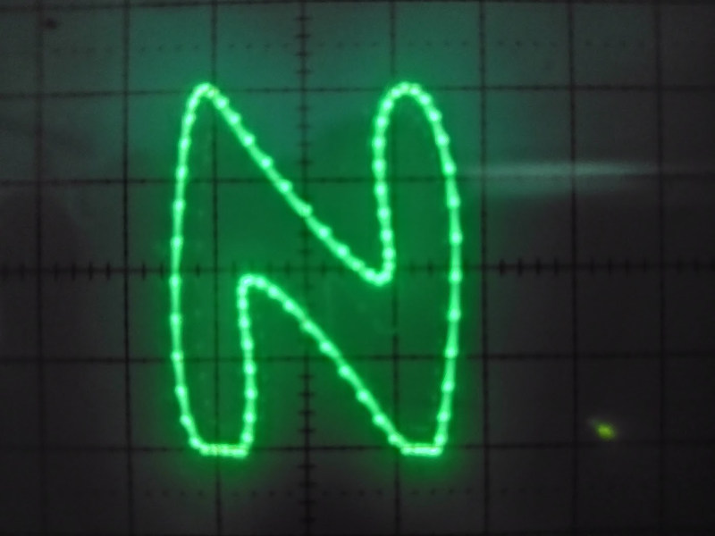
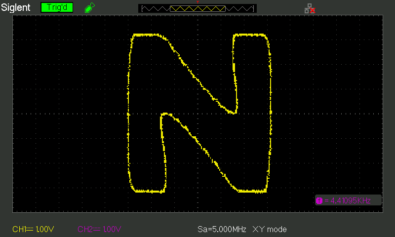
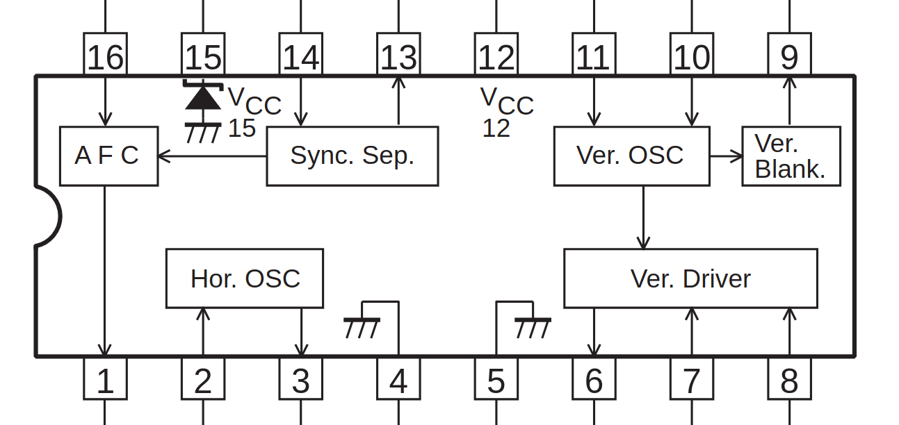

## Vector Displays

A [Vector Display](https://en.wikipedia.org/wiki/Vector_monitor) is a 
form of
[CRT](https://en.wikipedia.org/wiki/Cathode-ray_tube) display.

A conventional "raster" display moves the electron beam through a predefined
pattern and then modulates the strength of the beam to produce an image of varying
brightness, so is limited to a set number of "scan lines".  Each scan line is
broken up into pixels, and the computer displays drawings or images by changing
the brightness of the array of pixels.  The size of the pixels sets the 
resolution of the display.

By contrast a vector display just steers the electron beam to where it wants to
draw, and can therefore draw lines with effectively unlimited resolution.

The only commercially available vector display I'm aware of is the 
[Vectrex](https://en.wikipedia.org/wiki/Vectrex)
home game console from 1982.

## The Project

I'd already started on this project when I stumbled upon
[Jeroen Domburg's "Building a Portable Vectrex, The Right Way"](https://www.youtube.com/live/zBVmCFS2sYs)
which does way more with this than I have any intention of doing,
hopefully this little project will still be fun ...

The aim is to make some kind of retrofuturistic clock / weather display,
with the mini CRT mounted in a 3D-printed
[Jetsons](https://www.imdb.com/title/tt0055683/)-esque housing.
Kind of like a [Nixie Clock](https://www.etsy.com/au/market/nixie_tube_clock)
but featuring a nice curvy outline font and 
[squircles](https://en.wikipedia.org/wiki/Squircle).

## Micro CRT

There's a bunch of ["Micro CRT"s on Ebay](https://www.ebay.com.au/sch/i.html?_nkw=micro+crt&_sacat=293),
there are a lot of different sellers but they're all pretty much the same as
[the one I bought](https://www.ebay.com.au/itm/404936807399), with a 4 inch 
[Flat CRT](https://en.wikipedia.org/wiki/Cathode-ray_tube#Flat_CRTs)
tube with power supply and composite video circuitry.

<p><table><tr><td>
<a href="img/ebay1.jpg"></a>
</td><td>
<a href="img/ebay2.jpg"></a>
</td><td>
<a href="img/ebay3.jpg"></a>
</td></tr></table>
<em style="display: inline-block; width: 100%; text-align: center">images from Ebay listing</em>
</p>

The ones on Ebay seem to have part numbers like `VIS4001D`, `VIS4001EA` or `VIS4001EC`,
but this one is labelled `YC-103A`.

The yoke is also labelled `DDY-0402B-26C LOT 10-51`.

On the reverse of the tube is a label:
"Direct Heating Flat Picture Tube `12SXP45ZRG`"

### In the wild

By a curious coincidence I spotted one of these in the wild!


*Swann Video Intercom*

### Smoke Test

The unit arrived swiftly and even though the plastic chassis was broken
it seems to work.  Providing power though the power/video input connector
and jumpering the top two brightness control contacts (I didn't have a 
6 pin connector handy) was enough to get the whole screen to light up
even with no composite input:



(The whole rectangle of phosphor is lit up evenly, I just didn't get the phone
camera configured right to get a decent photo.)

Interestingly, it's pretty obvious close-up that the tube is made of 
three separate pieces of glass.  The neck, the curved back / phosphor
and the flat front glass appear to have been cemented together before
the tube was evacuated and pinched off in the normal manner.

Note that unlike the phosphor surface on a normal CRT which has phosphor
on the front, with this device you're looking through the flat front side
to the phosphor on the back side.

The 6kV connector on the shoulder of the tube is protected by a small rubber
boot but this is removeable so the housing will have to cover it for safety.

### Resources

* ["Experiment with Sony flat 4inch CRT"](https://geeseang.wordpress.com/experiment-with-sony-flat-4inch-crt/)
[[archive.org]](https://web.archive.org/web/20230522080743/https://geeseang.wordpress.com/experiment-with-sony-flat-4inch-crt/)
* [tweet by ZxSpectROM](https://twitter.com/ZxSpectROM/status/1407363271171186695)
* [Jerry Walker on youtube](https://www.youtube.com/watch?v=mh_9LUYnDv0)
* [DiodeGoneWild on youtube](https://www.youtube.com/watch?v=l9CXZXSwG7I)

### Connectors

There's a six-pin connector for brightness/contrast pots, and a 4 pin 
connector for power and composite video.  These seem to be JST XH 2.5
as commonly used for multi-cell LiPo packs.

A 5 pin header on the board connects to the 7 pin connector on the base
of the CRT, presumably this is for the heater, grid, etc.  Another
4 pin JST XH connects to the yokes.

### Power

The sticker on the side of the assembly says `DC12V 5W`.
There's an internal 1A fuse.
Running at 12V, it seems to draw about 380mA.

[This tweet](https://twitter.com/ZxSpectROM/status/1408460498882940934) 
includes an infrared image of a similar board with the TO220 regulator
clocking in at 56.3⁰C, which suggests that a
large proportion of the power consumption is getting radiated from
that device alone. 


*Image: [ZxSpectROM on Twitter](https://twitter.com/ZxSpectROM/)*

By contrast, the tube itself and the "may cause mortal damage" HV power
module seem to run fairly cool.
This is good because I'll want to make a 3D printed housing for this thing
eventually.

I think all power is routed through the LM7810 regulator so the whole device could
be made >15% more efficient by replacing this part with a more efficient
regulator.

The chip at the heart of this circuit, the `LA7806` has two separate power pins called
`V12` and `V15`, on pins 12 and 15 respectively.
Both have a recommended voltage of 12V, and a maximum of 14V.
No minimum voltage is listed but this board appears to run both from the regulator
at 10V.

## Displaying Composite Video

## Taking Control

But what I *actually* want is to control the horizontal and the vertical
and the beam intensity separately, from a microcontroller.  This would then
let me implement a vector display.

### CRO prototype

Controlling the actual device may prove a little tricky, so let's start with
the simplest possible thing.  I already have a device which can act like a 
vector CRT ... my old [Tektronix 2225 oscilloscope](https://w140.com/tekwiki/wiki/2225),
which I pulled out of a skip at Monash Uni many years ago.

And I have any number of microcontroller boards.  The
[ESP32](/tag/esp32/) runs
[micropython](/tag/micropython/) has two 8-bit
DACs on board, so let's go with that for the moment.

### Python Code

There's some code up at
[github:nickzoic/mini-vector](https://github.com/nickzoic/mini-vector/)

#### points

We can start off by defining an array of points to visit:

```
points = [
        (0.0, 0.0),
        (0.0, 1.0),
        (0.25, 1.0),
        (0.75, 0.5),
        (0.75, 1.0),
        (1.0, 1.0),
        (1.0, 0.0),
        (0.75, 0.0),
        (0.25, 0.5),
        (0.25, 0.0),
]
```

Here's how lines between those points would look plotted:


*a big N*

[`micropython-itertools`](https://pypi.org/project/micropython-itertools/)
implements a lot of the core python `itertools`, including a handy function `cycle`
which repeats an iterable indefinitely, so `cycle(points)` runs through all the points
in an endless loop.

If you don't have `itertools` installed you can always define this function yourself:

```
def cycle(iterable):
    while True:
        yield from iterable
```

#### segments

At this point, I wanted to loop over each line segment.
Unfortunately, it doesn't include `pairwise`, so I had to implement that myself:

```
from itertools import cycle

def pairwise(iterable):
    it = iter(iterable)
    a = next(it)
    for b in it:
        yield a, b
        a = b
```

now we can easily step through the line segments like this:

```
for (x1, y1), (x2, y2) in pairwise(cycle(points)):
    print (x1, y1, x2, y2)
```

now we've got each line segment, what are we going to do with it?
Let's try breaking it up into a number of intermediate points,

```
def interpolate(iterable_of_pairs_of_points, steps=8):
    for (x1, y1), (x2, y2) in iterable_of_pairs_of_points:
        for s in range(0,steps):
            f = s / steps
            x = x1 * (1-f) + x2 * f
            y = x1 * (1-f) + y2 * f
            yield x, y
```

#### writing to the DACs

```
from machine import Pin, DAC

dac_x = DAC(Pin(25))
dac_y = DAC(Pin(26))

for x, y in interpolate(pairwise(cycle(points))):
    dac_x.write(int(x*255))
    dac_y.write(int(y*255))
```

This isn't *nice* but it's enough to get us *something*:


*big N on the oscilloscope*

It works, despite some pretty big problems with this code:

* the number of points per segment is fixed, so the density of points depends
  on the length of the segment
* if you look at the diagonals, you can see that updates of X and Y aren't happening
  in sync, there's quite a long delay resulting in a 16 point "stair step" between
  the 8 points.
* even the densest lines aren't smooth enough not to look like lines of dots.
* the update rate isn't high enough to increase the number of points much.

Fortunately, we can get around a lot of these problems using
[ESP32 I2S](https://docs.espressif.com/projects/esp-idf/en/stable/esp32/api-reference/peripherals/i2s.html#)

Allegedly, as in this 
[example code by infrasonicaudio](https://github.com/infrasonicaudio/esp32-i2s-synth-example), the 
I2S peripheral can be routed to the in-built DAC pins rather than using an external device.
This may no longer be supported though?  In ESP-IDF 5.0.4 the only mention of this functionality
is under `components/driver/deprecated/driver/i2s.h` which seems ominous.

But I do have a [`PCM5102A`](https://www.ti.com/product/PCM5102A) based
[I2S DAC module](https://www.aliexpress.com/item/1005006816695590.html) 
in the junkbox which will give me 2 × 16 bit channels at quite a high sample rate,
and includes digital filtering to remove artifacts.





Using I2S lets us stream coordinates out to the display at set time intervals 
without having to worry about the rest of our code keeping up.

### Intensity

The electron beam intensity can be modulated to alter the brightness of the line
drawn, but I'm hoping that it'll be sufficient to move the beam very rapidly to
"skip" between lines.  Then I can just wire the beam intensity for full power.
This will save having a third output channel to coordinate.

## Back to the CRT

There's no way I'm going to try to make a new driver board for this thing.
The existing board is based on
a Sanyo `LA7806` "B/W TV Synchronization, Deflection Circuit" ... a 16 pin 
IC which decodes the sync pulses from composite video, and sends out
horizontal and vertical deflection signals.

There's a lot of analogue circuitry on this board which presumably handles
the grid and yoke drivers and mixes horizontal and vertical to match the weird geometry
of the picture tube.  I'd rather not have to recreate that either, although
I suppose it wouldn't be impossible in software.


*Image: Excerpt from LA7806 datasheet*

The datasheets for this chip are pretty minimal, so
first things first, I'll get it working with a composite video input and
check out the signals on pins 3 and 6. These should be horizontal and
vertical drive respectively, in the sample circuit on the datasheet 
both of these pins drive the bases of NPN transistors directly so they
are presumably current sources.

Hopefully I can just de-solder the LA7806 and feed my own signals into the
board instead.


