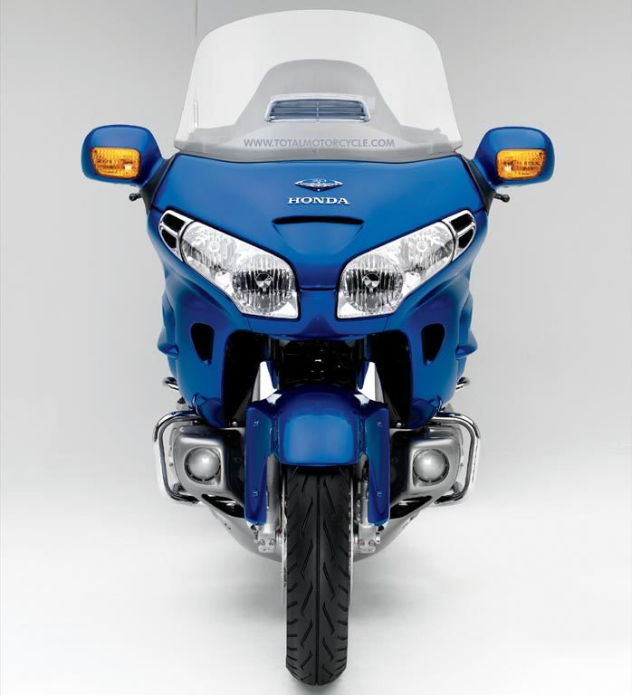
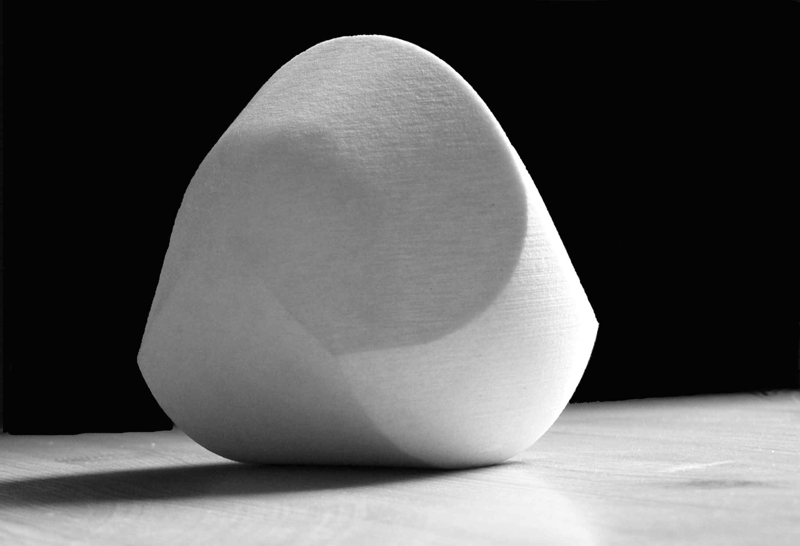

This is going to be a build log for a unicycle robot project based on
3d printed parts and micropython.

# Vision Thing

* [Eve from Wall-E](http://disney.wikia.com/wiki/EVE)
* A [Honda Goldwing](https://en.wikipedia.org/wiki/Honda_Gold_Wing), as seen from directly in front
* The [gömböc, a self-righting solid](https://en.wikipedia.org/wiki/G%C3%B6mb%C3%B6c)

