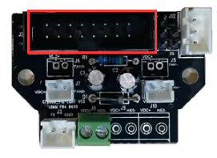

See also:
* [Multi-Material 3D Printing With OpenSCAD, Cura and the Geeetech A20T](/art/multi-material-3d-printing-openscad-cura-geeetech/)
* [Geeetech A20T: Assembly and Configuration](/art/geeetech-a20t-assembly-and-configuration/)
* [Geeetech A20T: First Prints](/art/geeetech-a20t-first-prints/)

## Mixing

I was able to get decent color separation on the Geeetech printer by
setting the following:

| Setting                           | Value     |
|-----------------------------------|-----------|
| Prime Tower Size                  | 35 mm     |
| Prime Tower Minimum Volume        | 25.0 mm³  |
| Nozzle Switch Retraction Distance | 15.0 mm   |
| Nozzle Switch Retraction Speed    | 10.0 mm/s |

But this wastes a lot of plastic and there's still visible 
contamination between colors.

I'm beginning to think I'd be better off with a
[Reprap Diamond](https://reprap.org/wiki/Diamond_Hotend) style
printhead which looks like it has a much smaller internal "mixed" volume,
or maybe just give up and go with
[three separate nozzles](https://www.aliexpress.com/item/32887495430.html)
after all.

Altering the printer so radically might sound a bit cray-cray but it'd
actually be a fairly simple upgrade I think, so long as you don't mind
having the three nozzles share a heater and thermostat.

*Of course, something in my tiny brain is telling me: if you can't decide
between 3 individual nozzles and one three-way mixing nozzle, perhaps you
need a two-way mixing nozzle plus another separate nozzle ... or two
two-way mixing nozzles!  This way, clearly, lies madness.*

There's some details of the
[hotend group assembly](https://www.geeetech.com/a10t-a20t-a30t-16-pin-connector-hotend-group-assembly-with-pulley-bracket-for-gt2560-v41b-version-p-1300.html) at Geeetech, including this useful image:


*Hotend connector board from A20T*

... which shows some interesting details of how the hotend is wired together,
with a 16 pin connector from the wiring loom being broken out into several
connectors for hotend and fans.

## Multiple Settings

The most maddening thing about Cura turns out to be the per-extruder
settings.  It's really easy to set the infill for one material and forget
to change it for the others, for example.  It'd be nice if the UI 
supported this in some way, perhaps by highlighting fields where 
different materials have different values.

## Saving to SD Card

It'd be nice to buffer the print from the PC to the printer, ideally
without having to mess around with OctoPrint.

the [M28 Start SD Write](https://marlinfw.org/docs/gcode/M028.html),
[M29 Stop SD Write](https://marlinfw.org/docs/gcode/M029.html),
[M23 Select SD File](https://marlinfw.org/docs/gcode/M023.html) and
[M24 Start or Resume SD print](https://marlinfw.org/docs/gcode/M024.html)
commands should make this possible by wrapping the g-code in something
like:

```
M28 buffer.gco
; rest of the g-code goes here
M29
M23 buffer.gco
M24
```

I think with this code in place the printer's built-in filament
run-out and power fail resume functions should actually work, too.

When printing from USB, the filament runout sensor seems to turn 
off the nozzle heater but otherwise the motors and extruders
keep on running, which isn't too helpful.  This would be a really
handy feature to have.

This could also be done as a plugin if you wanted somewhat more
flexible file naming.

## TO BE CONTINUED
