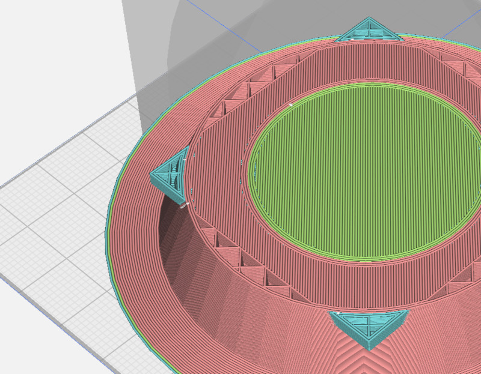
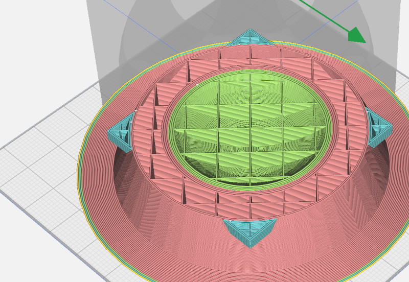
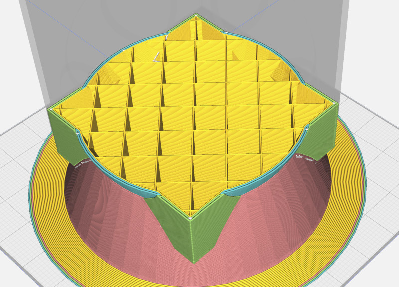

I've been messing around with my [cheapo printer](/art/aldi-coccoon-3d-printer/)
for a few years now and I'm considering upgrading to a new one, particularly to
print with multiple filament colours.

## OpenSCAD

I mostly use [OpenSCAD](https://openscad.org/) to design
[stuff](https://github.com/nickzoic/models3d/) and
[OpenSCAD support for multi materials](https://github.com/openscad/openscad/wiki/Multi-material-support)
is not good ([#1041](https://github.com/openscad/openscad/issues/1041),
[#1608](https://github.com/openscad/openscad/issues/1608).)

It'd be great to fix that, but in the meantime I needed a quick solution.
[Erik Nygren has made a good start](https://erik.nygren.org/2018-3dprint-multicolor-openscad.html)
but I wanted to get something working with
[Ultimaker Cura](https://ultimaker.com/software/ultimaker-cura/) and
without having to save a whole lot of separate 
[STL](https://en.wikipedia.org/wiki/STL_%28file_format%29) files.

Cura 5.4 doesn't handle *intersecting* volumes nicely at all, with weird alternating layers
where the volumes intersect.


*layers behave weirdly when volumes intersect*

So instead make sure you subtract layers from each other before
emitting them.

```
if (material == 1) {
    difference() {
        red();
        green();
        blue();
    }
}
```        


*layers behave better when the volumes don't intersect.*

(note extraneous interior walls though, see [below](#a-terrible-workaround-for-interior-walls))

### Exporting as AMF

So far, I've used [STL](https://en.wikipedia.org/wiki/STL_%28file_format%29)
to get my models from [OpenSCAD](https://openscad.org)
to Cura, but it's pretty limited and a bit of a pain to work with.
There are more modern formats available.
I had a look at [3MF](https://en.wikipedia.org/wiki/3D_Manufacturing_Format)
but it a mess of ZIPped XML and so instead I've been working with
[AMF](https://en.wikipedia.org/wiki/Additive_manufacturing_file_format).

AMF is a relatively simple XML format.  It's an "Open Standard", but sadly
it's the kind of "Open Standard" which
[costs sixty-three bucks to download](https://www.astm.org/f2915-20.html)
so instead we're gonna go on guesswork and other people's code.
Just looking at the AMF file, you can tell that it contains a pretty
simple hierarchy of `<amf>` -> `<object>` -> `<mesh>` -> `<vertices>` and `<volume>`s
so it's not hard to guess what everything does.

OpenSCAD can only export a single material at a time, but we can automate that 
from the command line using the `-D var=val` command line option.

```
openscad -D material=1 -o temp1.amf
openscad -D material=2 -o temp2.amf
openscad -D material=3 -o temp3.amf
```

Since we can manipulate AMF files pretty easily we can then combine those files
into one file which can be importing into Cura.

`combine_amf.py`:
```
import sys
import xml.etree.ElementTree as ET

# XXX should handle units other than millimeters
# XXX probably should keep per file metadata
# XXX possibly should define materials per input file
# XXX possibly could unify vertices and produce multiple volumes in a single object

xout = ET.Element('amf', attrib={'unit': 'millimeter'})

obj_id = 0

for fn in sys.argv[1:]:
    et = ET.parse(fn)
    root = et.getroot()
    assert root.tag == 'amf'
    assert root.get('unit') == 'millimeter'

    for obj in root.findall('object'):
        obj.set('id', str(obj_id))
        xout.append(obj)
        obj_id += 1

ET.ElementTree(xout).write(sys.stdout, encoding='unicode', xml_declaration=True)
```

Rather than doing these steps manually we can use a bash script:

`mmexport.sh`:
```
set -eu
SOURCE=$1
TARGET=${2:-${SOURCE%.*}.amf}
TEMPDIR = `mktmp -d`
for MATERIAL in 1 2 3 4 5 6 7 8; do
    openscad -D material=$MATERIAL -o $TEMPDIR/temp$MATERIAL.amf $SOURCE
combine_amf.py $TEMPDIR/temp*.amf > $TARGET
```

### Some examples

I've uploaded
[some multi-material OpenSCAD examples](https://github.com/nickzoic/models3d/tree/master/multi) 
which use these methods, although I'm still messing around trying to work out
"the best way" ...

## Importing into Cura

[Ultimaker Cura](https://ultimaker.com/software/ultimaker-cura/) can import AMF
files, and when we import a multi-object AMF file as generated by the script
above it appears as a single "grouped" object.  All the materials are locked
together to prevent misalignment.  We can still select individual pieces within
the group using Control-Click, and then assign them to different extruders
manually.
Beware, if you decide to ungroup the pieces they may become misaligned as Cura
will "drop" each piece to touch the print bed.  To prevent this, first control-click
each piece and make sure "Drop Down Model" is turned off on every piece.


## Geeetech A20T

I've been considering the
[Geeetech A20T](https://www.geeetech.com/geeetech-a20t-triple-color-mixing-filament-detector-breakingresuming-250x250x250mm-p-1108.html).
It has three extruders feeding into a single nozzle.
On Youtube, there's a 
[Geeetech A10M review at Teaching Tech](https://www.youtube.com/watch?v=AbZhNvMM4Os)
and [six Geeetech A10M upgrades at Teaching Tech](https://www.youtube.com/watch?v=8o--HmfZ57I)
which give you some idea of how these printers work.

The printer has three physical extruders, and some built in
firmware to do mixing and fading between the extruders, which
we can control using custom G-code.

### G-Code Mixing

I think it can be set up in Cura to have up to
[8 or maybe 16 virtual extruders](https://community.ultimaker.com/topic/41834-can-i-add-more-than-8-extruders-in-cura/)
each of which is a different blend of the three actual extruders, 
set up in the printer settings G-code using the 
[M163](https://marlinfw.org/docs/gcode/M163.html) and
[M164](https://marlinfw.org/docs/gcode/M164.html)
commands. 

**Note that G-code standardization is quite broken across
different brands of printer and different firmwares.  There's 
multiple interpretations of even basic stuff like tool
changes and lots of optional features which your printer
may or may not support.  If you're using something other than
a Geeetech printer the required G-code may be subtly different.**

For example these commands select a 50/30/20 mix of the three
filaments in the real extruders 0, 1 and 2, and assign that
mix to a "virtual tool" 3:

```
M163 S0 P0.5
M163 S1 P0.3
M163 S2 P0.2
M164 S3
```

Once these virtual tools are set up, Cura will automatically
use them for the different extruders using the tool change
commands `T0` .. `T7`.  So by fiddling with the "Start G-Code"
in the printer settings, you can set up several extra
colour mixes so for example this sequence would set up
tools 3 through 7 as mixes of tools 1 and 2 (the second
and third filaments), so you could for example load white,
red and blue and print in white and several shades of purple.

```
M163 S0 P0
M163 S1 P0.84
M163 S2 P0.16
M164 S3

M163 S0 P0
M163 S1 P0.67
M163 S2 P0.33
M164 S4

M163 S0 P0
M163 S1 P0.5
M163 S2 P0.5
M164 S5

M163 S0 P0
M163 S1 P0.33
M163 S2 P0.67
M164 S6

M163 S0 P0
M163 S1 P0.16
M163 S2 P0.84
M164 S7
```

Using [M166](https://marlinfw.org/docs/gcode/M166.html)
should let you assign a Z-gradient to a tool as well!

## Outstanding Issues

* Doesn't understand when you don't care what colour the infill is.

  For a lot of models you don't care
  what colour the infill is and it can go ahead and purge the old colour
  into the infill instead of a separate purge bucket.
  You can [set infill per object](https://community.ultimaker.com/topic/35660-model-specific-settings-override-extruder-used/)
  but it'll still want to purge between colours.

  Perhaps a list of "infill extruder**s**" should be settable per tool.
  Then, when changing from outline to infill, if a tool's outline extruder
  is also one of its infill extruders, the colour change can happen just
  inside the infill, and then back just before resuming the outline.
  If the outline colour is the same as the first infill colour, no change 
  is necessary.

  For multi coloured prints there might be a bit of extra changing back and
  forth between outline and infill required to make this happen
  efficiently.

* Builds internal walls between colours

  If you define two intersecting solids, Cura still constructs solid
  walls between them even though those walls are doubled up and also 
  hidden from view.  This is probably what you want if, eg: printing
  a PLA wheel with an integral TPU tyre, but not necessary if you're
  just printing a multicoloured design where this internal structure
  is just an artifact of the way you designed it.

  I have a terrible work-around for this; see below

* Doesn't harness the full potential of colour mixing

  Limiting the print to a set of fixed ratios in the form of virtual
  tools simplifies the situation but also misses out on some of the 
  capabilities of the printer to continuously adjust the mix as it
  prints.  Use of colour gradients in some situations might actually
  be quite pretty!

### A Terrible Workaround For Interior Walls

1. Create a volume which is just a smidge smaller than the sum of your actual volume.
   There are smarter ways, such as defining the interiors of each of your parts as
   you create them and then combining those interiors, but this probably works
   well enough:

   ```
   module everything() {
       red();
       green();
       blue();
   }
   
   module interior() {
       intersection() {
           translate([1,0,0]) everything();
           translate([-1,0,0]) everything();
           translate([0,1,0]) everything();
           translate([0,-1,0]) everything();
           translate([0,0,1]) everything();
           translate([0,0,-1]) everything();
       }
   }
   ```

   It'd be nice to have 
   [a 3D equivalent of offset](https://github.com/openscad/openscad/pull/4516)
   or possibly a [minkowski difference](https://en.wikipedia.org/wiki/Minkowski_addition),
   but this is an approximation.  If there's holes in the corners, add more 
   translations like `translate([1,1,0]) everything();` but it gets very slow.

2. Subtract this interior volume from every part:

   ```
   if (material == 1) {
       difference() {
           red();
           green();
           blue();
           interior();
       }
   }
   ```

3. Also render the interior volume as its own material:

   ```
   if (material == 4) {
       interior();
   }
   ```

4. Combine AMFs and set the interior volume as your infill material,
   with only a single wall, top and bottom layer.  You can't select the 
   interior volume by clicking on it, but you can set the material for the
   whole grouped component, and then change each of the visible components
   individually.

   The interior volume now takes up most of the space, with the other
   materials just forming a thin shell of 2-3 layers surrounding
   the outside.

   
   *layers with the internal volume removed*

   or if your design works well this way, you could beef up the shell a little
   and leave the core out, just letting Cura add support where necessary.

This feature probably belongs in Cura, not OpenSCAD, but doing it this
way is expedient.
