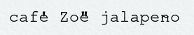

This is kind of a third installment following on from
[Boot Naked Linux](/art/boot-naked-linux/) and
[Forest for the trees](/art/forest-for-the-trees/) so
maybe go read those first if you didn't already.

## What is a computer anyway?

It's okay, we're going back into the technical weeds real soon, but
first I want to ask some questions:

* What is a computer anyway, and what does it do?
* If the point of this project is to rethink some aspects of
  typical computers, what will the rethought computer do?

Considering for the moment my own plethora of desktops, laptops,
phones, tablets and so on, all of which are "computers" in some
sense, most of what they do is run a web browser so I can watch
bicycle videos and buy bicycle parts and plan bicycle trips and
read conversations about bicycles.
The browser is a staggeringly complex piece of work I cannot 
hope to replace even a fraction of, so all that's out.

The other thing I do is construct structured information.
Documents, including this blog post.
Programs, including the subject of this blog post.

## Terminals and keyboards and the Linux console (oh my)

*A lot of this stuff is supported by the
[ncurses](https://tldp.org/HOWTO/NCURSES-Programming-HOWTO/intro.html)
library so we probably don't need to reinvent that particular
wheel but it makes sense to understand the *ahem* challenges.*

### ASCII 

A lot of you will be familiar with the idea of "computer
text" as [Unicode](https://en.wikipedia.org/wiki/Unicode)[^monster]
strings where Unicode is able to represent hundreds of
thousands of distinct symbols from many of the world's scripts.

[^monster]:

    > Actually, "Unicode" is the name of the consortium.
    > The name of the character set is "Unicode's Monster"...
    
    -- [@FakeUnicode on Twitter](https://x.com/FakeUnicode/status/893305253420027904)

But back at the dawn of computing time, you had 7-bit 
ASCII and you liked it.  It's very much centered on English,
you can't even write café or Zoë or jalapeño
[properly](https://en.wikipedia.org/wiki/English_terms_with_diacritical_marks).
Quotation marks, apostrophes and diacritics have all been
wedged together in a mess of typewriter conventions
and it could do that, because back then computer terminals
were "teletypewriters", things which printed your conversation
with the computer onto paper, so they could type an `e` then back
up and type a `'` over the top of it and it'd look a bit like
an `é`[^overtype]

*thanks to [overtype: the over-the-top typewriter simulator](https://uniqcode.com/typewriter/)*

[^overtype]: The tilde `~` character was up high in some typefaces to
    make it useful for this.
    See also [The centralized ASCII tilde](https://en.wikipedia.org/wiki/Tilde#The_centralized_ASCII_tilde) for the history here.

### Keyboards

This is still important to us because when we're dealing
with the console we're dealing with this jurassic[^jurassic]
layer of technology.

[^jurassic]: as in, "ASCII finds a way".

When you press and release keys on the keyboard the kernel
translates the keycodes into the ASCII codes used by old
terminals.
Normally these get intercepted by the TTY subsystem to provide line
editing and process interruption and so on, but we can prevent this 
by setting some terminal attributes like this:

    struct termios termios;
    tcgetattr(0, &termios);
    cfmakeraw(&termios);
    termios.c_oflag |= OPOST | ONLCR;
    tcsetattr(0, TCSANOW, &termios);

Now we can read almost all of the key combinations, and they're available
immediately without waiting for the user to hit 'Enter'.
Many keys have obvious ASCII codes, such as 
`a` and `Z` and `~` but there's no ASCII code for `F1` 
or `Home` or `PgUp` etc.  So the console
[mangles these keys](https://en.wikipedia.org/wiki/ANSI_escape_code#Terminal_input_sequences) into "escape sequences", which
arrive at our program exactly as if the user splattered
a bunch of keys all in an instant.

I started to catalog which keys were reliably available in this
mode but it got a bit out of hand ...

* [some console keycodes](keyboards/)

Sadly, the first character in an escape sequence is the
`ESC` character, exactly what is produced by the "Esc" key.
So the only way we can tell if this is the start of a
escape sequence, and not just someone hitting the "Esc" key,
is to see if the code arrive superhumanly fast[^fast].
Which is a terrible hack, but here we are.

[^fast]: At least on my keyboard, mashing "Esc" key and
    `[` together will get you a pair of codes indistiguishable
    from the start of an escape sequence at least half the time,
    so we have to consider *several* characters of input
    and either ignore them all or treat them as normal input
    if they aren't a valid escape code.

    There's no way at all to tell the difference between
    Alt-A and someone mashing Escape and A at the same time,
    or between Alt-[ and the start of an escape sequence.
    There's also no way to tell the difference between
    Control-J and Enter, or Control-I and Tab, for example.

With all this in mind, why bother with the console at all?
We could access keyboard scan codes directly, but then it'd 
be much harder to support remote access over ssh, etc.
So dealing with all this is probably going to be worth it
in the long run.

### Console Output

Going back the other way, the console can do more than just
display letters: we can position the cursor, change colours,
there's even a sequence to check the number of rows and
columns.  By default this is limited to ASCII or possibly
[CP437](https://en.wikipedia.org/wiki/Code_page_437)
characters, and we need to mess with the kernel options to
support much at all.

