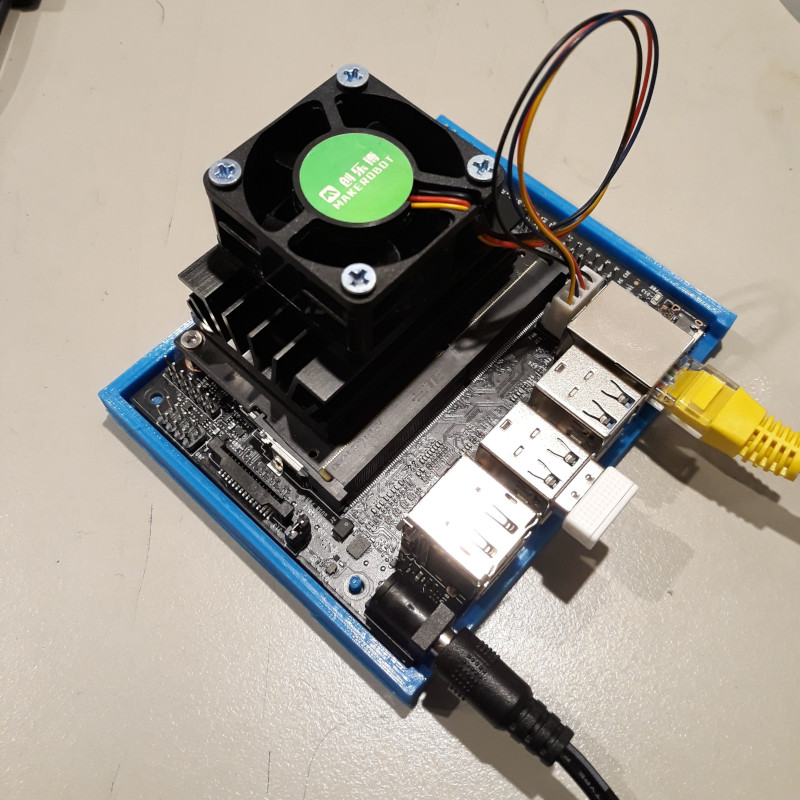

I grabbed an [Nvidia Jetson Nano Dev Kit](https://developer.nvidia.com/embedded/learn/get-started-jetson-nano-devkit) board from
[Seeed](https://www.seeedstudio.com/NVIDIA-Jetson-Nano-Development-Kit-p-2916.html) ...
well, I was ordering some other stuff and it was on sale and it just kinda happened ... 
anyway, they're rather a cool little unit and I wanted to see how it'd go as a PC for my office.

I do do a bit of development, and this board is likely to be painfully slow for
compiling stuff, but the idea is to see how it goes as a desktop and if it makes
sense to farm the compute-intensive stuff out to a headless PC, or to a cloud server.

# Disk Image

There's a [5.2GB image file to download](https://developer.nvidia.com/embedded/learn/get-started-jetson-nano-devkit#write)
, which contains a ~12GB disk image.  This seems a little excessive to me.
Sure, it's actually a Linux distro but [Alpine](https://www.alpinelinux.org/)
for ARM manages to fit a lot into under 85MB compressed.

How exactly is the Jetson Nano image 60 times this big?
Well, it turns out that it includes gnome, and chromium, 
and LibreOffice, and Shotwell, and Thunderbird, and ... well, lots of stuff.
Python 2.7 *and* Python 3.6 *and* Perl 5.26.

It's pretty much ready to go as a Linux PC out of the box.

## SD Card

I ended up popping up to the shop and grabbing a 
"64GB Sandisk Extreme A2", claiming *UP TO* 160MB/s read and 60MB/s write.

Writing the initial image onto this from my laptop started promisingly at 100 MB/s or so and
then slowly dwindled away to 15MB/s, but I think that has more to do with the shonky USB 
adaptor I was using.   Still, it go there fast enough.

Looking at this card from my laptop, it appears to have 14 partitions of various sizes,
which seems odd.  There's also an ominous warning:

```
GPT PMBR size mismatch (25165823 != 124735487) will be corrected by write.
The backup GPT table is not on the end of the device. This problem will be corrected by write.

Device     Start      End  Sectors  Size Type
/dev/sda1  28672 25165790 25137119   12G Linux filesystem
/dev/sda2   2048     2303      256  128K Linux filesystem
/dev/sda3   4096     4991      896  448K Linux filesystem
/dev/sda4   6144     7295     1152  576K Linux filesystem
/dev/sda5   8192     8319      128   64K Linux filesystem
/dev/sda6  10240    10623      384  192K Linux filesystem
/dev/sda7  12288    13055      768  384K Linux filesystem
/dev/sda8  14336    14463      128   64K Linux filesystem
/dev/sda9  16384    17279      896  448K Linux filesystem
/dev/sda10 18432    19327      896  448K Linux filesystem
/dev/sda11 20480    22015     1536  768K Linux filesystem
/dev/sda12 22528    22655      128   64K Linux filesystem
/dev/sda13 24576    24735      160   80K Linux filesystem
/dev/sda14 26624    26879      256  128K Linux filesystem
```

# First Boot

So I finally found my 5V 4A power supply and booted the device.
On first boot it gives you the option to resize that first partition,
although I'm still not sure what all the other ones are for.
If you've got it networked you can then upgrade Ubuntu packages.

Disappointingly, the DisplayPort on board is *only* a DisplayPort ...
it [won't work with the normal DisplayPort to HDMI converter cables](https://developer.nvidia.com/embedded/learn/get-started-jetson-nano-devkit#troubleshooting).
Apparently [it will with some 'active' adaptors though](https://devtalk.nvidia.com/default/topic/1049356/jetson-nano/dual-simultaneous-monitors/2)
so I'll try to get hold of one of those.

*UPDATE: The one I bought was described as an "active converter" but doesn't work.
I suspect, short of buying a converter about the same price as the Nano board itself, 
it can't be made to work. Never mind.*

The distro doesn't seem to
include the "Nsight Eclipse Edition" any more ... there's a `/usr/local/cuda/bin/nvcc`
but no `nsight` on this disk, and
[the usual download link](https://developer.nvidia.com/cuda-downloads?target_os=Linux)
doesn't offer a ARM8 architecture.
I saw a release note somewhere indicating that it was maybe no longer included due
to a transition to
[Nsight Visual Studio Edition](https://developer.nvidia.com/nsight-visual-studio-edition)
but I'm not clear on this yet.

You can also [develop remotely](https://devblogs.nvidia.com/cuda-jetson-nvidia-nsight-eclipse-edition/)
but I'm not sure what that's all about.

## Not A Big Fan

When I ordered the Nano, I figured I could fit some other kind of fan to the top if needed:
perhaps a normal PC case fan fitted to the top of the enclosure and blowing down onto the heatsink.
The idea being that a bigger fan would be quieter for the same amount of cooling.
However it turns out that while the dev kit has a 4 pin fan header (yay!) it's only at 
5V, not 12V as per every other fan header.

So short of making up a little boost converter board or something, the choice of fans is
very limited.  For now I've ordered a tiny 
[5V 4-pin fan from Ebay](https://www.ebay.com.au/itm/4PIN-Dedicated-Cooling-Fan-For-Jetson-Nano-Developer-Kit-5V-PWM-Adjustment/133128349987) which seems to work quite well considering how tiny
it is.



Based on this [article on the Jetson Nano Thermal Performance](https://www.phoronix.com/scan.php?page=article&item=jetson-nano-cooling)
what I really want to do is to load the CPU/GPU up with a difficult task and then
measure the equilibrium temperature at various fan RPMs.  So far I'm having trouble finding
something which is enough of a load, the closest I've got is `glmark2` which can be run
continuously with:

```
glmark2 --fullscreen --run-forever
```

... but even with no fan these are barely enough to get the processor to 53⁰C so
I need to find a 'heavier' benchmark.

Some performance figures with the tiny fan mounted on the heatsink
(sorry, I don't have a dB meter):

| PWM | RPM | noise |
| --- | --- | --- |
| 0 | 0 | none |
| 20 | 0 | none |
| 32 | 700 | inaudible |
| 64 | 1000 | barely audible |
| 72 | 2300 | barely audible |
| 80 | 2630 | whisper quiet |
| 90 | 3000 | only a tiny bit louder |
| 118 | 4000 | low-key annoying |
| 160 | 5600 | tiny RC helicopter |
| 200 | 6950 | ... taking off |
| 255 | 8800 | self-destruct imminent! |

The aim here is to characterize the heatsink as designed, I'd like to make a little printed
plastic case for the board with a side-mounted fan, possibly with some kind of shroud to
direct air through the heatsink.

### Update: Desktop Sled

I tried 3D printing a little case for the board, but the cases I found were all pretty fussy with
little holes all over and didn't print well for me.  So I ended up designing a little 'sled' just to
keep the board off the desk and make sure it didn't short out on a paperclip or something tragic like
that. 

* [Jetson Nano Devkit Sled](https://github.com/nickzoic/models3d/blob/master/parts/jetson-nano.scad)

## Don't Upgrade (too far)!

The distro it comes with is Ubuntu 18.04.3 LTS Bionic Beaver, which is pretty old now.

The usual `do-release-upgrade` process, normally very reliable on Ubuntu, ends up with the
board in a video reboot loop ...
it gets as far as the Nvidia splash screen then goes black for a while then back 'round again.

There might be an obvious solution to this but the easiest thing was to just re-flash the
SD card and start over. Note to self: Don't do that again.

I did however do the usual `apt update && apt dist-upgrade && apt autoremove` ... which works fine.

## Networking

OpenSSH is already set up, so once you've got the initial user and network setup done
it's pretty easy to use the device headless.

I'm using it as a display as well, with
[x2x](https://www.linuxjournal.com/content/share-keyboardmouse-between-multiple-computers-x2x)
running to share the keyboard, mouse and clipboard between them over ssh.

It's plugged into gigabit ethernet but I'm planning on
[adding a M.2 E WiFi card](https://www.jetsonhacks.com/2019/04/08/jetson-nano-intel-wifi-and-bluetooth/)
in the near future. 

*UPDATE: It works fine with a very cheap USB WiFi adaptor, so I'll probably just stick with that.*

# My First CUDA

I started off with [this CUDA Tutorial](https://cuda-tutorial.readthedocs.io/en/latest/) 
which gives a pretty easy entry into how CUDA programming works.

I then had a look at [Conway's Game of Life on GPU using CUDA](http://www.marekfiser.com/Projects/Conways-Game-of-Life-on-GPU-using-CUDA)
which is a great introduction to thinking in CUDA.

